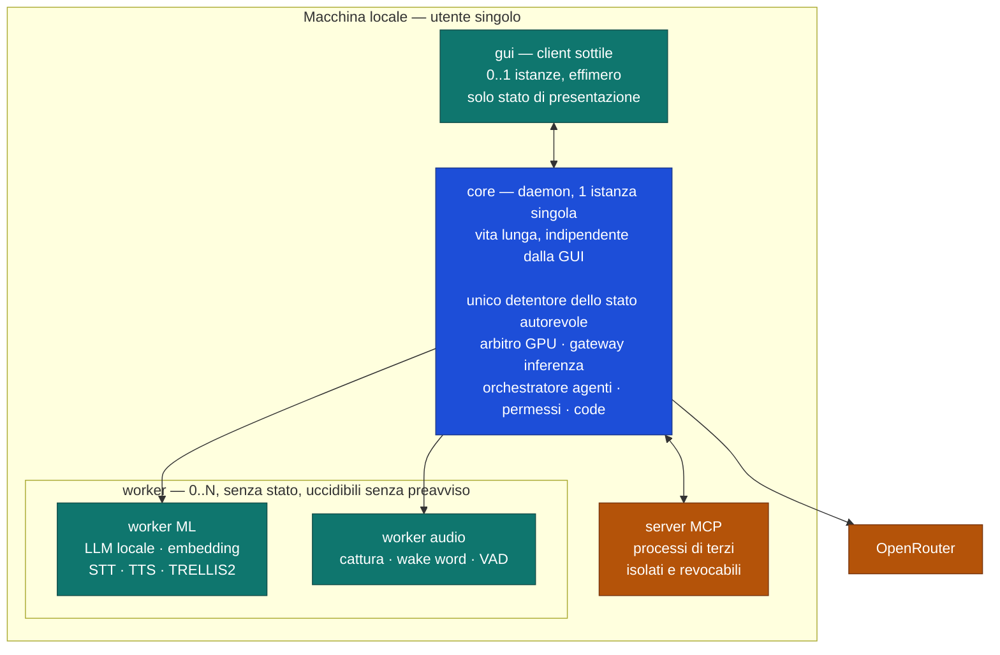
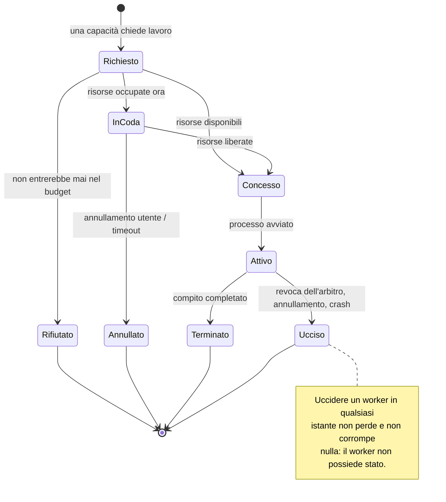

# Topologia dei processi

Struttura di processo del sistema. Fonte di verità sulle classi di processo ammesse,
su chi possiede lo stato e su quali canali esistono.

Decisione e motivazioni: [ADR-0004](../adr/0004-topologia-di-processo.md).

## Vista d'insieme

Legenda dei colori: **blu** = detiene stato autorevole · **verde** = effimero e
sacrificabile · **ambra** = sorgente di contenuto non fidato.

## Canali

| Da → A | Canale | Direzione | Note |
|---|---|---|---|
| gui ↔ core | IPC privato | bidirezionale | Un trasporto, uno schema, non versionato (I4) |
| core ↔ worker ML | porta `process` | **bidirezionale, ma a iniziativa del core** | Avvia, istruisce, legge, chiude, uccide — **sei verbi**. Il worker non risponde **di iniziativa propria**: ogni byte che risale è coperto da una **ricevuta**. Vedi il richiamo in fondo |
| core ↔ worker audio | porta `process` | idem | Idem; il flusso audio risale al core **dentro una ricevuta di flusso** |
| core ↔ server MCP | protocollo MCP | bidirezionale | **Tutto ciò che arriva da qui è contenuto non fidato**, descrizioni degli strumenti incluse |
| core → OpenRouter | HTTPS | uscente | Unico processo autorizzato a uscire in rete verso i provider |

**La GUI non parla con nessuno tranne il core.** Nessun canale gui → worker,
gui → MCP, gui → rete. È ciò che la rende sacrificabile.

## Ciclo di vita di un worker

## Regole che il diagramma non esprime

- Un worker **non** ritenta, **non** accoda, **non** decide: ogni logica di
  ritentativo, coda e priorità sta nel core (I5).
- Un worker **non** parla con un altro worker. Mai. Se due compiti devono
  coordinarsi, li coordina il core.
- `Concesso → Attivo` è l'unico punto in cui un processo può toccare la GPU, e
  richiede una concessione valida dell'arbitro (I2).
- Il numero di classi di processo è **tre**. Aggiungerne una quarta richiede un ADR.

---

## ⚠️ Richiamo — il canale worker non è a senso unico, e il codice lo dice da due traguardi (2026-08-18)

La tabella dei canali dava `core → worker` come **comando a senso unico**. Era la lettura giusta
finché il canale non esisteva; oggi esiste, ed è la porta **`process`** di
[ADR-0035](../adr/0035-porta-verso-i-worker-e-lettura-di-i4.md) — `crates/kernel/src/ports/process.rs`.

| | |
|---|---|
| **i verbi sono sei**, contati sul sorgente | `instruct_one` · `instruct_stream` · `read_one` · `read_next` · `close` · `kill`, più `Process::start` che restituisce il `Worker` |
| **i frame RISALGONO** | `read_one` e `read_next` restituiscono un `Frame`: il flusso audio della riga qui sopra è esattamente questo |
| ⛔ **ciò che resta vero, ed è la sostanza** | il worker **non risponde di iniziativa propria**. Ogni byte che risale è coperto da una **ricevuta**, e le ricevute le emette **solo un'istruzione**: un frame che nessuna ricevuta copre è un **guasto**, non un dato |

⛔ **La tensione che questo file conteneva è stata SCIOLTA, non ignorata:** *«il worker non
risponde di iniziativa propria»* contro *«il flusso audio risale al core»* è la contraddizione
che la voce **F1b** doveva conciliare, e il gettone della ricevuta è come l'ha conciliata. Le
**due** ricevute sono tipi distinti — singola e di flusso — perché *«una risposta singola diventa
un flusso»* non deve essere **esprimibile**.

📌 **Perché la riga è rimasta stretta:** è stata scritta quando il canale era un disegno, e
nessuno l'ha riletta il giorno in cui è diventato codice. È la radice **R3** dell'[audit del
2026-08-11](../audit-2026-08-11.md) — *un doc scritto quando la cosa non esisteva, mai ridatato*
— finding **A-4**.
