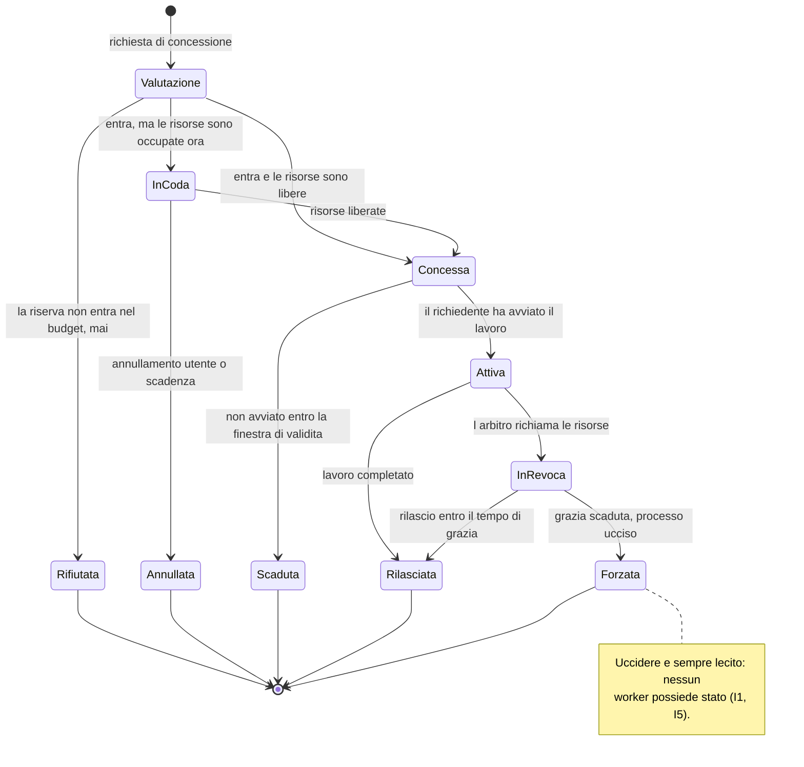
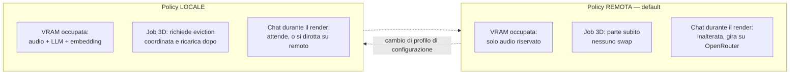

# Arbitrato delle risorse GPU

Modello della risorsa, ciclo di vita di una concessione, corsie di priorità.
Fonte di verità su chi può toccare la GPU e a quali condizioni.

Decisioni: [ADR-0005](../adr/0005-arbitrato-gpu-su-due-dimensioni.md) ·
[ADR-0006](../adr/0006-due-policy-vram-come-oggetti-distinti.md).

## Le due dimensioni della risorsa

Modellare solo la VRAM è l'errore che fa balbettare la voce durante un render:
la VRAM basta perché il render *parta*, ma è la contesa di calcolo a rovinare
l'esperienza. Sono due grandezze di natura diversa e vanno arbitrate diversamente.

| Dimensione | Natura | Fallimento tipico | Come si arbitra |
|---|---|---|---|
| **VRAM** | capacità — allocabile, esclusiva, quantizzata | OOM: brutale e immediato | ammissione: o entra, o non parte |
| **Calcolo** | contesa — condivisibile, degrada con continuità | balbuzie, latenza che si allunga | corsie: chi ha priorità occupa meno il resto |

## Profilo di risorsa

Ogni tipo di lavoro dichiara un profilo. È un descrittore nominato e versionato,
non un numero sparso nel codice.

| Campo | Tipo | Significato |
|---|---|---|
| `nome` | identificatore | es. `trellis2-single-image-q-media` |
| `vram_riservata` | MiB | riserva di picco dichiarata, non misurata a posteriori |
| `classe_calcolo` | `realtime` \| `interattivo` \| `batch` | corsia di appartenenza |
| `prelazionabile` | sì / no | se l'arbitro può richiamare le risorse |
| `tempo_di_rilascio` | ms | quanto può metterci a liberarle prima del kill |
| `avvio_a_freddo` | ms stimati | usato per avvisare l'utente, non per decidere |

**La riserva è dichiarata dal richiedente, verificata dall'arbitro.** Il picco reale
viene misurato durante l'esecuzione e registrato: se supera la riserva dichiarata, il
profilo è sbagliato e va corretto. È così che la "stima di fit prima del caricamento"
smette di essere un'illusione e diventa un dato che migliora nel tempo.

## Ciclo di vita di una concessione

### Regole che il diagramma non esprime

- **`Rifiutata` è diversa da `InCoda`.** Rifiutata significa "non entrerebbe *mai*",
  e va detto subito con l'alternativa praticabile. InCoda significa "non ora".
  Confonderle produce attese infinite per lavori impossibili.
- **`Concessa` ha una finestra di validità.** Una concessione non ritirata blocca
  risorse per un richiedente che forse è morto.
- **`InRevoca` non esiste per i profili non prelazionabili**: per loro l'arbitro
  attende o rifiuta, non revoca.
- Nessun processo passa a `Attiva` senza concessione valida in mano (I2).

## Corsie di priorità

| Corsia | Chi la usa | Prelazionabile | Garanzia |
|---|---|---|---|
| `realtime` | wake word, VAD, STT, TTS | **mai** | quota VRAM riservata, fuori dal pool allocabile |
| `interattivo` | chat e agente in primo piano | sì, grazia breve | servita prima di `batch` |
| `batch` | render 3D, indicizzazione, run in background | sì | può attendere indefinitamente |

### La quota audio è sottratta, non prioritaria

La VRAM riservata all'audio viene **tolta dal budget allocabile all'avvio** e non vi
rientra mai. Nessun altro lavoro può richiederla, nemmeno se la GPU è scarica.

È una differenza sostanziale rispetto a "dare priorità alta alla voce": una priorità
è un ordinamento, e sotto pressione un ordinamento si può solo rispettare *dopo* aver
già allocato. Un budget sottratto non può essere allocato per errore. Questa è la
risposta strutturale a "la voce non deve balbettare durante un render".

### Contesa di calcolo

Il calcolo GPU non è prelazionabile a grana fine come la memoria. La leva praticabile
è indiretta: quando una corsia `realtime` è attiva, i lavori `batch` in corso vengono
istruiti a **ridurre la propria occupazione** (meno stream concorrenti, batch più
piccoli), accettando di allungarsi.

Quanto questo basti a tenere Q1 sotto i 600 ms è una domanda aperta, non una
certezza: è oggetto dello spike SP-2 in §8 della spec.

## Le due policy VRAM

| | Policy REMOTA *(default)* | Policy LOCALE |
|---|---|---|
| Chi occupa VRAM | audio riservato soltanto | audio + LLM + embedding locali |
| Prima di un job 3D | nulla da fare | eviction coordinata, obbligatoria |
| Dopo un job 3D | nulla da fare | ricarica con avvio a freddo visibile |
| Chat durante un render | inalterata | bloccata, oppure dirottata su remoto |
| Modo di fallire | rete assente | avvio a freddo lungo, attese |

**Sono due oggetti distinti, non due rami di un `if`.** Hanno invarianti diverse e
modi di fallire diversi; un condizionale sparso nell'arbitro deriva in silenzio fino
a che nessuno sa più quale regola valga. La policy attiva è determinata dal profilo
di configurazione, e il passaggio da una all'altra è una **transizione esplicita**
con effetti osservabili — non un cambio di flag.

Il "passaggio suggerito a OpenRouter durante i render" della mappa funzionale è
esattamente questa transizione, offerta all'utente invece che imposta.

## Cosa vede l'utente

Il principio: **nessun degrado silenzioso**. Ogni volta che il sistema decide
qualcosa al posto dell'utente, glielo dice.

| Situazione | Cosa viene mostrato |
|---|---|
| `Rifiutata` | perché non entra, e l'alternativa concreta (qualità ridotta, backend remoto) |
| `InCoda` | posizione e stima d'attesa, con opzione di annullare |
| `InRevoca` | cosa sta per essere fermato e perché |
| Avvio a freddo | che un modello si sta ricaricando, con attesa stimata |
| Policy in transizione | che il backend è cambiato, e per quali richieste |
