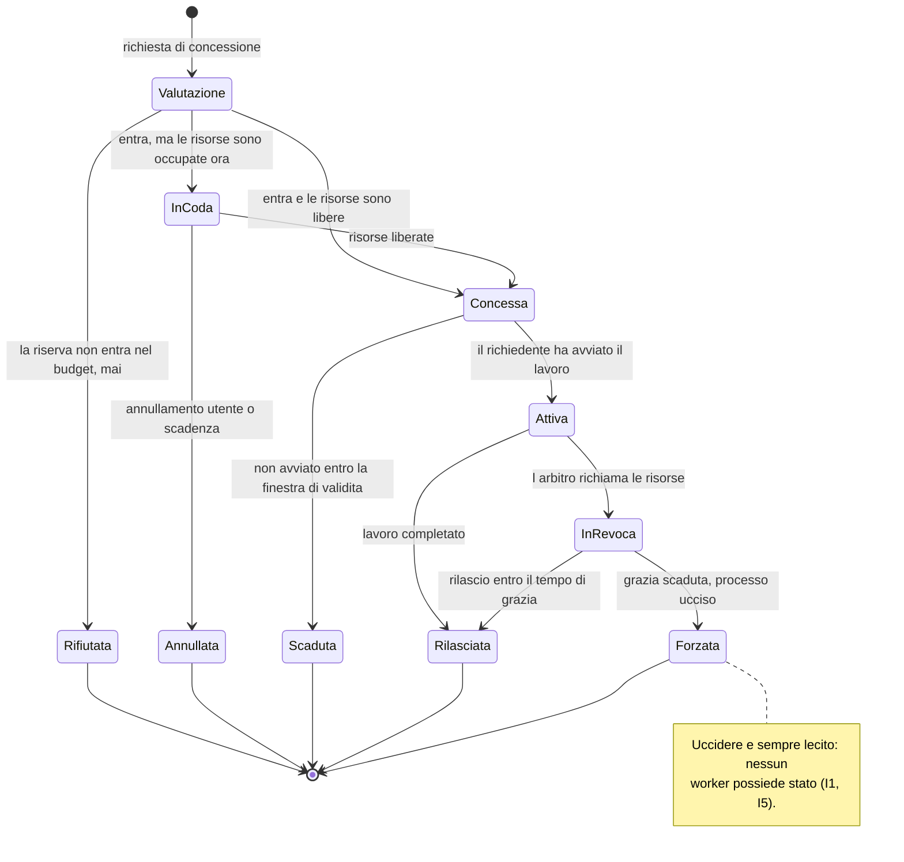
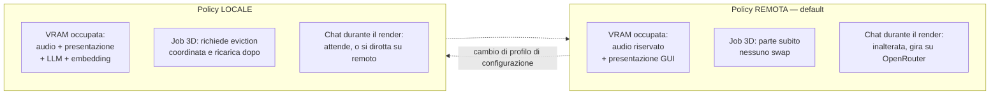

# Arbitrato delle risorse GPU

Modello della risorsa, ciclo di vita di una concessione, corsie di priorità.
Fonte di verità su chi può toccare la GPU e a quali condizioni.

Decisioni: [ADR-0005](../adr/0005-arbitrato-gpu-su-due-dimensioni.md) ·
[ADR-0006](../adr/0006-due-policy-vram-come-oggetti-distinti.md).

## Le due dimensioni della risorsa

Modellare solo la VRAM è l'errore che fa balbettare la voce durante un render:
la VRAM basta perché il render *parta*, ma è la contesa di calcolo a rovinare
l'esperienza. Sono due grandezze di natura diversa e vanno arbitrate diversamente.

| Dimensione | Natura | Fallimento tipico | Come si arbitra |
|---|---|---|---|
| **VRAM** | capacità — allocabile, esclusiva, quantizzata | OOM: brutale e immediato | ammissione: o entra, o non parte |
| **Calcolo** | contesa — condivisibile, degrada con continuità | balbuzie, latenza che si allunga | corsie: chi ha priorità occupa meno il resto |

## Profilo di risorsa

Ogni tipo di lavoro dichiara un profilo. È un descrittore nominato e versionato,
non un numero sparso nel codice.

| Campo | Tipo | Significato |
|---|---|---|
| `nome` | identificatore | es. `trellis2-single-image-q-media` |
| `vram_riservata` | MiB | riserva di picco dichiarata, non misurata a posteriori |
| `classe_calcolo` | `realtime` \| `interactive` \| `batch` | corsia di appartenenza |
| `prelazionabile` | sì / no | se l'arbitro può richiamare le risorse |
| `tempo_di_rilascio` | ms | quanto può metterci a liberarle prima del kill |
| `avvio_a_freddo` | ms stimati | usato per avvisare l'utente, non per decidere |

> ⚠️ **RICHIAMO DEL 2026-08-27, finding AUD-032 — questi sei campi sono realizzati da DUE
> strutture e non da un descrittore solo.** `ResourceProfile` ne porta **quattro**:
> `prelazionabile` e `tempo_di_rilascio` sono **un** campo, `Preemption::{Never, After(Millis)}`,
> perché due campi separati rendono pronunciabile *«non prelazionabile con una grazia di
> 500 ms»*; e `avvio_a_freddo` **non è nel profilo affatto** — `cold_start` vive in
> `WorkDescriptor`, che l'ammissione **non riceve**, così che una decisione che volesse leggerlo
> **non abbia una strada**. ⚠️ Nel merito la riga *«usato per avvisare l'utente, non per
> decidere»* è quindi più che rispettata: da intenzione è diventata una **regola di livello 1**,
> tenuta dal caso `crates/kernel/tests/compile_fail/admission_reads_cold_start.rs`. Il perché
> per esteso sta nel rimando in testa a [ADR-0005](../adr/0005-arbitrato-gpu-su-due-dimensioni.md),
> in una casa sola.
>
> ⚠️ **E `interattivo` è diventato `interactive` — finding AUD-036, ma solo qui e con la
> ragione.** Le altre due voci della stessa enumerazione erano **già inglesi**, e la §5.5 della
> spec scrive `interactive`: ciò che si chiude è un **dialetto misto dentro un'enumerazione
> sola**, che la §4 del compendio chiama *«la condizione peggiore delle due»*. ⛔ **Gli altri
> nomi italiani di questo file NON sono tradotti**, ed è deliberato: sono il **vocabolario del
> modello**, e tradurli tocca ciò che gli ADR e la spec approvata scrivono. La voce è
> **registrata e non presa** in [`porta-di-qualita.md`](../porta-di-qualita.md).

**Un tipo di lavoro può avere più profili.** Il fabbisogno di TRELLIS2 dipende dalla
risoluzione e dai parametri di qualità, quindi non produce un numero ma una **curva**:
i punti utili di quella curva diventano profili nominati distinti
(es. `trellis2-512-lean`, `trellis2-512-standard`, `trellis2-1024`), ciascuno con la
propria `vram_riservata` misurata. La scelta del profilo è la scelta del punto di
lavoro. Vedi SP-1 in §9 della spec.

**La riserva è dichiarata dal richiedente, verificata dall'arbitro.** Il picco reale
viene misurato durante l'esecuzione e registrato: se supera la riserva dichiarata, il
profilo è sbagliato e va corretto. È così che la "stima di fit prima del caricamento"
smette di essere un'illusione e diventa un dato che migliora nel tempo.

## Ciclo di vita di una concessione



⛔ **RICHIAMO DEL 2026-08-27, finding AUD-044 — la transizione `InCoda --> Annullata` NON HA
NESSUN MECCANISMO nell'arbitro, e fino a oggi non aveva nemmeno un indirizzo.** Misurato invece
che dedotto: `grep -rniE 'cancel|annull' --include=*.rs crates/kernel/src/` non ha **nessun**
riscontro; gli unici punti che mutano `queues` in `crates/kernel/src/arbiter/mod.rs` sono
`enqueue`, `promote` e `new`, e `collect_expired` fa `retain` **solo** su `held`. Quindi
dalla coda si esce **soltanto** per promozione, e un biglietto consegnato è **immortale** —
mentre più in basso questo stesso file promette all'utente *«posizione e stima d'attesa, con
opzione di annullare»*.

⚠️ **La conseguenza è già visibile e ha già costato codice:** `StartupError::ReservedQuota` in
`crates/daemon/src/main.rs` esiste perché la seconda quota permanente torna `Queued` e
**nessuno la servirà mai**, cioè il degrado silenzioso che ADR-0005 e ADR-0019 vietano. Il
tampone è nella **radice di composizione** e vale per **un** caso; il buco resta per ogni altro
chiamante.

⛔ **Il rimedio si ferma PRIMA di decidere, ed è deliberato:** se la macchina a stati mantenga
la promessa — e allora qualcuno costruisce l'annullamento — o se la transizione esca dal
diagramma, è una scelta del **proprietario**. Ciò che si chiude oggi è l'**arretrato anonimo**:
la voce ha ora una riga nella tabella *«Le voci aperte del Traguardo 5, in una tabella sola»* di
[`porta-di-qualita.md`](../porta-di-qualita.md), che è la sua casa unica. 📌 La §9 del disegno
del Traguardo 5 si intitola *«Cosa non entra, e dove va»* e apre con *«ogni riga ha un
indirizzo»*: questo ramo non compariva **né** fra le cose fatte **né** fra quelle rimandate,
perché la §6 aveva tradotto in tipi **quattro** punti della macchina e li aveva trattati come la
macchina intera.

### Regole che il diagramma non esprime

- **`Rifiutata` è diversa da `InCoda`.** Rifiutata significa "non entrerebbe *mai*",
  e va detto subito con l'alternativa praticabile. InCoda significa "non ora".
  Confonderle produce attese infinite per lavori impossibili.
- **`Concessa` ha una finestra di validità.** Una concessione non ritirata blocca
  risorse per un richiedente che forse è morto.
- **`InRevoca` non esiste per i profili non prelazionabili**: per loro l'arbitro
  attende o rifiuta, non revoca.
- Nessun processo passa a `Attiva` senza concessione valida in mano (I2).

## Corsie di priorità

| Corsia | Chi la usa | Prelazionabile | Garanzia |
|---|---|---|---|
| `realtime` | wake word, VAD, STT, TTS | **mai** | quota VRAM riservata, fuori dal pool allocabile |
| `interactive` | chat e agente in primo piano | sì, grazia breve | servita prima di `batch` |
| `batch` | render 3D, indicizzazione, run in background | sì | può attendere indefinitamente |

### La quota audio è sottratta, non prioritaria

La VRAM riservata all'audio viene **tolta dal budget allocabile all'avvio** e non vi
rientra mai. Nessun altro lavoro può richiederla, nemmeno se la GPU è scarica.

È una differenza sostanziale rispetto a "dare priorità alta alla voce": una priorità
è un ordinamento, e sotto pressione un ordinamento si può solo rispettare *dopo* aver
già allocato. Un budget sottratto non può essere allocato per errore. Questa è la
risposta strutturale a "la voce non deve balbettare durante un render".

**La sottrazione non è un'esenzione.** Il worker audio non è fuori dall'arbitrato:
detiene una **concessione permanente e non prelazionabile** sulla quota riservata.
I2 vale anche per lui — nessun processo tocca la GPU senza concessione. Ciò che cambia
non è l'obbligo, è che la sua concessione non può essere revocata né contesa.

### La quota di presentazione della GUI

Decisione: [ADR-0033](../adr/0033-gpu-della-gui-quota-di-presentazione.md).

Anche il processo `gui` tocca la GPU: il **compositing** della webview sempre, il
**viewer 3D** (G6) quando serve. Si modella come **tre consumatori distinti**, perché
hanno percorsi di richiesta diversi.

| # | Consumo | Governo | Corsia | Rifiuto esecutivo? |
|---|---|---|---|---|
| 1 | compositing della webview | quota di **presentazione** sottratta | `realtime`, **mai in coda** | ❌ no |
| 2 | viewer 3D **entro** la quota | stessa quota | `realtime`, **mai in coda** | ❌ no |
| 3 | viewer 3D **oltre** la quota | **concessione ordinaria** via IPC | `interactive` | ✅ sì |

> ⛔ **RICHIAMO DEL 2026-08-27, finding AUD-010 — la colonna «Corsia» diceva *«fuori dalle
> corsie: l'arbitro non lo schedula»* per i primi due e `interattivo` per il terzo, e la §5.5
> della spec aveva corretto la tabella gemella il 2026-08-08 — diciassette giorni prima che
> l'arbitro venisse scritto.** *«Fuori dalle corsie»* sarebbe un **quarto valore che il tipo non
> ha:** `ComputeClass` ne porta **tre** — `Realtime`, `Interactive`, `Batch` — e `compute_class`
> è un campo **obbligatorio** di `ResourceProfile`, perché la concessione di presentazione è una
> concessione **con un titolare** (ADR-0033) e non un'esenzione. ✅ **Il codice sta con la spec, e
> non è dedotto:** `crates/daemon/src/main.rs` dichiara `PRESENTATION_RESERVATION` con
> `compute_class: ComputeClass::Realtime`, e la sonda
> `the_two_reservations_declare_no_preemption_and_one_lane` fissa proprio quel valore.
> ⚠️ **Ciò che la vecchia cella diceva male resta comunque vero, e va tenuto:** i consumatori 1 e
> 2 non entrano **mai in coda**, perché una concessione permanente non torna in ammissione. È un
> fatto sul **ciclo di vita**, non un valore di tipo.
> ⛔ **E il secondo scarto, sullo stesso rigo, era la §1.0:** `interattivo` è un riferimento al
> codice scritto in italiano, e la regola vuole il **nome esatto del sorgente**.
> 📌 **La causa, e vale oltre il caso:** la correzione del 2026-08-08 è nata nella spec e non ha
> attraversato questo file — radice **R1** — mentre la §5.4 afferma che *«`design/02` è
> aggiornato nello stesso passaggio»*. Era vero della riga delle policy VRAM e **non** di questa
> cella: un aggiornamento **parziale letto come completo**, che è il gotcha **#71**.

```
budget allocabile = totale − quota audio − quota presentazione
```

**La concessione di presentazione la tiene il core**, non la GUI: la richiede all'avvio,
permanente e non prelazionabile. Così la sottrazione non diventa un'esenzione (I2 resta
vero) e nulla si perde quando la GUI muore — il titolare è il core, la cui vita è lunga
e indipendente.

⚠️ **Con una differenza di forza da dichiarare.** Verso un worker il rifiuto
dell'arbitro è *esecutivo*: il processo non parte. Verso il compositor **non lo è**:
compone lo stesso. La quota è una **promessa di budget, non un'imposizione**.

Il valore della quota è **non misurato**: lo chiude M5, insieme a M1–M4 di
[ADR-0029](../adr/0029-guscio-della-gui.md).

### Contesa di calcolo

Il calcolo GPU non è prelazionabile a grana fine come la memoria. La leva praticabile
è indiretta: quando una corsia `realtime` è attiva, i lavori `batch` in corso vengono
istruiti a **ridurre la propria occupazione** (meno stream concorrenti, batch più
piccoli), accettando di allungarsi.

Quanto questo basti a tenere Q1 sotto i 600 ms è una domanda aperta, non una
certezza: è oggetto dello spike SP-2 in §9 della spec.

## Le due policy VRAM



| | Policy REMOTA *(default)* | Policy LOCALE |
|---|---|---|
| Chi occupa VRAM | audio riservato **+ presentazione** | audio + presentazione + LLM + embedding locali |
| Prima di un job 3D | nulla da fare | eviction coordinata, obbligatoria |
| Dopo un job 3D | nulla da fare | ricarica con avvio a freddo visibile |
| Chat durante un render | inalterata | bloccata, oppure dirottata su remoto |
| Modo di fallire | rete assente | avvio a freddo lungo, attese |

**Sono due oggetti distinti, non due rami di un `if`.** Hanno invarianti diverse e
modi di fallire diversi; un condizionale sparso nell'arbitro deriva in silenzio fino
a che nessuno sa più quale regola valga. La policy attiva è determinata dal profilo
di configurazione, e il passaggio da una all'altra è una **transizione esplicita**
con effetti osservabili — non un cambio di flag.

Il "passaggio suggerito a OpenRouter durante i render" della mappa funzionale è
esattamente questa transizione, offerta all'utente invece che imposta.

## Cosa vede l'utente

Il principio: **nessun degrado silenzioso**. Ogni volta che il sistema decide
qualcosa al posto dell'utente, glielo dice.

| Situazione | Cosa viene mostrato |
|---|---|
| `Rifiutata` | perché non entra, e l'alternativa concreta (qualità ridotta, backend remoto) |
| `InCoda` | posizione e stima d'attesa, con opzione di annullare |
| `InRevoca` | cosa sta per essere fermato e perché |
| Viewer 3D revocato durante un render | che il 3D è in pausa e perché, con la ripresa attesa ([ADR-0033](../adr/0033-gpu-della-gui-quota-di-presentazione.md)) |
| Avvio a freddo | che un modello si sta ricaricando, con attesa stimata |
| Policy in transizione | che il backend è cambiato, e per quali richieste |
