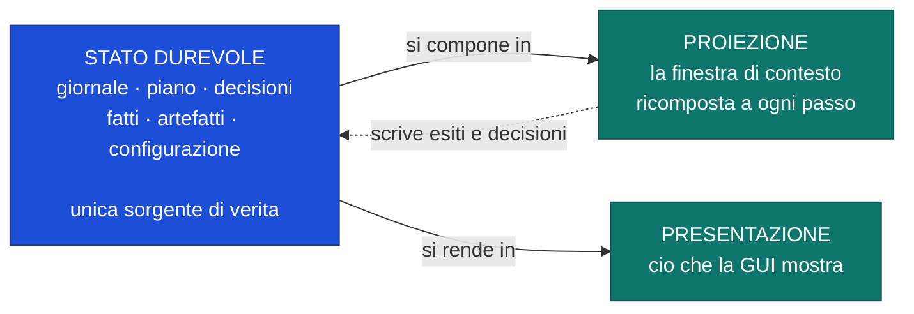
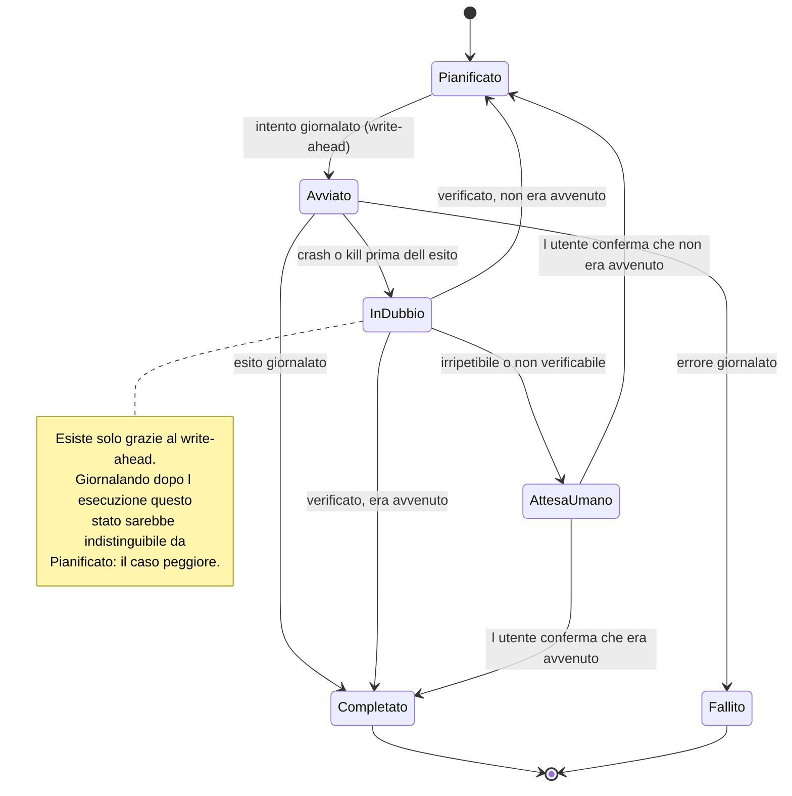
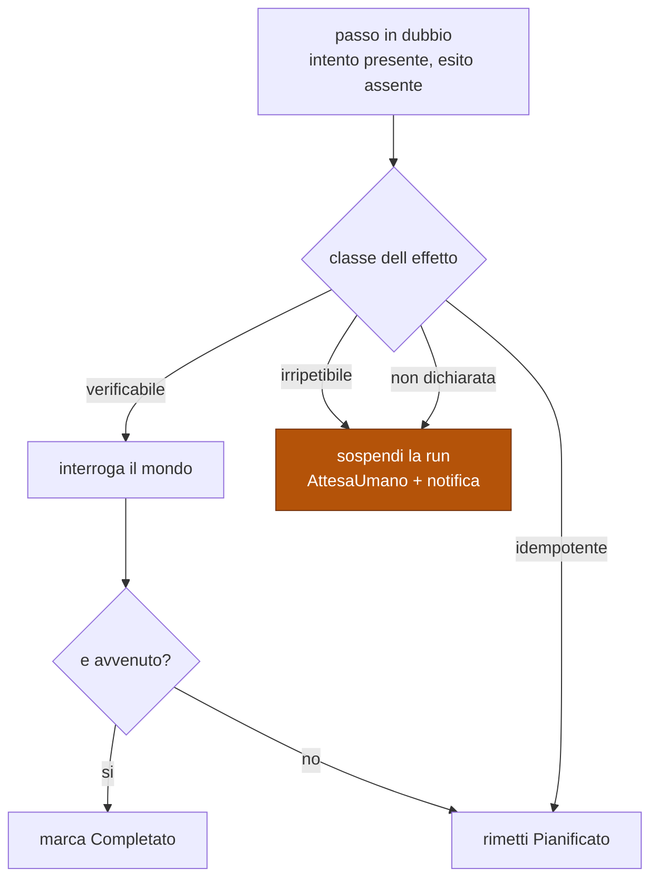

# Run durevoli, giornale e proiezione del contesto

Modello dello stato, ciclo di vita di un passo, riconciliazione alla ripresa.
Fonte di verità su cosa sopravvive a un crash e su come.

Decisioni: [ADR-0007](../adr/0007-giornale-write-ahead-e-riconciliazione.md) ·
[ADR-0008](../adr/0008-contesto-come-proiezione-dello-stato.md).

## I tre livelli dello stato

| Livello | Durata | Ricostruibile? |
|---|---|---|
| **Durevole** | permanente | no — **è** la sorgente |
| **Proiezione** | un passo | sì, dal durevole |
| **Presentazione** | finché la GUI è aperta | sì, dal durevole |

La freccia tratteggiata è la sola direzione in cui la proiezione può influire sulla
verità: **scrivendo un esito o una decisione**, cioè con un effetto giornalato. Non
esiste informazione che viva solo nella proiezione e conti.

## Ciclo di vita di un passo

## Riconciliazione alla ripresa

**Il ramo "non dichiarata" finisce nello stesso posto di `irripetibile`.** Un effetto
che nessuno ha classificato viene trattato come il più pericoloso: davanti a un dubbio
non risolvibile il sistema si ferma e chiede, non indovina.

## Classi di effetto

| Classe | Esempi | Riconciliazione |
|---|---|---|
| `verificabile` | scrittura file, commit git, creazione risorsa con nome noto | interroga, poi decidi |
| `idempotente` | scrittura con chiave, aggiornamento indice, upsert | riesegui |
| `irripetibile` | chiamata a pagamento, invio messaggio, comando distruttivo | sospendi e chiedi |

## Cosa sopravvive alla compattazione

| Elemento | Sacrificabile? |
|---|---|
| obiettivo · vincoli · piano · stato dei passi | **mai** |
| decisioni prese, con il motivo | **mai** |
| fatti acquisiti, con la provenienza | **mai** |
| artefatti prodotti — riferimenti, non contenuti | **mai** (il contenuto si rilegge) |
| trascrizione grezza | **sì**, unica perdita ammessa |

Compattare non significa riassumere la conversazione: significa **ricomporre la
proiezione** dallo stato durevole. Ciò che serve a proseguire è strutturato, quindi
non passa mai dal riassunto.

## Confini di autonomia

| Tetto | Al superamento |
|---|---|
| passi | la run passa in `AttesaUmano` |
| tempo di parete | idem |
| costo cumulato | idem |

Il superamento **sospende**, non termina: lo stato resta ripristinabile e l'utente
decide se alzare il tetto o fermarsi. Ogni ingresso in `AttesaUmano` emette una
notifica — una run in background che si blocca in silenzio è indistinguibile da una
run morta.

## Regole che i diagrammi non esprimono

- **Il giornale è l'unica sorgente per la ripresa.** Non lo stato in memoria, non un
  file di checkpoint separato, non la trascrizione.
- **Un passo = un'interazione con il mondo esterno.** Non più fine: ogni passo costa
  due scritture durevoli.
- **Se non è giornalato, non è avvenuto.** Vale per gli effetti e vale per le
  decisioni: rende osservabile ciò che altrimenti sarebbe sperato.
- Un sub-agente non è un meccanismo nuovo: è una **proiezione ristretta** della
  stessa struttura, con il proprio segmento di giornale.
