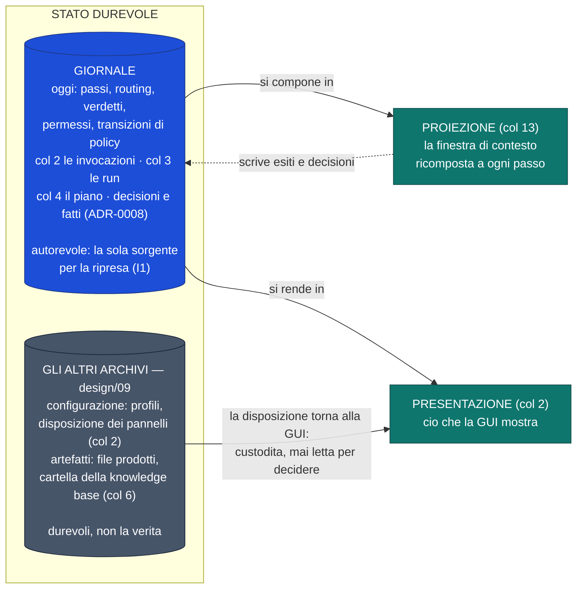
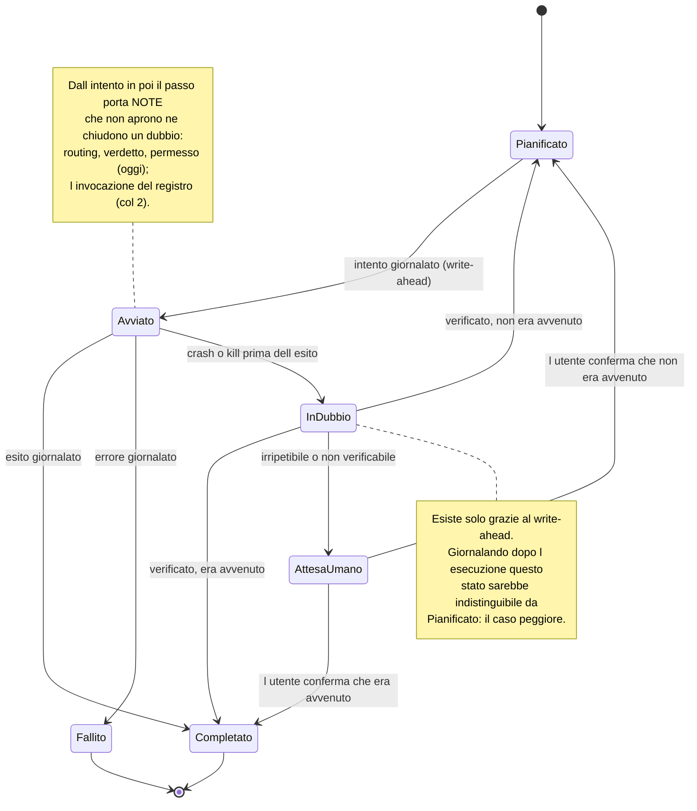
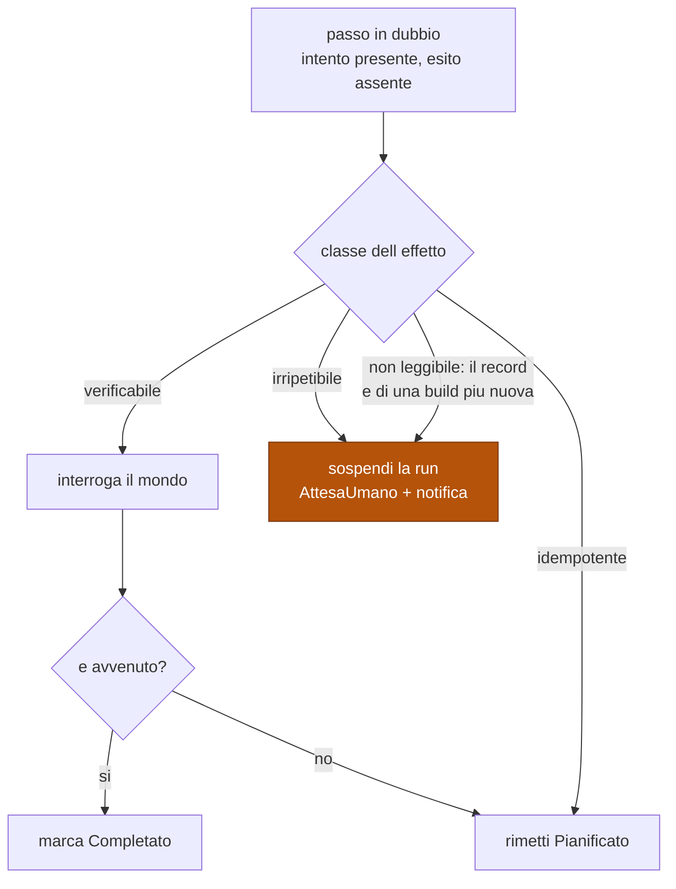

# Run durevoli, giornale e proiezione del contesto

Modello dello stato, ciclo di vita di un passo, riconciliazione alla ripresa.
Fonte di verità su cosa sopravvive a un crash e su come.

Decisioni: [ADR-0007](../adr/0007-giornale-write-ahead-e-riconciliazione.md) ·
[ADR-0008](../adr/0008-contesto-come-proiezione-dello-stato.md).

⚠️ **RICHIAMO DEL 2026-09-08 — la sezione 2 della passata sui diagrammi della stella polare della GUI.**
Il diagramma dei tre livelli separa il **giornale**, la sola sorgente autorevole (I1, design/09), dagli
altri archivi, durevoli ma non la verità; il ciclo di vita del passo guadagna le **note** — routing,
verdetto, permesso oggi, l'invocazione del registro col 2 — che non aprono né chiudono un dubbio; il ramo
«non dichiarata» della riconciliazione diventa «non leggibile», perché una classe non dichiarata **non si
può scrivere**: è un campo obbligatorio senza default (§7.4.4 della spec, V5 al compilatore). Una voce
segnata «(col N)» è **decisa**, e la costruisce il sotto-progetto N. Il perché sta nella
[stella polare](../superpowers/specs/2026-09-07-direzione-gui-design.md), decisioni 16–18.

## I tre livelli dello stato

| Livello | Durata | Ricostruibile? |
|---|---|---|
| **Durevole** | permanente | no — il **giornale è** la sorgente; gli altri archivi si ricostruiscono o si rifiutano (design/09) |
| **Proiezione** (col 13) | un passo | sì, dal giornale |
| **Presentazione** (col 2) | finché la GUI è aperta | sì, dal giornale — e la disposizione dei pannelli dalla settima porta, custodita dal core |

La freccia tratteggiata è la sola direzione in cui la proiezione può influire sulla
verità: **scrivendo un esito o una decisione**, cioè con un effetto giornalato. Non
esiste informazione che viva solo nella proiezione e conti. La freccia dagli altri
archivi alla presentazione è la **disposizione dei pannelli**: durevole perché sopravvive
al riavvio, non verità perché il core non la legge mai per decidere (design/09, decisioni
14 e 15 della stella polare).

## Ciclo di vita di un passo

## Riconciliazione alla ripresa

**Il ramo «non leggibile» finisce nello stesso posto di `irripetibile`.** Un effetto senza
classe **non si può scrivere**: la classe è un campo obbligatorio del record, senza default
(§7.4.4 della spec, V5 al compilatore; ADR-0007, rimando del 2026-08-07). Ciò che una build può
incontrare è un record che **non sa decodificare** — scritto da una build più nuova, ADR-0036 —
e lo tratta come il caso più pericoloso: il passo entra in dubbio con «sospendi e chiedi», il
sistema si ferma e non indovina (`steps_in_doubt`, `crates/kernel/src/reconcile.rs`). ⚠️ Fino
al 2026-09-08 il ramo diceva «non dichiarata»: nel codice quel caso non è pronunciabile da quando
esiste il record (2026-08-10).

## Classi di effetto

| Classe | Esempi | Riconciliazione |
|---|---|---|
| `verificabile` | scrittura file, commit git, creazione risorsa con nome noto | interroga, poi decidi |
| `idempotente` | scrittura con chiave, aggiornamento indice, upsert; **oggi** il cambio di policy VRAM (`Arbiter::set_policy`), e col 2 l'invocazione del registro che lo chiede (§5 del disegno del 2) | riesegui |
| `irripetibile` | chiamata a pagamento, invio messaggio, comando distruttivo | sospendi e chiedi |

## Cosa sopravvive alla compattazione

| Elemento | Sacrificabile? |
|---|---|
| obiettivo · vincoli · piano · stato dei passi | **mai** |
| decisioni prese, con il motivo | **mai** |
| fatti acquisiti, con la provenienza | **mai** |
| artefatti prodotti — riferimenti, non contenuti | **mai** (il contenuto si rilegge) |
| la mappa della knowledge base — per chiave, le foglie come riferimenti (col 13) | **mai** (ADR-0008, rimando del 2026-09-05) |
| trascrizione grezza | **sì**, unica perdita ammessa |

Compattare non significa riassumere la conversazione: significa **ricomporre la
proiezione** dallo stato durevole. Ciò che serve a proseguire è strutturato, quindi
non passa mai dal riassunto.

## Confini di autonomia

| Tetto | Al superamento |
|---|---|
| passi | la run passa in `AttesaUmano` |
| tempo di parete | idem |
| costo cumulato | idem |

Il superamento **sospende**, non termina: lo stato resta ripristinabile e l'utente
decide se alzare il tetto o fermarsi. Ogni ingresso in `AttesaUmano` emette una
notifica — una run in background che si blocca in silenzio è indistinguibile da una
run morta.

## Regole che i diagrammi non esprimono

- **Il giornale è l'unica sorgente per la ripresa.** Non lo stato in memoria, non un
  file di checkpoint separato, non la trascrizione.
- **Un passo = un'interazione con il mondo esterno.** Non più fine: ogni passo costa
  due scritture durevoli.
- **Se non è giornalato, non è avvenuto.** Vale per gli effetti e vale per le
  decisioni: rende osservabile ciò che altrimenti sarebbe sperato.
- Un sub-agente non è un meccanismo nuovo: è una **proiezione ristretta** della
  stessa struttura, con il proprio segmento di giornale — col 3: oggi il record non
  porta né run né passo padre (ADR-0011).
- Un'**invocazione del registro** è un passo suo, e l'effetto che invoca è un altro
  passo suo (§5 del disegno del 2): «B dentro A» è **ordine nel giornale**, non
  gerarchia. Se col 3 ogni chiamata di strumento debba costare due passi è registrato
  nella stella polare, chiusore il 3.
