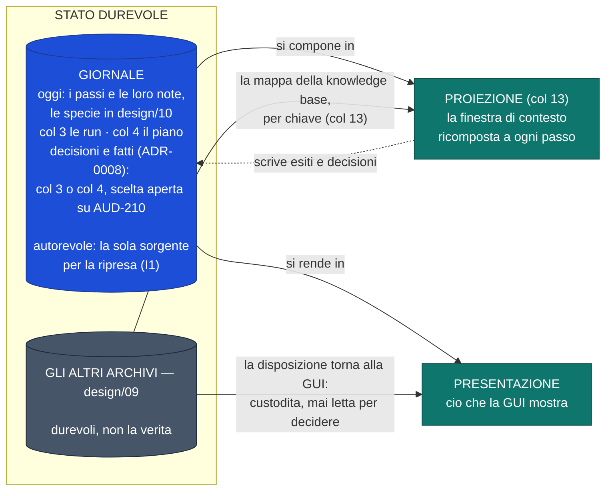
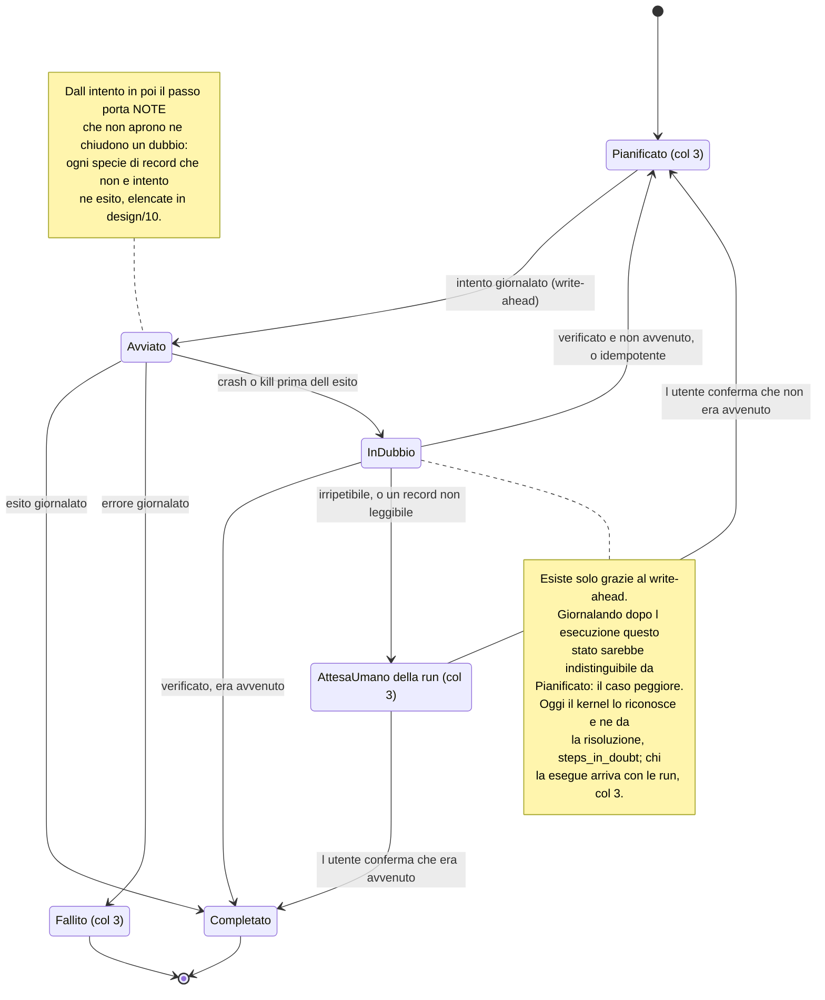
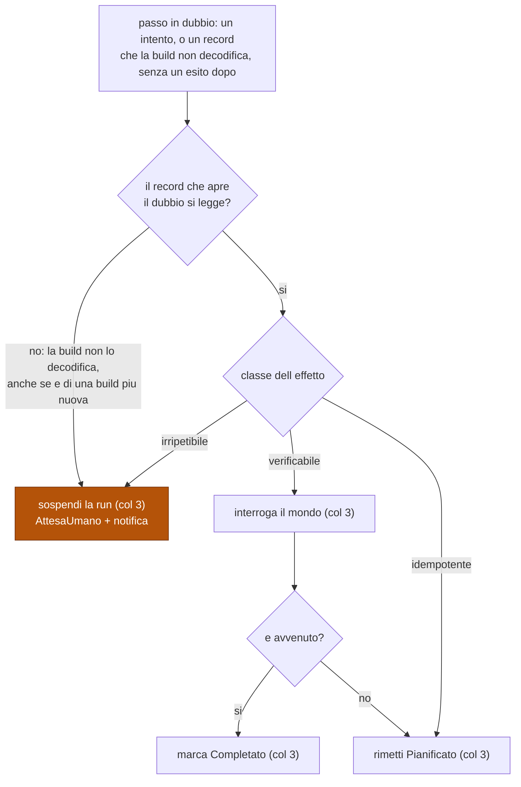

# Run durevoli, giornale e proiezione del contesto

Modello dello stato, ciclo di vita di un passo, riconciliazione alla ripresa.
Fonte di verità su cosa sopravvive a un crash e su come.

Decisioni: [ADR-0007](../adr/0007-giornale-write-ahead-e-riconciliazione.md) ·
[ADR-0008](../adr/0008-contesto-come-proiezione-dello-stato.md).

⚠️ **RICHIAMO DEL 2026-09-08 — la sezione 2 della passata sui diagrammi della stella polare della GUI.**
Il diagramma dei tre livelli separa il **giornale**, la sola sorgente autorevole (I1, design/09), dagli
altri archivi, durevoli ma non la verità; il ciclo di vita del passo guadagna le **note** — routing,
verdetto, permesso, l'invocazione del registro — che non aprono né chiudono un dubbio; il ramo
«non dichiarata» della riconciliazione diventa «non leggibile», perché una classe non dichiarata **non si
può scrivere**: è un campo obbligatorio senza default (§7.4.4 della spec, V5 al compilatore). Una voce
segnata «(col N)» è **decisa**, e la costruisce il sotto-progetto N. Il perché sta nella
[stella polare](../superpowers/specs/2026-09-07-direzione-gui-design.md), decisioni 16–18.

⚠️ **RICHIAMO DEL 2026-10-02** — audit del 2026-09-30, AUD-208, AUD-210, AUD-216, AUD-219 e AUD-222:
l'invocazione del registro, la presentazione e la disposizione dei pannelli esistono, dal sotto-progetto 2;
gli stati del passo e le azioni della riconciliazione arrivano con le run (col 3). Il segno è la regola 2
del [README](../README.md).

## I tre livelli dello stato

```mermaid
flowchart LR
    subgraph DUR["STATO DUREVOLE"]
        J[("GIORNALE<br/>oggi: i passi e le loro note,<br/>le specie in design/10<br/>col 3 le run · col 4 il piano<br/>decisioni e fatti (ADR-0008):<br/>col 3 o col 4, scelta aperta su AUD-210<br/><br/>autorevole: la sola sorgente<br/>per la ripresa (I1)")]
        O[("GLI ALTRI ARCHIVI — design/09<br/><br/>durevoli, non la verita")]
    end
    P["PROIEZIONE (col 13)<br/>la finestra di contesto<br/>ricomposta a ogni passo"]
    G["PRESENTAZIONE<br/>cio che la GUI mostra"]

    J -->|"si compone in"| P
    O -->|"la mappa della knowledge base,<br/>per chiave (col 13)"| P
    J -->|"si rende in"| G
    O -->|"la disposizione torna alla GUI:<br/>custodita, mai letta per decidere"| G
    P -.->|"scrive esiti e decisioni"| J

    classDef ver fill:#1d4ed8,stroke:#1e3a8a,color:#fff
    classDef der fill:#0f766e,stroke:#134e4a,color:#fff
    classDef plain fill:#475569,stroke:#1e293b,color:#fff
    class J ver
    class P,G der
    class O plain
```

| Livello | Durata | Ricostruibile? |
|---|---|---|
| **Durevole** | permanente | no — il **giornale è** la sorgente; gli altri archivi si ricostruiscono o si rifiutano (design/09) |
| **Proiezione** (col 13) | un passo | sì, dallo stato durevole: il giornale e, per chiave, la mappa della knowledge base |
| **Presentazione** | finché la GUI è aperta | sì, dal giornale — e la disposizione dei pannelli dalla settima porta, custodita dal core |

La freccia tratteggiata è la sola direzione in cui la proiezione può influire sulla
verità: **scrivendo un esito o una decisione**, cioè con un effetto giornalato. Non
esiste informazione che viva solo nella proiezione e conti. La freccia dagli altri
archivi alla presentazione è la **disposizione dei pannelli**: durevole perché sopravvive
al riavvio, non verità perché il core non la legge mai per decidere (design/09, decisioni
14 e 15 della stella polare). La freccia dagli altri archivi alla proiezione è la **mappa della
knowledge base**: entra per chiave — ambito, run, modello — e mai per lettura del suo testo, e le
foglie come riferimenti (ADR-0008, rimando del 2026-09-05). ⚠️ **RICHIAMO DEL 2026-10-02** — audit del
2026-09-30, AUD-211, AUD-218, AUD-220 e AUD-221: la proiezione si compone dallo stato durevole, il giornale
e per chiave la mappa; che cosa contengano gli altri archivi lo dice design/09, casa unica.

## Ciclo di vita di un passo

```mermaid
stateDiagram-v2
    state "Pianificato (col 3)" as Pianificato
    state "Fallito (col 3)" as Fallito
    state "AttesaUmano della run (col 3)" as AttesaUmano

    [*] --> Pianificato

    Pianificato --> Avviato : intento giornalato (write-ahead)

    Avviato --> Completato : esito giornalato
    Avviato --> Fallito : errore giornalato
    Avviato --> InDubbio : crash o kill prima dell esito

    InDubbio --> Completato : verificato, era avvenuto
    InDubbio --> Pianificato : verificato e non avvenuto, o idempotente
    InDubbio --> AttesaUmano : irripetibile, o un record non leggibile

    AttesaUmano --> Completato : l utente conferma che era avvenuto
    AttesaUmano --> Pianificato : l utente conferma che non era avvenuto

    Completato --> [*]
    Fallito --> [*]

    note left of Avviato
        Dall intento in poi il passo porta NOTE
        che non aprono ne chiudono un dubbio:
        ogni specie di record che non e intento
        ne esito, elencate in design/10.
    end note

    note right of InDubbio
        Esiste solo grazie al write-ahead.
        Giornalando dopo l esecuzione questo
        stato sarebbe indistinguibile da
        Pianificato: il caso peggiore.
        Oggi il kernel lo riconosce e ne da
        la risoluzione, steps_in_doubt; chi
        la esegue arriva con le run, col 3.
    end note
```

⚠️ **RICHIAMO DEL 2026-10-02** — audit del 2026-09-30, AUD-205, AUD-209, AUD-212, AUD-213 e AUD-214: oggi un
passo nasce col suo intento e si chiude col suo esito, e il kernel riconosce il dubbio con la sua risoluzione
(`steps_in_doubt`); `Pianificato`, `Fallito`, `AttesaUmano` e le uscite dal dubbio arrivano con le run (col 3).
`AttesaUmano` è uno stato della **run**: ci entra per un dubbio irripetibile o illeggibile, e ne esce con la
risposta dell'utente sul passo, qui sopra; ci entra per un tetto superato, e ne esce se l'utente alza il tetto
o la ferma — i confini di autonomia, più sotto.

## Riconciliazione alla ripresa

```mermaid
flowchart TD
    A["passo in dubbio: un intento, o un record<br/>che la build non decodifica, senza un esito dopo"] --> R{"il record che apre<br/>il dubbio si legge?"}
    R -->|"no: la build non lo decodifica,<br/>anche se e di una build piu nuova"| G["sospendi la run (col 3)<br/>AttesaUmano + notifica"]
    R -->|si| B{"classe dell effetto"}

    B -->|verificabile| C["interroga il mondo (col 3)"]
    C --> D{"e avvenuto?"}
    D -->|si| E["marca Completato (col 3)"]
    D -->|no| F["rimetti Pianificato (col 3)"]

    B -->|idempotente| F
    B -->|irripetibile| G

    classDef safe fill:#b45309,stroke:#78350f,color:#fff
    class G safe
```

**Il ramo «non leggibile» finisce nello stesso posto di `irripetibile`.** Un effetto senza
classe **non si può scrivere**: la classe è un campo obbligatorio del record, senza default
(§7.4.4 della spec, V5 al compilatore; ADR-0007, rimando del 2026-08-07). Ciò che una build può
incontrare è un record che **non sa decodificare** — scritto da una build più nuova, ADR-0036, o
byte troncati e guasti — e lo tratta come il caso più pericoloso: il passo entra in dubbio con
«sospendi e chiedi», anche dopo un esito leggibile (`steps_in_doubt`,
`crates/kernel/src/reconcile.rs`). ⚠️ Fino al 2026-09-08 il ramo diceva «non dichiarata»: nel codice
quel caso non è pronunciabile da quando esiste il record (2026-08-10). ⚠️ **RICHIAMO DEL 2026-10-02** —
audit del 2026-09-30, AUD-209, AUD-213, AUD-215 e AUD-217: oggi il kernel classifica il dubbio e ne dà la
risoluzione, e nessun codice di produzione la chiede; chi interroga il mondo, ripianifica e sospende la
run arriva con le run (col 3).

## Classi di effetto

| Classe | Esempi | Riconciliazione |
|---|---|---|
| `verificabile` | scrittura file, commit git, creazione risorsa con nome noto | interroga, poi decidi |
| `idempotente` | scrittura con chiave, aggiornamento indice, upsert; **oggi** il cambio di policy VRAM (`Arbiter::set_policy`) e l'invocazione del registro che lo chiede (§5 del disegno del 2) | riesegui |
| `irripetibile` | chiamata a pagamento, invio messaggio, comando distruttivo | sospendi e chiedi |

## Cosa sopravvive alla compattazione

| Elemento | Sacrificabile? |
|---|---|
| obiettivo · vincoli · piano · stato dei passi | **mai** |
| decisioni prese, con il motivo | **mai** |
| fatti acquisiti, con la provenienza | **mai** |
| artefatti prodotti — riferimenti, non contenuti | **mai** (il contenuto si rilegge) |
| la mappa della knowledge base — per chiave, le foglie come riferimenti (col 13) | **mai** (ADR-0008, rimando del 2026-09-05) |
| trascrizione grezza | **sì**, unica perdita ammessa |

Compattare — col 13, con la proiezione — non significa riassumere la conversazione: significa
**ricomporre la proiezione** dallo stato durevole. Ciò che serve a proseguire è strutturato, quindi
non passa mai dal riassunto.

## Confini di autonomia

| Tetto | Al superamento |
|---|---|
| passi | la run passa in `AttesaUmano` (col 3) |
| tempo di parete | idem |
| costo cumulato | idem |

Il superamento **sospende**, non termina — tetti e sospensione arrivano con la run, col 3 —: lo
stato resta ripristinabile e l'utente decide se alzare il tetto o fermarsi. Ogni ingresso in
`AttesaUmano` emette una notifica — una run in background che si blocca in silenzio è
indistinguibile da una run morta.

## Regole che i diagrammi non esprimono

- **Il giornale è l'unica sorgente per la ripresa.** Non lo stato in memoria, non un
  file di checkpoint separato, non la trascrizione.
- **Un passo = un'interazione con il mondo esterno.** Non più fine: ogni passo costa
  due scritture durevoli.
- **Se non è giornalato, non è avvenuto.** Vale per gli effetti e vale per le
  decisioni: rende osservabile ciò che altrimenti sarebbe sperato.
- Un sub-agente non è un meccanismo nuovo: è una **proiezione ristretta** della
  stessa struttura, con il proprio segmento di giornale — col 3: oggi il record non
  porta né run né passo padre (ADR-0011).
- Un'**invocazione del registro** è un passo suo, e l'effetto che invoca è un altro
  passo suo (§5 del disegno del 2): «B dentro A» è **ordine nel giornale**, non
  gerarchia. Se col 3 ogni chiamata di strumento debba costare due passi è registrato
  nella stella polare, chiusore il 3.
