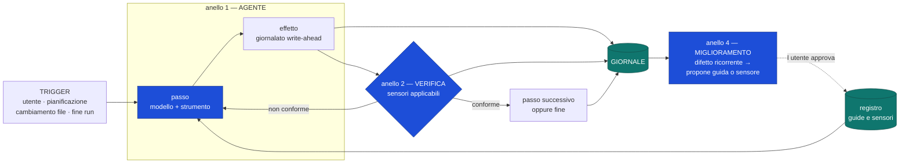
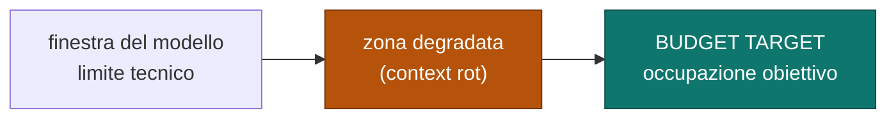

# Anelli di controllo, guide e sensori

I quattro anelli in cui gira il sistema e i due tipi di controllo che li governano.
Fonte di verità su cosa avviene fra un passo e il successivo.

Decisioni: [ADR-0009](../adr/0009-guide-sensori-e-anelli-sono-meccanismi-di-kernel.md) ·
[ADR-0010](../adr/0010-budget-della-proiezione-invece-di-soglia-di-riempimento.md).

## I due tipi di controllo

| | **Guide** — feedforward | **Sensori** — feedback |
|---|---|---|
| Quando agiscono | prima dell'azione | dopo l'azione |
| Cosa fanno | steer: orientano il comportamento | detect: rilevano lo scarto e permettono la correzione |
| Nel nostro sistema | regole di progetto, convenzioni, **skill dichiarative** ([ADR-0003](../adr/0003-estensibilita-solo-mcp-e-skill-dichiarative.md)), istruzioni d'uso degli strumenti | linter, test, validazione mesh, verifica delle citazioni, revisione |
| Dove vivono | registro delle guide → iniettate nella proiezione | registro dei sensori → verdetti nel giornale |

Il principio che li distingue: **una guida è probabilistica, un sensore è
verificabile.** Dire all'agente «segui le convenzioni» in un prompt è una guida; un
controllo che blocca il risultato quando le convenzioni sono violate è un sensore. Le
guide riducono la frequenza degli errori, i sensori li rendono impossibili da
ignorare. Servono entrambi, e non sono intercambiabili.

## I quattro anelli

| Anello | Cosa automatizza | Chi lo possiede |
|---|---|---|
| **1 — Agente** | il lavoro | capacità (politica) su meccanismo di kernel |
| **2 — Verifica** | la qualità dell'esito | kernel (esecuzione sensori) · capacità (rubrica) |
| **3 — Eventi** | l'avvio: pianificazione, file, fine di un'altra run | kernel |
| **4 — Miglioramento** | il miglioramento del sistema stesso | kernel propone · **utente approva** |

L'anello 3 non compare come blocco nel diagramma perché non è una fase: è
**l'insieme dei modi in cui l'anello 1 può partire**. Senza di esso il sistema
funziona solo quando qualcuno lo guarda.

L'anello 4 è quello che quasi nessun sistema chiude, ed è il motivo per cui gli stessi
difetti si ripresentano. La regola adottata: **quando un problema si ripete, si
migliora il controllo, non il prompt.**

## Classificazione dei sensori per costo

Principio: **tieni la qualità a sinistra** — i controlli si distribuiscono nel ciclo
per costo e velocità.

| Tipo | Tempo | Determinismo | Dove gira |
|---|---|---|---|
| **computazionale** | ms – s | deterministico | dentro l'anello 2, sempre |
| **inferenziale** | s – min | probabilistico, semanticamente ricco | a valle, o su richiesta |

Un sensore inferenziale dentro l'anello stretto raddoppia costo e latenza di ogni
passo. È il motivo per cui il costo fa parte del contratto del sensore e non è un
dettaglio implementativo.

## Budget della proiezione

La ricomposizione mantiene l'occupazione **al budget**, non sotto il limite. Il limite
resta come guardia di sicurezza; la politica è il budget.

| Categoria misurata | Comprimibile? |
|---|---|
| obiettivo · vincoli · piano · stato dei passi | no |
| decisioni prese, con il motivo | no |
| fatti acquisiti, con la provenienza | parzialmente (per rilevanza) |
| riferimenti agli artefatti | no (i **contenuti** sì: si rileggono) |
| trascrizione grezza | **sì** — prima vittima, unica perdita ammessa |

L'occupazione per categoria entra nel giornale. Senza misura, «il contesto è troppo
pieno» è un'impressione; con la misura si sa quale categoria lo sta divorando.

## Regole che i diagrammi non esprimono

- **Un sensore non modifica nulla.** Osserva e produce un verdetto. Correggere è
  compito dell'anello 1.
- **Il contratto del sensore è minimo per scelta:** `(artefatto) → (verdetto,
  dettaglio, costo)`. Un contratto povero si allarga; uno ricco e sbagliato no.
- **L'anello 4 propone, non applica.** Il sistema non modifica le proprie guide senza
  approvazione: un harness che si auto-modifica in silenzio è indebuggabile.
- Un verdetto negativo che rientra nell'anello 1 è **un passo nuovo**, giornalato come
  tutti gli altri: la correzione è tracciabile quanto l'errore.
