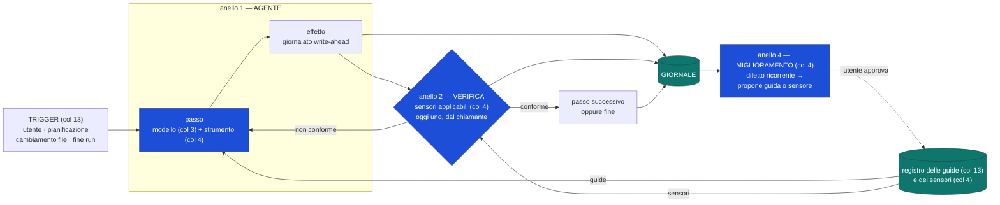
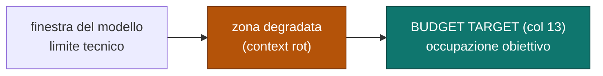

# Anelli di controllo, guide e sensori

I quattro anelli in cui gira il sistema e i due tipi di controllo che li governano.
Fonte di verità su cosa avviene fra un passo e il successivo.

Decisioni: [ADR-0008](../adr/0008-contesto-come-proiezione-dello-stato.md) ·
[ADR-0009](../adr/0009-guide-sensori-e-anelli-sono-meccanismi-di-kernel.md) ·
[ADR-0010](../adr/0010-budget-della-proiezione-invece-di-soglia-di-riempimento.md).

⚠️ **RICHIAMO DEL 2026-10-06** — audit del 2026-09-30, AUD-119, AUD-224, AUD-225, AUD-226, AUD-227 e AUD-228: oggi
esistono il giornale e l'anello 2 — il contratto del sensore, la classe di costo che ne decide l'ammissione all'anello
stretto, il verdetto nel giornale e il passo nuovo che ne rientra: `run_the_ring`, in `crates/kernel/src/sensor.rs`,
provato dai banchi con un sensore finto —; il resto è deciso, e porta il segno «(col N)» della regola 2 del
[README](../README.md).

## I due tipi di controllo

| | **Guide** — feedforward | **Sensori** — feedback |
|---|---|---|
| Quando agiscono | prima dell'azione | dopo l'azione |
| Cosa fanno | steer: orientano il comportamento | detect: rilevano lo scarto e permettono la correzione |
| Nel nostro sistema | regole di progetto, convenzioni e **skill dichiarative** ([ADR-0003](../adr/0003-estensibilita-solo-mcp-e-skill-dichiarative.md)), tutte col 13; istruzioni d'uso degli strumenti (col 4) | linter e test (col 5), verifica delle citazioni (col 6), validazione mesh (col 7), revisione (col il primo che la usa) |
| Dove vivono | registro delle guide (col 13) → iniettate nella proiezione (col 13) | registro dei sensori (col 4) → verdetti nel giornale, oggi da `run_the_ring` |

Il principio che li distingue: **una guida è probabilistica, un sensore è
verificabile.** Dire all'agente «segui le convenzioni» in un prompt è una guida; un
controllo che blocca il risultato quando le convenzioni sono violate è un sensore. Le
guide riducono la frequenza degli errori, i sensori li rendono impossibili da
ignorare. Servono entrambi, e non sono intercambiabili.

## I quattro anelli

```mermaid
flowchart LR
    T["TRIGGER (col 13)<br/>utente · pianificazione<br/>cambiamento file · fine run"] --> A

    subgraph AL["anello 1 — AGENTE"]
        A["passo<br/>modello (col 3) + strumento (col 4)"] --> E["effetto<br/>giornalato write-ahead"]
    end

    E --> S{"anello 2 — VERIFICA<br/>sensori applicabili (col 4)<br/>oggi uno, dal chiamante"}
    S -->|conforme| N["passo successivo<br/>oppure fine"]
    S -->|"non conforme"| A

    E --> J[("GIORNALE")]
    S --> J
    N --> J

    J --> H["anello 4 — MIGLIORAMENTO (col 4)<br/>difetto ricorrente →<br/>propone guida o sensore"]
    H -.->|"l utente approva"| G[("registro delle guide (col 13)<br/>e dei sensori (col 4)")]
    G -->|guide| A
    G -->|sensori| S

    classDef loop fill:#1d4ed8,stroke:#1e3a8a,color:#fff
    classDef store fill:#0f766e,stroke:#134e4a,color:#fff
    class A,S,H loop
    class J,G store
```

| Anello | Cosa automatizza | Chi lo possiede |
|---|---|---|
| **1 — Agente** | il lavoro | capacità (politica, col 3) su meccanismo di kernel — oggi il passo giornalato write-ahead |
| **2 — Verifica** | la qualità dell'esito | kernel (esecuzione sensori) · capacità (rubrica, col 4) |
| **3 — Eventi** (col 13) | l'avvio: pianificazione, file, fine di un'altra run | kernel |
| **4 — Miglioramento** (col 4) | il miglioramento del sistema stesso | kernel propone · **utente approva** |

L'anello 3 non compare come blocco nel diagramma perché non è una fase: è
**l'insieme dei modi in cui l'anello 1 può partire**. Senza di esso il sistema
funziona solo quando qualcuno lo guarda. Oggi ne è dichiarata la porta, `reactor`, per la
pianificazione e il cambiamento di file (§0.4.3 della
[spec del sotto-progetto 1](../superpowers/specs/2026-08-06-sottoprogetto-1-kernel.md)), e niente genera ancora eventi.

L'anello 4 è quello che quasi nessun sistema chiude, ed è il motivo per cui gli stessi
difetti si ripresentano. La regola adottata: **quando un problema si ripete, si
migliora il controllo, non il prompt.**

## Classificazione dei sensori per costo

Principio: **tieni la qualità a sinistra** — i controlli si distribuiscono nel ciclo
per costo e velocità.

| Tipo | Tempo | Determinismo | Dove gira |
|---|---|---|---|
| **computazionale** | ms – s | deterministico | dentro l'anello 2, sempre |
| **inferenziale** | s – min | probabilistico, semanticamente ricco | fuori dall'anello stretto, che oggi lo rifiuta; a valle, o su richiesta (col 4) |

Un sensore inferenziale dentro l'anello stretto raddoppia costo e latenza di ogni
passo. È il motivo per cui il costo fa parte del contratto del sensore e non è un
dettaglio implementativo.

## Budget della proiezione

```mermaid
flowchart LR
    A["finestra del modello<br/>limite tecnico"] --> B["zona degradata<br/>(context rot)"]
    B --> C["BUDGET TARGET (col 13)<br/>occupazione obiettivo"]

    classDef bad fill:#b45309,stroke:#78350f,color:#fff
    classDef good fill:#0f766e,stroke:#134e4a,color:#fff
    class B bad
    class C good
```

La ricomposizione — col 13, con la proiezione — mantiene l'occupazione **al budget**, non
sotto il limite. Il limite resta come guardia di sicurezza; la politica è il budget.

| Categoria misurata (col 13) | Sacrificabile? |
|---|---|
| obiettivo · vincoli · piano · stato dei passi | no |
| decisioni prese, con il motivo | no |
| fatti acquisiti, con la provenienza | no |
| riferimenti agli artefatti | no (i **contenuti** sì: si rileggono) |
| la mappa della knowledge base — per chiave, le foglie come riferimenti (col 13) | no |
| trascrizione grezza | **sì** — prima vittima, unica perdita ammessa |

L'occupazione per categoria entra nel giornale (col 13). Senza misura, «il contesto è troppo
pieno» è un'impressione; con la misura si sa quale categoria lo sta divorando.
⚠️ **RICHIAMO DEL 2026-10-06** — audit del 2026-09-30, AUD-011, AUD-012, AUD-013 e AUD-223: la colonna dice ciò
che dice ADR-0008, e la mappa della knowledge base è la categoria che il rimando del 2026-09-05 aggiunge in ADR-0008 e
in ADR-0010.

## Regole che i diagrammi non esprimono

- **Un sensore non modifica nulla.** Osserva e produce un verdetto. Correggere è
  compito dell'anello 1.
- **Il contratto del sensore è minimo per scelta:** `(artefatto) → (verdetto,
  dettaglio, costo)`. Un contratto povero si allarga; uno ricco e sbagliato no.
- **L'anello 4 propone, non applica** (col 4). Il sistema non modifica le proprie guide senza
  approvazione: un harness che si auto-modifica in silenzio è indebuggabile.
- Un verdetto negativo che rientra nell'anello 1 è **un passo nuovo**, giornalato come
  tutti gli altri: la correzione è tracciabile quanto l'errore.
