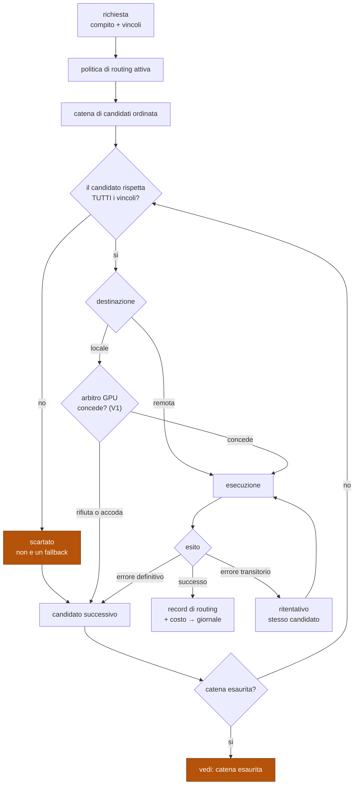
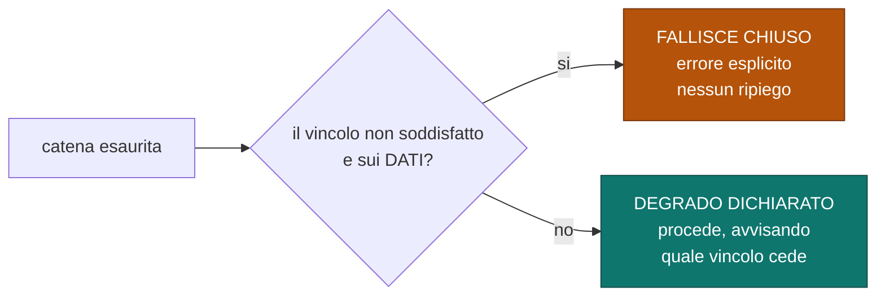
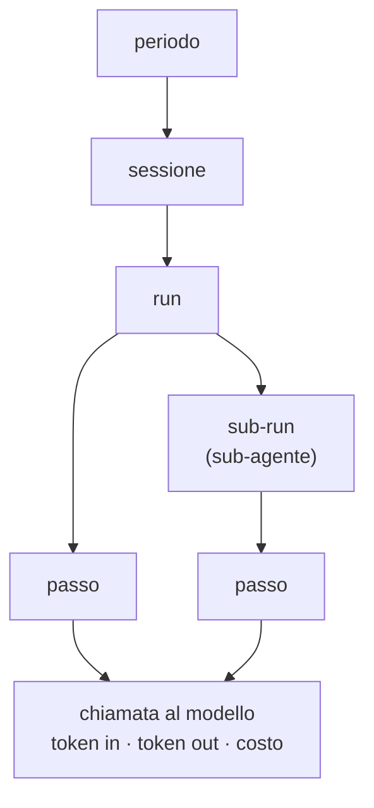

# Gateway di inferenza

Risoluzione di una richiesta, catena di riserva, contabilità.
Fonte di verità su come si sceglie dove eseguire una chiamata a un modello e su cosa
resta registrato.

Decisioni: [ADR-0011](../adr/0011-routing-risolto-e-giornalato-per-richiesta.md) ·
[ADR-0012](../adr/0012-equivalenza-del-fallback-e-fallimento-chiuso.md) ·
[ADR-0013](../adr/0013-conformita-allo-schema-e-un-verdetto-di-sensore.md).

## Cos'è e cosa non è

| Il gateway **è** | Il gateway **non è** |
|---|---|
| un punto di decisione: quale modello, dove, con quali vincoli | un proxy trasparente |
| il contabile: token, costo, attribuzione gerarchica | un sottosistema di contabilità separato |
| l'unico processo che esce verso i provider remoti | un punto in cui vive logica di dominio |
| il custode dei vincoli della richiesta | il posto dove si decide *cosa* chiedere |

## Risoluzione di una richiesta

Tutto ciò che accade in questo diagramma resta **dentro un solo passo** della run: un
ritentativo o un passaggio al candidato successivo cambia il record di routing, non la
struttura della run. Una run di 20 passi non diventa di 60 perché la rete era
instabile.

## Catena esaurita: due esiti opposti

| Classe di vincolo | Esempi | A catena esaurita |
|---|---|---|
| **dati e riservatezza** | ritenzione dati, provider esclusi, solo locale | fallisce chiuso |
| **qualità e costo** | tetto di prezzo, modello preferito, latenza | degrado dichiarato |

Il messaggio d'errore del ramo chiuso deve dire **quale vincolo** non è stato
soddisfatto. Un generico errore di rete trasforma una protezione in un guasto
incomprensibile.

## Cause di fallback

| Causa | Classe | Nota |
|---|---|---|
| limite di frequenza | transitoria | ritentativo prima del passaggio |
| errore del provider (5xx) | transitoria | idem |
| indisponibilità di risorsa GPU | **di prima classe** | il rifiuto dell'arbitro non è un errore (V1) |
| contesto eccessivo per il modello | definitiva | il candidato non è idoneo |
| moderazione o rifiuto | definitiva | |
| vincolo violato | **mai un fallback** | scartato prima della valutazione |

## Contabilità

Le quattro granularità richieste dalla mappa funzionale — messaggio, sessione, run,
sub-agente — sono **aggregazioni della stessa gerarchia**, non quattro contatori
separati. Reggono su un solo fatto: *ogni interazione con un modello è un passo di
una run* ([ADR-0011](../adr/0011-routing-risolto-e-giornalato-per-richiesta.md)).

| Regola | Motivo |
|---|---|
| Il costo si registra **anche per gli stream interrotti** | annullare può comunque generare addebito: ignorarlo rende la contabilità ottimistica proprio dove l'utente annulla di più |
| I tetti agiscono a ogni livello della gerarchia | stessa logica per richiesta, run, sessione e periodo |
| Il superamento di un tetto porta la run in `AttesaUmano` | coerente con V8: sospende, non termina |
| Il record di routing non contiene **mai** credenziali | nomi di provider e parametri sì, segreti no |

## Contenuto del record di routing

| Campo | Perché |
|---|---|
| modello, destinazione, provider | riproducibilità |
| parametri di generazione | idem |
| vincoli richiesti | dice cosa la richiesta *pretendeva*, non cosa la configurazione permetteva |
| catena valutata e scarti, con motivo | rende visibile un perimetro che si allarga |
| tentativi effettuati | distingue instabilità di rete da difetto |
| output vincolato: **decoding vincolato** o **validazione a posteriori** | cambia il significato dell'assenza di verdetti del sensore |
| token in/out, costo, stream interrotto sì/no | contabilità |

Il record contiene la decisione **risolta**, non un riferimento alla configurazione:
rileggere la configurazione di oggi non dice cosa accadde ieri.

## Regole che i diagrammi non esprimono

- Un candidato che viola un vincolo **non viene provato**: è scartato prima.
- Ritentativo e passaggio al candidato successivo restano **dentro lo stesso passo**.
- Un output non conforme allo schema è un **verdetto di sensore** (§5), non
  un'eccezione del gateway ([ADR-0013](../adr/0013-conformita-allo-schema-e-un-verdetto-di-sensore.md)).
- Il gateway è l'unico processo autorizzato a uscire verso i provider remoti
  (vedi [topologia](01-topologia-dei-processi.md#canali)).
- Nessuna logica di ritentativo vive nei worker (I5): sta qui.
