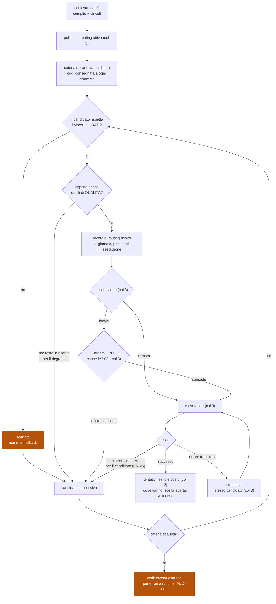
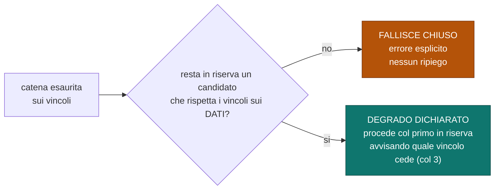
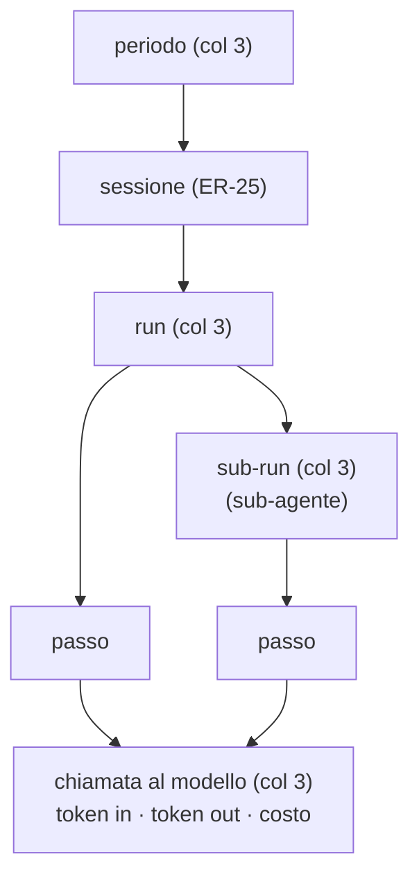

# Gateway di inferenza

Risoluzione di una richiesta, catena di riserva, contabilità.
Fonte di verità su come si sceglie dove eseguire una chiamata a un modello e su cosa
resta registrato.

Decisioni: [ADR-0011](../adr/0011-routing-risolto-e-giornalato-per-richiesta.md) ·
[ADR-0012](../adr/0012-equivalenza-del-fallback-e-fallimento-chiuso.md) ·
[ADR-0013](../adr/0013-conformita-allo-schema-e-un-verdetto-di-sensore.md).

⚠️ **RICHIAMO DEL 2026-10-06** — audit del 2026-09-30, AUD-014, AUD-023, AUD-027, AUD-119, AUD-122, AUD-231,
AUD-232, AUD-237, AUD-238, AUD-379 e AUD-604: oggi il gateway è il decisore — `resolve` e `dispatch`, in
`crates/kernel/src/gateway/mod.rs`, provati dai banchi — e non chiama nessun provider; il resto è deciso, e porta il
segno «(col N)» della regola 2 del [README](../README.md): la chiamata e ciò che ne dipende col 3, il primo che chiama
un modello (§6.2 della [spec del sotto-progetto 1](../superpowers/specs/2026-08-06-sottoprogetto-1-kernel.md)). I pezzi
segnati «(ER-25)» li riscrive il compito 4 del
[piano della revisione della knowledge base](../superpowers/plans/2026-09-29-knowledge-base-revisione-documenti.md),
voce ER-25: D10 e D11 della [revisione](../superpowers/specs/2026-09-28-knowledge-base-revisione-design.md) dicono il
contrario.

## Cos'è e cosa non è

| Il gateway **è** | Il gateway **non è** |
|---|---|
| un punto di decisione: quale modello, dove, con quali vincoli | un proxy trasparente |
| il contabile: token, costo, attribuzione gerarchica (col 3) | un sottosistema di contabilità separato |
| l'unico componente del core che esce verso i provider remoti (col 3) | un punto in cui vive logica di dominio |
| il custode dei vincoli della richiesta | il posto dove si decide *cosa* chiedere |

⚠️ **RICHIAMO DEL 2026-10-06** — audit del 2026-09-30, AUD-229: il processo è il core
([topologia](01-topologia-dei-processi.md), ADR-0004), e il gateway ne è un componente.

## Risoluzione di una richiesta

```mermaid
flowchart TD
    R["richiesta (col 3)<br/>compito + vincoli"] --> P["politica di routing attiva (col 3)"]
    P --> C["catena di candidati ordinata<br/>oggi consegnata a ogni chiamata"]

    C --> F{"il candidato rispetta<br/>i vincoli sui DATI?"}
    F -->|no| X["scartato<br/>non e un fallback"]
    X --> NEXT["candidato successivo"]

    F -->|si| Q{"rispetta anche<br/>quelli di QUALITA?"}
    Q -->|"no: resta in riserva<br/>per il degrado"| NEXT
    Q -->|si| REC["record di routing risolto<br/>→ giornale, prima dell esecuzione"]

    REC --> D{"destinazione (col 3)"}
    D -->|remota| EX["esecuzione (col 3)"]
    D -->|locale| G{"arbitro GPU<br/>concede? (V1, col 3)"}
    G -->|"rifiuta o accoda"| NEXT
    G -->|concede| EX

    EX --> OK{"esito"}
    OK -->|successo| AC["tentativi, esito e costo (col 3)<br/>dove vanno: scelta aperta, AUD-236"]
    OK -->|"errore transitorio"| RT["ritentativo<br/>stesso candidato (col 3)"]
    OK -->|"errore definitivo<br/>per il candidato (ER-25)"| NEXT
    RT --> EX

    NEXT --> END{"catena esaurita?"}
    END -->|no| F
    END -->|si| FC["vedi: catena esaurita<br/>per errori a runtime: AUD-605"]

    classDef bad fill:#b45309,stroke:#78350f,color:#fff
    class X,FC bad
```

Tutto ciò che accade in questo diagramma resta **dentro un solo passo** della run (col 3): un
ritentativo o un passaggio al candidato successivo cambia il record di routing, non la struttura
della run. Una run di 20 passi non diventa di 60 perché la rete era instabile.
⚠️ **RICHIAMO DEL 2026-10-06** — audit del 2026-09-30, AUD-233: i vincoli sui dati scartano e quelli di qualità
ordinano i rimasti, in due passate (`resolve`), e per questo il degrado ha un candidato con cui procedere.

## Catena esaurita: due esiti opposti

```mermaid
flowchart LR
    A["catena esaurita<br/>sui vincoli"] --> B{"resta in riserva un candidato<br/>che rispetta i vincoli sui DATI?"}
    B -->|no| C["FALLISCE CHIUSO<br/>errore esplicito<br/>nessun ripiego"]
    B -->|si| D["DEGRADO DICHIARATO<br/>procede col primo in riserva<br/>avvisando quale vincolo cede (col 3)"]

    classDef closed fill:#b45309,stroke:#78350f,color:#fff
    classDef open fill:#0f766e,stroke:#134e4a,color:#fff
    class C closed
    class D open
```

| Classe di vincolo | Esempi | A catena esaurita |
|---|---|---|
| **dati e riservatezza** | ritenzione dati e solo locale — oggi `NoRetention` e `LocalOnly` —; provider esclusi (col 3) | fallisce chiuso |
| **qualità e costo** | tetto di prezzo — oggi `PriceCeiling` —; modello preferito e latenza (col 3) | degrado dichiarato |

Il messaggio d'errore del ramo chiuso deve dire **quale vincolo** non è stato
soddisfatto (col 3). Un generico errore di rete trasforma una protezione in un guasto
incomprensibile. ⚠️ **RICHIAMO DEL 2026-10-06** — audit del 2026-09-30, AUD-016, AUD-135, AUD-136 e AUD-605:
oggi il ramo chiuso risponde `GatewayError::NoConformingCandidate`, senza il vincolo, e il degrado si dichiara col
booleano `Conforming::was_degraded`, senza il vincolo che cede: li nomina il 3, nel kernel e nell'interfaccia insieme
— il rimando del 2026-10-04 in testa ad [ADR-0012](../adr/0012-equivalenza-del-fallback-e-fallimento-chiuso.md). I
due esiti valgono per la catena esaurita sui vincoli; quale esito abbia la catena esaurita da errori a runtime, con
ogni candidato conforme fallito, è la scelta aperta su AUD-605.

## Cause di fallback

| Causa | Classe | Nota |
|---|---|---|
| limite di frequenza (ER-25) | transitoria | ritentativo prima del passaggio |
| errore del provider, 5xx (col 3) | transitoria | ritentativo prima del passaggio |
| indisponibilità di risorsa GPU (col 3) | **di prima classe** | il rifiuto dell'arbitro non è un errore (V1) |
| contesto eccessivo per il modello (ER-25) | definitiva per il candidato | il candidato non è idoneo |
| moderazione o rifiuto (col 3) | definitiva per il candidato | |
| vincolo sui dati violato | **mai un fallback** | scartato prima della valutazione |
| vincolo di qualità non soddisfatto | preferenza | il candidato resta in riserva: se nessuno li rispetta tutti, degrado dichiarato |

⚠️ **RICHIAMO DEL 2026-10-06** — audit del 2026-09-30, AUD-239: «definitiva» vale qui per il candidato, non per la
richiesta — si passa al successivo —, e non è la classe «definitivo» di [design/07](07-osservabilita-e-degrado.md),
che non ha ripiego.

## Contabilità

```mermaid
flowchart TD
    P["periodo (col 3)"] --> S["sessione (ER-25)"]
    S --> R["run (col 3)"]
    R --> SR["sub-run (col 3)<br/>(sub-agente)"]
    R --> ST["passo"]
    SR --> ST2["passo"]
    ST --> T["chiamata al modello (col 3)<br/>token in · token out · costo"]
    ST2 --> T
```

Le quattro granularità richieste dalla mappa funzionale — messaggio, sessione, run,
sub-agente — sono **aggregazioni della stessa gerarchia**, non quattro contatori
separati, e arrivano con la contabilità, col 3. Reggono su un solo fatto: *ogni richiesta
di inferenza **generativa** è un passo di una run*; l'inferenza percettiva sempre attiva non è un
passo e non passa dal gateway ([ADR-0011](../adr/0011-routing-risolto-e-giornalato-per-richiesta.md),
il suo confine esplicito). ⚠️ **RICHIAMO DEL 2026-10-06** — audit del 2026-09-30, AUD-235: «generativa» e il
confine sono quelli di ADR-0011.

| Regola | Motivo |
|---|---|
| Il costo si registra **anche per gli stream interrotti** (col 3) | annullare può comunque generare addebito: ignorarlo rende la contabilità ottimistica proprio dove l'utente annulla di più |
| I tetti agiscono a ogni livello della gerarchia (col 3) | stessa logica per richiesta, run, sessione e periodo |
| Il superamento di un tetto porta la run in `AttesaUmano` (col 3) | coerente con V8: sospende, non termina |
| Il record di routing non contiene **mai** credenziali | nomi di provider e parametri sì (col 3), segreti no |

## Contenuto del record di routing

| Campo | Perché |
|---|---|
| modello — oggi `model` —; destinazione e provider (col 3) | riproducibilità |
| parametri di generazione (col 3) | idem |
| vincoli richiesti (col 3) | dice cosa la richiesta *pretendeva*, non cosa la configurazione permetteva |
| catena valutata — oggi quanti candidati offriva, `evaluated` —; gli scarti, con motivo (col 3) | rende visibile un perimetro che si allarga |
| degrado dichiarato — oggi `degraded` | un vincolo di qualità ceduto non è mai silenzioso ([ADR-0012](../adr/0012-equivalenza-del-fallback-e-fallimento-chiuso.md)) |
| tentativi effettuati (col 3) | distingue instabilità di rete da difetto |
| output vincolato: **decoding vincolato** o **validazione a posteriori** (col 3) | cambia il significato dell'assenza di verdetti del sensore |
| token in/out, costo, stream interrotto sì/no (col 3) | contabilità |

Il record contiene la decisione **risolta**, non un riferimento alla configurazione:
rileggere la configurazione di oggi non dice cosa accadde ieri. ⚠️ **RICHIAMO DEL 2026-10-06** — audit del
2026-09-30, AUD-014, AUD-234 e AUD-236: oggi il record porta tre campi, `model`, `evaluated` e `degraded`
(`RoutingDetail`, in `crates/kernel/src/record.rs`), e `dispatch` lo scrive sul passo **prima** dell'esecuzione; dove
vadano tentativi, esito e costo, che esistono solo dopo, è la scelta aperta su AUD-236.

## Due confini che si prestano a essere confusi

### Ritentativo o passo nuovo? Il discriminante è l'output

V17 dice che un ritentativo resta nello stesso passo. V14 dice che un verdetto
negativo di sensore produce un passo nuovo. Non è una contraddizione: il
discriminante è **se il modello ha prodotto un output**.

| Situazione | Il modello ha prodotto output? | Unità |
|---|---|---|
| errore di trasporto, 5xx, limite di frequenza, rifiuto dell'arbitro (col 3) | no | **stesso passo**, nuovo tentativo nel record di routing |
| output prodotto ma respinto da un sensore (schema, linter, test) | **sì** | **passo nuovo**, con il verdetto come feedback |

La ragione è sostanziale, non formale: un output prodotto **esiste, è stato pagato e
fa parte della storia**. Nasconderlo dentro un tentativo lo renderebbe invisibile
all'anello di miglioramento (col 4), che è esattamente ciò che deve vederlo.

### Policy VRAM o destinazione della richiesta?

Sono cose diverse e V3 riguarda solo la prima.

| | Cosa determina | Chi la cambia |
|---|---|---|
| **Policy VRAM** (§2) | cosa risiede in memoria: solo audio, oppure audio + LLM (col 9) + embedding (col 6) | una transizione esplicita — dal 2 una funzione del registro; la corrente è la proiezione del giornale, il profilo dà il default (rimando del 2026-09-08 in ADR-0006) |
| **Destinazione della richiesta** (§3) | dove viene eseguita *questa* chiamata | il routing, richiesta per richiesta |

In policy LOCALE una singola richiesta può benissimo finire su un provider remoto —
per rifiuto dell'arbitro o per fallback, col 3 — **senza che la policy cambi**. Il contrario
non vale: la policy non si cambia per servire una richiesta.

## Regole che i diagrammi non esprimono

- Un candidato che viola un vincolo **sui dati** non viene provato: è scartato prima. Uno che
  manca un vincolo di qualità resta in riserva, dietro quelli che li rispettano tutti.
- Ritentativo e passaggio al candidato successivo restano **dentro lo stesso passo** (col 3).
- Un output non conforme allo schema è un **verdetto di sensore** (§5), non
  un'eccezione del gateway ([ADR-0013](../adr/0013-conformita-allo-schema-e-un-verdetto-di-sensore.md)).
- Il gateway è l'unico componente del core autorizzato a uscire verso i provider remoti, col 3
  (vedi [topologia](01-topologia-dei-processi.md#canali)).
- Nessuna logica di ritentativo vive nei worker (I5): sta qui (col 3).
