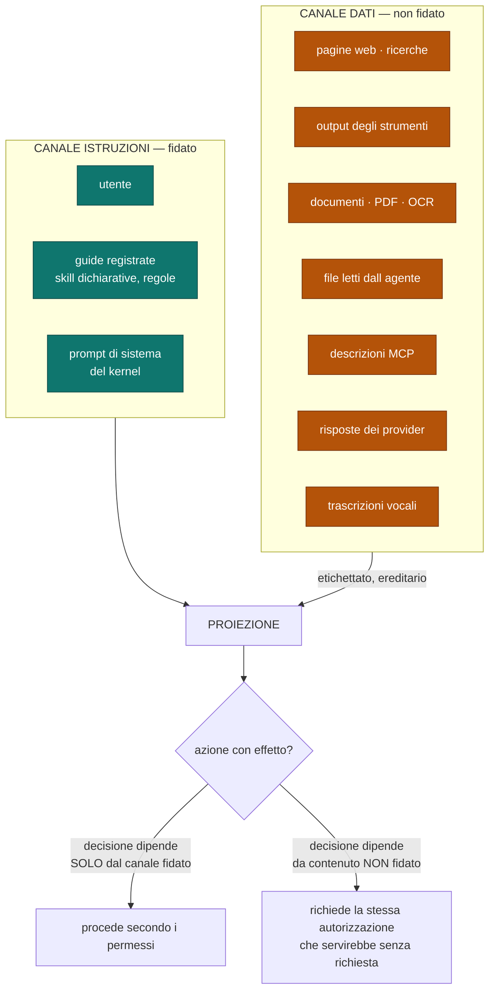
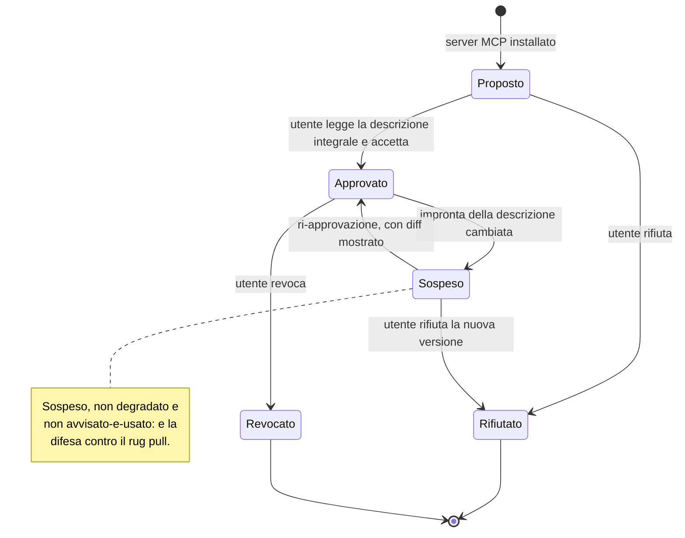
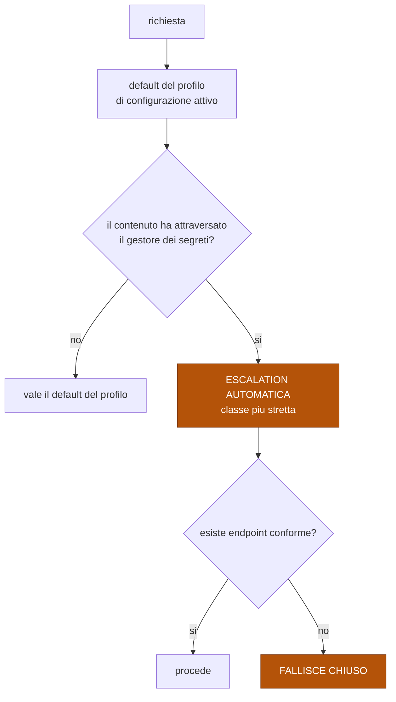

# Permessi e confine dei dati non fidati

Come il contenuto esterno attraversa il sistema, e cosa serve per agire.
Fonte di verità su chi può fare cosa e su cosa non può mai diventare un'autorizzazione.

Decisioni: [ADR-0014](../adr/0014-confine-dei-dati-non-fidati-nel-sistema-di-tipi.md) ·
[ADR-0015](../adr/0015-descrizioni-degli-strumenti-fissate-all-approvazione.md) ·
[ADR-0016](../adr/0016-permessi-granulari-e-default-dei-vincoli-sui-dati.md).

## I due canali

**Entrambi i canali raggiungono il modello.** Non è una difesa contro l'inganno: è
una difesa contro l'**escalation di privilegio**. Il modello può essere convinto di
qualsiasi cosa; ciò che non può è convertire quella convinzione in autorizzazione.

## Ereditarietà dell'etichetta

| Operazione su contenuto non fidato | Risultato |
|---|---|
| estrazione, ritaglio | non fidato |
| riassunto | non fidato |
| traduzione | non fidato |
| concatenazione con contenuto fidato | **non fidato** (il peggiore vince) |
| conversione esplicita a istruzione | **evento giornalato**, mai implicito |

Senza ereditarietà basterebbe un riassunto per ripulire un attacco.

## Ciclo di approvazione di uno strumento di terze parti

| Regola | Motivo |
|---|---|
| Si mostra la **descrizione integrale**, non il nome | l'utente deve valutare il testo che influenzerà il modello |
| L'impronta è fissata all'approvazione | un cambiamento successivo è rilevabile |
| Una descrizione **non concede permessi** | i permessi vengono solo dalla tripla, mai da un metadato |

## Permessi

| Componente | Esempi |
|---|---|
| **strumento** | file, shell, rete, strumento MCP `x` |
| **risorsa** | un percorso, una allow-list di comandi, un host |
| **operazione** | lettura, scrittura, esecuzione, uscita |

| Preset | Procede senza chiedere | Chiede |
|---|---|---|
| `chiede sempre` | nulla | ogni azione con effetto |
| **`auto-approva sicuri`** *(default)* | letture, test, build | scritture, comandi, uscite di rete |
| `autonomo` | quasi tutto | effetti `irripetibili` (§4) · azioni fermate da un sensore |

**Un'approvazione non si estende**: vale per la tripla concessa e per la sessione
corrente. `~/progetti/x` non implica `~/progetti/y`, e oggi non implica domani.

## Vincoli sui dati: default ed escalation

Il default resta usabile, ma la regola scatta sempre dove conta. **Falla nota:** un
segreto incollato a mano in chat non attraversa il gestore e aggira l'escalation.

## Canary di esfiltrazione

| Aspetto | |
|---|---|
| Cos'è | valori sentinella nel gestore dei segreti |
| Come funziona | la loro comparsa in contenuto in uscita è un **verdetto di sensore** (§5): blocca e segnala |
| Cosa copre | esfiltrazione dei segreti **noti** |
| Cosa **non** copre | dati sensibili generici. È una rete, non un muro |

## Regole che i diagrammi non esprimono

- **Non esiste sanitizzazione.** Non si tenta di rimuovere istruzioni dal testo: si
  impedisce che diventino autorizzazioni.
- Il record di routing (§3) non contiene **mai** credenziali (V16).
- La provenienza deve essere **visibile nell'interfaccia**: se l'utente non vede da
  dove viene un contenuto, approva alla cieca e la difesa collassa sull'anello umano.
- Il modo di fallire più probabile di questa sezione non è tecnico: è **l'utente che
  approva per stanchezza**. I preset lo riducono, non lo eliminano.
