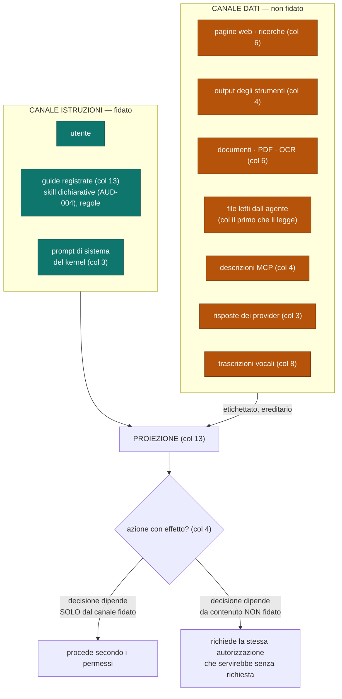
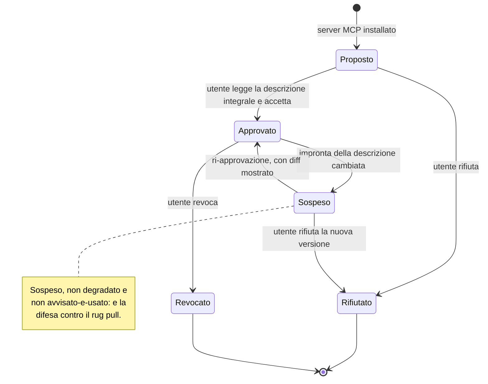
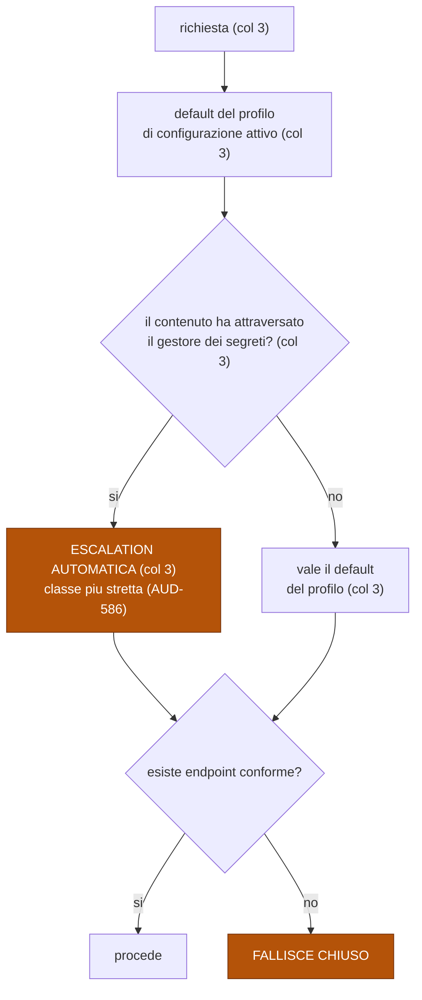

# Permessi e confine dei dati non fidati

Come il contenuto esterno attraversa il sistema, e cosa serve per agire.
Fonte di verità su chi può fare cosa e su cosa non può mai diventare un'autorizzazione.

Decisioni: [ADR-0014](../adr/0014-confine-dei-dati-non-fidati-nel-sistema-di-tipi.md) ·
[ADR-0015](../adr/0015-descrizioni-degli-strumenti-fissate-all-approvazione.md) ·
[ADR-0016](../adr/0016-permessi-granulari-e-default-dei-vincoli-sui-dati.md).

⚠️ **RICHIAMO DEL 2026-10-06** — audit del 2026-09-30, AUD-019, AUD-119, AUD-241, AUD-243, AUD-244, AUD-245 e
AUD-247: oggi esistono il confine dei tipi — `Untrusted` e `Instruction`, con l'etichetta ereditaria e la conversione
giornalata, in `crates/kernel/src/boundary.rs` — e il permesso come tripla, registrato nel giornale e chiesto dal
registro delle funzioni (`crates/kernel/src/permission.rs`, `crates/kernel/src/registry.rs`); il resto è deciso, e
porta il segno «(col N)» della regola 2 del [README](../README.md).

## I due canali

```mermaid
flowchart TB
    subgraph FID["CANALE ISTRUZIONI — fidato"]
        U["utente"]
        G["guide registrate (col 13)<br/>skill dichiarative (AUD-004), regole"]
        K["prompt di sistema<br/>del kernel (col 3)"]
    end

    subgraph NF["CANALE DATI — non fidato"]
        W["pagine web · ricerche (col 6)"]
        T["output degli strumenti (col 4)"]
        D["documenti · PDF · OCR (col 6)"]
        F["file letti dall agente<br/>(col il primo che li legge)"]
        M["descrizioni MCP (col 4)"]
        P["risposte dei provider (col 3)"]
        V["trascrizioni vocali (col 8)"]
    end

    FID --> PR["PROIEZIONE (col 13)"]
    NF -->|"etichettato, ereditario"| PR
    PR --> A{"azione con effetto? (col 4)"}
    A -->|"decisione dipende<br/>SOLO dal canale fidato"| OK["procede secondo i permessi"]
    A -->|"decisione dipende<br/>da contenuto NON fidato"| ASK["richiede la stessa autorizzazione<br/>che servirebbe senza richiesta"]

    classDef fid fill:#0f766e,stroke:#134e4a,color:#fff
    classDef nfid fill:#b45309,stroke:#78350f,color:#fff
    class U,G,K fid
    class W,T,D,F,M,P,V nfid
```

**Entrambi i canali raggiungono il modello.** Non è una difesa contro l'inganno: è
una difesa contro l'**escalation di privilegio**. Il modello può essere convinto di
qualsiasi cosa; ciò che non può è convertire quella convinzione in autorizzazione.
⚠️ **RICHIAMO DEL 2026-10-06** — audit del 2026-09-30, AUD-125: se le skill dichiarative stiano nel canale fidato è la
decisione aperta su AUD-004 — il rimando del 2026-10-04 in testa ad
[ADR-0003](../adr/0003-estensibilita-solo-mcp-e-skill-dichiarative.md).

## Ereditarietà dell'etichetta

| Operazione su contenuto non fidato | Risultato |
|---|---|
| estrazione, ritaglio | non fidato |
| riassunto | non fidato |
| traduzione | non fidato |
| concatenazione con contenuto fidato | **non fidato** (il peggiore vince) |
| conversione esplicita a istruzione | **evento giornalato**, mai implicito |

Senza ereditarietà basterebbe un riassunto per ripulire un attacco.
⚠️ **RICHIAMO DEL 2026-10-06** — audit del 2026-09-30, AUD-137: il passaggio giornalato è `Untrusted::promote`, e
`Instruction::new`, pubblico, è la via che il compilatore non chiude — il rimando del 2026-10-04 in testa ad
[ADR-0014](../adr/0014-confine-dei-dati-non-fidati-nel-sistema-di-tipi.md).

## Ciclo di approvazione di uno strumento di terze parti (col 4)

```mermaid
stateDiagram-v2
    [*] --> Proposto : server MCP installato

    Proposto --> Approvato : utente legge la descrizione integrale e accetta
    Proposto --> Rifiutato : utente rifiuta

    Approvato --> Sospeso : impronta della descrizione cambiata
    Sospeso --> Approvato : ri-approvazione, con diff mostrato
    Sospeso --> Rifiutato : utente rifiuta la nuova versione

    Approvato --> Revocato : utente revoca
    Rifiutato --> [*]
    Revocato --> [*]

    note right of Sospeso
        Sospeso, non degradato e
        non avvisato-e-usato: e la
        difesa contro il rug pull.
    end note
```

| Regola | Motivo |
|---|---|
| Si mostra la **descrizione integrale**, non il nome | l'utente deve valutare il testo che influenzerà il modello |
| L'impronta è fissata all'approvazione | un cambiamento successivo è rilevabile |
| Una descrizione **non concede permessi** | i permessi vengono solo dalla tripla, mai da un metadato |

## Permessi

| Componente | Esempi |
|---|---|
| **strumento** | file, rete e strumento MCP `x` (col 4), shell (col 5); oggi `registry`, il registro delle funzioni |
| **risorsa** | un percorso e un host (col 4), una allow-list di comandi (col 5); oggi `arbiter` |
| **operazione** | lettura e scrittura, oggi `Read` e `Write`; esecuzione e uscita (col il primo strumento che ne ha bisogno) |

| Preset (col 4) | Procede senza chiedere | Chiede |
|---|---|---|
| `chiede sempre` | nulla | ogni azione con effetto |
| **`auto-approva sicuri`** *(default)* | letture, test, build | scritture, comandi, uscite di rete |
| `autonomo` | quasi tutto | effetti `irripetibili` (§4) · azioni fermate da un sensore (AUD-139) |

**Un'approvazione non si estende**: vale per la tripla concessa e per la sessione
corrente (col 3), e un effetto `irripetibile` chiede a ogni invocazione (col il primo che ne ha uno).
`~/progetti/x` non implica `~/progetti/y`, e una sessione non implica la successiva.
⚠️ **RICHIAMO DEL 2026-10-06** — audit del 2026-09-30, AUD-019, AUD-246 e AUD-606: oggi un'invocazione del registro
delle funzioni senza la sua tripla torna `InvokeError::PermissionRequired`, e una tripla concessa vale per sempre —
`is_granted` rilegge tutto il giornale, senza sessione né revoca. La sessione è quella di D11 della
[revisione della knowledge base](../superpowers/specs/2026-09-28-knowledge-base-revisione-design.md), la run radice,
e la costruisce il 3; che un effetto irripetibile chieda a ogni invocazione lo dicono la regola 4 di
[ADR-0038](../adr/0038-registro-delle-funzioni-del-programma.md) e la riga di ADR-0016 nella 3.1 della revisione.

## Vincoli sui dati: default ed escalation

```mermaid
flowchart TD
    R["richiesta (col 3)"] --> P["default del profilo<br/>di configurazione attivo (col 3)"]
    P --> S{"il contenuto ha attraversato<br/>il gestore dei segreti? (col 3)"}
    S -->|no| N["vale il default<br/>del profilo (col 3)"]
    S -->|si| E["ESCALATION AUTOMATICA (col 3)<br/>classe piu stretta (AUD-586)"]
    E --> C{"esiste endpoint conforme?"}
    N --> C
    C -->|si| OK["procede"]
    C -->|no| FC["FALLISCE CHIUSO"]

    classDef bad fill:#b45309,stroke:#78350f,color:#fff
    class FC,E bad
```

Il default resta usabile, ma la regola scatta sempre dove conta. **Falla nota:** un
segreto incollato a mano in chat non attraversa il gestore e aggira l'escalation.
⚠️ **RICHIAMO DEL 2026-10-06** — audit del 2026-09-30, AUD-242, AUD-585 e AUD-586: oggi esiste il fallimento chiuso
sui vincoli sui dati che il chiamante consegna, `LocalOnly` e `NoRetention` (`crates/kernel/src/gateway/mod.rs`): la
verifica da cui passano il default e l'escalation. La richiesta e il default del profilo arrivano col 3, consegnati
alla prima richiesta, e l'escalation nasce col gestore dei segreti, col 3 (AUD-585); quali vincoli prenda una
richiesta che sale, perché «la classe più stretta» non è definita, è la scelta aperta su AUD-586 — il rimando del
2026-10-04 in testa ad [ADR-0016](../adr/0016-permessi-granulari-e-default-dei-vincoli-sui-dati.md).

## Canary di esfiltrazione (col 3)

| Aspetto | |
|---|---|
| Cos'è | valori sentinella nel gestore dei segreti |
| Come funziona | la loro comparsa in contenuto in uscita è un **verdetto di sensore** (§5): blocca e segnala (AUD-139) |
| Cosa copre | esfiltrazione dei segreti **noti** |
| Cosa **non** copre | dati sensibili generici. È una rete, non un muro |

⚠️ **RICHIAMO DEL 2026-10-06** — audit del 2026-09-30, AUD-139: «blocca e segnala» qui e «azioni fermate da un
sensore» nei preset non hanno un meccanismo — l'anello costruito, `run_the_ring`, fa rientrare un verdetto negativo
come passo nuovo e non chiede a nessuno (Q10) —; chi ferma l'azione è la scelta aperta su AUD-139, nel rimando del
2026-10-04 in testa ad [ADR-0016](../adr/0016-permessi-granulari-e-default-dei-vincoli-sui-dati.md).

## Regole che i diagrammi non esprimono

- **Non esiste sanitizzazione.** Non si tenta di rimuovere istruzioni dal testo: si
  impedisce che diventino autorizzazioni.
- Il record di routing (§3) non contiene **mai** credenziali (V16).
- La provenienza deve essere **visibile nell'interfaccia**: se l'utente non vede da
  dove viene un contenuto, approva alla cieca e la difesa collassa sull'anello umano.
- Il modo di fallire più probabile di questa sezione non è tecnico: è **l'utente che
  approva per stanchezza**. I preset (col 4) lo riducono, non lo eliminano.
