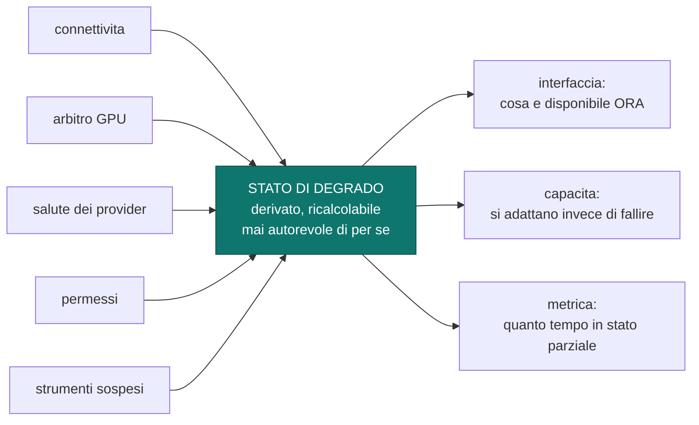
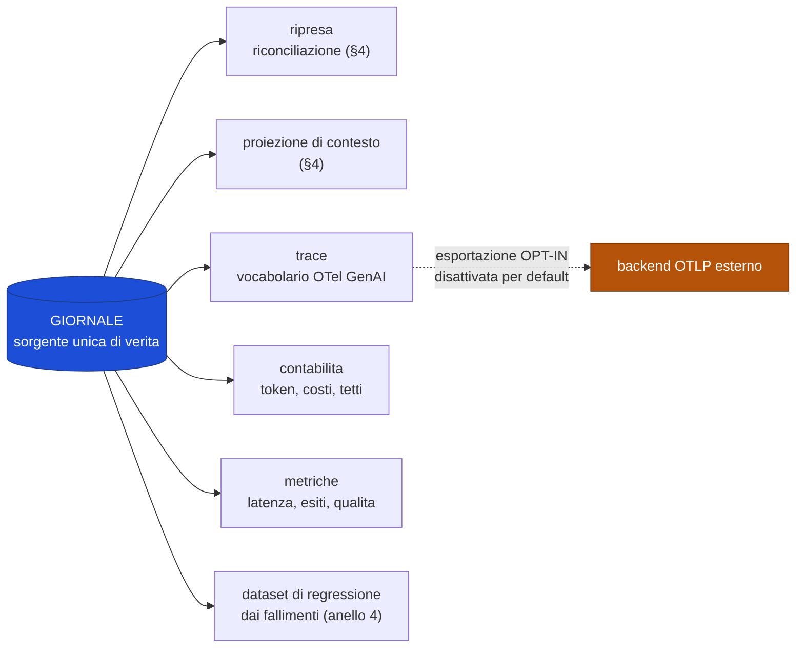

# Osservabilità, errori e degrado

Tassonomia degli errori, stato di degrado, proiezioni del giornale.
Fonte di verità su cosa il sistema sa di sé e su cosa ne mostra.

Decisioni: [ADR-0017](../adr/0017-giornale-sorgente-trace-proiezione.md) ·
[ADR-0018](../adr/0018-ritenzione-a-livelli-del-giornale.md) ·
[ADR-0019](../adr/0019-lo-stato-di-degrado-e-un-oggetto-osservabile.md).

## Tassonomia degli errori

Ogni classe ha già un meccanismo, deciso in una sezione precedente. Nessun errore
richiede un percorso nuovo: è la verifica più forte che il design regga.

| Classe | Esempi | Meccanismo | Deciso in |
|---|---|---|---|
| **transitorio** | 5xx, limite di frequenza, timeout senza output | ritentativo nello stesso passo | §3 · V17 |
| **di risorsa** | VRAM insufficiente, GPU occupata | coda, oppure fallback al candidato successivo | §2 · §3 |
| **di vincolo** | nessun endpoint conforme ai vincoli sui dati | **fallisce chiuso** | §3 · ADR-0012 |
| **di autorizzazione** | permesso mancante, strumento sospeso | sospende e chiede | §6 |
| **di verifica** | verdetto negativo di un sensore | rientra nell'anello, passo nuovo | §5 · V14 |
| **di dubbio** | passo `InDubbio` dopo un crash | riconciliazione per classe di effetto | §4 · ADR-0007 |
| **di autonomia** | tetto di passi, tempo o costo superato | `AttesaUmano` + notifica | §4 · V8, V9 |
| **definitivo** | invariante violata, dato corrotto, difetto | fallisce e si dichiara; nessun ripiego | — |

Solo l'ultima riga non ha un meccanismo di recupero, ed è corretto: un'invariante
violata è un difetto del sistema, non una condizione da gestire.

## Stato di degrado

| Condizione | Resta disponibile | Cade |
|---|---|---|
| **offline** | inferenza locale, RAG locale, generazione asset, voce | OpenRouter, ricerca web |
| **GPU satura** | tutto ciò che è remoto; **voce** (quota riservata, §2) | inferenza locale, generazione asset |
| **provider indisponibile** | fallback della catena; locale se configurato | quel provider |
| **modello locale scaricato** | tutto, con avvio a freddo dichiarato (Q8) | latenza del primo token |
| **strumento MCP sospeso** | tutto il resto | quello strumento, fino a ri-approvazione (§6) |

**Si dichiara prima, non si fallisce dopo.** Nessuna azione deve fallire per una
condizione che era già nota e non era stata mostrata.

## Il giornale e le sue proiezioni

**Un substrato, sei scopi.** Il giornale nasce per la ripresa dopo crash (§4); tutto
il resto sono viste. Il vocabolario OpenTelemetry GenAI si applica alla **proiezione
trace**, non all'archiviazione: se la convenzione cambia — ed è ancora pre-stabile —
cambia la proiezione, non i dati.

## Ritenzione

| Livello | Contenuto | Ritenzione |
|---|---|---|
| **struttura** | identità, transizioni, esiti, routing, costi, verdetti, decisioni | lunga; è la parte piccola |
| **payload** | prompt, risposte, output degli strumenti, trascrizioni | finestra breve → potati, sostituiti da impronta e dimensione |
| **artefatti** | file prodotti | **riferimenti**: il contenuto vive sul filesystem |

| Regola | Motivo |
|---|---|
| Un record potato **dichiara** di esserlo | payload assente e payload mai registrato non devono confondersi |
| Un passo `InDubbio` **non è potabile** | la riconciliazione può dipendere dal payload |
| I fallimenti candidati a regressione si **promuovono** prima della potatura | potare un fallimento non sfruttato butta via il dato più prezioso |

È la stessa gerarchia della compattazione del contesto (§4): ciò che è strutturato
sopravvive, il grezzo si sacrifica.

## Cosa deve essere sempre visibile

| Elemento | Perché | Vincolo |
|---|---|---|
| stato di degrado corrente | si dichiara prima, non si fallisce dopo | V27 |
| permessi attivi nella sessione | un permesso concesso e dimenticato è indistinguibile da uno mai concesso | V21 · §6 |
| occupazione del contesto **per categoria** | senza misura è un'impressione | §5 · ADR-0010 |
| costo corrente e distanza dal tetto | i tetti sospendono: l'utente deve vederli arrivare | §3 · V8 |
| provenienza del contenuto | senza, si approva alla cieca | V23 · §6 |
| run in `AttesaUmano` | una run bloccata in silenzio è indistinguibile da una morta | V9 |

## Regole che i diagrammi non esprimono

- **Nessuna telemetria lascia la macchina per default.** L'esportazione è opt-in e la
  destinazione la sceglie l'utente. C'è **un solo punto di uscita**, il che rende la
  promessa verificabile invece che dichiarata.
- Prima dell'esportazione si applica la mascheratura dei segreti (V16).
- La proiezione trace dichiara **quale versione** della convenzione emette: un trace
  senza versione, in uno standard che cambia, è ambiguo.
- Lo stato di degrado è **derivato**: se diverge, si ricalcola. Non è mai la verità.
- Si mostra ciò che **cambia cosa l'utente può fare**, non ogni variazione interna:
  un'interfaccia che segnala tutto è indistinguibile da una che non segnala nulla.
