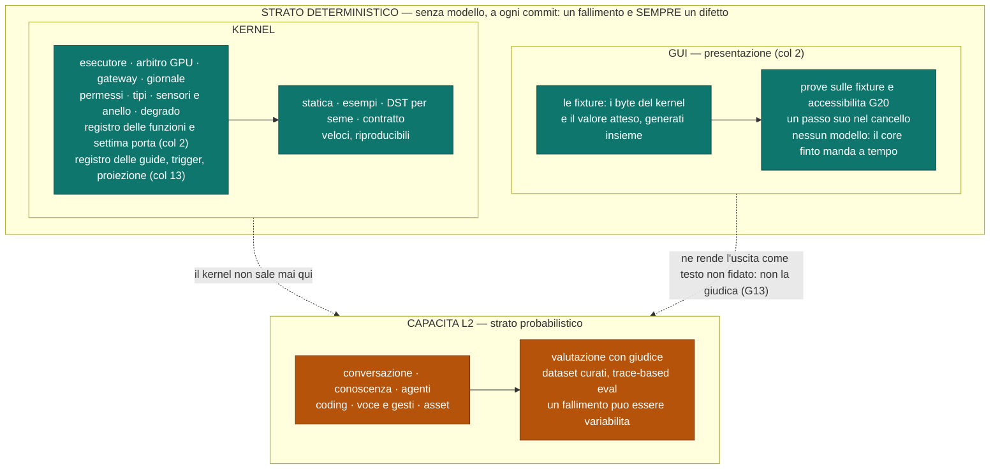

# Strategia di test e criteri di accettazione

Come si verifica ogni requisito di qualità, e cosa il kernel deliberatamente non testa.
Fonte di verità sulla porta di qualità.

Decisioni: [ADR-0020](../adr/0020-nessun-modello-nel-percorso-decisionale-del-kernel.md) ·
[ADR-0021](../adr/0021-simulazione-deterministica-e-iniettabilita.md).

⚠️ **RICHIAMO DEL 2026-09-08 — la sezione 2 della passata sui diagrammi della stella polare della GUI.**
Il diagramma dei due strati guadagna ciò che il kernel ha oggi e non nominava — l'esecutore, il degrado —
ciò che arriva, «(col N)», e la **GUI** come seconda scatola dello strato deterministico: prove sulle
fixture generate dal kernel, senza modello, con un passo suo nel cancello (col 2). Le suite di conformità
sono nominate — **due** oggi — con la regola che le fa crescere; le campagne DST della tabella delle
tecniche e della mappa sono le stesse **sei**; la riga Q3 dice ciò che la campagna di oggi prova e ciò che
arriva; lo **stato** di ogni Q resta nella §8.4 della spec, casa unica, e qui non si ricopia. Due frasi
corrette: il «ciclo lungo» della DST profonda, che non esiste, e la valutazione del linguaggio, che
ADR-0026 ha fatto. Una voce segnata «(col N)» è decisa e la costruisce il sotto-progetto N; «oggi» dice
che esiste nel codice. Il perché sta nella
[stella polare](../superpowers/specs/2026-09-07-direzione-gui-design.md), sezione 2 della passata,
decisione 18.

## I due strati, e dove passa il confine

Il confine è netto e verificabile: **nessun modello nel percorso decisionale del
kernel**. Un fallimento del kernel non è mai variabilità — è un difetto. La **GUI** sta
nello strato deterministico anche se mostra l'uscita di un modello: la rende come testo
non fidato (G13, ADR-0014) e non la giudica mai; le sue prove girano sulle **fixture**
generate dal kernel — i byte e il valore atteso, insieme — senza modello, e un suo
fallimento è un difetto come quelli del kernel (col 2, §4 e §6a del disegno del 2).

## Le quattro tecniche

| Tecnica | Verifica | Determinismo |
|---|---|---|
| **analisi statica** | I3 (nessuna chiamata OS nel kernel), I6/V19 (confine dei tipi), V5 (effetti classificati), V25 (un solo punto di uscita), V34 (lettura dei segreti), V35 (livello di confinamento), ADR-0020 | totale, a compilazione |
| **test a esempi** | comportamenti puntuali, macchine a stati, tabelle di decisione | totale |
| **simulazione deterministica (DST)** | concorrenza, crash, ripristino: I1, I2, I5; Q2, Q3, Q4, Q5, Q18, Q22 — le stesse sei righe che la mappa qui sotto marca **DST**. Ogni campagna è un bersaglio che il passo «DST campaigns» di `gate.sh` nomina **uno per uno**: una campagna nuova è anche una riga in quel passo, o il cancello la esegue senza mostrarne il tempo di parete | riproducibile **per seed** |
| **test di contratto** | worker, server MCP, provider: dati stantii, risposte malformate, timeout. ⭐ E la **conformità fra l'implementazione reale di una porta e la sua finta** — è ciò che impedisce di provare Q4 e Q5 contro una finzione. Oggi le suite sono **due**, `journal` e `reactor`: scritte in `crates/kernel/tests/`, rieseguite sulle implementazioni vere di `platform` con `include!`. **Ogni porta guadagna la propria quando arriva l'implementazione vera**: `ipc` e la settima porta col 2, `network` col 3, `filesystem` col 5, `process` col primo worker vero (ADR-0039) | totale, con doppi |

## Mappa requisito → metodo di verifica

Nessun requisito è accettato senza un metodo dichiarato. La colonna «tecnica» dice
anche *quanto costa* verificarlo, che è ciò che determina se verrà davvero fatto.

| Q | Requisito | Metodo | Tecnica |
|---|---|---|---|
| Q1 | voce < 600 ms sotto carico GPU | misura end-to-end con job `batch` attivo, percentile su N campioni | misura → SP-2, poi non-regressione |
| Q2 | zero OOM | proprietà: la somma delle concessioni non supera mai il budget, sotto richieste concorrenti casuali | **DST** |
| Q3 | crash GUI durante una run | la GUI muore a un'operazione scelta dal seme, con la finta `DyingGui` del simulatore; proprietà: il core non perde nulla — oggi le concessioni tornano (§5.7, proprietà 3), col 2 la stessa prova sull'attività del daemon che ascolta la GUI, col 3 la run prosegue | **DST** |
| Q4 | kill di un worker in qualsiasi istante | kill in punti arbitrari; proprietà: nessuna corruzione, nessuna perdita | **DST** |
| Q5 | riavvio del core a metà run | crash iniettato a **ogni confine di persistenza**; proprietà: nessun effetto rieseguito | **DST + crash-injection** |
| Q6 | contesto esaurito | ricomposizioni ripetute con budget ridotto; proprietà: gli elementi non sacrificabili sono sempre presenti | proprietà |
| Q7 | tetto di passi/tempo/costo superato | test a esempi sulla transizione ad `AttesaUmano` | esempi |
| Q8 | avvio a freddo dichiarato | test a esempi sull'evento emesso prima dell'attesa | esempi |
| Q9 | contenuto non fidato nel canale istruzioni | **non compila**: test negativo di compilazione | **statica** |
| Q10 | verdetto di sensore → anello | sensore finto con verdetto negativo; il passo successivo porta il feedback | esempi |
| Q11 | budget della proiezione | proprietà: occupazione ≤ budget dopo **ogni** ricomposizione | proprietà |
| Q12 | difetto ricorrente → proposta | giornale sintetico con ricorrenza; verifica che la proposta sia emessa | esempi |
| Q13 | vincolo sui dati senza endpoint conforme | proprietà: **nessun candidato non conforme viene mai eseguito**, per qualunque catena | proprietà |
| Q14 | ricostruire un passo di sei mesi fa | giornale storico + configurazione cambiata; il record risolto resta leggibile | esempi |
| Q15 | istruzione nei dati non autorizza | statica + test a esempi sull'obbligo di autorizzazione | **statica** + esempi |
| Q16 | descrizione MCP cambiata dopo l'approvazione | server finto che muta la descrizione; lo strumento passa a `Sospeso` | **contratto** |
| Q17 | segreto in uscita | valore canary iniettato nel contenuto in uscita; blocco e segnalazione | esempi |
| Q18 | perdita di rete | iniezione del guasto; proprietà: lo stato di degrado è dichiarato **prima** del primo fallimento | **DST** |
| Q19 | capire una run di 4 ore | giornale sintetico lungo; la proiezione trace è navigabile e completa | esempi |
| Q20 | nessun dato lascia la macchina | statica (un solo punto di uscita) + test che verifica assenza di traffico a default | **statica** + esempi |
| Q21 | ripristino da backup su macchina nuova | backup e ripristino su ambiente pulito; proprietà: nessun dato irriproducibile perso, e il messaggio pre-backup elenca le esclusioni | esempi + **contratto** |
| Q22 | annullare un passo che ha modificato file | dopo il rollback al passo N l'ambito è **byte-identico** allo stato precedente; crash iniettato durante la conservazione | **DST + crash-injection** |
| Q23 | esecuzione sotto il livello 2 di confinamento | statica: nessun percorso di esecuzione senza livello richiesto. Più test negativo: con confinamento indisponibile l'azione **non parte** | **statica** + esempi |
| Q24 | lettura di credenziali fuori dal gestore dei segreti | statica sui grafi di importazione e chiamata: nessun altro componente ha un percorso verso l'archivio dei segreti | **statica** |

**Le quattro nuove sono statiche o di proprietà**, non a esempi: Q23 e Q24 sono
proprietà strutturali, e verificarle a campione le renderebbe congetture.

⚠️ **Lo stato di ogni riga** — verificata, parziale, rimandata — **e chi la chiude** stanno
nella **§8.4 della spec del sotto-progetto 1**, in una casa sola, col comando che li conta
nella §6 del compendio: qui vive il **metodo**, e nessuna riga si marca. I requisiti della
**GUI**, G1–G21 e P1–P4, hanno la loro casa in
[`spikes/GUI-REQUISITI.md`](../../spikes/GUI-REQUISITI.md): il loro metodo — le fixture,
l'accessibilità, e le misure M1–M5 dello spike del guscio, che sono misure come SP-2 e non
prove — lo scrive il disegno del 2. Questa mappa non cresce coi moduli della GUI: una riga
nuova nasce solo da un requisito nuovo della spec.

## Cosa il kernel deliberatamente NON testa

| Fuori perimetro | Dove appartiene |
|---|---|
| qualità delle risposte del modello | capacità L2 |
| valutazione con giudice, dataset curati, trace-based eval | capacità L2 |
| correttezza semantica di un piano agentico | capacità Agenti |
| qualità percepita di voce e mesh 3D | capacità Voce, capacità Asset |
| ergonomia dell'interfaccia | GUI |

Dichiararlo evita l'errore opposto a quello comune: non solo «non applicare test
deterministici a ciò che è probabilistico», ma anche **«non rinunciare al determinismo
dove esiste»**.

## La porta di qualità

| Regola | Motivo |
|---|---|
| Nessuna sezione della spec è «fatta» senza i test dei suoi requisiti | un requisito senza verifica è un'intenzione |
| Ogni difetto trovato in simulazione **conserva il proprio seed** | ⛔ a entrare nella suite è la **proprietà** che quel difetto violava, **non il seed** — vedi il richiamo in fondo |
| I fallimenti promossi dall'anello 4 (§5) entrano nella stessa suite | un artefatto, non due |
| Analisi statica, test a esempi **e campagna DST breve** girano a **ogni commit**, e col 2 anche le prove della GUI, in un passo loro; la campagna DST **profonda** si lancia **a mano**. ⚠️ **Richiamo del 2026-09-08:** questa riga diceva *«la campagna DST profonda su cicli più lunghi»*, e quel ciclo **non esiste** — le due campagne profonde sono `#[ignore]` e nessun passo del cancello né della CI le lancia: è il vincolo 8 della §11 del compendio, aperto e del proprietario | «tieni la qualità a sinistra» (§5) |

> ⭐ **La riga sulla cadenza è cambiata dopo una misura.** Diceva «DST su cicli più
> lunghi», perché si dava per scontato che una campagna fosse cara. **M-2 l'ha smentito**:
> una corsa dello scenario minimo costa **25,8 µs**, quindi migliaia di semi stanno dentro
> un secondo. I cicli lunghi servono ad andare **più a fondo**, non a rendere possibile la
> DST. Riserva dichiarata: 25,8 µs è lo scenario *minimo*, e quelli reali saranno più
> pesanti — la misura dice che il substrato non è il collo di bottiglia, non che le
> campagne siano gratis.
>
> ⛔ **Richiamo del 2026-08-11 — la conclusione regge, il numero che la sostiene è morto, ed è
> questa formulazione a produrre il malinteso.** Chiudendo il Task 4 del Traguardo 4 la campagna
> è stata misurata sul codice che **spedisce**, e i 25,8 µs **non sono confrontabili con niente
> che esista oggi**: il prototipo che li produsse non è nel repository, l'esecutore era un altro
> — lo spike sceglieva un'attività **a caso** — e la cifra era un colpo singolo invece di una
> media. ⚠️ **E le parole *«scenario minimo»* di questo riquadro sono la causa prossima
> dell'errore**: lo scenario di M-2 il giornale **ce l'aveva**, quindi *«minimo»* qui non
> significa *«senza il giornale»*, e chi lo ha letto così ha visto un paradosso — una corsa che
> fa **di più** costando **di meno**. ✅ Ciò che il riquadro conclude è vero e per difetto: in
> `release` un secondo compra **centinaia di migliaia** di semi, e in `debug` — che è il profilo
> con cui gira il cancello, e la distinzione mancava qui — **circa diciannovemila**. 📌 Il numero
> vivo e il metodo con cui è stato scelto stanno in [`riferimenti.md`](../riferimenti.md).
>
> 📄 **Il meccanismo di questa porta** — ogni controllo con il proprio livello di forza, la
> sonda che deve scattare e la contro-sonda che deve restare verde — è la **§7 della spec
> del sotto-progetto 1**. Qui vive il *metodo*; là il *catalogo* e la cadenza operativa.

## Regole che le tabelle non esprimono

- **L'iniettabilità è un requisito di costruzione, non di test.** Nessun componente
  legge l'orologio, genera casualità o esegue I/O se non attraverso un confine
  sostituibile. Senza, la DST non è possibile — e non è retrofittabile.
- La scelta del linguaggio del core dovrà valutare esplicitamente la **sostituibilità
  dello scheduling**: è il primo caso in cui una decisione di test vincola una
  decisione di architettura. ✅ **Richiamo del 2026-09-08:** l'ha valutata — è stato lo
  spareggio #1 di ADR-0026, e ha deciso Rust. La riga resta come regola: vale per ogni
  runtime che volesse restituire all'ecosistema l'ordine delle attività (§7 del compendio).
- Un fallimento del kernel è **sempre** un difetto. Se un test del kernel è
  intermittente, il difetto è nel test o nell'iniettabilità — mai «è il modello».

---

## ⚠️ Richiamo — «il seed diventa una regressione permanente» è falsificato (2026-08-18)

La riga della porta di qualità diceva *«il seed diventa un caso di regressione permanente»*.
La **§3.4** della spec del sotto-progetto 1 e il **rimando del 2026-08-08 in
[ADR-0021](../adr/0021-simulazione-deterministica-e-iniettabilita.md)** la restringono in due
punti, e la restrizione non era mai arrivata fin qui:

| Cosa diceva | Cosa vale |
|---|---|
| il seed è un caso di regressione **permanente** | ⚠️ **no**: un seed **non riproduce la stessa esecuzione dopo un cambio di codice**. È un **punto di ripartenza per indagare**, non un oracolo |
| i seed formano una **suite di regressione** | ⚠️ **no**: a entrare nella suite è la **proprietà** che quel difetto violava. Un elenco di semi presentato come suite sarebbe una **falsa sicurezza** |

⛔ **La sostanza regge:** ogni difetto trovato in simulazione conserva il proprio seed, e il
seed si versiona — [`semi-dst.md`](../semi-dst.md) esiste per quello, e dichiara esso stesso
che al livello 2 *«un seme»* non identifica un caso.

📌 **Perché il richiamo è arrivato qui per ultimo, ed è il dato:** questo file **si dichiara
fonte di verità sulla porta di qualità**, quindi è l'ultimo posto in cui una formulazione
falsificata dovrebbe sopravvivere — e ci è sopravvissuta **dieci giorni**. È la radice **R1**
dell'[audit](../audit-2026-08-11.md): *una correzione attraversa il documento in cui nasce, non
gli altri*, e le altre case si cercano **col `grep`**, non a memoria. Finding **A-2**.
