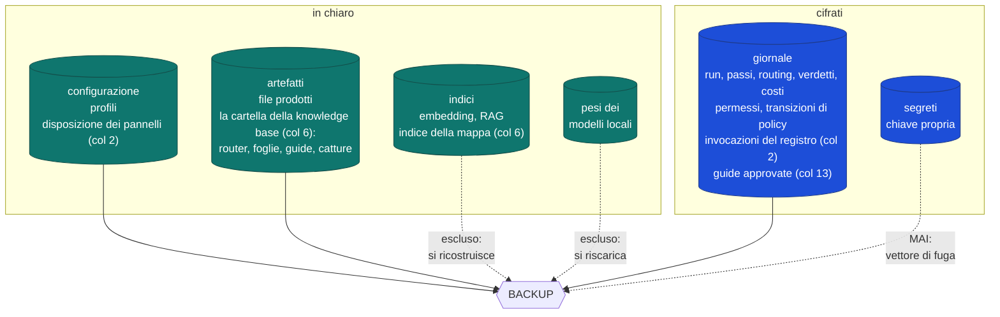
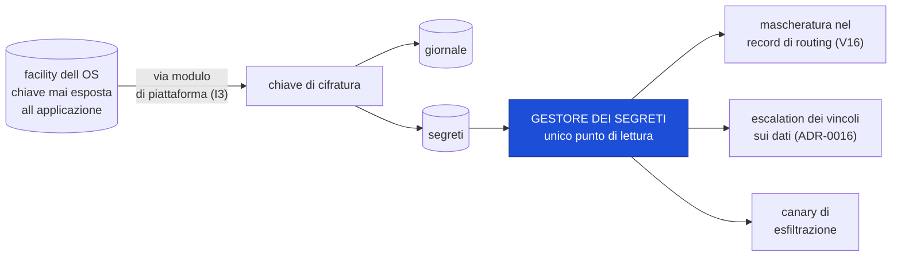
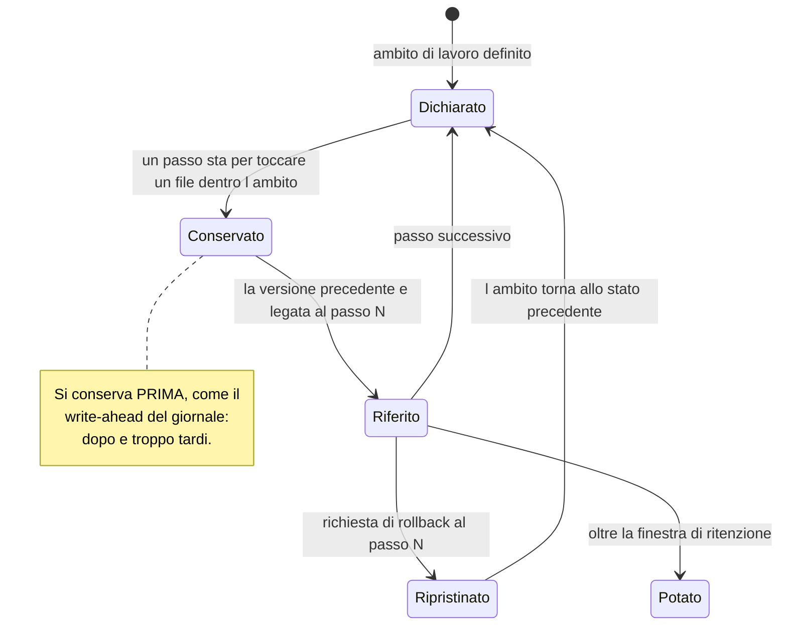
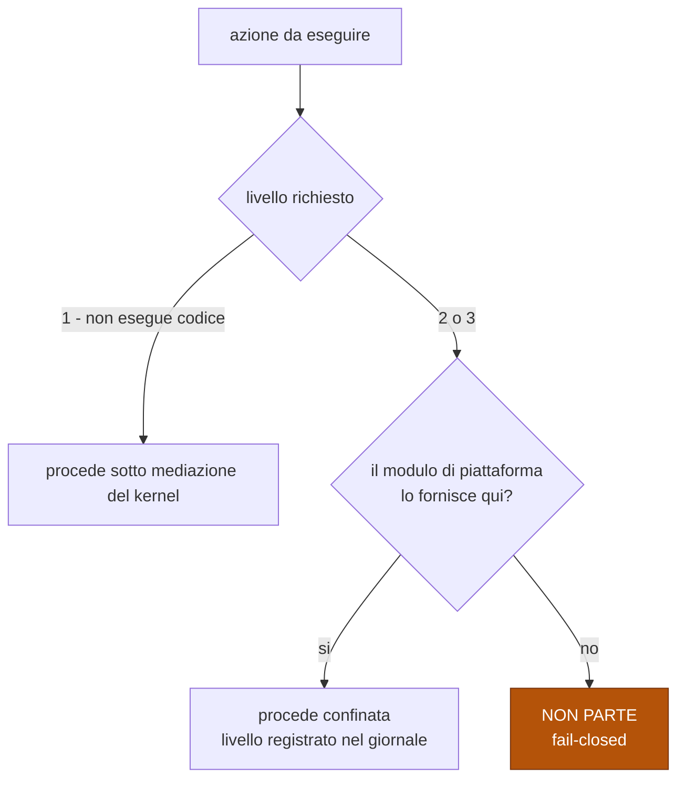

# L0 fisico — archivi, chiavi, checkpoint, confinamento

Dove finiscono i byte, chi possiede le chiavi, cosa si può annullare e come si
confina un processo. Fonte di verità sul supporto fisico della persistenza.

Decisioni: [ADR-0022](../adr/0022-layout-dei-dati-per-natura-e-backup-dichiarato.md) ·
[ADR-0023](../adr/0023-cifratura-a-riposo-e-gestore-dei-segreti.md) ·
[ADR-0024](../adr/0024-checkpoint-del-filesystem-ad-ambiti-dichiarati.md) ·
[ADR-0025](../adr/0025-confinamento-a-livelli.md).

## Gli archivi

⚠️ **RICHIAMO DEL 2026-09-08 — la sezione 1 della passata sui diagrammi della stella polare della GUI.**
Il diagramma e le due tabelle sono riscritti: la **configurazione** contiene i profili e, col 2, la
**disposizione dei pannelli**, che il kernel raggiunge da una settima porta; le **guide** sono file
della cartella della knowledge base, artefatti dell'utente (disegno del 2026-09-04); la **policy VRAM
corrente non è configurazione**, è la proiezione del giornale (decisione 17); il giornale porta anche i
permessi, le transizioni di policy e, col 13, le guide approvate. Una voce segnata «(col N)» è
**decisa**, e la costruisce il sotto-progetto N. Il perché sta nella
[stella polare](../superpowers/specs/2026-09-07-direzione-gui-design.md), §2 e decisioni 14–18.

| Archivio | Cifrato | Nel backup | Ricostruibile | Chi lo raggiunge |
|---|---|---|---|---|
| giornale | **sì** | sì | no | il kernel dalla porta `journal`; `redb` in `platform` (ADR-0032) |
| segreti | **sì**, chiave propria | **mai** | no, ma re-inseribili | la crate `secrets`, unico punto di lettura — vuota oggi, per decisione |
| configurazione: i profili e, col 2, la disposizione dei pannelli | no | sì | no | **due vie**: i profili li legge il **daemon** via `platform` e li **consegna** al kernel, che non li legge mai (ADR-0034; oggi i default sono letterali nel daemon); la **disposizione** dalla **settima porta**, custodita e mai letta per decidere (col 2) |
| artefatti prodotti e, col 6, la cartella della knowledge base | no — sono già file dell'utente | sì | no | il kernel dalla porta `filesystem` (ambiti e checkpoint, ADR-0024); l'implementazione vera col 5 |
| indici ed embedding e, col 6, l'indice della mappa | no | **no** | sì, dai documenti | la capacità (6) li costruisce e li rigenera; l'indice della mappa lo tiene il core e lo manda alla GUI via `ipc` |
| pesi dei modelli locali | no | **no** | sì, riscaricabili | gestione dedicata (9) |

**Il backup contiene solo l'irriproducibile.** Un backup che trascina decine di GB di
pesi riscaricabili non viene fatto; uno che trasporta chiavi API è un vettore di fuga.

## Chiavi e segreti

I tre meccanismi a destra funzionano **perché** esiste un punto unico di lettura. Con
credenziali leggibili da più punti nessuno dei tre sarebbe verificabile.

### Cosa significa davvero «cifrato a riposo», qui

| Protegge da | **Non** protegge da |
|---|---|
| disco letto da un altro account | chi ha già il tuo account di sistema |
| copia dei file fatta da un altro utente | malware che gira come te |

La chiave è protetta dalle credenziali di accesso dell'utente. **La sicurezza dei dati
equivale a quella dell'account OS**, e questa frase va in interfaccia — «cifrato»
suona più forte di quanto sia, e una falsa sicurezza è peggio di nessuna sicurezza.

### La composizione mutuamente esclusiva

| Profilo | Chiave | Avvio automatico | Voce always-on | Telecamera |
|---|---|---|---|---|
| **normale** *(default)* | facility dell'OS | ✅ | ✅ | ✅ — spenta per default, si accende dal registro |
| **riservato** | passphrase all'avvio | ❌ | ❌ | ❌ |

Non si possono avere entrambe. Nel profilo riservato il sistema **rifiuta** di
abilitare l'avvio automatico, non si limita a sconsigliarlo.
⚠️ La colonna della telecamera è del 2026-09-08: ADR-0039, col suo rimando ad ADR-0023 — «riservato»
spegne anche la telecamera.

## Checkpoint del filesystem

| | Checkpoint | Versionamento (git) |
|---|---|---|
| Quando | **automatico**, a ogni passo | intenzionale, a ogni commit |
| Grana | il passo | il commit |
| Copre file non versionati | sì | no |
| Richiede un repository | no | sì |

Convivono: non si sostituiscono.

**Limite dichiarato:** gli effetti **fuori** dagli ambiti non sono coperti. Per la §4
restano effetti `verificabili` o `irripetibili`, quindi soggetti ad approvazione (§6).
L'interfaccia deve mostrare cosa è coperto **prima** che l'agente inizi a scrivere.

## Confinamento

| Livello | Confine | Garantito da | Regge contro codice eseguito? |
|---|---|---|---|
| **0** | nessuno | — | no |
| **1** | permessi applicativi (tripla §6) | il kernel media ogni accesso | **no** |
| **2** | processo ristretto dell'OS | primitive di sistema | sì |
| **3** | macchina virtuale leggera | hypervisor | sì, anche a fuga dal kernel guest |

**Default: livello 2 minimo per qualsiasi esecuzione di codice generato o di comando.**

Il livello 1 non è un confine contro codice eseguito, ed è l'illusione più pericolosa
del capitolo sicurezza: un processo figlio non passa dal mediatore e può aprire ciò
che l'utente può aprire.

**Un confinamento più debole di quello richiesto non è un ripiego: è un'altra cosa.**
Perciò l'azione non parte — su una piattaforma non ancora supportata l'app non
«funziona a metà», rifiuta di eseguire.

## Regole che i diagrammi non esprimono

- Solo il **giornale** è autorevole (I1). Gli altri archivi possono essere ricostruiti
  o rifiutati; nessuno di essi è la verità.
- Il **livello di confinamento usato** entra nel giornale insieme al passo: senza, non
  si può stabilire a posteriori in quali condizioni un comando è stato eseguito.
- Il checkpoint pota con la stessa logica a livelli del giornale (ADR-0018), e un file
  troppo grande viene **escluso con avviso**, non silenziosamente.
- Ogni operazione di I/O di questo strato resta **iniettabile** (V29): è lo strato che
  la simulazione deterministica deve poter sostituire per intero.
- La **disposizione dei pannelli** è un **pacchetto opaco**: il core la custodisce dalla settima
  porta e la restituisce alla GUI, non la legge mai per decidere. Non è un parametro consegnato
  (ADR-0034): è ciò che la GUI gli affida — stella polare della GUI, decisioni 14 e 15 del 2026-09-08.
- La **policy VRAM corrente non è configurazione**: è la proiezione del giornale, l'ultima
  transizione che `Arbiter::set_policy` scrive come intento ed esito. Il profilo dà il **default**
  (ADR-0006, rimando del 2026-09-08); il daemon la rilegge all'avvio — compito del piano del 2,
  perché oggi `build_the_arbiter` riparte da `Remote` e nessuno chiama `set_policy` in produzione.
