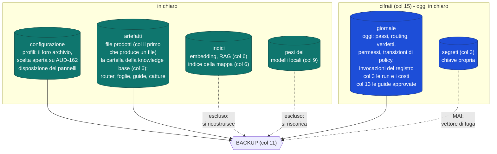
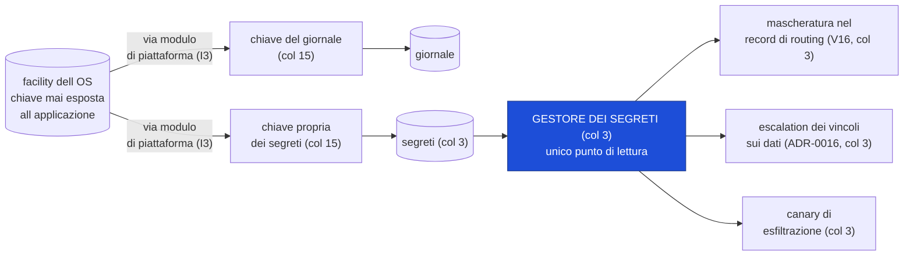
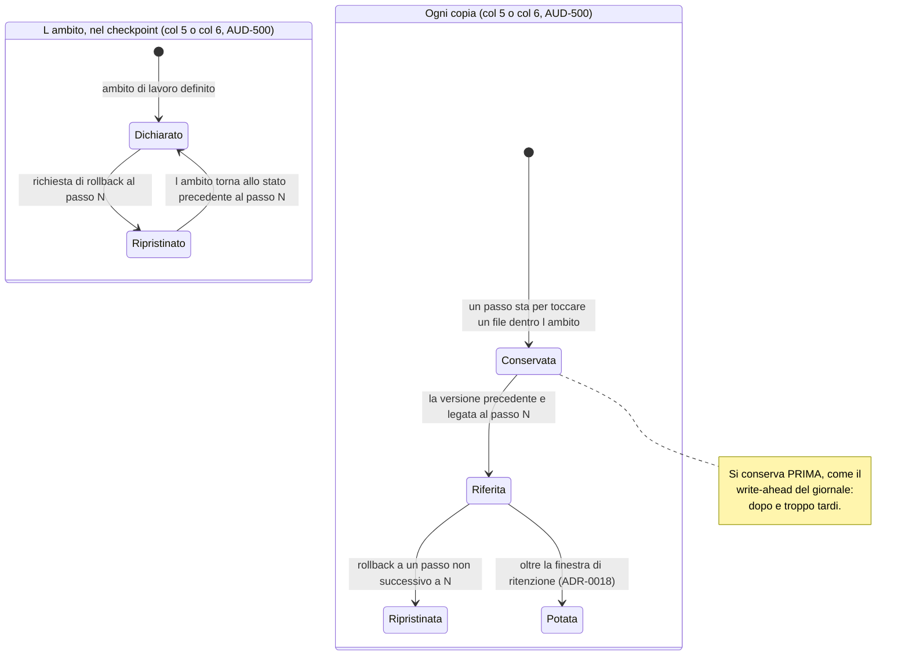
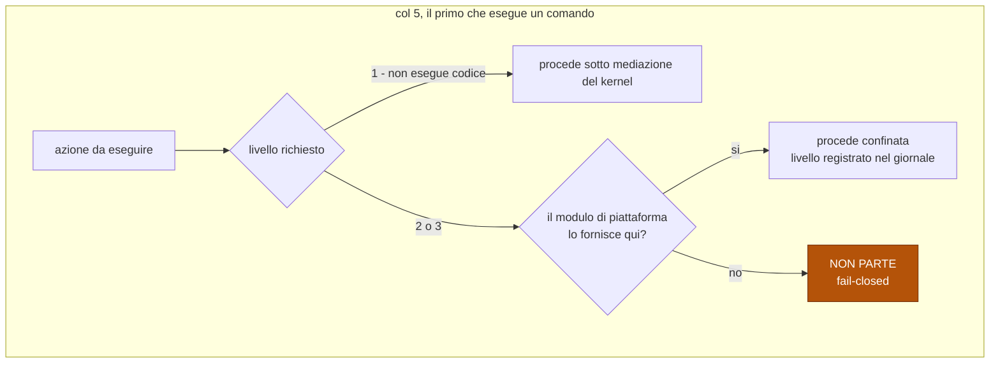

# L0 fisico — archivi, chiavi, checkpoint, confinamento

Dove finiscono i byte, chi possiede le chiavi, cosa si può annullare e come si
confina un processo. Fonte di verità sul supporto fisico della persistenza.

Decisioni: [ADR-0022](../adr/0022-layout-dei-dati-per-natura-e-backup-dichiarato.md) ·
[ADR-0023](../adr/0023-cifratura-a-riposo-e-gestore-dei-segreti.md) ·
[ADR-0024](../adr/0024-checkpoint-del-filesystem-ad-ambiti-dichiarati.md) ·
[ADR-0025](../adr/0025-confinamento-a-livelli.md).

## Gli archivi

⚠️ **RICHIAMO DEL 2026-09-08 — la sezione 1 della passata sui diagrammi della stella polare della GUI.**
Il diagramma e le due tabelle sono riscritti: la **configurazione** contiene i profili e la
**disposizione dei pannelli**, che il kernel raggiunge da una settima porta; le **guide** sono file
della cartella della knowledge base, artefatti dell'utente (disegno del 2026-09-04); la **policy VRAM
corrente non è configurazione**, è la proiezione del giornale (decisione 17); il giornale porta anche i
permessi, le transizioni di policy e, col 13, le guide approvate. Una voce segnata «(col N)» è
**decisa**, e la costruisce il sotto-progetto N. Il perché sta nella
[stella polare](../superpowers/specs/2026-09-07-direzione-gui-design.md), §2 e decisioni 14–18.

⚠️ **RICHIAMO DEL 2026-10-03** — audit del 2026-09-30, AUD-020, AUD-037, AUD-277, AUD-288, AUD-208 e AUD-216: le
invocazioni del registro e la disposizione dei pannelli esistono, dal sotto-progetto 2; le run e i costi arrivano col
3, la cifratura a riposo col 15 — oggi il giornale è in chiaro —, il backup con l'11; chi costruisce l'archivio dei
profili è la scelta aperta su AUD-162. Il segno è la regola 2 del [README](../README.md).

```mermaid
flowchart TB
    subgraph CIF["cifrati (col 15) - oggi in chiaro"]
        G[("giornale<br/>oggi: passi, routing, verdetti,<br/>permessi, transizioni di policy,<br/>invocazioni del registro<br/>col 3 le run e i costi<br/>col 13 le guide approvate")]
        S[("segreti (col 3)<br/>chiave propria")]
    end
    subgraph CHI["in chiaro"]
        C[("configurazione<br/>profili: il loro archivio,<br/>scelta aperta su AUD-162<br/>disposizione dei pannelli")]
        A[("artefatti<br/>file prodotti (col il primo<br/>che produce un file)<br/>la cartella della knowledge base (col 6):<br/>router, foglie, guide, catture")]
        I[("indici<br/>embedding, RAG (col 6)<br/>indice della mappa (col 6)")]
        M[("pesi dei<br/>modelli locali (col 9)")]
    end

    G --> B{{"BACKUP (col 11)"}}
    C --> B
    A --> B
    I -.->|"escluso:<br/>si ricostruisce"| B
    M -.->|"escluso:<br/>si riscarica"| B
    S -.->|"MAI:<br/>vettore di fuga"| B

    classDef enc fill:#1d4ed8,stroke:#1e3a8a,color:#fff
    classDef plain fill:#0f766e,stroke:#134e4a,color:#fff
    class G,S enc
    class C,A,I,M plain
```

| Archivio | Cifrato | Nel backup (col 11) | Ricostruibile | Chi lo raggiunge |
|---|---|---|---|---|
| giornale | **sì**, col 15 — oggi in chiaro | sì | no | il kernel dalla porta `journal`; `redb` in `platform` (ADR-0032) |
| segreti | **sì**, chiave propria, col 15 | **mai** | no, ma re-inseribili | la crate `secrets`, unico punto di lettura — vuota oggi, per decisione; il gestore col 3 |
| configurazione: i profili e la disposizione dei pannelli | no | sì | no | **due vie**: i profili li legge il **daemon** via `platform` e li **consegna** al kernel, che non li legge mai (ADR-0034; oggi i default sono letterali nel daemon, e chi costruisce l'archivio dei profili è la scelta aperta su AUD-162); la **disposizione** dalla **settima porta**, custodita e mai letta per decidere |
| artefatti prodotti (col il primo che produce un file) e, col 6, la cartella della knowledge base | no — sono già file dell'utente | sì | no | il kernel dalla porta `filesystem` (ambiti e checkpoint, ADR-0024); l'implementazione vera arriva a pezzi — chi costruisce che cosa lo dice la 4.2 del [disegno della revisione della knowledge base](../superpowers/specs/2026-09-28-knowledge-base-revisione-design.md) —, e chi conserva e ripristina le copie del checkpoint, il 5 o il 6, è la scelta aperta su AUD-500 e AUD-504 |
| indici ed embedding e, col 6, l'indice della mappa | no | **no** | sì, dai documenti | la capacità (6) li costruisce e li rigenera; l'indice della mappa lo tiene il core e lo manda alla GUI via `ipc` |
| pesi dei modelli locali | no | **no** | sì, riscaricabili | gestione dedicata (9) |

**Il backup contiene solo l'irriproducibile.** Un backup che trascina decine di GB di
pesi riscaricabili non viene fatto; uno che trasporta chiavi API è un vettore di fuga.

## Chiavi e segreti

⚠️ **RICHIAMO DEL 2026-10-03** — audit del 2026-09-30, AUD-020, AUD-276, AUD-277, AUD-283 e AUD-284: di questa
sezione esiste il solo giornale, in chiaro. Le chiavi arrivano col 15, e sono due — quella del giornale e quella
propria dei segreti, come vogliono ADR-0022 e ADR-0023 —; il gestore dei segreti e i tre meccanismi che ne
discendono col 3; i due profili col 15, e l'avvio automatico, la voce always-on e la telecamera ciascuno col proprio
sotto-progetto, nella tabella più sotto. Il segno è la regola 2 del [README](../README.md).

```mermaid
flowchart LR
    OS[("facility dell OS<br/>chiave mai esposta<br/>all applicazione")] -->|"via modulo<br/>di piattaforma (I3)"| K["chiave del giornale<br/>(col 15)"]
    OS -->|"via modulo<br/>di piattaforma (I3)"| KS["chiave propria<br/>dei segreti (col 15)"]
    K --> G[("giornale")]
    KS --> S[("segreti (col 3)")]

    S --> GS["GESTORE DEI SEGRETI (col 3)<br/>unico punto di lettura"]
    GS --> M1["mascheratura nel<br/>record di routing (V16, col 3)"]
    GS --> M2["escalation dei vincoli<br/>sui dati (ADR-0016, col 3)"]
    GS --> M3["canary di<br/>esfiltrazione (col 3)"]

    classDef uniq fill:#1d4ed8,stroke:#1e3a8a,color:#fff
    class GS uniq
```

I tre meccanismi a destra **poggiano** sul punto unico di lettura: con credenziali leggibili da più
punti nessuno dei tre sarebbe verificabile.

### Cosa significa davvero «cifrato a riposo», qui

Vale dal 15, che cifra. Fino ad allora il giornale è in chiaro, e che cosa ne dicano il filo e l'interfaccia è la
scelta aperta su AUD-686.

| Protegge da | **Non** protegge da |
|---|---|
| disco letto da un altro account | chi ha già il tuo account di sistema |
| copia dei file fatta da un altro utente | malware che gira come te |

La chiave è protetta dalle credenziali di accesso dell'utente. **La sicurezza dei dati
equivale a quella dell'account OS**, e questa frase va in interfaccia — «cifrato»
suona più forte di quanto sia, e una falsa sicurezza è peggio di nessuna sicurezza.

### La composizione mutuamente esclusiva

| Profilo (col 15) | Chiave | Avvio automatico (col 10) | Voce always-on (col 8) | Telecamera (col 12) |
|---|---|---|---|---|
| **normale** *(default)* | facility dell'OS | ✅ | ✅ | ✅ — spenta per default, si accende dal registro |
| **riservato** | passphrase all'avvio | ❌ | ❌ | ❌ |

Non si possono avere entrambe. Nel profilo riservato il sistema **rifiuta** di
abilitare l'avvio automatico, non si limita a sconsigliarlo.
⚠️ La colonna della telecamera è del 2026-09-08: ADR-0039, col suo rimando ad ADR-0023 — «riservato»
spegne anche la telecamera.

## Checkpoint del filesystem

⚠️ **RICHIAMO DEL 2026-10-03** — audit del 2026-09-30, AUD-274, AUD-275 e AUD-278: il checkpoint è deciso e non
costruito — oggi c'è la sola porta, `crates/kernel/src/ports/filesystem.rs`, senza un'implementazione vera —, e chi
conserva e ripristina le copie, il 5 o il 6, è la scelta aperta su AUD-500 e AUD-504; chi dichiara quale ambito lo
dice la 4.2 del [disegno della revisione della knowledge base](../superpowers/specs/2026-09-28-knowledge-base-revisione-design.md). Il
diagramma tiene i due cicli che ADR-0024 decide: l'ambito torna allo stato precedente a un passo N qualunque, e ogni
copia resta legata al suo passo finché un rollback non la usa o la potatura non la toglie. Lo stesso segno sta sulla
regola del checkpoint, in fondo.

```mermaid
stateDiagram-v2
    state "L ambito, nel checkpoint (col 5 o col 6, AUD-500)" as Ambito {
        [*] --> Dichiarato : ambito di lavoro definito
        Dichiarato --> Ripristinato : richiesta di rollback al passo N
        Ripristinato --> Dichiarato : l ambito torna allo stato precedente al passo N
    }

    state "Ogni copia (col 5 o col 6, AUD-500)" as Copia {
        [*] --> Conservata : un passo sta per toccare un file dentro l ambito
        Conservata --> Riferita : la versione precedente e legata al passo N
        Riferita --> Ripristinata : rollback a un passo non successivo a N
        Riferita --> Potata : oltre la finestra di ritenzione (ADR-0018)

        note right of Conservata
            Si conserva PRIMA, come il
            write-ahead del giornale:
            dopo e troppo tardi.
        end note
    }
```

| | Checkpoint (col 5 o col 6, AUD-500) | Versionamento (git) |
|---|---|---|
| Quando | **automatico**, a ogni passo | intenzionale, a ogni commit |
| Grana | il passo | il commit |
| Copre file non versionati | sì | no |
| Richiede un repository | no | sì |

Convivono: non si sostituiscono.

**Limite dichiarato:** gli effetti **fuori** dagli ambiti non sono coperti. Per la §4
restano effetti `verificabili` o `irripetibili`, quindi soggetti ad approvazione (§6).
L'interfaccia deve mostrare cosa è coperto **prima** che l'agente inizi a scrivere.

## Confinamento

⚠️ **RICHIAMO DEL 2026-10-03** — audit del 2026-09-30, AUD-279: il confinamento è deciso e non costruito, e il tipo
del livello non esiste — la riga `V37` della §8.3 della [spec del sotto-progetto 1](../superpowers/specs/2026-08-06-sottoprogetto-1-kernel.md).
Il livello chiesto per azione, il suo record nel giornale e il livello 2 arrivano col 5, il primo che esegue un
comando; il livello 3 lo valuta il primo che esegue codice da un repository sconosciuto (ADR-0025), e fino ad allora
chi lo chiede non parte. Lo stesso segno sta sulla regola del livello, in fondo.

| Livello | Confine | Garantito da | Regge contro codice eseguito? |
|---|---|---|---|
| **0** | nessuno | — | no |
| **1** | permessi applicativi (tripla §6) | il kernel media ogni accesso | **no** |
| **2** | processo ristretto dell'OS | primitive di sistema (col 5) | sì |
| **3** | macchina virtuale leggera | hypervisor (col il primo che esegue codice da un repository sconosciuto) | sì, anche a fuga dal kernel guest |

```mermaid
flowchart TD
    subgraph C5["col 5, il primo che esegue un comando"]
        A["azione da eseguire"] --> L{"livello richiesto"}
        L -->|"1 - non esegue codice"| OK1["procede sotto mediazione del kernel"]
        L -->|"2 o 3"| D{"il modulo di piattaforma<br/>lo fornisce qui?"}
        D -->|si| OK2["procede confinata<br/>livello registrato nel giornale"]
        D -->|no| FC["NON PARTE<br/>fail-closed"]
    end

    classDef bad fill:#b45309,stroke:#78350f,color:#fff
    class FC bad
```

**Default: livello 2 minimo per qualsiasi esecuzione di codice generato o di comando.**

Il livello 1 non è un confine contro codice eseguito, ed è l'illusione più pericolosa
del capitolo sicurezza: un processo figlio non passa dal mediatore e può aprire ciò
che l'utente può aprire.

**Un confinamento più debole di quello richiesto non è un ripiego: è un'altra cosa.**
Perciò l'azione non parte — su una piattaforma non ancora supportata l'app non
«funziona a metà», rifiuta di eseguire.

## Regole che i diagrammi non esprimono

- Solo il **giornale** è autorevole (I1). Gli altri archivi possono essere ricostruiti
  o rifiutati; nessuno di essi è la verità.
- Il **livello di confinamento usato** entra nel giornale insieme al passo (col 5): senza, non
  si può stabilire a posteriori in quali condizioni un comando è stato eseguito.
- Il checkpoint (col 5 o col 6, la scelta aperta su AUD-500) pota con la stessa logica a livelli
  del giornale (ADR-0018), e un file oltre un limite di dimensione, che fissa chi lo costruisce
  (ADR-0024), viene **escluso con avviso**, non silenziosamente.
- Ogni operazione di I/O di questo strato resta **iniettabile** (V29): è lo strato che
  la simulazione deterministica deve poter sostituire per intero.
- La **disposizione dei pannelli** è un **pacchetto opaco**: il core la custodisce dalla settima
  porta e la restituisce alla GUI, non la legge mai per decidere. Non è un parametro consegnato
  (ADR-0034): è ciò che la GUI gli affida — stella polare della GUI, decisioni 14 e 15 del 2026-09-08.
- La **policy VRAM corrente non è configurazione**: è la proiezione del giornale, l'ultima
  transizione che `Arbiter::set_policy` scrive come intento ed esito. Il profilo dà il **default**
  (ADR-0006, rimando del 2026-09-08), che oggi è un letterale del daemon, `VramPolicy::Remote`. Il
  daemon la rilegge all'avvio con `arbiter::policy_now` e la consegna a `build_the_arbiter`; in
  produzione la cambia la funzione `vram-policy` del registro, che chiama `Arbiter::set_policy` da
  `kernel::serving`. La rilettura la tiene `the_policy_in_the_journal_is_the_one_the_arbiter_starts_on`,
  in `crates/daemon/src/main.rs`. ⚠️ **RICHIAMO DEL 2026-10-03** — audit del 2026-09-30, AUD-280, AUD-281
  e AUD-282: la rilettura all'avvio e la funzione del registro le ha costruite il sotto-progetto 2.
