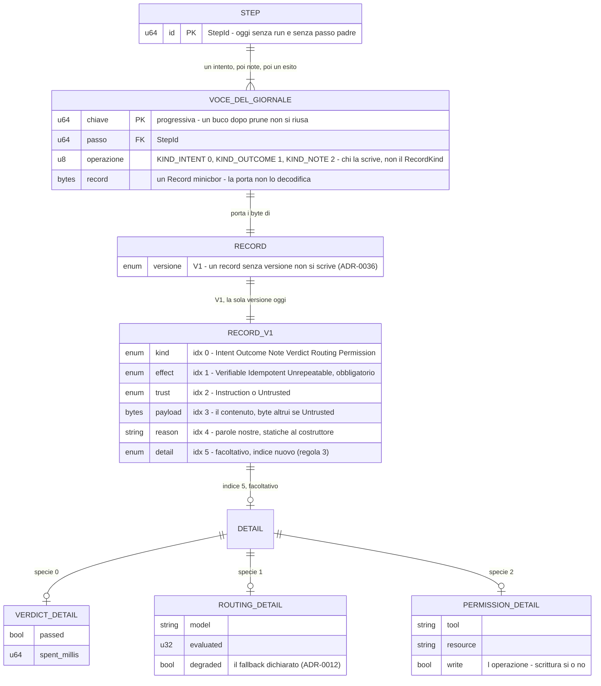
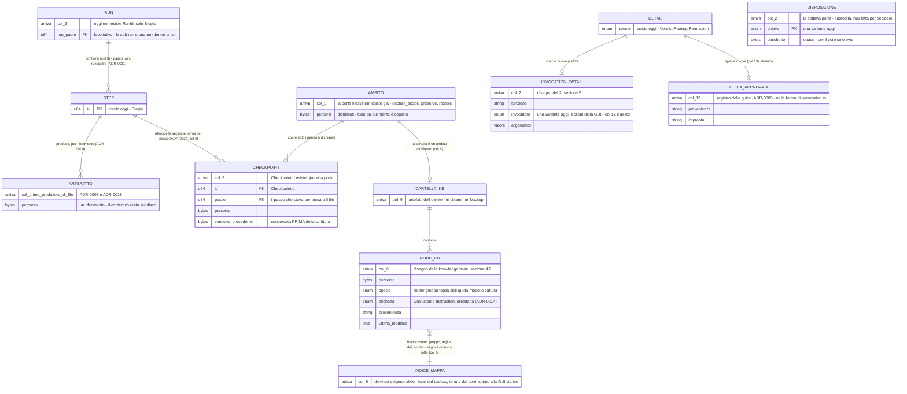

# Il modello dei dati durevoli — entità, chiavi, relazioni

Che cosa il sistema conserva, com'è fatto ogni pezzo e come i pezzi si legano: il giornale
com'è nel codice oggi, e ciò che è deciso e non ancora costruito. Fonte di verità sulle
entità durevoli. Le politiche di ogni archivio — cifrato, nel backup, chi lo raggiunge —
stanno in [design/09](09-l0-fisico.md) e qui non si ripetono.

Decisioni: [ADR-0036](../adr/0036-evoluzione-del-formato-durevole-del-giornale.md) ·
[ADR-0007](../adr/0007-giornale-write-ahead-e-riconciliazione.md) ·
[ADR-0011](../adr/0011-routing-risolto-e-giornalato-per-richiesta.md) ·
[ADR-0008](../adr/0008-contesto-come-proiezione-dello-stato.md) ·
[ADR-0018](../adr/0018-ritenzione-a-livelli-del-giornale.md) ·
[ADR-0024](../adr/0024-checkpoint-del-filesystem-ad-ambiti-dichiarati.md) ·
[ADR-0022](../adr/0022-layout-dei-dati-per-natura-e-backup-dichiarato.md) ·
[ADR-0009](../adr/0009-guide-sensori-e-anelli-sono-meccanismi-di-kernel.md).

⚠️ **Nato il 2026-09-08, sezione 3 della passata sui diagrammi della stella polare della GUI**
(decisioni 16–18): fino a quel giorno nessun diagramma a entità esisteva in `docs/`. Una voce
segnata «(col N)» è **decisa**, e la costruisce il sotto-progetto N; il giorno in cui la
costruisce, la sua entità **passa dal secondo diagramma al primo**, con richiamo datato. Il
perché sta nella [stella polare](../superpowers/specs/2026-09-07-direzione-gui-design.md),
decisione 20.

## Il giornale, com'è nel codice oggi

Letto il 2026-09-08 in `crates/kernel/src/record.rs`, `crates/kernel/src/ports/journal.rs` e
`crates/platform/src/journal.rs`; i comandi che rifanno la lettura stanno in fondo.



| Chi scrive oggi | Che cosa | Dove |
|---|---|---|
| `Arbiter::set_policy` | un intento e un esito, `Idempotent`, `Instruction`, payload vuoto, la policy per nome nel `reason`; nessun dettaglio | `crates/kernel/src/arbiter/mod.rs`, `transition_record` |
| `Untrusted::promote` | una nota `Unrepeatable`, `Untrusted`, col contenuto nel payload e la ragione nel `reason` | `crates/kernel/src/boundary.rs` |
| `permission::grant` | un record `Permission` col suo dettaglio, scritto con l'operazione `note` | `crates/kernel/src/permission.rs` |
| il gateway | un record `Routing` col suo dettaglio | `crates/kernel/src/gateway/mod.rs` |
| un sensore | un record `Verdict` col suo dettaglio e, a verdetto negativo, un **intento nuovo** come feedback (ADR-0013: la correzione è un passo nuovo) | `crates/kernel/src/sensor.rs` |

E chi legge: `reconcile::steps_in_doubt`, `permission::is_granted` e `degradation_now` rileggono
`replay()` **per intero** — le proiezioni del giornale (ADR-0017) oggi sono queste tre, e nessun
indice le aiuta: il primo giornale grande lo misura (compendio, §6, la riga di `replay()`).

## Deciso e non costruito, per sotto-progetto



| Entità | Chi la costruisce | Fonte | Verificato · dedotto |
|---|---|---|---|
| `INVOCATION_DETAIL` | 2 | §5 del [disegno del 2](../superpowers/specs/2026-09-06-sottoprogetto-2-gui-minima-design.md): funzione, invocatore, argomento; l'invocatore ha una variante oggi, il 12 aggiunge il gesto con un indice nuovo | verificato; la forma dell'argomento la dice il disegno del 2 |
| `DISPOSIZIONE` | 2 | stella polare §2, decisioni 14 e 15: due operazioni, una chiave, un pacchetto opaco | verificato |
| `RUN`, il passo padre | 3 | ADR-0011: passo → run → run padre; oggi `RunId` non esiste, solo `StepId` | verificato |
| `ARTEFATTO` | il primo sotto-progetto che produce un file | ADR-0008 e ADR-0018: l'artefatto è un **riferimento**, il contenuto vive sul disco | fonte verificata; il «chi» **dedotto** dalla roadmap |
| `AMBITO`, `CHECKPOINT` | 5 | ADR-0024, decisioni 1 e 2; la porta `filesystem` ha già `declare_scope`, `preserve` e `restore`, e `CheckpointId`; l'implementazione vera col 5 | verificato |
| `CARTELLA_KB`, `NODO_KB`, `INDICE_MAPPA` | 6 | [disegno della knowledge base](../superpowers/specs/2026-09-04-knowledge-base-design.md), §2.2 e §4.2: nodi, attributi, frecce, segnali; la cartella è un ambito dichiarato | verificato |
| `GUIDA_APPROVATA` | 13 | ADR-0009 col rimando del 2026-09-05; disegno della knowledge base §2.2: «approvate ora» è una proiezione del giornale, «nella forma di `permission.rs`» | la forma è **dedotta**: provenienza e impronta come dettaglio di una nota |

## Regole che i diagrammi non esprimono

- **Due verità sullo stesso record.** L'operazione della voce (`KIND_INTENT`, `KIND_OUTCOME`,
  `KIND_NOTE`) e il `kind` del record sono **indipendenti**: le tiene in passo chi scrive, non un
  tipo. È una decisione del proprietario (compendio §6, il Task 6 del Traguardo 3): ogni scrittore
  ha la propria sonda, e l'aiutante comune resta registrato e non preso.
- **`prune` oggi cancella le voci del passo**, in entrambe le implementazioni; ADR-0018 vuole al
  loro posto impronta e dimensione — voce aperta 1 di [`porta-di-qualita.md`](../porta-di-qualita.md),
  chiusore il traguardo della ritenzione. Un passo in dubbio non si pota (`StepInDoubt`).
- **La chiave della voce è progressiva e non si riusa**: un buco lasciato da `prune` resta un buco.
- **I byte congelati sono sei**, uno per `RecordKind`, con una mappa sola —
  `crates/kernel/tests/frozen/`. Non si rigenerano: se cambiano, si apre una versione nuova.
- **Il payload di un record `Untrusted` sono byte altrui**: il `Debug` del record non lo stampa
  (indice 3) e stampa il `reason` (indice 4), che è statico al costruttore.
- **Non disegnato, e perché**: il piano (col 4) e la sostituzione di un parametro (ADR-0034)
  stanno nel giornale ma senza una forma decisa; i segreti e i pesi dei modelli hanno la politica
  in design/09 e nessuna entità decisa; il dettaglio tipizzato della transizione di policy è
  registrato nella stella polare, e lo decide il disegno del 2.

## I comandi che rifanno la lettura

```bash
grep -n -A1 '#\[n(' crates/kernel/src/record.rs
grep -n 'const RECORDS\|const KIND_' crates/platform/src/journal.rs
ls crates/kernel/tests/frozen/
grep -rn 'RecordV1::\(intent\|outcome\|note\|verdict\|routing\|permission\)(' crates/*/src | grep -v 'src/record.rs'
grep -n '^\s*fn ' crates/kernel/src/ports/filesystem.rs
grep -rE '^\s*erDiagram' docs/
```
