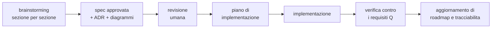

# Roadmap — sotto-progetti, ordine, stato

Piano generale del progetto. **Da aggiornare a ogni sotto-progetto chiuso**, insieme a
[tracciabilità](tracciabilita.md).

Ultimo aggiornamento: **2026-08-07**.

## Stato in una riga

> Spec del kernel **completa e approvata** (§0–§10, 33 ADR). Stack deciso **tranne il
> guscio della GUI**: core in **Rust**, interfaccia web in **Vue 3**, worker ML in
> **Python**; Tauri contro Electron resta aperto ([ADR-0029](adr/0029-guscio-della-gui.md),
> `Proposed`) e **non blocca nulla**.
>
> **Sotto-progetto 1 in corso**: spec approvata fino alla **§7.4**. Nessuna riga di codice.
> Le evidenze di M-3 sono **trasferite nella §7.2**, le due domande che nessuna misura
> decideva sono **chiuse dalla §7.3**, e la §7.4 porta il **catalogo dei controlli** — ogni
> voce con il proprio livello di forza, la sonda che deve scattare e la contro-sonda che
> deve restare verde.
>
> Prossimo passo: **§7.5** — la cadenza. Poi §7.6–§7.7, poi §8, poi il piano.
>
> ✅ **La lacuna su I2 è chiusa**: [ADR-0033](adr/0033-gpu-della-gui-quota-di-presentazione.md)
> — quota di presentazione sottratta, con la concessione tenuta dal core. Il kernel non
> ha più lacune aperte.

## Il ciclo che seguiamo

Ogni sotto-progetto attraversa gli stessi passi. Non si salta.

## Sotto-progetti

| # | Sotto-progetto | Livello | Stato | Dipende da |
|---|---|---|---|---|
| **0** | **Kernel — arbitri e meccanismi** (§0–§9) | L0 + L1 | ✅ **spec completa** | — |
| **0b** | **Kernel L0 fisico** (§10) — archivi, cifratura, backup, segreti, checkpoint, confinamento | L0 | ✅ **spec completa** | 0 |
| **0c** | **Stack completo** — ADR-0026 core, ADR-0027 GUI, ADR-0028 worker ML | — | ✅ **deciso** | SP-5, SP-6 |
| 1 | Implementazione del kernel + simulatore DST | L0 + L1 | 🔵 **in corso** — spec approvata fino alla §7.4 | 0, 0b, 0c |
| 2 | GUI minima (shell, chat, stato) | — | ⬜ | 1, ADR-0027 |
| 3 | Conversazione | L2 | ⬜ | 1, 2 |
| 4 | Agenti | L2 | ⬜ | 3 |
| 5 | Coding | L2 | ⬜ | 4, 0b |
| 6 | Conoscenza / RAG | L2 | ⬜ | 3 |
| 7 | Generazione asset | L2 | ⬜ | 1 · chiude **SP-1** |
| 8 | Voce | L2 | ⬜ | 7 · chiude **SP-2** |
| 9 | Gestione modelli locali | L1 est. | ⬜ | 1 |
| 10 | Integrazione OS completa | L3 | ⬜ | 2 |

## Perché quest'ordine

| Scelta | Motivo |
|---|---|
| **SP-5/SP-6 prima di tutto** | possono **escludere un linguaggio**: farli dopo significa riscrivere |
| Kernel prima di ogni capacità | imposto da ADR-0001: parità, nessun accesso privilegiato |
| Conversazione come prima capacità | è il consumatore più sottile di *tutti* i meccanismi del kernel: lo valida da capo a fondo con il minimo codice |
| Agenti prima di Coding | Coding usa gli anelli e i sensori che Agenti introduce per primo |
| Generazione asset prima di Voce | chiude **SP-1** (il rischio più grande) prima; e **SP-2** richiede che esistano *entrambi* — voce e job GPU pesante |
| L3 completo per ultimo | packaging, i18n e accessibilità non sbloccano nulla a monte |

Non è un ordine per importanza: i quattro pilastri restano paritari (ADR-0001). È un
ordine per **dipendenza e per rischio**.

## Il primo valore utile

Sotto-progetti 1 + 2 + 3: una chat funzionante con contabilità dei costi, giornale,
ripresa dopo crash e stato di degrado dichiarato. È il momento in cui il progetto
smette di essere solo documenti.

Costo accettato in ADR-0001: arriva più tardi che in un'architettura con baricentro.

## Spike aperti

| ID | Domanda | Blocca | Stato |
|---|---|---|---|
| **SP-5** | iniettabilità di tempo, casualità, I/O, scheduling | ⛔ ADR linguaggio | ✅ **chiuso**: solo Rust passa. Go fallisce C6 (9 e 4 tracce distinte su 100 dentro `synctest`), TypeScript parziale |
| **SP-6** | il sistema di tipi regge il confine dei dati non fidati | ⛔ ADR linguaggio | ✅ **chiuso**: Rust e Go passano, TypeScript parziale su T4 e T6 |
| SP-1 | curva qualità/VRAM di TRELLIS2 su 16 GB | profili di risorsa §2 | ⬜ |
| SP-2 | Q1 (voce < 600 ms) sotto carico GPU | taratura corsie §2 | ⬜ |
| SP-3 | budget della proiezione per modello | taratura §5 | ⬜ |
| SP-4 | provider con annullamento senza addebito | ordine di preferenza §3 | ⬜ |

Protocolli e soglie decisionali: [spec §9](superpowers/specs/2026-08-06-kernel-design.md).

## Piani di implementazione

| Piano | Copre | Stato |
|---|---|---|
| [Spike bloccanti e stack](superpowers/plans/2026-08-06-spike-linguaggio-del-core.md) | SP-5, SP-6, ADR-0026, ADR-0027, ADR-0028 | ✅ **eseguito** il 2026-08-06 |

Il piano del sotto-progetto 1 si scrive **dopo** che la sua spec è completa (§0–§8):
vale «spec prima del codice», e il piano è il passo fra le due.

**Il codice si scrive in questo repository**, non altrove. Il piano deve quindi decidere
anche *dove*: `spikes/rust/` ha un proprio `Cargo.toml` e alla radice non ce n'è nessuno,
quindi il workspace delle cinque crate nasce alla radice — escludendo gli spike — oppure
accanto ad essi.

Il prototipo [`spikes/rust/`](../spikes/rust/) è il punto di partenza del simulatore:
contiene già il confine dei tipi, l'esecutore deterministico, l'esecutore su `Future`
native e il giornale write-ahead iniettabile, tutti con i loro test.

**Toolchain sulla macchina**, verificata il 2026-08-06: `rustc` 1.95.0 · `cargo` 1.95.0
· `clippy` 0.1.95. Go 1.26.5 e Node 24.9 restano installati ma non servono più al core.

## Decisioni ancora da prendere

| Decisione | Quando | Vincolata da |
|---|---|---|
| ~~Linguaggio del core~~ | ✅ **ADR-0026: Rust** | — |
| ~~Interfaccia web o toolkit nativo~~ | ✅ **ADR-0027: interfaccia web** (G7) | — |
| ~~Ecosistema dei worker ML~~ | ✅ **ADR-0028: Python** | — |
| ~~Framework dell'interfaccia~~ | ✅ **ADR-0030: Vue 3** | — |
| ⚠️ **Guscio della GUI: Tauri o Electron** | **ADR-0029, `Proposed`.** Si chiude con **cinque** misure M1–M5 all'inizio del sotto-progetto 2 | non blocca il sotto-progetto 1 |
| ~~La GPU usata dalla GUI non è arbitrata~~ | ✅ **[ADR-0033](adr/0033-gpu-della-gui-quota-di-presentazione.md)**, nella §5 della spec del sotto-progetto 1 | I2 è ora verificato su **tutte e tre** le classi di processo |
| ~~Motore di persistenza~~ | ✅ **[ADR-0032](adr/0032-motore-di-persistenza.md): `redb` 4.1.0** con `StorageBackend` scritto da noi | il requisito 4 di §10.6 è stato misurato: solo `redb` lo espone |
| ~~Serializzatore dello schema IPC~~ | ✅ **`bincode` 2.0.1**, misura M-1 nella §6 — prime voci della lista di [ADR-0031](adr/0031-dipendenze-del-kernel-parte-del-confine.md), che smette di essere vuota | il criterio non era «`no_std`» ma **il grafo transitivo** |
| Livello 3 di confinamento (microVM) | quando servirà eseguire codice di provenienza ignota | ADR-0025 |

### La lacuna su I2 — ✅ chiusa il 2026-08-07

Trovata durante la revisione di ADR-0027, non cercata. Chiusa da
[ADR-0033](adr/0033-gpu-della-gui-quota-di-presentazione.md) nella §5 della spec del
sotto-progetto 1.

Le tre uscite enumerate **non erano tre opzioni per un problema**: erano tre risposte
parziali per **tre consumatori diversi**, trattati fino ad allora come uno solo.

| # | Consumo GPU della GUI | Governo | Rifiuto esecutivo? |
|---|---|---|---|
| 1 | compositing della webview | quota di presentazione sottratta, **concessione tenuta dal core** | ❌ no |
| 2 | viewer 3D entro la quota | stessa quota | ❌ no |
| 3 | viewer 3D oltre la quota | concessione ordinaria via IPC, prelazionabile | ✅ sì |

Il titolare è il **core** e non la GUI, perché la GUI non può *chiedere*: chi alloca è il
compositor, che non ha un percorso di richiesta. E una quota sottratta senza titolare
lascerebbe I2 falso.

⚠️ **Costo dichiarato:** verso il compositor il rifiuto dell'arbitro **non è esecutivo**.
La quota è una promessa di budget, non un'imposizione, e per la GUI I2 vale in una forma
più debole *in natura*. Il valore della quota è **non misurato**: lo chiude **M5**, e
stringe **RK-1** di una quantità oggi ignota.

## Regola di manutenzione

Alla chiusura di ogni sotto-progetto si aggiornano, **nello stesso passaggio**:

1. la tabella dei sotto-progetti qui sopra;
2. le righe corrispondenti in [tracciabilita.md](tracciabilita.md);
3. lo stato degli spike che quel sotto-progetto ha chiuso;
4. `CLAUDE.md` alla radice, se cambia il «prossimo passo».

Un documento di stato disallineato è peggio di nessun documento: mente con autorevolezza.
