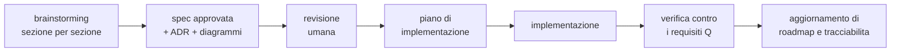

# Roadmap — sotto-progetti, ordine, stato

Piano generale del progetto. **Da aggiornare a ogni sotto-progetto chiuso**, insieme a
[tracciabilità](tracciabilita.md).

Ultimo aggiornamento: **2026-08-06**.

## Stato in una riga

> Spec del kernel **completa e approvata** (§0–§10, 30 ADR). Stack deciso **tranne il
> guscio della GUI**: core in **Rust**, interfaccia web in **Vue 3**, worker ML in
> **Python**; Tauri contro Electron resta aperto ([ADR-0029](adr/0029-guscio-della-gui.md),
> `Proposed`) e **non blocca nulla**. Prossimo passo: **implementazione del kernel +
> simulatore DST** (sotto-progetto 1).
>
> ⚠️ **Una lacuna aperta nel kernel**: la GPU usata dalla GUI non è arbitrata da
> nessuno. Va chiusa nel sotto-progetto 1 — vedi [HANDOFF](HANDOFF.md).

## Il ciclo che seguiamo

Ogni sotto-progetto attraversa gli stessi passi. Non si salta.

## Sotto-progetti

| # | Sotto-progetto | Livello | Stato | Dipende da |
|---|---|---|---|---|
| **0** | **Kernel — arbitri e meccanismi** (§0–§9) | L0 + L1 | ✅ **spec completa** | — |
| **0b** | **Kernel L0 fisico** (§10) — archivi, cifratura, backup, segreti, checkpoint, confinamento | L0 | ✅ **spec completa** | 0 |
| **0c** | **Stack completo** — ADR-0026 core, ADR-0027 GUI, ADR-0028 worker ML | — | ✅ **deciso** | SP-5, SP-6 |
| 1 | Implementazione del kernel + simulatore DST | L0 + L1 | ⏭️ **prossimo** | 0, 0b, 0c |
| 2 | GUI minima (shell, chat, stato) | — | ⬜ | 1, ADR-0027 |
| 3 | Conversazione | L2 | ⬜ | 1, 2 |
| 4 | Agenti | L2 | ⬜ | 3 |
| 5 | Coding | L2 | ⬜ | 4, 0b |
| 6 | Conoscenza / RAG | L2 | ⬜ | 3 |
| 7 | Generazione asset | L2 | ⬜ | 1 · chiude **SP-1** |
| 8 | Voce | L2 | ⬜ | 7 · chiude **SP-2** |
| 9 | Gestione modelli locali | L1 est. | ⬜ | 1 |
| 10 | Integrazione OS completa | L3 | ⬜ | 2 |

## Perché quest'ordine

| Scelta | Motivo |
|---|---|
| **SP-5/SP-6 prima di tutto** | possono **escludere un linguaggio**: farli dopo significa riscrivere |
| Kernel prima di ogni capacità | imposto da ADR-0001: parità, nessun accesso privilegiato |
| Conversazione come prima capacità | è il consumatore più sottile di *tutti* i meccanismi del kernel: lo valida da capo a fondo con il minimo codice |
| Agenti prima di Coding | Coding usa gli anelli e i sensori che Agenti introduce per primo |
| Generazione asset prima di Voce | chiude **SP-1** (il rischio più grande) prima; e **SP-2** richiede che esistano *entrambi* — voce e job GPU pesante |
| L3 completo per ultimo | packaging, i18n e accessibilità non sbloccano nulla a monte |

Non è un ordine per importanza: i quattro pilastri restano paritari (ADR-0001). È un
ordine per **dipendenza e per rischio**.

## Il primo valore utile

Sotto-progetti 1 + 2 + 3: una chat funzionante con contabilità dei costi, giornale,
ripresa dopo crash e stato di degrado dichiarato. È il momento in cui il progetto
smette di essere solo documenti.

Costo accettato in ADR-0001: arriva più tardi che in un'architettura con baricentro.

## Spike aperti

| ID | Domanda | Blocca | Stato |
|---|---|---|---|
| **SP-5** | iniettabilità di tempo, casualità, I/O, scheduling | ⛔ ADR linguaggio | ✅ **chiuso**: solo Rust passa. Go fallisce C6 (9 e 4 tracce distinte su 100 dentro `synctest`), TypeScript parziale |
| **SP-6** | il sistema di tipi regge il confine dei dati non fidati | ⛔ ADR linguaggio | ✅ **chiuso**: Rust e Go passano, TypeScript parziale su T4 e T6 |
| SP-1 | curva qualità/VRAM di TRELLIS2 su 16 GB | profili di risorsa §2 | ⬜ |
| SP-2 | Q1 (voce < 600 ms) sotto carico GPU | taratura corsie §2 | ⬜ |
| SP-3 | budget della proiezione per modello | taratura §5 | ⬜ |
| SP-4 | provider con annullamento senza addebito | ordine di preferenza §3 | ⬜ |

Protocolli e soglie decisionali: [spec §9](superpowers/specs/2026-08-06-kernel-design.md).

## Piani di implementazione

| Piano | Copre | Stato |
|---|---|---|
| [Spike bloccanti e stack](superpowers/plans/2026-08-06-spike-linguaggio-del-core.md) | SP-5, SP-6, ADR-0026, ADR-0027, ADR-0028 | ✅ **eseguito** il 2026-08-06 |

Il piano del sotto-progetto 1 (implementazione del kernel) **è ora scrivibile**:
ADR-0026 nomina Rust, quindi percorsi di file e struttura delle crate sono determinati.

Il prototipo [`spikes/rust/`](../spikes/rust/) è il punto di partenza del simulatore:
contiene già il confine dei tipi, l'esecutore deterministico, l'esecutore su `Future`
native e il giornale write-ahead iniettabile, tutti con i loro test.

**Toolchain sulla macchina**, verificata il 2026-08-06: `rustc` 1.95.0 · `cargo` 1.95.0
· `clippy` 0.1.95. Go 1.26.5 e Node 24.9 restano installati ma non servono più al core.

## Decisioni ancora da prendere

| Decisione | Quando | Vincolata da |
|---|---|---|
| ~~Linguaggio del core~~ | ✅ **ADR-0026: Rust** | — |
| ~~Interfaccia web o toolkit nativo~~ | ✅ **ADR-0027: interfaccia web** (G7) | — |
| ~~Ecosistema dei worker ML~~ | ✅ **ADR-0028: Python** | — |
| ~~Framework dell'interfaccia~~ | ✅ **ADR-0030: Vue 3** | — |
| ⚠️ **Guscio della GUI: Tauri o Electron** | **ADR-0029, `Proposed`.** Si chiude con quattro misure M1–M4 all'inizio del sotto-progetto 2 | non blocca il sotto-progetto 1 |
| ⚠️ **La GPU usata dalla GUI non è arbitrata** | ADR nel sotto-progetto 1, quando si progetta l'arbitro | **I2 come scritto è verificato solo sui worker** |
| **Motore di persistenza** | ADR prossimo; l'ecosistema ora è noto | requisiti in §10.6; candidati Rust verificati in `spikes/RISULTATI.md` |
| Livello 3 di confinamento (microVM) | quando servirà eseguire codice di provenienza ignota | ADR-0025 |

### La lacuna su I2, per esteso

Trovata durante la revisione di ADR-0027, non cercata.
[ADR-0005](adr/0005-arbitrato-gpu-su-due-dimensioni.md) e
[design/02](design/02-arbitrato-gpu.md) **non menzionano mai la GUI**, e la verifica di
I2 è scritta solo sui worker: «nessun *worker* si avvia senza una concessione valida».

Ma un viewer 3D (G6) usa la GPU, e il compositing della webview la usa anche senza 3D.
Durante un render TRELLIS2 che vuole 13–14 GB su 16, quella VRAM è contesa.

| Opzione | Conseguenza |
|---|---|
| il viewer chiede una concessione come tutti | I2 resta vero, ma la GUI smette di essere «solo stato di presentazione» (I1) |
| il viewer è esente | **I2 è falso come scritto** e va riformulato, dichiarando il rischio |
| quota sottratta, come per l'audio | riusa il meccanismo che ADR-0005 ha già inventato per la voce |

Vale identico per Tauri e per Electron: **è una questione di kernel, non di guscio.**

## Regola di manutenzione

Alla chiusura di ogni sotto-progetto si aggiornano, **nello stesso passaggio**:

1. la tabella dei sotto-progetti qui sopra;
2. le righe corrispondenti in [tracciabilita.md](tracciabilita.md);
3. lo stato degli spike che quel sotto-progetto ha chiuso;
4. `CLAUDE.md` alla radice, se cambia il «prossimo passo».

Un documento di stato disallineato è peggio di nessun documento: mente con autorevolezza.
