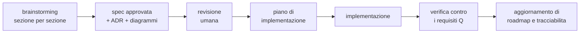

# Roadmap — sotto-progetti, ordine, stato

Piano generale del progetto. **Da aggiornare a ogni sotto-progetto chiuso**, insieme a
[tracciabilità](tracciabilita.md).

Ultimo aggiornamento: **2026-08-06**.

## Stato in una riga

> Spec del kernel **completa e approvata** (§0–§10, 25 ADR), nessuna lacuna aperta. **Nessun codice
> scritto.** Prossimo passo: spike SP-5 e SP-6, che decidono il linguaggio del core.

## Il ciclo che seguiamo

Ogni sotto-progetto attraversa gli stessi passi. Non si salta.

## Sotto-progetti

| # | Sotto-progetto | Livello | Stato | Dipende da |
|---|---|---|---|---|
| **0** | **Kernel — arbitri e meccanismi** (§0–§9) | L0 + L1 | ✅ **spec completa** | — |
| **0b** | **Kernel L0 fisico** (§10) — archivi, cifratura, backup, segreti, checkpoint, confinamento | L0 | ✅ **spec completa** | 0 |
| **0c** | **ADR linguaggio del core** | — | ⏭️ **prossimo** | SP-5, SP-6 |
| 1 | Implementazione del kernel + simulatore DST | L0 + L1 | ⬜ | 0, 0b, 0c |
| 2 | GUI minima (shell, chat, stato) | — | ⬜ | 1 |
| 3 | Conversazione | L2 | ⬜ | 1, 2 |
| 4 | Agenti | L2 | ⬜ | 3 |
| 5 | Coding | L2 | ⬜ | 4, 0b |
| 6 | Conoscenza / RAG | L2 | ⬜ | 3 |
| 7 | Generazione asset | L2 | ⬜ | 1 · chiude **SP-1** |
| 8 | Voce | L2 | ⬜ | 7 · chiude **SP-2** |
| 9 | Gestione modelli locali | L1 est. | ⬜ | 1 |
| 10 | Integrazione OS completa | L3 | ⬜ | 2 |

## Perché quest'ordine

| Scelta | Motivo |
|---|---|
| **SP-5/SP-6 prima di tutto** | possono **escludere un linguaggio**: farli dopo significa riscrivere |
| Kernel prima di ogni capacità | imposto da ADR-0001: parità, nessun accesso privilegiato |
| Conversazione come prima capacità | è il consumatore più sottile di *tutti* i meccanismi del kernel: lo valida da capo a fondo con il minimo codice |
| Agenti prima di Coding | Coding usa gli anelli e i sensori che Agenti introduce per primo |
| Generazione asset prima di Voce | chiude **SP-1** (il rischio più grande) prima; e **SP-2** richiede che esistano *entrambi* — voce e job GPU pesante |
| L3 completo per ultimo | packaging, i18n e accessibilità non sbloccano nulla a monte |

Non è un ordine per importanza: i quattro pilastri restano paritari (ADR-0001). È un
ordine per **dipendenza e per rischio**.

## Il primo valore utile

Sotto-progetti 1 + 2 + 3: una chat funzionante con contabilità dei costi, giornale,
ripresa dopo crash e stato di degrado dichiarato. È il momento in cui il progetto
smette di essere solo documenti.

Costo accettato in ADR-0001: arriva più tardi che in un'architettura con baricentro.

## Spike aperti

| ID | Domanda | Blocca | Stato |
|---|---|---|---|
| **SP-5** | iniettabilità di tempo, casualità, I/O, scheduling | ⛔ ADR linguaggio | ⬜ da eseguire |
| **SP-6** | il sistema di tipi regge il confine dei dati non fidati | ⛔ ADR linguaggio | ⬜ da eseguire |
| SP-1 | curva qualità/VRAM di TRELLIS2 su 16 GB | profili di risorsa §2 | ⬜ |
| SP-2 | Q1 (voce < 600 ms) sotto carico GPU | taratura corsie §2 | ⬜ |
| SP-3 | budget della proiezione per modello | taratura §5 | ⬜ |
| SP-4 | provider con annullamento senza addebito | ordine di preferenza §3 | ⬜ |

Protocolli e soglie decisionali: [spec §9](superpowers/specs/2026-08-06-kernel-design.md).

## Piani di implementazione

| Piano | Copre | Stato |
|---|---|---|
| [Spike bloccanti e linguaggio del core](superpowers/plans/2026-08-06-spike-linguaggio-del-core.md) | SP-5, SP-6, ADR-0026 | ⏭️ **pronto, non eseguito** |

Il piano del sotto-progetto 1 (implementazione del kernel) **non è scrivibile** finché
ADR-0026 non nomina il linguaggio: percorsi di file e codice dipendono da quella scelta.

## Decisioni ancora da prendere

| Decisione | Quando | Vincolata da |
|---|---|---|
| Linguaggio del core | dopo SP-5/SP-6 | V29, V19, I3, V28, ADR-0004 |
| Motore di persistenza | ADR dopo il linguaggio | requisiti fissati in §10.6 |
| Linguaggio e tecnologia della GUI | sotto-progetto 2 | ADR-0004 (GUI sacrificabile) |
| Livello 3 di confinamento (microVM) | quando servirà eseguire codice di provenienza ignota | ADR-0025 |

## Regola di manutenzione

Alla chiusura di ogni sotto-progetto si aggiornano, **nello stesso passaggio**:

1. la tabella dei sotto-progetti qui sopra;
2. le righe corrispondenti in [tracciabilita.md](tracciabilita.md);
3. lo stato degli spike che quel sotto-progetto ha chiuso;
4. `CLAUDE.md` alla radice, se cambia il «prossimo passo».

Un documento di stato disallineato è peggio di nessun documento: mente con autorevolezza.
