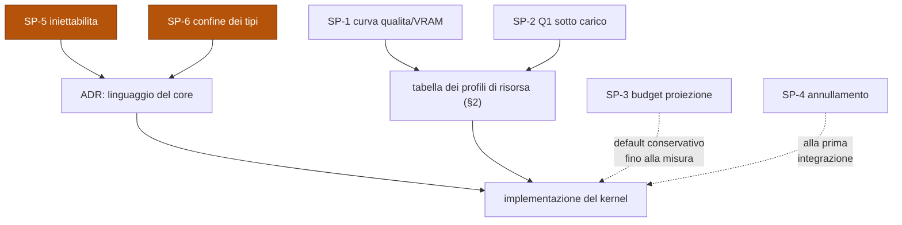

# Spec — Kernel (L0 fondamenta + L1 arbitri trasversali)

- **Data:** 2026-08-06
- **Sotto-progetto:** kernel. È il primo, perché tutte e sei le capacità di L2
  dipendono da esso.
- **Stato:** §0–§9 approvate. **Una lacuna aperta:** vedi §10.

## Avanzamento delle sezioni

| § | Sezione | Stato |
|---|---|---|
| 0 | Perimetro, vincoli e requisiti di qualità | Approvata |
| 1 | Architettura di processo | Approvata |
| 2 | Arbitro risorse GPU e policy VRAM | Approvata |
| 3 | Gateway di inferenza | Approvata |
| 4 | Persistenza, run durevoli e idempotenza | Approvata |
| 5 | Harness: guide, sensori e anelli di controllo | Approvata |
| 6 | Permessi e confine dei dati non fidati | Approvata |
| 7 | Errori, degrado e osservabilità | Approvata |
| 8 | Test e criteri di accettazione | Approvata |
| 9 | Rischi e spike di validazione | Approvata |
| **10** | **L0 fisico: persistenza, cifratura, backup, segreti, confinamento** | ⚠️ **lacuna — da presentare** |

---

## 0. Perimetro, vincoli e requisiti di qualità

### 0.1 Cosa è

Applicazione desktop GUI, local-first, utente singolo. Piattaforma a quattro pilastri
paritari su kernel comune ([ADR-0001](../../adr/0001-architettura-a-kernel-con-capacita-paritarie.md)).

### 0.2 Cosa il kernel NON fa

Il perimetro negativo è l'artefatto più prezioso di questa sezione.

| Il kernel non… | Perché |
|---|---|
| …conosce le capacità | Deve restare testabile senza alcuna capacità caricata (ADR-0001) |
| …contiene interfaccia grafica | La GUI è un processo separato e sacrificabile (ADR-0004) |
| …contiene chiamate OS-specifiche | Passano tutte dal modulo di piattaforma (I3) |
| …carica codice di terze parti | Estensioni solo via MCP e skill dichiarative ([ADR-0003](../../adr/0003-estensibilita-solo-mcp-e-skill-dichiarative.md)) |
| …espone un'API pubblica | Il protocollo IPC è privato e non versionato (I4) |

### 0.3 Vincoli dati

| Vincolo | Valore |
|---|---|
| GPU | singola, RTX 5080, 16 GB VRAM |
| Sistema operativo | Windows primario; Linux successivo dietro confine esplicito ([ADR-0002](../../adr/0002-windows-primario-con-confine-os-esplicito.md)) |
| Inferenza | OpenRouter primaria; inferenza locale opzionale |
| Utenza | singolo utente, nessuna multi-tenancy, nessuna autenticazione |
| Rete | richiesta per OpenRouter; degrado esplicito quando assente |

### 0.4 Requisiti di qualità

Espressi come **scenari misurabili**: è qui che vive la difficoltà reale del sistema,
non nell'elenco delle funzionalità. Le soglie numeriche di Q1 e Q11 sono **provvisorie
e da tarare**: le fissano gli spike SP-2 e SP-3 (§9). Non sono segnaposto — sono valori
il cui metodo di determinazione è già deciso.

| ID | Scenario | Soglia |
|---|---|---|
| Q1 | Da fine enunciato a primo fonema di risposta, con job GPU pesante in corso | < 600 ms al 95° percentile |
| Q2 | Job GPU concorrenti che causano OOM | zero, per costruzione (I2) |
| Q3 | Chiusura o crash della GUI durante una run agentica | la run prosegue, nessuna perdita di stato |
| Q4 | Crash o kill di un worker in qualsiasi istante | nessuna corruzione, nessuna perdita (I1) |
| Q5 | Riavvio del core a metà di una run lunga | ripresa dall'ultimo passo giornalato, **nessun effetto rieseguito** |
| Q6 | Contesto esaurito prima che il task sia finito | la run prosegue: il contesto si ricalcola dallo stato durevole, nessuna informazione persa |
| Q7 | Run che supera il tetto di passi, tempo o costo | si ferma e chiede; non prosegue in silenzio |
| Q8 | Ricarica di un modello locale dopo scarico (avvio a freddo) | segnalata all'utente prima che percepisca un blocco |
| Q9 | Contenuto non fidato che tenta di iniettare istruzioni | non raggiunge mai il canale delle istruzioni (I6) |
| Q10 | Esito di un passo che viola un sensore | rientra nell'anello con il feedback del sensore, senza intervento umano |
| Q11 | Occupazione della proiezione | resta al **budget target**, non al limite della finestra |
| Q12 | Difetto che si ripresenta per la seconda volta | il sistema propone una guida o un sensore, non una raccomandazione generica |
| Q13 | Richiesta con vincolo sui dati e nessun endpoint conforme | **fallisce chiuso**: errore che nomina il vincolo, nessun ripiego |
| Q14 | Ricostruire con cosa è stato eseguito un passo di sei mesi fa | il record di routing lo dice, indipendentemente dalla configurazione attuale |
| Q15 | Contenuto non fidato che contiene un'istruzione | può informare, mai autorizzare: l'azione richiede la stessa approvazione che servirebbe senza quella richiesta |
| Q16 | Server MCP che cambia la descrizione di uno strumento dopo l'approvazione | strumento **sospeso**, diff mostrato, ri-approvazione obbligatoria |
| Q17 | Un segreto noto compare in contenuto in uscita | bloccato e segnalato dal canary |
| Q18 | Perdita della rete durante l'uso | il sistema **dichiara** cosa resta disponibile; non fallisce azione per azione |
| Q19 | Capire cosa è andato storto in una run di 4 ore | trace gerarchico navigabile, ricavato dal giornale |
| Q20 | Dati che lasciano la macchina | nessuno per default: esportazione opt-in, un solo punto di uscita |

Q5–Q7 sono i requisiti delle **long-horizon tasks** (§4).
Q10–Q12 sono i requisiti dell'**harness** (§5).
Q13–Q14 sono i requisiti del **gateway** (§3).
Q15–Q17 sono i requisiti di **sicurezza** (§6).
Q18–Q20 sono i requisiti di **osservabilità e degrado** (§7).

### 0.5 Requisiti strutturali che vincolano la topologia

Vedi la tabella R1–R5 in [ADR-0004](../../adr/0004-topologia-di-processo.md#context).
Sono proprietà del processo, non funzionalità: non si aggiungono a posteriori.

### 0.6 Le tre discipline e dove vivono

Il progetto adotta esplicitamente le tre discipline consolidate nello stato dell'arte
2025–2026. Sono impilate: ognuna avvolge la precedente.

| Disciplina | Oggetto | Formula |
|---|---|---|
| **Context engineering** | l'insieme dei token che il modello vede a ogni turno — memoria, strumenti, recupero, stato | *l'informazione giusta, nel formato giusto, al momento giusto* |
| **Loop engineering** | il ciclo in cui l'agente gira: trigger, topologia, verificatore, regole di arresto | quattro anelli annidati |
| **Harness engineering** | tutto ciò che circonda il modello | `Agent = Model + Harness` |

Non sono una sezione della spec: sono **trasversali**, e ogni loro leva ha una casa
esplicita.

| Leva | Disciplina | Sezione che la possiede |
|---|---|---|
| Contesto come artefatto curato | context | §4 — [ADR-0008](../../adr/0008-contesto-come-proiezione-dello-stato.md) |
| Budget della proiezione, misura per categoria | context | §5 — [ADR-0010](../../adr/0010-budget-della-proiezione-invece-di-soglia-di-riempimento.md) |
| Politiche di memoria e recupero | context | §4 (meccanismo) · capacità Conoscenza (politica) |
| Anello dell'agente | loop | capacità Agenti, su meccanismo §4 |
| Anello di verifica | loop | §5 — [ADR-0009](../../adr/0009-guide-sensori-e-anelli-sono-meccanismi-di-kernel.md) |
| Trigger ed eventi | loop | §5 |
| Regole di arresto | loop | §4 — confini di autonomia (V8) |
| Anello di miglioramento | loop | §5 |
| Guide (feedforward) | harness | §5 · le skill dichiarative di [ADR-0003](../../adr/0003-estensibilita-solo-mcp-e-skill-dichiarative.md) *sono* guide |
| Sensori (feedback) | harness | §5 |
| Schemi degli strumenti | harness | §3 — output vincolato |
| Sandbox ed esecuzione | harness | §6 |
| Livelli di permesso e gate umani | harness | §6 |
| Routing | harness | §3 |
| Osservabilità | harness | §4 (giornale) · §7 |

---

## 1. Architettura di processo

**Decisione:** [ADR-0004](../../adr/0004-topologia-di-processo.md) — core di servizio,
GUI sottile, worker effimeri.

**Struttura corrente:** [Topologia dei processi](../../design/01-topologia-dei-processi.md).

Le sei invarianti I1–I6 definite nell'ADR sono vincolanti per tutte le sezioni
successive. Ogni scelta di design che segue deve poter essere verificata contro di
esse; una violazione richiede un ADR, non una deroga.

---

## 2. Arbitro risorse GPU e policy VRAM

**Decisioni:** [ADR-0005](../../adr/0005-arbitrato-gpu-su-due-dimensioni.md) ·
[ADR-0006](../../adr/0006-due-policy-vram-come-oggetti-distinti.md).

**Struttura:** [Arbitrato delle risorse GPU](../../design/02-arbitrato-gpu.md).

### 2.1 In sintesi

| Scelta | Sostanza |
|---|---|
| Due dimensioni | VRAM = capacità (ammissione) · calcolo = contesa (corsie) |
| Profilo di risorsa | descrittore nominato per ogni tipo di lavoro; riserva dichiarata, picco misurato |
| Quota audio | **sottratta** dal budget allocabile, non prioritaria |
| Tre corsie | `realtime` mai prelazionabile · `interattivo` · `batch` |
| Due policy | REMOTA (default) e LOCALE come oggetti distinti, con transizione esplicita |
| Nessun degrado silenzioso | ogni decisione presa al posto dell'utente viene comunicata |

### 2.2 Vincoli che la §2 impone alle sezioni successive

| # | Vincolo | Colpisce |
|---|---|---|
| V1 | Nessun lavoro tocca la GPU senza concessione valida | §3 gateway, ogni capacità L2 |
| V2 | Ogni tipo di lavoro GPU deve avere un profilo di risorsa dichiarato | ogni capacità L2 |
| V3 | La policy attiva è una sola e proviene dal profilo di configurazione | §3, §4 |
| V4 | `Rifiutata` e `InCoda` sono esiti distinti e vanno distinti anche in interfaccia | §7, GUI |

### 2.3 Domande aperte, con il metodo per chiuderle

| ID | Domanda | Si chiude con |
|---|---|---|
| SP-1 | Quale punto della **curva qualità/VRAM** di TRELLIS2 scegliere su 16 GB? | spike §9 — produce la tabella dei profili di risorsa; determina se la policy LOCALE può tenere un LLM caldo |
| SP-2 | Ridurre l'occupazione dei job `batch` basta a tenere Q1 sotto i 600 ms? | spike §9 — se no, l'unica leva è sospendere il `batch` |

---

## 3. Gateway di inferenza

**Decisioni:** [ADR-0011](../../adr/0011-routing-risolto-e-giornalato-per-richiesta.md) ·
[ADR-0012](../../adr/0012-equivalenza-del-fallback-e-fallimento-chiuso.md) ·
[ADR-0013](../../adr/0013-conformita-allo-schema-e-un-verdetto-di-sensore.md).

**Struttura:** [Gateway di inferenza](../../design/05-gateway-inferenza.md).

### 3.1 In sintesi

| Scelta | Sostanza |
|---|---|
| Record di routing risolto | ogni richiesta giornala la decisione **risolta**, non un rimando alla configurazione |
| Tutto è una run | ogni interazione con un modello è un passo; una chat è una run interattiva |
| Contabilità gerarchica | messaggio/sessione/run/sub-agente sono aggregazioni della stessa gerarchia |
| Equivalenza del fallback | definita dai **vincoli** della richiesta, non dalla capacità del modello |
| Due classi di vincolo | dati → **fallisce chiuso** · qualità e costo → degrado dichiarato |
| Rifiuto dell'arbitro GPU | causa di fallback di prima classe, non errore |
| Ritentativo ≠ passo | resta dentro lo stesso passo: cambia il record, non la run |
| Schema non conforme | **verdetto di sensore** (§5), non eccezione del gateway |
| Stream interrotti | il costo si registra comunque |

### 3.2 Confini chiariti dall'audit di coerenza

| Confine | Regola |
|---|---|
| Inferenza generativa vs percettiva | solo la **generativa** passa dal gateway ed è un passo. Wake word, VAD e trascrizione continua sono **eventi** (anello 3), mai passi: giornalarle violerebbe Q1 |
| Ritentativo vs passo nuovo | discriminante = **il modello ha prodotto output?** No → stesso passo. Sì, ma respinto da un sensore → passo nuovo, perché quell'output esiste, è stato pagato e deve restare visibile all'anello 4 |
| Policy VRAM vs destinazione | V3 riguarda **cosa risiede in memoria**, non dove va la singola richiesta. In policy LOCALE una richiesta può finire su un provider remoto senza che la policy cambi |
| Quota audio sottratta vs I2 | la sottrazione **non è un'esenzione**: il worker audio detiene una concessione *permanente e non prelazionabile*, non l'assenza di concessione |

### 3.3 Perché "tutto è una run" non è sovra-ingegnerizzazione

È la condizione perché i meccanismi della §4 siano **universali invece che specifici
dell'agente**. Senza di essa servirebbe un secondo percorso per la chat: un'altra
contabilità, un altro annullamento, un altro tracciamento. Il costo è due scritture
durevoli su una latenza già dominata dalla chiamata al modello.

### 3.4 Vincoli che la §3 impone alle sezioni successive

| # | Vincolo | Colpisce |
|---|---|---|
| V15 | Ogni richiesta dichiara i propri vincoli, anche quando coincidono con i default | ogni capacità |
| V16 | Il record di routing non contiene mai credenziali; nomi di provider e parametri sì | §6 |
| V17 | Ritentativo e cambio di candidato restano dentro lo stesso passo | §4, capacità Agenti |
| V18 | Un errore di vincolo non soddisfatto deve nominare **quale** vincolo | §7, GUI |

### 3.5 Il costo che questa sezione introduce

**Più richieste falliranno del tutto**, per scelta. Un vincolo sui dati che non trova
endpoint conformi produce un errore invece di una risposta.

È controintuitivo e sotto pressione la tentazione di "provare comunque" sarà forte:
per questo la decisione è presa adesso e scritta, non lasciata al momento in cui
qualcosa non funziona. Il contrappeso è V18 — se il sistema si rifiuta di rispondere,
deve dire esattamente perché.

### 3.6 Domanda aperta

| ID | Domanda | Si chiude con |
|---|---|---|
| SP-4 | Quali provider supportano l'annullamento senza addebito? | verifica sul campo alla prima integrazione: determina l'ordine di preferenza per le richieste che si annullano spesso |

---

## 4. Persistenza, run durevoli e idempotenza

È la sezione che decide se le **long-horizon tasks** arrivano in fondo. Non ha
dipendenze dalla §3: si può leggere prima.

**Decisioni:** [ADR-0007](../../adr/0007-giornale-write-ahead-e-riconciliazione.md) ·
[ADR-0008](../../adr/0008-contesto-come-proiezione-dello-stato.md).

**Struttura:** [Run durevoli, giornale e proiezione](../../design/03-run-durevoli.md).

### 4.1 In sintesi

| Scelta | Sostanza |
|---|---|
| Tre livelli di stato | durevole (verità) · proiezione (contesto) · presentazione (GUI) |
| Giornale write-ahead | intento prima di eseguire, esito dopo → il **dubbio è rilevabile** |
| Ripresa = riconciliazione | non replay cieco: per ogni passo in dubbio si stabilisce cosa è accaduto |
| Tre classi di effetto | `verificabile` · `idempotente` · `irripetibile` |
| Default sicuro | effetto non classificato = `irripetibile` → sospendi e chiedi |
| Contesto = proiezione | compattare **ricompone**, non riassume; solo la trascrizione grezza è sacrificabile |
| Confini di autonomia | passi, tempo, costo: il superamento **sospende**, non termina |

### 4.2 Perché è nel kernel e non nella capacità agenti

Il giornale delle run serve anche alla coda dei render 3D, all'indicizzazione RAG e
alla deep research: sono tutte attività lunghe con effetti da riconciliare. Metterlo
nella capacità agenti le darebbe un accesso privilegiato, che
[ADR-0001](../../adr/0001-architettura-a-kernel-con-capacita-paritarie.md) vieta.

Il kernel fornisce il **meccanismo**; ogni capacità porta la propria **politica**
(quali passi, quali effetti, cosa entra nella proiezione).

### 4.3 Vincoli che la §4 impone alle sezioni successive

| # | Vincolo | Colpisce |
|---|---|---|
| V5 | Nessun effetto senza classe dichiarata; l'assenza vale `irripetibile` | ogni strumento, §6 |
| V6 | Write-ahead obbligatorio: nulla si esegue prima che l'intento sia durevole | §3, ogni capacità |
| V7 | Il contesto non è mai sorgente di verità: ciò che deve sopravvivere si scrive | §3, ogni capacità |
| V8 | Ogni run ha un tetto; in assenza di configurazione vale un default conservativo | §7, GUI |
| V9 | Ogni ingresso in `AttesaUmano` emette una notifica | §7, L3 |

### 4.4 Il modo di fallire che questa sezione introduce

Onestà sul rovescio della medaglia: il fallimento non scompare, **si sposta**.

| Prima | Dopo |
|---|---|
| "il contesto si riempie e l'informazione è persa" | "l'agente non ha registrato una decisione" |

Mitigazione strutturale: **registrare è un passo con un effetto giornalato**, non
un'aspettativa sul comportamento del modello. Se non è giornalato non è avvenuto — il
che rende il problema *osservabile* invece che silenzioso.

---

## 5. Harness: guide, sensori e anelli di controllo

**Decisioni:** [ADR-0009](../../adr/0009-guide-sensori-e-anelli-sono-meccanismi-di-kernel.md) ·
[ADR-0010](../../adr/0010-budget-della-proiezione-invece-di-soglia-di-riempimento.md).

**Struttura:** [Anelli di controllo, guide e sensori](../../design/04-anelli-e-sensori.md).

### 5.1 In sintesi

| Scelta | Sostanza |
|---|---|
| Due tipi di controllo | **guide** (feedforward, probabilistiche) · **sensori** (feedback, verificabili) |
| Quattro anelli | agente · verifica · eventi · miglioramento |
| Contratto del sensore | minimo per scelta: `(artefatto) → (verdetto, dettaglio, costo)` |
| Sensori per costo | computazionali dentro l'anello stretto · inferenziali a valle |
| Anello di miglioramento | il sistema **propone**, l'utente approva; non si auto-modifica |
| Budget della proiezione | occupazione obiettivo, non soglia di overflow (**context rot**) |
| Misura per categoria | l'occupazione del contesto per categoria entra nel giornale |

### 5.2 L'unificazione che giustifica la collocazione nel kernel

| Capacità | Il suo "sensore" |
|---|---|
| Coding | linter, type checker, esecuzione dei test |
| Generazione asset | validazione della mesh prima dell'export |
| Conoscenza / RAG | verifica che ogni affermazione abbia una citazione risolvibile |

Sono lo **stesso oggetto**: osservano un artefatto e producono un verdetto.
Implementarli dentro tre capacità darebbe tre vocabolari, tre formati di verdetto e
nessun anello di miglioramento possibile — oltre a violare la parità di ADR-0001.

### 5.3 Vincoli che la §5 impone alle sezioni successive

| # | Vincolo | Colpisce |
|---|---|---|
| V10 | Un sensore osserva e produce un verdetto: **non modifica nulla** | ogni capacità |
| V11 | Ogni sensore dichiara il proprio costo; gli inferenziali restano fuori dall'anello stretto | §3, ogni capacità |
| V12 | L'anello 4 propone, non applica: nessuna auto-modifica delle guide senza approvazione | §7, GUI |
| V13 | La ricomposizione della proiezione mantiene il **budget**, non evita l'overflow | §3, capacità Agenti |
| V14 | Un verdetto negativo che rientra nell'anello è **un passo nuovo**, giornalato | §4 |

### 5.4 Domanda aperta

| ID | Domanda | Si chiude con |
|---|---|---|
| SP-3 | Oltre quale frazione della finestra la qualità cala, per i modelli usati? | spike §9 — fino ad allora vale un default conservativo, **dichiarato come tale** |

### 5.5 Il rischio che questa sezione introduce

**Astrazione prematura.** Il contratto comune del sensore è ipotizzato su tre casi di
cui nessuno esiste ancora. Se divergono più del previsto, il contratto diventa un
vincolo invece che uno strumento.

Mitigazione: il contratto è deliberatamente povero, e va **rivisto dopo il secondo
sensore reale in aree diverse**. Se non si adatta, si spezza — non si piega.

---

## 6. Permessi e confine dei dati non fidati

**Decisioni:** [ADR-0014](../../adr/0014-confine-dei-dati-non-fidati-nel-sistema-di-tipi.md) ·
[ADR-0015](../../adr/0015-descrizioni-degli-strumenti-fissate-all-approvazione.md) ·
[ADR-0016](../../adr/0016-permessi-granulari-e-default-dei-vincoli-sui-dati.md).

**Struttura:** [Permessi e confine dei dati](../../design/06-permessi-e-confine-dei-dati.md).

### 6.1 In sintesi

| Scelta | Sostanza |
|---|---|
| Il confine è nel **sistema di tipi** | contenuto esterno e istruzioni hanno tipi distinti; la conversione è esplicita e giornalata |
| Etichetta **ereditaria** | riassumere, tradurre o concatenare non ripulisce nulla |
| **Nessuna sanitizzazione** | non si filtra: *un'istruzione trovata nei dati non è mai un'autorizzazione* |
| Descrizioni degli strumenti **fissate** | cambiano → strumento **sospeso**, diff mostrato, ri-approvazione |
| Permesso = **tripla** | `(strumento × risorsa × operazione)`, mai «lo strumento» |
| Approvazione **non estendibile** | vale per la tripla e per la sessione |
| Vincoli sui dati | default per profilo + **escalation automatica** sui segreti |
| Canary | verdetto di sensore (§5), non sottosistema nuovo |

### 6.2 Cosa questa sezione difende, e cosa no

Distinzione che regge tutto il capitolo:

| Difende da | Non difende da |
|---|---|
| **escalation di privilegio**: un contenuto ostile che diventa azione | **inganno del modello**: il modello può comunque essere convinto di qualcosa di falso |

Il modello vede il contenuto non fidato — deve vederlo, per lavorarci. Ciò che non
può è convertire quella convinzione in autorizzazione. Riporre nella difesa più
fiducia di così significa non averla capita.

### 6.3 L'unica eccezione strutturale, e come è contenuta

Le descrizioni degli strumenti MCP sono contenuto di terze parti che **deve** entrare
nel canale che influenza il comportamento: senza, l'agente non sa cosa fa lo
strumento. È l'unico varco, e viene chiuso su tre lati:

| Lato | Difesa |
|---|---|
| contenuto | mostrato integralmente all'approvazione, non solo il nome |
| tempo | impronta fissata: cambia → **sospeso** (difesa contro il *rug pull*) |
| autorità | una descrizione **non concede permessi**: quelli vengono solo dalla tripla |

### 6.4 Vincoli che la §6 impone alle sezioni successive

| # | Vincolo | Colpisce |
|---|---|---|
| V19 | Il contenuto esterno è trasportato da un tipo distinto; la conversione è esplicita e giornalata | ogni capacità |
| V20 | L'etichetta di non-fidatezza è ereditaria attraverso ogni trasformazione | ogni capacità |
| V21 | Un permesso vale per la tripla concessa e per la sessione corrente | §7, GUI |
| V22 | Nessuna descrizione di strumento concede permessi | §3, capacità Agenti |
| V23 | La provenienza del contenuto è visibile in interfaccia | §7, GUI |

### 6.5 I modi di fallire, dichiarati

Nessuno di questi è tecnico. Sono i tre punti in cui il capitolo cede.

| # | Falla | Mitigazione |
|---|---|---|
| 1 | **L'utente approva per stanchezza** | preset (`auto-approva sicuri` di default) riducono il volume; non lo azzerano |
| 2 | Un **segreto incollato a mano** in chat non attraversa il gestore e aggira l'escalation | candidato sensore in §7: rilevare segreti in chiaro nell'input |
| 3 | Il **canary copre i segreti noti**, non dati sensibili generici | nessuna: è una rete, non un muro, e va presentata come tale |

Scriverli qui è la mitigazione principale: una falla dichiarata è una falla che
qualcuno può decidere di chiudere.

---

## 7. Errori, degrado e osservabilità

**Decisioni:** [ADR-0017](../../adr/0017-giornale-sorgente-trace-proiezione.md) ·
[ADR-0018](../../adr/0018-ritenzione-a-livelli-del-giornale.md) ·
[ADR-0019](../../adr/0019-lo-stato-di-degrado-e-un-oggetto-osservabile.md).

**Struttura:** [Osservabilità, errori e degrado](../../design/07-osservabilita-e-degrado.md).

### 7.1 In sintesi

| Scelta | Sostanza |
|---|---|
| Giornale sorgente, trace proiezione | il vocabolario **OpenTelemetry GenAI** si applica alla proiezione, non all'archiviazione |
| Nessuna telemetria per default | esportazione opt-in, **un solo punto di uscita** → promessa verificabile |
| Ritenzione a livelli | struttura lunga · payload potati con impronta · artefatti per riferimento |
| Stato di degrado osservabile | si dichiara **prima**, non si fallisce dopo |
| Tassonomia degli errori | otto classi, sette già coperte da meccanismi decisi nelle §2–§6 |

### 7.2 Perché il vocabolario sì, la dipendenza no

Le convenzioni `gen_ai.*` sono lo standard di fatto — gli agenti di riferimento le
emettono — ma a giugno 2026 sono **ancora pre-stabili**: spostate in un repository
dedicato, senza rilascio 1.0, con i nomi ancora soggetti a cambiamento.

| Se le usassimo per archiviare | Usandole per proiettare |
|---|---|
| un cambio di attributi diventa una **migrazione dei dati di ripristino** | un cambio di attributi cambia solo la trasformazione |

Rischio sproporzionato al beneficio, quindi: vocabolario adottato, dipendenza no.
Fonti in [riferimenti.md](../../riferimenti.md).

### 7.3 La verifica di coerenza più forte del design

Sette delle otto classi di errore hanno già un meccanismo deciso in una sezione
precedente. Nessuna richiede un percorso nuovo.

| Classe | Meccanismo | Deciso in |
|---|---|---|
| transitorio | ritentativo nello stesso passo | §3 · V17 |
| di risorsa | coda o fallback | §2 · §3 |
| di vincolo | fallisce chiuso | §3 · ADR-0012 |
| di autorizzazione | sospende e chiede | §6 |
| di verifica | rientra nell'anello, passo nuovo | §5 · V14 |
| di dubbio | riconciliazione per classe di effetto | §4 · ADR-0007 |
| di autonomia | `AttesaUmano` + notifica | §4 · V8, V9 |
| **definitivo** | **nessun recupero**: fallisce e si dichiara | — |

L'ottava è corretta così: un'invariante violata è un difetto del sistema, non una
condizione da gestire.

### 7.4 Vincoli che la §7 impone alle sezioni successive

| # | Vincolo | Colpisce |
|---|---|---|
| V24 | Il giornale è la sorgente; trace, metriche e costi ne sono proiezioni | ogni capacità |
| V25 | Nessuna telemetria lascia la macchina per default; un solo punto di uscita | L3, GUI |
| V26 | La ritenzione pota i payload grezzi, mai i record strutturati | §8 |
| V27 | Nessuna azione fallisce per una condizione già nota e non dichiarata | GUI, ogni capacità |

### 7.5 Il rischio che questa sezione introduce

**Allarmismo.** Uno stato di degrado sempre visibile può rendere l'interfaccia
ansiogena, e un'interfaccia che segnala tutto è indistinguibile da una che non segnala
nulla.

Criterio di selezione: si mostra ciò che **cambia cosa l'utente può fare**, non ogni
variazione interna. È un criterio di prodotto, non tecnico, e va verificato sull'uso
reale — candidato naturale per una metrica dell'anello 4.

---

## 8. Test e criteri di accettazione

**Decisioni:** [ADR-0020](../../adr/0020-nessun-modello-nel-percorso-decisionale-del-kernel.md) ·
[ADR-0021](../../adr/0021-simulazione-deterministica-e-iniettabilita.md).

**Struttura:** [Strategia di test](../../design/08-strategia-di-test.md), con la mappa
completa Q1–Q20 → metodo di verifica.

### 8.1 In sintesi

| Scelta | Sostanza |
|---|---|
| Il kernel è **deterministico per costruzione** | nessun modello nel suo percorso decisionale: un fallimento è **sempre** un difetto |
| Quattro tecniche | analisi statica · test a esempi · **simulazione deterministica** · test di contratto |
| DST per crash e concorrenza | seed → esecuzione riproducibile; crash iniettati a ogni confine di persistenza |
| **Iniettabilità di costruzione** | tempo, casualità, I/O e scheduling sostituibili dalla prima riga |
| Ogni Q ha un metodo dichiarato | un requisito senza verifica è un'intenzione |
| Valutazione probabilistica **fuori** dal kernel | giudice, dataset curati e trace-based eval appartengono a L2 |

### 8.2 La decisione che vincola l'implementazione

**La simulazione deterministica non è retrofittabile.** Richiede che tempo, casualità,
I/O e ordinamento delle attività siano sostituibili dall'esterno: se il codice legge
l'orologio di sistema, un'esecuzione non è riproducibile e la tecnica non si applica.

È il terzo caso in cui una proprietà si ottiene **solo costruendola dall'inizio**,
dopo I6 (confine dei dati non fidati) e il confine OS di ADR-0002. Il costo oggi è
un'astrazione; il costo domani è una riscrittura.

Conseguenza diretta sull'ADR successivo: la scelta del linguaggio del core dovrà
valutare esplicitamente la **sostituibilità dello scheduling**. È il primo punto in
cui una decisione di test vincola una decisione di architettura, e va detto invece che
scoperto.

### 8.3 Perché il kernel può permettersi il determinismo

Verifica componente per componente in
[ADR-0020](../../adr/0020-nessun-modello-nel-percorso-decisionale-del-kernel.md):
nessuna parte del kernel usa un modello per decidere. Il gateway instrada con regole,
il registro dei sensori tratta i verdetti come **dati opachi**, l'anello 4 rileva le
ricorrenze in modo deterministico anche quando la proposta che ne deriva è
inferenziale.

Non è un caso ma una proprietà emersa dal design, e questa sezione la rende
vincolante prima che venga erosa per comodità.

### 8.4 Vincoli che la §8 impone all'implementazione

| # | Vincolo | Colpisce |
|---|---|---|
| V28 | Nessun modello nel percorso decisionale del kernel; verificabile staticamente | tutto il kernel |
| V29 | Tempo, casualità, I/O e scheduling sono iniettabili — requisito di costruzione | tutto il kernel, ADR sul linguaggio |
| V30 | Ogni requisito Q ha un metodo di verifica dichiarato **prima** dell'implementazione | ogni sezione |
| V31 | Ogni difetto trovato in simulazione conserva il proprio seed come caso di regressione | §5, anello 4 |

### 8.5 Il costo che questa sezione introduce

Costruire il simulatore è **lavoro reale prima che il kernel faccia qualcosa di
visibile**, e V29 è il vincolo più invasivo dell'intera spec: tocca ogni riga che
legge l'orologio o esegue I/O.

Il contrappeso: senza, i requisiti Q2, Q4 e Q5 — cioè le tre promesse su cui poggia
l'intera architettura a processi — restano dichiarazioni non verificate.

---

## 9. Rischi e spike di validazione

> **Nessun ADR nuovo:** questa sezione non decide, **misura**. Le decisioni che ne dipendono sono già scritte e indicano la
> propria soglia.

### 9.1 Registro dei rischi

L'ultima colonna è la più importante: un rischio senza **innesco osservabile** è un
timore, non un rischio gestito.

| ID | Rischio | Impatto | Innesco osservabile | Risposta |
|---|---|---|---|---|
| RK-1 | TRELLIS2 non lascia margine utile su 16 GB | policy LOCALE con LLM caldo impossibile | picco misurato > ~14 GB al profilo minimo accettabile (SP-1) | dichiarare la **mutua esclusività** in interfaccia; il default REMOTA la rende poco impattante |
| RK-2 | Ridurre l'occupazione dei job `batch` non basta per Q1 | voce degradata durante i render | p95 > 600 ms con `batch` attivo (SP-2) | **sospendere** il `batch` mentre si parla; costo: render più lenti |
| RK-3 | L'iniettabilità non è praticabile nel linguaggio scelto | DST impossibile → Q2/Q4/Q5 non verificabili | il prototipo SP-5 non riproduce l'esecuzione per seed | **cambiare linguaggio** — per questo lo spike precede l'ADR |
| RK-4 | Il confine dei tipi non è applicabile staticamente | I6 scende da garanzia a convenzione | il prototipo SP-6 non impedisce l'assegnazione | cambiare linguaggio, oppure accettare verifica per lint dedicato e **dichiararlo** |
| RK-5 | Astrazione prematura del contratto sensore | diventa vincolo invece che strumento | il **secondo** sensore reale non vi si adatta | spezzare il contratto, non piegarlo (§5.5) |
| RK-6 | L'utente approva per stanchezza | la sicurezza collassa sull'anello umano | tempo di risposta all'approvazione tendente a zero | preset; è una metrica naturale dell'anello 4 |
| RK-7 | L'agente non registra le decisioni | la proiezione perde ciò che conta | run che tornano a ragionare su cose già decise | registrare è **un passo con effetto giornalato** (§4.4) |
| RK-8 | Allarmismo dello stato di degrado | l'utente ignora gli avvisi | frequenza di avvisi ignorati | mostrare solo ciò che **cambia cosa si può fare** (§7.5) |
| RK-9 | Il simulatore costa prima di produrre valore visibile | tentazione di saltarlo | — | non è un'opzione: senza, Q2/Q4/Q5 restano dichiarazioni (§8.5) |
| RK-10 | Le convenzioni OTel cambiano | rottura dell'esportazione | rilascio con rinomina di attributi | assorbita dalla proiezione (ADR-0017) |
| RK-11 | Il confine OS è verificato ma non **validato** | l'astrazione ha la forma sbagliata | la prima implementazione Linux richiede modifiche al kernel | schizzare su carta l'implementazione Linux al primo punto OS non banale (ADR-0002) |
| RK-12 | Il kernel-first allontana il primo valore utile | abbandono del progetto | — | accettato in ADR-0001; mitigazione: il kernel è **sottile per costruzione** |
| RK-13 | Il fail-closed fa fallire più richieste | frustrazione | tasso di fallimento per vincolo | V18: nominare **quale** vincolo (§3.5) |
| RK-14 | Crescita del giornale | disco pieno | dimensione su disco | ritenzione a livelli (ADR-0018) |

### 9.2 Gli spike

Ognuno dichiara la domanda, il metodo e **la soglia che cambia una decisione**. Uno
spike senza soglia è un esperimento, non una validazione.

#### SP-1 — Curva qualità/VRAM di TRELLIS2 su 16 GB

Il conflitto di fonti del documento originale **si risolve**: le due cifre misuravano
configurazioni diverse, non erano in contraddizione.

| Configurazione | VRAM dichiarata |
|---|---|
| raccomandazione generale | ≥ 24 GB |
| **512³** | **16 GB minimo** |
| 1024³ | 40 GB raccomandati |
| configurazioni low-VRAM documentate | fino a 6–8 GB, con tempi 2–3× |

| | |
|---|---|
| **Domanda** | quale punto della curva qualità/VRAM scegliere, e quanto margine resta |
| **Metodo** | per ogni combinazione di risoluzione, `max_num_tokens` (32768 / 49152 / 65536+), generazione texture on/off e passi di campionamento: misurare **picco** VRAM e tempo, a GPU altrimenti scarica |
| **Output** | la **tabella dei profili di risorsa** di §2 con `vram_riservata` misurata — non un sì/no |
| **Soglia** | se al profilo minimo accettabile il picco supera ~14 GB → RK-1: LLM caldo e render 3D sono **mutuamente esclusivi**, e va dichiarato |

#### SP-2 — Q1 sotto carico GPU

| | |
|---|---|
| **Domanda** | ridurre l'occupazione dei job `batch` basta a tenere la voce sotto i 600 ms? |
| **Metodo** | p95 fine-enunciato → primo fonema, a occupazioni `batch` crescenti, con e senza riduzione |
| **Soglia** | p95 > 600 ms → RK-2: l'unica leva resta **sospendere** il `batch` durante il parlato |

#### SP-3 — Budget della proiezione

| | |
|---|---|
| **Domanda** | oltre quale frazione della finestra cala la qualità, per i modelli effettivamente usati? |
| **Metodo** | compito ripetibile a occupazioni crescenti, misura di accuratezza |
| **Soglia** | fino alla misura vale un default conservativo, **dichiarato come non misurato** (ADR-0010) |

#### SP-4 — Annullamento senza addebito

| | |
|---|---|
| **Domanda** | quali provider supportano l'annullamento dello stream senza generare costo? |
| **Metodo** | verifica sul campo alla prima integrazione |
| **Output** | ordine di preferenza per le richieste che si annullano spesso (ADR-0011) |

#### SP-5 — Iniettabilità nel linguaggio candidato ⛔ *blocca l'ADR sul linguaggio*

| | |
|---|---|
| **Domanda** | nel linguaggio candidato si possono sostituire tempo, casualità, I/O e **ordinamento delle attività concorrenti**? |
| **Metodo** | prototipo minimo: due attività concorrenti, un guasto iniettato, riproduzione identica dato il seed |
| **Soglia** | se l'esecuzione non è riproducibile → il linguaggio è **escluso** (RK-3) |

#### SP-6 — Confine dei tipi nel linguaggio candidato ⛔ *blocca l'ADR sul linguaggio*

| | |
|---|---|
| **Domanda** | il sistema di tipi impedisce di assegnare contenuto non fidato a un campo istruzione? |
| **Metodo** | prototipo con **test negativo di compilazione** |
| **Soglia** | se non impedibile staticamente → I6 scende da garanzia a convenzione verificata per lint, e va dichiarato (RK-4) |

### 9.3 Ordine e dipendenze

| Spike | Quando | Blocca |
|---|---|---|
| **SP-5, SP-6** | **prima di scrivere codice** | l'ADR sul linguaggio del core, quindi tutto |
| SP-1, SP-2 | prima di congelare i profili di risorsa | la taratura di §2, non l'impianto |
| SP-3 | quando esistono chat e proiezione funzionanti | nulla: default conservativo dichiarato |
| SP-4 | alla prima integrazione con un provider | nulla: ordine di preferenza |

**Solo due spike bloccano.** Gli altri quattro tarano parametri di decisioni già prese
— che è il segno che il design non dipende dal loro esito.

### 9.4 La decisione che questa sezione consegna al passo successivo

Il kernel **non si implementa** finché SP-5 e SP-6 non hanno risposto, perché
entrambi possono escludere un linguaggio, e il linguaggio non è ancora scelto.

Il prossimo artefatto è quindi **l'ADR sul linguaggio del core**, e i suoi criteri
sono già fissati da questa spec, non da preferenze:

| Criterio | Da |
|---|---|
| sostituibilità di tempo, casualità, I/O e scheduling | V29 · ADR-0021 |
| capacità del sistema di tipi di reggere il confine dei dati non fidati | V19 · ADR-0014 |
| verificabilità statica dell'assenza di chiamate OS nel kernel | I3 · ADR-0002 |
| verificabilità statica dell'assenza di modelli nel percorso decisionale | V28 · ADR-0020 |
| adeguatezza a un daemon a vita lunga con concorrenza reale | ADR-0004 |

---

## 10. L0 fisico: persistenza, cifratura, backup, segreti, confinamento

> **Lacuna aperta, non ancora progettata.** Emersa dall'esercizio di tracciabilità:
> vedi [tracciabilita.md](../../tracciabilita.md), §Lacune.

Questa spec si intitola «L0 fondamenta + L1 arbitri trasversali». Le §0–§9 coprono
integralmente L1 e i meccanismi trasversali, ma di L0 hanno deciso la **semantica**
senza mai toccare il **supporto fisico**.

| # | Lacuna | Cosa manca | Su cosa poggia già |
|---|---|---|---|
| L-1 | Checkpoint del filesystem | §4 giornala le *run*, non lo stato dei file. Serve a Coding, Generazione asset e Conoscenza: per la parità di [ADR-0001](../../adr/0001-architettura-a-kernel-con-capacita-paritarie.md) è **kernel**, non capacità | classi di effetto §4, permessi §6 |
| L-2 | Storage e cifratura a riposo | §4 decide la semantica della persistenza, mai il motore né la cifratura | giornale §4, ritenzione ADR-0018 |
| L-3 | Backup ed export dei dati | nessuna sezione lo affronta; include il backup della base di conoscenza indipendente dall'app | ritenzione ADR-0018 |
| L-4 | Gestore dei segreti | §6 vi si appoggia — escalation automatica, canary, mascheratura V16 — ma non lo progetta | ADR-0016, V16 |
| L-5 | Confinamento reale dell'esecuzione | §6 decide **cosa** si può toccare (la tripla); **come** si confina un processo è OS-specifico → modulo di piattaforma (I3) | permessi §6, ADR-0002 |

**Nessuna invalida le decisioni prese**: stanno tutte *sotto* i meccanismi già decisi,
non sopra. Ma nessuna delle cinque è opzionale, e L-1 e L-5 bloccano la capacità
Coding.

Vincoli già noti che la §10 dovrà rispettare:

| Vincolo | Da |
|---|---|
| Il confinamento è OS-specifico → vive nel modulo di piattaforma, non nel core | I3 · ADR-0002 |
| Il checkpoint del filesystem è di kernel, non della capacità Coding | ADR-0001 |
| La persistenza deve reggere il write-ahead e la potatura a livelli | ADR-0007 · ADR-0018 |
| Il gestore dei segreti è il punto in cui scatta l'escalation dei vincoli sui dati | ADR-0016 |
| Tutto ciò che qui esegue I/O resta **iniettabile** | V29 · ADR-0021 |
