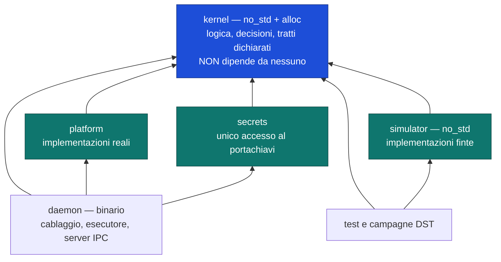
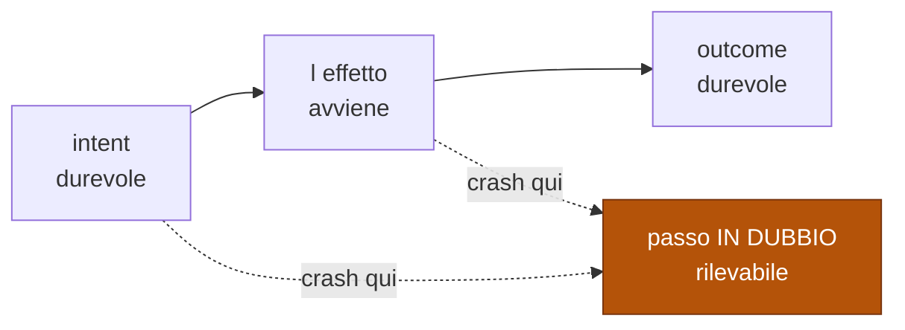

# Spec — Sotto-progetto 1: implementazione del kernel + simulatore DST

- **Data:** 2026-08-06
- **Sotto-progetto:** 1. Dipende da 0, 0b, 0c ([roadmap](../../roadmap.md))
- **Stato:** §0–§6 approvate. §7 approvata fino alla §7.3; §7.4–§7.7 e §8 da presentare.

Questa spec **non ri-decide l'architettura**: la spec del kernel dice *cosa* il sistema
fa e *perché*, e gli ADR dicono con quali alternative scartate. Qui si dice *quali crate
esistono, quali tratti hanno quali firme, quale controllo prova quale vincolo, e in che
ordine si costruisce*.

Dove mi trovassi a rimettere in discussione una scelta già in un ADR, la strada è
sbagliata — con l'eccezione delle tre decisioni della §0.5, dove qualcosa manca davvero.

## Avanzamento delle sezioni

| § | Sezione | Stato |
|---|---|---|
| 0 | Perimetro e criterio di scaglionamento | **Approvata** |
| 1 | Struttura delle crate e regole di importazione | **Approvata** |
| 2 | Il substrato iniettabile | **Approvata** |
| 3 | Il simulatore DST | **Approvata** |
| 4 | Giornale, riconciliazione e motore di persistenza | **Approvata** |
| 5 | Arbitro GPU, e la lacuna su I2 | **Approvata** |
| 6 | Gli altri meccanismi: gateway, sensori, permessi, degrado | **Approvata** |
| 7 | La porta di qualità: i controlli automatici | **§7.0–§7.3 approvate** · §7.4–§7.7 da presentare |
| 8 | Copertura V1–V37 e Q1–Q24 | da presentare |

---

## 0. Perimetro e criterio di scaglionamento

### 0.1 Cosa costruisce

| Artefatto | |
|---|---|
| **il kernel** | crate proprie, secondo i quattro vincoli di [ADR-0026](../../adr/0026-linguaggio-del-core.md) |
| **il simulatore DST** | l'infrastruttura che rende Q2, Q4 e Q5 verificabili invece che dichiarate |
| **tre ADR** | vedi §0.5 |
| **la porta di qualità** | controlli automatici, ciascuno **provato in negativo** |

Il punto di partenza è [`spikes/rust/`](../../../spikes/rust/): confine dei tipi,
esecutore deterministico su `Future` native, giornale write-ahead iniettabile, tutti con
i loro test. Sono **prove promosse a fondamenta**, non codice da riscrivere.

### 0.2 Cosa NON costruisce

Il perimetro negativo è l'artefatto più prezioso di questa sezione, come lo era nella
[§0.2 della spec del kernel](2026-08-06-kernel-design.md#02-cosa-il-kernel-non-fa).

| Non costruisce | Perché |
|---|---|
| nessuna capacità L2 | [ADR-0001](../../adr/0001-architettura-a-kernel-con-capacita-paritarie.md): prima il kernel deve esistere |
| nessuna interfaccia grafica | è il sotto-progetto 2, e [ADR-0029](../../adr/0029-guscio-della-gui.md) è ancora `Proposed` |
| nessun adattatore verso provider reali | serve una chiave, una rete e SP-4; e [ADR-0020](../../adr/0020-nessun-modello-nel-percorso-decisionale-del-kernel.md) garantisce che il kernel sia testabile **senza** chiamare un modello |
| nessun worker Python | [ADR-0028](../../adr/0028-ecosistema-dei-worker-ml.md) ne fissa il linguaggio, non ne chiede l'esistenza ora |
| nessuno spike chiuso | SP-1, SP-2, SP-3 e SP-4 richiedono modelli e GPU reali |

### 0.3 Il criterio di scaglionamento

Il sotto-progetto 1 copre L0 + L1, cioè **tutte** le §0–§10 della spec del kernel. È
molto, e comprende il pezzo che [ADR-0025](../../adr/0025-confinamento-a-livelli.md)
chiama «il più costoso del modulo di piattaforma».

Il criterio **non è «meno lavoro»**: sarebbe una scorciatoia travestita da piano. È
questo, e ha tre regole in ordine di precedenza:

| # | Regola | Esito |
|---|---|---|
| **A** | senza di esso **la DST non prova niente** | entra |
| **B** | è una proprietà **non retrofittabile** — costruirla dopo è una riscrittura, non una patch | entra |
| **C** | ha un **consumatore solo quando esiste una capacità L2** | si scaglia |

A e B vincono su C: se un pezzo ricade sia in B che in C, entra.

**Perché è falsificabile e non un'opinione.** Ogni riga della §0.4 va giustificata
nominando quale regola si applica. Un pezzo scaglionato senza una riga C esplicita è un
errore di questa sezione, non una semplificazione.

### 0.4 Ripartizione, sezione per sezione della spec del kernel

| § del kernel | Entra | Si scaglia | Regola |
|---|---|---|---|
| **§1** architettura di processo | core, ciclo di vita dei worker, **IPC lato core** | il processo `gui` | **A** — Q3 e Q4 sono DST, e senza il confine di processo non c'è nulla da simulare. Lo schema IPC è definito lato core ([ADR-0029](../../adr/0029-guscio-della-gui.md)), quindi non attende il guscio |
| **§2** arbitro GPU | tutta: ammissione, corsie, ciclo della concessione, revoca, due policy | la taratura dei profili reali (SP-1, SP-2) | **A** — Q2 e I2 sono il cuore della DST. I valori dei profili sono parametri, non impianto |
| **§3** gateway | il **decisore**: risoluzione del routing, filtro dei vincoli, catena, contabilità, record risolto | gli adattatori dei provider reali | **A** per il decisore (Q13 è una proprietà su *qualunque* catena) · **C** per gli adattatori |
| **§4** persistenza e run durevoli | giornale write-ahead, riconciliazione, classi di effetto, confini di autonomia, modello dello stato durevole | la **ricomposizione della proiezione** | **A** — Q5 è crash-injection ai confini di persistenza, ed è ciò che giustifica il simulatore · **C** per la ricomposizione: non ha consumatore finché nessuno chiama un modello |
| **§5** harness | il **contratto** del sensore e l'anello di verifica, con sensore finto | i sensori reali, il registro delle guide, l'**anello 4** | **A** — Q10 si verifica con un doppio · **C** — RK-5 dice di rivedere il contratto **dopo** il secondo sensore reale, e l'anello 4 legge ricorrenze che esistono solo quando qualcosa gira |
| **§6** permessi e confine dei dati | il **confine dei tipi**; la forma del permesso e la sua registrazione nel giornale | il mediatore completo, i preset, il ciclo di approvazione MCP, il canary | **B** — il confine dei tipi è la proprietà n. 1 non aggiungibile dopo (I6, V19, V20) · **C** — un mediatore non ha nulla da mediare finché non esistono strumenti |
| **§7** errori e degrado | tassonomia, stato di degrado osservabile, ritenzione a livelli | la proiezione trace e l'esportazione OTLP | **A** — Q18 è DST: lo stato va dichiarato *prima* del primo fallimento · **C** — l'esportazione ha per consumatore un backend esterno, ed è opt-in |
| **§8** test | tutta: è metà di questo sotto-progetto | — | **A** — è il simulatore |
| **§10** L0 fisico | il **motore di persistenza**; il *lato kernel* di segreti, confinamento e checkpoint: **dichiarare, richiedere, giornalare** | le implementazioni di piattaforma: livello 2 su Windows, cifratura reale, checkpoint su filesystem reale | **A** per il motore (senza, il giornale non esiste) · **B** per il lato kernel: V34, V35 e V37 costano poco ora e sono strutturali · **C** per la piattaforma — il livello 2 non ha nulla da confinare finché nessuna capacità esegue codice |

**La riga §10 è quella su cui voglio più attenzione in revisione**, perché è dove il
criterio è più affilato: il kernel *richiede* un livello di confinamento dal primo
giorno — quindi V35 non è rimandabile — ma *chi lo implementa* è la piattaforma, e la
piattaforma non serve finché nessuno esegue nulla. Se questa distinzione non regge,
salta lo scaglionamento più costoso di tutti.

### 0.5 Le tre decisioni che questo sotto-progetto deve prendere

Non sono ri-derivazioni: sono buchi, ciascuno già documentato come tale.

| # | Decisione | Dove nasce | Sezione che la ospita |
|---|---|---|---|
| 1 | ✅ **La GPU usata dalla GUI non è arbitrata** — [ADR-0033](../../adr/0033-gpu-della-gui-quota-di-presentazione.md): quota di presentazione sottratta, concessione tenuta dal **core** | lacuna aperta, [HANDOFF](../../HANDOFF.md) e [roadmap](../../roadmap.md): I2 è verificato solo sui worker | §5 |
| 2 | ✅ **Motore di persistenza** — [ADR-0032](../../adr/0032-motore-di-persistenza.md): `redb`, con backend nostro | [§10.6](2026-08-06-kernel-design.md#106-cosa-resta-a-un-adr-successivo): la roadmap dice che blocca **l'implementazione**. Il discriminante era il requisito 4, **I/O iniettabile**: misurato, e solo `redb` lo espone | §4 |
| 3 | **Dove vive l'esecutore delle attività concorrenti** | conseguenza del vincolo 3 di ADR-0026: la crate del kernel è `#![no_std]`, e va **misurato** se un runtime deterministico di ecosistema può starci dentro o debba stare accanto | §2 |
| 4 | ✅ **Le dipendenze del kernel sono parte del confine I3** — [ADR-0031](../../adr/0031-dipendenze-del-kernel-parte-del-confine.md) | non previsto quando la §0 è stata approvata: emerge da una **misura**, registrata in §1.4.1. `no_std` impedisce di *nominare* `std`, non di *raggiungere* l'OS attraverso una dipendenza | §1 |

Ciascuna nasce **dentro** la sezione che la richiede, non in coda: una decisione staccata
dal contesto che la motiva è la stessa cosa che ADR-0028 ha dovuto ratificare a
posteriori.

Sulla n. 3 vale la nota di metodo del piano degli spike: **si misura, non si assume.** Un
runtime che risulti incompatibile con `no_std` cambia la firma di ogni tratto del kernel;
uno compatibile renderebbe inutile la complicazione. In entrambi i casi la risposta si
scrive dopo la misura, e dove diverge dall'attesa si registra la divergenza.

### 0.6 I costi dichiarati dello scaglionamento

Un piano che elenca solo ciò che guadagna è incompleto.

| Costo | |
|---|---|
| **Il contratto del sensore resta un'ipotesi** | verificato con un doppio, su tre casi reali di cui **nessuno esiste**. È RK-5 per intero: va rivisto dopo il secondo sensore reale, e se non si adatta si spezza, non si piega |
| **Q6, Q11, Q12 e Q16 non sono verificati qui** | restano dichiarazioni fino al sotto-progetto che dà loro un consumatore. Vanno nella tabella §8 come *rimandati*, con il sotto-progetto che li chiude |
| **Q17, Q21, Q22, Q23 sono verificati solo lato kernel** | la parte di piattaforma resta **verificata ma non validata**: è RK-11, applicato alla §10 invece che al confine OS. Mitigazione di ADR-0002: schizzare *su carta* l'implementazione prima di congelare l'interfaccia |
| **Il gateway non parla con nessun provider vero** | il decisore è provato, l'integrazione no. La prima integrazione reale può scoprire che una firma è sbagliata |
| **«Rimandato» tende a diventare «dimenticato»** | mitigazione: la §8 elenca **ogni** V e **ogni** Q con il proprio stato, e `check-docs.sh` può essere esteso per controllarla — come già fa per V30 |

### 0.7 Definizione di «fatto»

Il sotto-progetto 1 è chiuso quando **tutte** queste sono vere, non quando il codice gira.

| # | Condizione |
|---|---|
| 1 | ogni V in perimetro ha un controllo che gira in automatico |
| 2 | ogni controllo statico **è stato visto fallire** su una violazione deliberata, e poi tornare verde — gotcha #14: un controllo mai visto fallire non è un controllo |
| 3 | ogni Q in perimetro è verificato col metodo che [design/08](../../design/08-strategia-di-test.md) gli assegna, non con un altro |
| 4 | ogni difetto trovato in simulazione conserva il proprio **seed** come caso di regressione permanente (V31) |
| 5 | i tre ADR della §0.5 sono scritti, ciascuno con le proprie `Negative (accettate)` |
| 6 | `roadmap.md`, `tracciabilita.md`, lo stato degli spike e `HANDOFF.md` sono aggiornati **nello stesso passaggio** |
| 7 | `bash scripts/check-docs.sh` esce verde |

---

## 1. Struttura delle crate e regole di importazione

### 1.0 Convenzione di nomenclatura

| | |
|---|---|
| **Codice** | interamente in **inglese**: nomi di crate, moduli, tipi, funzioni, commenti nel sorgente |
| **Documentazione** | in **italiano** |
| **Riferimenti al codice dentro la documentazione** | in **inglese**, con il nome esatto del sorgente |

Il costo accettato: fra la parola di un ADR («l'arbitro») e il nome nel codice (`arbiter`)
c'è una traduzione, che va tenuta a mente leggendo. Il beneficio: il codice non stona con
un ecosistema che è interamente in inglese, e non nasce un dialetto misto — che è la
condizione peggiore delle due.

### 1.1 Perché la crate è l'unità che conta

In Rust una **crate** è ciò che il compilatore compila in un colpo solo. Qui non è una
scelta organizzativa: i divieti forti — `#![forbid(unsafe_code)]`, `#![no_std]` — si
applicano **a una crate intera**, mai a un file o a una cartella. È la nota strutturale
registrata in [`RISULTATI.md`](../../../spikes/RISULTATI.md) dopo T6, ed è il vincolo 1 di
[ADR-0026](../../adr/0026-linguaggio-del-core.md).

Conseguenza: decidere quali crate esistono significa decidere **dove il compilatore ha il
potere di dire di no**. Ogni confine che non è di crate regge solo finché qualcuno si
ricorda di rispettarlo.

### 1.2 Le crate

| Crate | Libreria standard | Possiede | Cosa il compilatore le vieta |
|---|---|---|---|
| **`kernel`** | **no** — `no_std` + `alloc` | tutta la logica: arbitro, giornale, decisioni di routing, confine dei tipi, macchine a stati, e **la decisione** di quale attività far avanzare | l'OS, l'orologio, `HashMap`, `unsafe` |
| **`platform`** | sì | le implementazioni **reali** dei tratti dichiarati dal kernel: filesystem, orologio, rete, processi, confinamento livello 2 | — |
| **`secrets`** | sì | l'**unico** punto che tocca il portachiavi dell'OS | — |
| **`simulator`** | **no** — `no_std` + `alloc` | le implementazioni **finte** degli stessi tratti: orologio virtuale, RNG seminato, I/O in memoria, guasti scelti dal seed | come `kernel` |
| **`daemon`** (binario) | sì | il cablaggio: sceglie `platform` o `simulator`, avvia l'esecutore, ospita il server IPC | — |



**`kernel` non dipende da nessuna crate del progetto.** È una riga del suo manifesto, e
rende I3 verificabile guardando quella riga invece di ispezionare il codice.

Cinque crate e non meno: `secrets` è separata da `platform` perché V34 chiede che «un solo
punto legge le credenziali» sia **verificabile staticamente**, e in Rust la granularità
verificabile è la crate. Dentro `platform` sarebbe una regola fra moduli, cioè una
convenzione.

### 1.3 Perché le dipendenze vanno in quel verso

Il kernel **dichiara ciò di cui ha bisogno** e qualcun altro lo fornisce. Non va mai a
prendersi niente da solo.

È questo che rende possibile il simulatore: sostituire il fornitore sostituisce la realtà
con una finta **senza che il kernel se ne accorga**. Col verso opposto, ogni sostituzione
sarebbe una modifica al kernel, e la DST smetterebbe di essere iniettabilità per diventare
riscrittura a ogni test.

Una conseguenza da isolare qui, perché la §2 vi costruisce sopra:

| Chi | Cosa possiede |
|---|---|
| **`kernel`** | la **decisione** di quale attività concorrente far avanzare — è ciò che ADR-0026 ha comprato con lo spareggio #1 |
| **`platform`** | l'**attesa** che qualcosa sia pronto, cioè la chiamata all'OS |

Separarle è ciò che permette al simulatore di essere deterministico senza reimplementare
la logica: rende istantanea l'attesa, mentre la decisione resta quella vera.

### 1.4 Le regole, e con quale forza sono imposte

La colonna che conta è l'ultima. Gotcha #13: **un lint non è il compilatore.**

| Regola | Da | Meccanismo | Forza |
|---|---|---|---|
| il kernel non **nomina** `std` | I3, V28 | `#![no_std]` | **compilatore** — `E0433`, misurato in entrambe le direzioni |
| il kernel non **raggiunge** l'OS attraverso una dipendenza | I3, V28, [ADR-0031](../../adr/0031-dipendenze-del-kernel-parte-del-confine.md) | allow-list sul grafo **transitivo** di `kernel` e `simulator` — §1.4.1; le voci sono in §6.1.1, il meccanismo in §7 | test — **`no_std` non lo copre**, misurato. §6.8.2 aggiunge un controllo strutturale più forte, ma **non sufficiente** |
| niente `unsafe` nel kernel | ADR-0026 | `#![forbid(unsafe_code)]` | **compilatore** — `E0453`, non scavalcabile per riga |
| niente `HashMap` nominato nel kernel e nel simulatore | V29 | conseguenza gratuita di `no_std`: `HashMap` vive in `std`, non in `alloc` | **compilatore**, a costo zero — ma vale la riga 2: una dipendenza può portarne uno |
| niente `HashMap` nelle altre crate | V29 | `clippy.toml` | ⚠️ **lint** — scavalcabile con una riga |
| il kernel non ha un percorso verso il gateway per proprio conto | V28 | grafo delle crate + driver | test |
| solo `secrets` tocca il portachiavi | V34 | grafo delle crate | test |
| un solo punto di uscita verso la rete | V25 | allow-list delle crate autorizzate, **oggi vuota** | test |

#### 1.4.1 `no_std` non è tutto il confine — misurato

La riga 2 della tabella non c'era nella prima stesura di questa sezione. È stata aggiunta
dopo una misura che ha smentito un'attesa scritta prima, e la divergenza si registra
invece di allinearsi ad essa.

**Eseguito il 2026-08-06** · `rustc 1.95.0 (59807616e 2026-04-14)` · `cargo 1.95.0` ·
`madsim 0.2.34`.

| Sonda | Attesa scritta prima | Misurato |
|---|---|---|
| **controllo** — crate `no_std` che nomina `std::fs` | `E0433` | ✅ `E0433`. Il controllo è attivo, quindi le sonde seguenti non sono vacue |
| **A** — crate `no_std` che dipende da `madsim` | «fallisce: `madsim` richiede `std`» | ❌ **compila.** `Finished dev profile`, 55 crate nel grafo |
| **A3** — crate `no_std` **e** `forbid(unsafe_code)` che chiama una dipendenza la quale usa `std::fs` e `SystemTime` | — | ❌ **compila ed esegue**: legge un file dal disco e stampa l'orologio di sistema, senza mai nominare `std` |

**Causa.** `#![no_std]` toglie `std` dalla portata **dell'unità di compilazione che lo
dichiara**. Non è una proprietà transitiva del grafo: una dipendenza che usa `std`
compila normalmente, e il kernel può chiamarne le funzioni.

**Cosa questo cambia, e cosa no.**

| | |
|---|---|
| **ADR-0026 resta corretto** | afferma che una crate `no_std` rifiuta `std::fs` con `E0433`, e la misura lo riconferma |
| **Ciò che non era mai stato misurato** | che questo bastasse a garantire I3. Non basta |
| **Conseguenza** | `no_std` è **necessario e non sufficiente**. La lista delle dipendenze del kernel è l'altra metà del confine, e va governata da una regola propria, verificata e **provata in negativo** |

La regola è materia di ADR, non di questa sezione: vedi §0.5.

**Perché `simulator` è `no_std`.** Fuori dal kernel il divieto di `HashMap` è solo un lint,
e fuori dal kernel c'è il simulatore — cioè il posto in cui un ordine di iterazione non
riproducibile avvelenerebbe *ogni* traccia, manifestandosi come il gotcha #12: divergenza
inspiegabile che non compare in nessun elenco di «chiamate OS». `no_std` lo rende un errore
del compilatore anche lì.

Costo accettato: il simulatore non fa I/O per conto proprio. Leggere un archivio di seed da
disco appartiene al *runner* dei test, non al simulatore. La scelta è **condizionata a M-2**
(§1.5): se la misura dice che non regge, si torna indietro e lo si dichiara.

**Sull'ultima riga.** Una allow-list vuota passa sempre, quindi sarebbe un controllo vacuo.
Si prova in negativo mettendo deliberatamente una chiamata di rete in `daemon` e verificando
che si accenda. Aggiungere una crate alla allow-list resta un atto esplicito e rivedibile,
non uno scivolamento.

### 1.5 Tre misure prima di congelare questa sezione

Non si assumono. Se una va diversamente, il grafo cambia **prima** che vi si scriva sopra.

| # | Da misurare | Cosa cambia se va male |
|---|---|---|
| **M-1** ✅ | esiste un serializzatore usabile in `no_std` + `alloc`? | se no, lo schema IPC (I4) non può stare in `kernel` e serve una crate accanto: il grafo di §1.2 cambia. **Misurata in §6.8: esito A, il grafo non cambia** |
| **M-2** | `simulator` regge `no_std` mentre inietta guasti e registra tracce? | se no, perde il divieto gratuito su `HashMap` e resta appeso a un lint |
| **M-3** | le regole di allow-list si esprimono con la toolchain standard, e si provano in negativo? | se no, servono driver scritti a mano — è successo in Go per T6, e va messo in conto |

### 1.6 I costi di questa struttura

| Costo | |
|---|---|
| **cinque crate invece di una** | più manifesti, compilazione più lenta, e spostare codice fra crate costa più che spostarlo fra moduli |
| **`no_std` è scomodo** | niente `HashMap`, niente `std::thread`, nessuna comodità della libreria standard: ogni cosa va sostituita o fatta passare da un tratto. Si paga a ogni riga di `kernel` e di `simulator`, non una volta sola |
| **`kernel` resta una crate grande** | non si spezza: i divieti forti sono per crate, e spezzare moltiplica i posti in cui dimenticare gli attributi. Il costo è che i confini interni sono tenuti dai moduli, cioè più deboli |
| **due regole restano test, non compilatore** | V25 e V34. Un test si cancella, `no_std` no. Detto invece che sperato |

---

## 2. Il substrato iniettabile

È la sezione da cui dipende ogni firma delle successive. **Nessuna delle sue scelte poggia
su una previsione**: le tre misure che la sostengono sono in §2.6, con comandi e versioni.

### 2.0 Cosa vuol dire iniettabile

Il kernel non prende mai niente dal mondo: lo **chiede a un fornitore che gli viene
consegnato**. In produzione il fornitore è vero; in simulazione è finto e governato da un
seme. Il kernel non sa la differenza, ed è per questo che una simulazione può riprodurre un
difetto **a comando**.

V29 elenca quattro cose da consegnare: **tempo, casualità, I/O, scheduling**.

### 2.1 Tempo — due concetti distinti

| Concetto | A cosa serve | Chi lo usa |
|---|---|---|
| **monotonic** — non torna mai indietro | scadenze, finestre di validità della concessione, tempi di grazia, timeout | **le decisioni** |
| **wall time** — che ora è nel mondo | Q14, timestamp nel giornale | **solo la registrazione** |

**Nessuna decisione del kernel dipende dal wall time.** L'orologio di sistema torna indietro
— NTP, ora legale, l'utente che lo cambia — e una run che morisse per questo sarebbe un
difetto irriproducibile, cioè esattamente la classe che il sotto-progetto esiste per
eliminare.

Sono **due tipi distinti**, non due funzioni sullo stesso tipo: scambiarli non compila, con
lo stesso meccanismo che separa `Instruction` da `Untrusted`.

### 2.2 Casualità — la porta esiste, i consumatori si contano

Ogni sorgente di casualità è un punto da cui una traccia può divergere. La porta esiste;
**l'elenco di chi la consuma si scrive**, e resta corto per scelta.

| Cosa | Approccio istintivo | Scelto |
|---|---|---|
| identità di run e passi | identificatori casuali | **progressivi, assegnati dal giornale** — deterministici per costruzione, e leggibili in un trace |
| attesa fra due ritentativi | backoff con jitter | **senza jitter**: serve contro la contesa fra molti client, e qui il client è uno |

**Elenco dei consumatori nel kernel: vuoto.** Dichiararlo vuoto è un'informazione; una porta
generica «tanto poi servirà» è il contrario. La casualità serve al `simulator` — per
scegliere l'ordine e iniettare guasti — non alla logica.

### 2.3 I/O — le famiglie di porte

| Famiglia | Progettata in |
|---|---|
| `journal` — scrittura durevole ordinata, rilettura | §4 |
| `filesystem` — ambiti di checkpoint, artefatti | §4 |
| `process` — avvio e uccisione dei worker | §5 |
| `ipc` — server verso la gui | §6 |
| `network` — uscita verso i provider | dichiarata qui, implementazione scaglionata (§0.4) |
| `reactor` — «cosa è pronto», e l'attesa | §2.4 |

### 2.4 Scheduling — dove vive l'esecutore

È la **decisione n. 3** della §0.5.

| | |
|---|---|
| **L'esecutore vive in `kernel`** | sceglie col seme quale attività far avanzare |
| **`platform` implementa la porta `Reactor`** | risponde a «cosa è pronto» e compie l'**attesa** vera sull'OS |
| **`simulator` implementa la stessa porta** | «cosa è pronto» e «quanto tempo passa» li decide il **seme**: è così che il tempo diventa virtuale (C3) |
| **Nessun thread nel percorso decisionale** | `platform` può usarne quanti vuole dietro le porte; la **sequenza delle decisioni** resta una per volta |

#### 2.4.1 La regola che rende possibile il resto

Un risvegliatore su misura — il biglietto «quando è pronto, chiama me» — **non è
costruibile dentro il kernel**: richiede `unsafe`, e `#![forbid(unsafe_code)]` lo rifiuta.
Misurato, §2.6.

Quindi l'esecutore deve sapere da sé chi può avanzare, e può saperlo a una condizione:

> **Un'attività del kernel si sospende solo su una primitiva dell'esecutore o su una porta.**

La prontezza ha due sorgenti, e nessuna richiede un risvegliatore:

| Sorgente | Chi la conosce |
|---|---|
| interna — code, canali, attese fra attività del kernel | l'**esecutore**, che le possiede |
| esterna — I/O, timer, IPC, worker | la porta **`Reactor`** |

La regola è **quasi auto-imposta**: `no_std` toglie dal kernel le primitive di attesa della
libreria standard, e [ADR-0031](../../adr/0031-dipendenze-del-kernel-parte-del-confine.md)
impedisce che rientrino da una dipendenza. Resta la disciplina di non aggirarla quando
sembrerà comodo.

#### 2.4.2 Perché una decisione per volta

Non è una rinuncia al parallelismo: il lavoro pesante sta nei **worker**, che sono processi
separati (ADR-0004), e le operazioni pesanti ma di sistema stanno dietro le porte di
`platform`, che può usare thread propri.

Ciò che si guadagna è la rimozione di una classe di difetti. ADR-0004 descrive l'arbitro
come «un unico processo con **un unico lock**» — ed è la primitiva che ha fatto fallire Go
in C6. Con una decisione per volta **quel lock non esiste**: il problema è rimosso, non
gestito.

E non è la posizione di TypeScript: là il thread singolo era l'**unico** modo di essere
deterministici; qui è una scelta revocabile, perché il linguaggio il parallelismo ce l'ha.
Lo spike lo ha misurato in entrambe le direzioni: `Future` sotto esecutore proprio → **1**
traccia su 100; `std::thread` → **più di 1**. Rust non ha vinto C6 perché i suoi thread
sono deterministici — **non lo sono** — ma perché le `Future` lasciano l'ordine a noi.

**Innesco che riaprirebbe la questione:** una *decisione* del kernel — non un I/O, non una
cifratura — misurata sopra il millisecondo, che tenga fermo l'anello. Anche allora la prima
risposta sarebbe spostare quel calcolo dietro una porta; il multithread nel percorso
decisionale sarebbe un ADR che supera ADR-0021, non una modifica.

#### 2.4.3 Il beneficio di ADR-0026 che non si incassa

ADR-0026 conta fra le conseguenze positive: «esiste un runtime deterministico di ecosistema
— `madsim` — quindi il simulatore non va scritto da zero». **Con questa scelta il beneficio
non si incassa**, e il conto è misurato:

| | Con `madsim` | Con l'esecutore nostro |
|---|---|---|
| crate nel grafo di `kernel` | **55**, fra cui `getrandom` e `rand` | **0** |
| ADR-0031 | la lista nasce con 55 voci da valutare | la lista nasce **vuota** |
| chi decide l'ordine | il runtime, sostituito a compilazione | **il kernel**, sempre, anche fuori dai test |
| codice da scrivere | poco | l'esecutore — nel prototipo misurato ~40 righe |

`getrandom` è la riga decisiva: una sorgente di casualità **seminata dall'OS** dentro il
kernel, cioè il gotcha #12 in una forma che nessun elenco di «chiamate OS» mostrerebbe.

### 2.5 Come sale `spikes/rust/`

| Nello spike | Dove va | Cosa cambia |
|---|---|---|
| `Instruction` / `Untrusted` | `kernel/src/boundary.rs` | sostanza invariata; la conversione diventa **giornalata** (V19) |
| `sched.rs` · `Rng` | porta `Rng` nel kernel + implementazione seminata in `simulator` | la guardia sullo zero (gotcha #10) sale con lei |
| `sched.rs` · `World` | **non sale** | era un esecutore giocattolo: il ruolo lo prende `simulator` |
| `concorrenza.rs` · `esegui_async` | `kernel/src/executor.rs` | è il nucleo, misurato in `no_std` |
| `concorrenza.rs` · `esegui_thread` | **resta nello spike** | non è codice: è l'evidenza che C6 non è vacuo |
| `giornale.rs` | porta `Journal` nel kernel + doppio cadente in `simulator` | §4 la estende |
| `kernel_core/` | assorbito da `kernel` | era la prova di T6 |
| `tests/compile_fail/` | sale e **cresce** | ogni regola nuova porta il suo test negativo |

### 2.6 Le misure che sostengono questa sezione

Eseguite il **2026-08-06** · `rustc 1.95.0 (59807616e 2026-04-14)` · `cargo 1.95.0` ·
`madsim 0.2.34` · Windows 11. Prototipi usa-e-getta, fuori dal repository.

#### M-4 — un runtime di ecosistema è utilizzabile sotto `no_std`?

**Sì.** L'ipotesi contraria, scritta prima della misura, era falsa. Esiti e conseguenze in
§1.4.1 e in ADR-0031. Il dato che decide non è la compatibilità ma il **grafo**: 55 crate,
fra cui `tokio`, `mio`, `socket2`, `windows-sys`, `getrandom`, `rand`.

#### M-5 — un esecutore `no_std` senza `unsafe` fa avanzare `Future` reali?

**Sì, con zero dipendenze.**

| Sonda | Esito |
|---|---|
| 100 esecuzioni, seed `20260806` | **1 sola traccia distinta** |
| seme diverso | traccia diversa |
| **non-vacuità** — l'interlacciamento è reale? | **13 cambi di task su 17 transizioni**, contro **2** della controprova sequenziale |
| dipendenze della crate | **0** |
| `unsafe { }` dentro la crate | ❌ `error: usage of an unsafe block` — `forbid` è attivo, non solo dichiarato |
| costruire un `Waker` su misura | ❌ `E0133: call to unsafe function Waker::from_raw is unsafe` |

L'ultima riga **forza** la regola §2.4.1: non è una preferenza di design.

La prima versione di questa sonda usava un controllo di non-vacuità sbagliato («task0 due
volte di fila»), che capita per caso una volta su tre. Registrato perché è il gotcha #14
applicato a sé stessi: è stato corretto contando i **cambi di task**.

#### M-7 — quanto costa una decisione dell'arbitro

Aggiunta per falsificare l'affermazione «sono microsecondi», che era un ragionamento sulla
struttura e non un numero. Arbitro con budget 16 GB meno 1 GB di quota audio **sottratta**,
quattro profili (`realtime` 512 · `interactive` 2048 · `batch` 6144 · `batch` 13312 come
TRELLIS2), corsie, coda e promozione al rilascio. `no_std`, `forbid(unsafe_code)`, zero
dipendenze, `BTreeMap`.

| Coda tenuta a | `request` p99 | `release` p99 — **release** | `release` p99 — **debug** |
|---|---|---|---|
| **2** — realistico per un desktop a utente singolo | ≤ 100 ns | **500 ns** | 2,2 µs |
| 100 | ≤ 100 ns | 3,1 µs | 45,6 µs |
| 500 | ≤ 100 ns | 16,6 µs | 313 µs |
| 2000 | ≤ 100 ns | 86,6 µs | non misurato |

Tradotto nel budget che conta — **Q1, voce sotto i 600 ms** — quante decisioni devono
accodarsi dietro l'anello per mangiarne l'1 % (6 ms):

| Coda | Decisioni in fila per 6 ms |
|---|---|
| 2 | ~12 000 |
| 100 | ~1 900 |
| 500 | ~360 |
| 2000 | ~70 |

**I limiti di questa misura, dichiarati:**

| # | Limite |
|---|---|
| 1 | `request` è **sotto la risoluzione del timer** di Windows (~100 ns): il dato dice «non più di 100 ns», non quanto esattamente |
| 2 | l'implementazione ordina l'intera coda a ogni rilascio — una versione reale la terrebbe ordinata per corsia. I numeri sono quindi un **limite pessimistico** |
| 3 | è misurato **solo l'arbitro**. L'affermazione «le decisioni del kernel costano microsecondi» è più larga di ciò che è stato misurato: giornale, routing e proiezione non lo sono |
| 4 | il `max` per operazione è dominato dal rumore dello scheduler di Windows; il dato è p50/p99 |
| 5 | il primo scenario scritto **è stato buttato**: lasciava crescere la coda a diecimila invece di tenerla al valore obiettivo, e i suoi scaglioni non erano confrontabili. Registrato invece che nascosto |

### 2.7 I costi di questa sezione

| Costo | |
|---|---|
| **l'esecutore lo scriviamo noi** | e va mantenuto. È il beneficio che ADR-0026 aveva contato, e ora si sa quanto vale non incassarlo: 0 crate contro 55 |
| **un'attività si sospende solo su una porta o su una primitiva dell'esecutore** | vincola come si scrive ogni pezzo del kernel. Chi ne inventasse una terza otterrebbe un'attività che non si risveglia più — un blocco che si scopre a runtime, non a compilazione |
| **una decisione per volta** | se una decisione diventasse pesante in CPU terrebbe fermo l'anello. Difesa strutturale: il pesante sta nei worker e dietro le porte. Innesco di riapertura in §2.4.2 |
| **due concetti di tempo** | più attrito a ogni «che ora è». Mitigato dal fatto che sono due tipi: scambiarli non compila |
| **la porta di rete esiste vuota** | dichiarata qui, riempita in un sotto-progetto successivo. Il rischio di dimenticarsene sta nella tabella di copertura §8 |

---

## 3. Il simulatore DST

### 3.0 Cosa fa, a parole

Il simulatore prende il posto del mondo. Al kernel vengono consegnate le stesse porte di
sempre, ma dietro non c'è il sistema operativo: c'è un oggetto che **decide col seme** cosa
succede — chi va avanti per primo, quanto tempo passa, quando qualcosa si rompe.

Il kernel non se ne accorge. È questo che permette due cose che senza non esistono:

| | |
|---|---|
| **riprodurre** | stesso seme, stessa identica esecuzione, difetto compreso |
| **accelerare** | un'attesa di cinque secondi non si aspetta: si fa scorrere l'orologio |

### 3.1 Cosa sostituisce

Non è un elenco arbitrario: **sono esattamente le porte della §2.3**, e non esistono altri
punti in cui il mondo tocchi il kernel.

| Porta | Reale (`platform`) | Finta (`simulator`) |
|---|---|---|
| `reactor` | attende gli eventi dell'OS | fa scorrere l'orologio virtuale e sceglie i pronti col seme |
| `journal` | scrive sul motore di persistenza | scrive in memoria, e **cade** a una scrittura scelta dal seme |
| `filesystem` | disco | albero in memoria |
| `process` | avvia e uccide worker veri | worker finti, uccisi in istanti scelti dal seme |
| `network` | HTTPS verso i provider | risposte, ritardi e perdite scelti dal seme |
| `ipc` | named pipe verso la gui | client finto, che può **morire** quando il seme decide |
| `rng` | seminato all'avvio | seminato dal seme della campagna |

### 3.2 Il tempo virtuale

Regola: **l'orologio avanza solo quando nessuno può lavorare.** Finché esiste un'attività
pronta, il tempo è fermo; quando nessuna lo è, il reattore porta l'orologio alla **prima
scadenza futura**.

#### 3.2.1 La trappola, trovata sbattendoci contro

`advance()` deve considerare **solo le scadenze future**, e deve poter rispondere «non c'è
niente da avanzare».

La prima stesura prendeva il minimo di *tutte* le scadenze registrate. Le voci dei task già
conclusi restano nella mappa con un istante ormai passato: il minimo cadeva lì, l'orologio
non si muoveva, e la funzione dichiarava comunque di aver avanzato. L'esecutore girava a
vuoto per sempre.

Due conseguenze, entrambe adottate:

| | |
|---|---|
| `advance()` filtra le scadenze **strettamente future** e restituisce `false` se non ce ne sono | un avanzamento nullo non deve mai essere dichiarato riuscito |
| l'esecutore ha una **guardia sul numero di giri** | un blocco deve manifestarsi come errore, non come attesa infinita. Un test che non finisce non dice nulla |

#### 3.2.2 Perché qui si ottiene ciò che `synctest` prometteva a metà

Il tempo avanza solo a quiescenza — è la stessa nozione che la documentazione di Go
dichiara per `synctest`. La differenza è che qui l'esecutore **sceglie anche l'ordine** fra
i pronti, col seme. Quiescenza *e* ordine totale, invece di quiescenza soltanto: è
esattamente lo scarto misurato che ha chiuso ADR-0026.

### 3.3 L'iniezione dei guasti

**Si inietta un guasto dove c'è una porta**, e non ci sono altri posti. Ogni riga serve un
requisito preciso:

| Guasto | Porta | Verifica |
|---|---|---|
| caduta fra intento ed esito | `journal` | **Q5** — ripresa senza effetti rieseguiti |
| uccisione di un worker in un istante qualsiasi | `process` | **Q4** · I1 · I5 |
| morte della gui a metà run | `ipc` | **Q3** |
| perdita della rete | `network` | **Q18** — il degrado si dichiara *prima* del primo fallimento |
| interlacciamento delle richieste concorrenti | `reactor` | **Q2** — la somma delle concessioni non supera mai il budget · I2 |
| caduta durante la conservazione di un file | `filesystem` | **Q22** — l'ambito torna byte-identico |

### 3.4 Il seme come caso di regressione — e cosa **non** è

V31 dice che ogni difetto trovato in simulazione conserva il proprio seme. Adottato: il
seme entra in un elenco versionato, insieme a *cosa* ha trovato.

**Ma un seme non è un oracolo permanente, e va detto adesso.** Un seme riproduce
un'esecuzione **solo finché il codice non cambia**: modificato il kernel, lo stesso seme
esplora un cammino diverso. Quindi:

| Cosa è permanente | Cosa non lo è |
|---|---|
| la **proprietà** verificata — «la somma delle concessioni non supera mai il budget» | il **cammino** che quella volta la violò |
| il valore del seme come punto di ripartenza per indagare *oggi* | la garanzia che domani ritrovi lo stesso difetto |

Il seme serve a **debuggare**; è la proprietà a proteggere. Un elenco di semi presentato
come suite di regressione sarebbe una falsa sicurezza — la stessa classe di errore di
«cifrato a riposo» dichiarato più forte di quanto sia.

### 3.5 La campagna

| Quando | Cosa gira |
|---|---|
| a ogni commit | campagna breve: N semi sugli scenari principali |
| su ciclo lungo | campagna profonda: molti più semi, scenari più grandi |
| su difetto trovato | il seme entra nell'elenco e la **proprietà** entra nella suite |

La misura M-2 sposta questa riga in meglio rispetto a quanto
[design/08](../../design/08-strategia-di-test.md) assumeva («DST su cicli più lunghi»): una
corsa completa dello scenario minimo costa **25,8 µs**, quindi migliaia di semi stanno
dentro un secondo. La DST può girare **a ogni commit**, e i cicli lunghi servono ad andare
più a fondo, non a renderla possibile.

Con una riserva: 25,8 µs è lo scenario **minimo**. Gli scenari reali saranno più pesanti.
La misura dice che il substrato non è il collo di bottiglia — non che le campagne siano
gratis.

### 3.6 La misura — M-2

Eseguita il **2026-08-07** · `rustc 1.95.0` · `cargo 1.95.0` · Windows 11, profilo
`release`. Due crate separate, `kernel` e `simulator`, entrambe `#![no_std]` +
`#![forbid(unsafe_code)]`.

Scenario: 3 run concorrenti × 4 passi; ogni passo scrive l'intento, attende **5000 ms
virtuali** la risposta del modello, scrive l'esito.

| # | Criterio | Esito |
|---|---|---|
| **C1** | 100 corse, seme `20260806` | **1 sola traccia distinta** |
| **C2** | seme diverso | traccia diversa |
| **C3** | tempo virtuale | **20 000 ms virtuali in 25,8 µs di parete** |
| **NV** | non-vacuità: interlacciamento reale | **11 cambi di task su 23 transizioni** |
| **C7a** | nessun crash | **nessun** passo in dubbio — niente falsi positivi |
| **C7b** | crash riproducibile | **5 semi su 5**; col seme 99 i passi in dubbio sono `[3, 7]` |
| — | dipendenze esterne di `kernel` e `simulator` | **0 e 0** al momento della misura — §6.1.1 aggiunge poi `bincode` a `kernel`; quella di `simulator` **resta vuota** |
| — | sonda negativa: `std::fs` dentro `simulator` | ❌ `E0433` — `no_std` è attivo, non solo dichiarato |

**M-2 è chiusa: `simulator` regge `no_std`** con iniezione dei guasti, orologio virtuale e
doppio del giornale, a zero dipendenze.

#### 3.6.1 Due cose che la misura ha trovato e che non erano previste

| # | |
|---|---|
| 1 | **Un crash lascia _più_ passi in dubbio, non uno.** Col seme 99: `[3, 7]`. Con esecuzione interlacciata, due run possono avere entrambe l'intento scritto quando il processo cade. [ADR-0007](../../adr/0007-giornale-write-ahead-e-riconciliazione.md) diceva già «per **ogni** passo in dubbio», quindi la semantica regge — ma **l'aiutante `passo_in_dubbio` dello spike non sale così com'è**: restituiva un solo passo perché assumeva esecuzione sequenziale. Con l'interlacciamento dava un falso negativo. Sostituito da una versione che restituisce un insieme |
| 2 | **Il tempo virtuale è 20 000 ms, non 60 000.** Tre task da 4 attese di 5000 ms darebbero 60 000 ms se fossero sequenziali. Il numero misurato è la **controprova che la concorrenza è reale**, non solo il determinismo |

### 3.7 I costi

| Costo | |
|---|---|
| **il simulatore è lavoro prima di ogni valore visibile** | è RK-9, già accettato nella spec del kernel. La contropartita: senza, Q2, Q4 e Q5 restano dichiarazioni |
| **un seme non protegge domani** | §3.4. Il rischio reale è presentare l'elenco dei semi come una rete che non è |
| **la simulazione vede solo ciò che passa da una porta** | è anche la sua forza: qualunque sorgente di non determinismo nascosta si manifesta come **C1 che fallisce**, cioè tracce diverse a parità di seme. Il controllo esiste già ed è il primo |
| **la finta non è la vera** | che `platform` si comporti come `simulator` promette **non è verificato dalla DST**. Serve la quarta tecnica di [design/08](../../design/08-strategia-di-test.md), i **test di contratto**, ed è il vero punto cieco di questa sezione. La §4.6 ne chiude una parte per il giornale |

---

## 4. Giornale, riconciliazione e motore di persistenza

È la sezione che decide se le run lunghe arrivano in fondo. Porta la **seconda decisione**
della §0.5: [ADR-0032](../../adr/0032-motore-di-persistenza.md), motore `redb` con backend
nostro.

### 4.0 A parole

Il giornale è un quaderno su cui il kernel scrive **prima** di fare una cosa, e poi
**dopo** che l'ha fatta. Sembra pedante e invece è tutto: se il computer si spegne fra le
due scritture, riaccendendolo si trova una riga aperta e senza chiusura — e quella riga
dice *«questa cosa forse è successa e forse no»*.

Senza la prima scrittura quel dubbio non sarebbe **rilevabile**: la cosa sarebbe successa e
il quaderno non ne saprebbe nulla. È l'unico caso davvero cattivo, perché alla ripresa il
sistema la rifarebbe credendola mai avvenuta.

### 4.1 La porta `journal`

Il kernel dichiara cosa gli serve; chi lo fornisce sta fuori.

| Operazione | Cosa fa |
|---|---|
| `intent` | rende durevole **l'intenzione** di un passo, prima che l'effetto avvenga |
| `outcome` | rende durevole **l'esito**, dopo |
| `read_back` | rilegge alla ripresa, per la riconciliazione |
| `prune` | sostituisce un payload con impronta e dimensione (ADR-0018) |

Due implementazioni, come per ogni porta:

| Implementazione | Vive in | Sotto c'è |
|---|---|---|
| reale | `platform` | `redb` con backend su file |
| finta | `simulator` | memoria, che cade a una scrittura scelta dal seme |

### 4.2 Il protocollo write-ahead



**Nulla si esegue prima che l'intento sia durevole** (V6). Il costo è due scritture per
passo, accettato in [ADR-0007](../../adr/0007-giornale-write-ahead-e-riconciliazione.md) e
mitigato dalla granularità: un passo è *un'interazione col mondo esterno*, non più fine.

### 4.3 La riconciliazione opera su un **insieme**

Scoperta di M-2, §3.6.1: con esecuzione interlacciata, **un crash lascia più passi in dubbio
insieme**. Col seme 99 lo scenario ne lasciava due, `[3, 7]`.

[ADR-0007](../../adr/0007-giornale-write-ahead-e-riconciliazione.md) diceva già «per **ogni**
passo in dubbio», quindi la semantica del progetto reggeva. Ma:

> **L'aiutante `passo_in_dubbio` dello spike non sale così com'è.** Restituiva *un* passo
> perché assumeva esecuzione sequenziale; con l'interlacciamento dava un **falso negativo**.
> Sostituito da una versione che restituisce un insieme.

La ripresa quindi: rilegge il giornale, raccoglie **tutti** i passi con intento e senza
esito, e li riconcilia uno per uno secondo la classe del proprio effetto — `verificabile`,
`idempotente`, `irripetibile`, e non dichiarata che vale `irripetibile`.

### 4.4 Il modello dello stato durevole

Cosa il giornale contiene, oltre ai passi. È l'elenco di
[ADR-0008](../../adr/0008-contesto-come-proiezione-dello-stato.md), e la regola che lo
governa è una sola: **ciò che deve sopravvivere si scrive**.

| Elemento | Sacrificabile |
|---|---|
| obiettivo · vincoli · piano · stato dei passi | mai |
| decisioni prese, con il motivo | mai |
| fatti acquisiti, con la provenienza | mai |
| artefatti — **riferimenti**, non contenuti | mai |
| trascrizione grezza | **sì**: unica perdita ammessa |

La **ricomposizione della proiezione** non è in questo sotto-progetto (§0.4, regola C): non
ha consumatore finché nessuno chiama un modello. Il *modello dei dati* però sì, perché è la
forma del giornale e la riconciliazione lo rilegge.

### 4.5 La ritenzione, lato kernel

| Livello | Ritenzione |
|---|---|
| struttura — identità, transizioni, esiti, routing, costi, verdetti | lunga |
| payload — prompt, risposte, output degli strumenti | finestra breve, poi **potati**: impronta e dimensione |
| artefatti | riferimenti; il contenuto vive sul filesystem |

Due regole non negoziabili di [ADR-0018](../../adr/0018-ritenzione-a-livelli-del-giornale.md):
un record potato **dichiara di esserlo** — payload assente e payload mai registrato non
devono confondersi — e **un passo in dubbio non è potabile** finché non è riconciliato.

### 4.6 I due livelli di crash

È il contributo di questa sezione alla verifica, e chiude una parte del punto cieco
dichiarato in §3.7.

| Livello | Si inietta | Risponde a | Stato |
|---|---|---|---|
| **1 — alla porta** | il simulatore sostituisce l'intero giornale | *il kernel si riconcilia bene?* | ✅ provato in M-2: crash riproducibile su 5 semi, passi in dubbio rilevati, **nessun falso positivo** senza crash |
| **2 — dentro il motore** | il `StorageBackend` di `redb` cade a una scrittura o a un `sync_data` | *il motore lascia un archivio recuperabile?* | ✅ provato in M-8: 12 punti scattati, **12/12 riaperti, 12/12 coerenti** |

Sostituire la porta **non** copre il livello 2. È la ragione per cui il requisito 4 di
§10.6 esisteva, ed è ciò che ha deciso ADR-0032.

### 4.7 La misura — M-8

Eseguita il **2026-08-07** · `rustc 1.95.0` · `cargo 1.95.0` · Windows 11, profilo
`release` · `redb` 4.1.0. `StorageBackend` scritto da noi, in memoria, che fallisce a
un'operazione scelta.

| # | Requisito §10.6 | Esito |
|---|---|---|
| 1 | scrittura durevole e ordinata, confermata | ✅ dopo riapertura i record **confermati** ci sono; quello di una transazione mai confermata **no** |
| 2 | lettura concorrente mentre si scrive | ✅ un lettore aperto **prima** continua a vedere la propria istantanea (5) mentre si scrive; uno nuovo vede lo stato nuovo (10). Nessun blocco |
| 3 | potatura selettiva senza riscrivere | ⚠️ **si stabilizza**: 4 116 → 16 452 → **32 900 KiB a 4, 6 e 8 giri**. Lo spazio è riusato, ma il livello di equilibrio è ~1 ordine di grandezza sopra il dato vivo; `compact()` recupera il 14 % |
| 4 | I/O iniettabile | ✅ 24 punti provati, **12 con fallimento osservabile**; di questi **12/12 riaperti** e **12/12 in stato coerente** — o i soli record confermati, o tutti. Mai uno stato parziale |

**Due errori miei, corretti e registrati:**

| # | |
|---|---|
| 1 | la prima versione di R4 iniettava a operazioni 12, 20 e 33 che la transazione **non raggiungeva mai**: tre prove su cinque erano **vacue** e stavano per essere riportate come successo. Corretta contando prima quante operazioni compie davvero una transazione, e iniettando solo dentro quel numero |
| 2 | la prima versione di R3 guardava **un solo giro** e concludeva «lo spazio non viene riusato». Falso: serviva misurare il **regime**. A regime si stabilizza |

**Limite dell'oracolo, dichiarato:** il controllo dopo il crash conta i record, non ne
verifica il contenuto integrale. La coerenza è *dimostrata su 12 punti*, non provata
esaustivamente.

### 4.8 I costi

| Costo | |
|---|---|
| **due scritture durevoli per passo** | accettato in ADR-0007. Trascurabile per un passo che chiama un modello, **non** per passi molto piccoli: la granularità del passo è una scelta, non un caso |
| **amplificazione dello spazio** | misurata: ~33 MiB contro ~2 MiB di dato vivo nel carico sintetico. Non cresce all'infinito, ma la potatura costa spazio. **Da rimisurare sul carico reale** prima di congelare i parametri di ADR-0018 |
| **`compact()` è esclusivo** | manutenzione da pianificare, non un'operazione da fare mentre il sistema lavora |
| **la riconciliazione è lavoro di progettazione per ogni strumento** | ogni effetto va classificato, e il default `irripetibile` produrrà interruzioni evitabili finché le classi non sono dichiarate bene |
| **il livello 2 è verificato su 12 punti, non esaustivamente** | è molto meglio di zero, e resta un campione |

---

## 5. Arbitro GPU, e la lacuna su I2

È la sezione che decide se quattro pilastri possono contendersi una sola GPU senza che
nessuno vada in OOM. Porta la **prima decisione** della §0.5:
[ADR-0033](../../adr/0033-gpu-della-gui-quota-di-presentazione.md).

Non ri-progetta l'arbitro: [ADR-0005](../../adr/0005-arbitrato-gpu-su-due-dimensioni.md),
[ADR-0006](../../adr/0006-due-policy-vram-come-oggetti-distinti.md) e
[design/02](../../design/02-arbitrato-gpu.md) dicono già *cosa* fa. Qui si dice **con
quali tipi**, quale porta lo espone, e quale controllo prova quale vincolo.

### 5.0 A parole

L'arbitro è l'unico che può dire «sì, puoi toccare la GPU». Protegge due cose diverse,
con due meccanismi diversi:

| Protegge | Come | Se cede |
|---|---|---|
| la **memoria** | ammissione: o ci sta, o non parte | OOM — brutale e immediato |
| la **fluidità** | corsie: chi rallenta per chi | balbuzie, latenza che si allunga |

La prima è una capacità che si esaurisce; la seconda una contesa che degrada con
continuità. È il motivo per cui ADR-0005 le arbitra con meccanismi separati invece di
contare solo la VRAM.

### 5.1 Il modello della risorsa nel kernel

| Asse | Rappresentazione | Meccanismo |
|---|---|---|
| **VRAM** | MiB **interi**, in un tipo proprio | ammissione |
| **calcolo** | tre corsie ordinate — **non** un numero | ordinamento + segnale «riduci occupazione» |

Due scelte di rappresentazione, entrambe con un motivo:

| Scelta | Perché |
|---|---|
| MiB interi | la risorsa è quantizzata. Un intero toglie ogni domanda sull'arrotondamento, e le domande sull'arrotondamento in un percorso deterministico sono debito |
| tipo proprio, non un intero nudo | scambiare MiB con millisecondi **non deve compilare**. Stesso meccanismo che separa `Instruction` da `Untrusted` (§2.5) e il tempo monotonic dal wall time (§2.1) |

Il budget allocabile è ciò che resta dopo **due** sottrazioni, non una:

```
budget allocabile = totale − quota audio − quota presentazione
```

La seconda è nuova e viene da ADR-0033. La §5.5 la argomenta.

**Le strutture dell'arbitro sono `BTreeMap` e `Vec`.** Non è una preferenza: `HashMap`
vive in `std`, che la crate `kernel` non nomina — quindi il divieto del gotcha #12 è qui
gratuito e imposto dal compilatore (§1.4). Chiude anche **M-6**, vedi §5.8.

### 5.2 Il profilo di risorsa come tipo

I campi sono quelli di [design/02](../../design/02-arbitrato-gpu.md). Qui si aggiunge
come si esprimono.

| Campo | Tipo | Nota |
|---|---|---|
| `name` | identificatore nominato e versionato | V2: **ogni** lavoro GPU ne ha uno |
| `reserved_vram` | MiB | riserva **dichiarata** dal richiedente |
| `compute_class` | `realtime` \| `interactive` \| `batch` | la corsia |
| `preemptible` | booleano | governa se `InRevoca` è raggiungibile — §5.3 |
| `release_grace` | durata sull'asse **monotonic** | mai wall time |
| `cold_start` | durata | ⚠️ vedi sotto |

#### 5.2.1 `cold_start` non è raggiungibile dal percorso decisionale

design/02 dice di `avvio_a_freddo`: *«usato per avvisare l'utente, non per decidere»*.
È una regola scritta, quindi finora era una raccomandazione.

Si esprime invece nella struttura: `cold_start` **non sta nel profilo che l'arbitro
riceve**. Vive in un descrittore separato, che va alla proiezione di presentazione e non
alla funzione di ammissione. Una decisione che volesse leggerlo non ha come.

Costo: due strutture invece di una, e un punto in più dove tenerle allineate.

#### 5.2.2 Riserva dichiarata, picco misurato

ADR-0005: *«la riserva è dichiarata dal richiedente e verificata dall'arbitro; il picco
reale viene misurato e registrato»*. In pratica:

| | |
|---|---|
| alla concessione | si prenota `reserved_vram` |
| al rilascio | il picco osservato entra nel **giornale**, accanto al passo |
| se il picco supera la riserva | è un **difetto del profilo**, non un incidente: diventa materiale dell'anello 4 |

Il giornale è già il substrato (§4): non serve un secondo posto dove mettere le misure.
È il gotcha #7 applicato qui.

### 5.3 Il ciclo della concessione

La macchina a stati è quella di [design/02](../../design/02-arbitrato-gpu.md) e non si
ripete. Quattro punti che la traduzione in tipi aggiunge:

| # | Punto | Conseguenza |
|---|---|---|
| 1 | `Rifiutata` e `InCoda` sono **esiti distinti** (V4) | l'esito è a **tre vie**, non un «ha funzionato sì/no». Un requisito d'interfaccia diventa una firma: chi chiama è obbligato a distinguerli |
| 2 | la finestra di validità di `Concessa` vive sull'asse **monotonic** | nessuna decisione dell'arbitro legge il wall time. Un orologio che torna indietro non può scadere una concessione |
| 3 | `InRevoca` **non esiste** per i profili non prelazionabili | reso **non rappresentabile** invece che controllato a runtime: la transizione non è costruibile per un profilo con `preemptible = false` |
| 4 | `Forzata` — uccidere è sempre lecito | poggia su I1 e I5: nessun worker possiede stato. Passa dalla porta `process`, §5.6 |

#### 5.3.1 Perché i numeri di M-7 restano validi senza rimisurare

M-7 (§2.6) dichiarava fra i propri limiti: *«l'implementazione ordina l'intera coda a
ogni rilascio — una versione reale la terrebbe ordinata per corsia. I numeri sono quindi
un limite pessimistico.»*

La versione specificata qui tiene l'ordine **per corsia**, cioè è la versione più veloce
delle due. I numeri misurati restano quindi validi **come limite superiore**, e non c'è
niente da rimisurare: una misura che può solo migliorare non va rifatta per confermare
che è migliorata.

### 5.4 Le due policy come due oggetti

[ADR-0006](../../adr/0006-due-policy-vram-come-oggetti-distinti.md) resta invariato: due
oggetti con la stessa interfaccia, uno attivo per volta, determinato dal profilo di
configurazione. Ciò che la spec aggiunge:

| | |
|---|---|
| **la transizione è un passo giornalato** | ha effetti reali sul mondo — eviction, ricarica — e V6 dice che nulla si esegue prima che l'intento sia durevole. Una transizione interrotta a metà lascia un passo **in dubbio**, riconciliabile come tutti gli altri (§4.3) |
| **la policy non cambia per servire una richiesta** | design/05 lo dice già: in policy LOCALE una richiesta può finire su un provider remoto senza che la policy cambi. Il contrario non vale |

⚠️ **Una riga di ADR-0006 diventa incompleta.** La policy REMOTA dichiarava «VRAM
occupata: solo audio riservato». Con ADR-0033 sono audio **più** presentazione. ADR-0006
non è superato — la decisione delle due policy come oggetti distinti regge — e riceve un
rimando; `design/02` è aggiornato nello stesso passaggio.

### 5.5 La lacuna su I2, e come si chiude

Decisione completa, con alternative e costi:
**[ADR-0033](../../adr/0033-gpu-della-gui-quota-di-presentazione.md)**.

Il consumo GPU della GUI si modella come **tre consumatori distinti**, perché hanno
percorsi di richiesta diversi:

| # | Consumo | Governo | Corsia | Rifiuto esecutivo? |
|---|---|---|---|---|
| 1 | compositing della webview | **quota di presentazione** sottratta | fuori dalle corsie | ❌ no |
| 2 | viewer 3D **entro** la quota | stessa quota | fuori dalle corsie | ❌ no |
| 3 | viewer 3D **oltre** la quota | concessione **ordinaria**, richiesta via IPC | `interactive` | ✅ sì |

I consumatori 1 e 2 stanno fuori dalle corsie perché una corsia è un **ordinamento che
l'arbitro applica a ciò che schedula**, e il compositor non lo schedula lui.

#### 5.5.1 Perché non basta copiare la quota audio

La quota audio è sottratta **e** ha un titolare: il worker audio detiene una concessione
permanente e non prelazionabile. È il gotcha #4 — *la sottrazione non è un'esenzione*.

Ma la GUI **non può chiedere**: chi alloca è il compositor, che non ha un percorso di
richiesta. Una quota sottratta senza titolare lascerebbe I2 falso.

**Il titolare è il core.** Richiede la concessione di presentazione all'avvio, permanente
e non prelazionabile; la GUI la consuma senza mai chiederla.

| Proprietà | |
|---|---|
| coerente con **I1** | la concessione è stato del core; la GUI non tiene nulla |
| **sopravvive alla GUI uccisa in qualsiasi istante** | il titolare ha vita lunga e indipendente. Nessuna concessione perduta, e nessun protocollo di liveness contro un processo progettato per morire (G3) |
| la quota non si libera a GUI chiusa | riallocata a un render, la GUI riaperta andrebbe in OOM |

#### 5.5.2 Cosa resta non imponibile, e come si dichiara

> Verso un worker il rifiuto dell'arbitro è **esecutivo**: il processo non parte.
> Verso il compositor **non lo è**: compone lo stesso.

La quota è una **promessa di budget, non un'imposizione**. Per la GUI I2 è quindi più
debole **in natura** che per i worker, e questo non è mitigabile con la tecnica. Si
dichiara, come si dichiara che «cifrato a riposo» vale quanto l'account OS (gotcha #6).

Cosa resta, e ha valore:

| # | |
|---|---|
| 1 | quella VRAM **non si alloca a nessun altro** |
| 2 | il picco reale si misura e si registra, con il meccanismo di §5.2.2 |
| 3 | il rischio residuo è dichiarato invece che scoperto |

#### 5.5.3 Il valore della quota è non misurato

Non esiste un numero misurato per la VRAM del compositing né per una scena three.js.
Inventarlo violerebbe il metodo. Vale il precedente di
[ADR-0010](../../adr/0010-budget-della-proiezione-invece-di-soglia-di-riempimento.md) con
SP-3: **default conservativo, dichiarato come non misurato**.

La misura è **M5** (§5.8), agganciata a M1–M4 di
[ADR-0029](../../adr/0029-guscio-della-gui.md).

#### 5.5.4 Cosa questa sezione esporta verso ADR-0029

ADR-0033 **non importa nulla dal guscio**: il meccanismo è identico su Tauri e su
Electron, come la lacuna prometteva. Esporta però un discriminante che ADR-0029 non
aveva: **quanto la quota sia governabile dipende da chi possiede il motore di
rendering** — impacchettato dal guscio, o quello di sistema.

È la prima volta che il kernel vincola la scelta del guscio invece del contrario, e per
questo la §5 **non è bloccata** da ADR-0029: la dipendenza va nell'altro verso.

### 5.6 La porta `process`, e I2 imposto dal compilatore

**A parole.** Oggi «nessun worker si avvia senza concessione» è una frase in un
documento, verificata da un test. Un test si può cancellare, e chi lo cancella non
incontra nessun ostacolo.

La porta `process` — dichiarata in §2.3 e progettata qui — **prende una concessione come
argomento** della funzione che avvia un worker. Una concessione può essere emessa solo
dall'arbitro. Chi scrive «avvia il worker» senza averne una **non compila**.

| | Prima | Dopo |
|---|---|---|
| forza di I2 sui worker | test | **compilatore** |
| vie di aggiramento | disciplina | nessuna: `process` è l'unica porta verso i processi (§2.3), e il kernel non raggiunge l'OS per altra via — `no_std` più [ADR-0031](../../adr/0031-dipendenze-del-kernel-parte-del-confine.md) |

Il ragionamento sulla chiusura è lo stesso di §2.4.1: **non è la disciplina a reggere il
vincolo, è l'assenza di alternative.** Il kernel non ha un secondo modo di avviare un
processo perché non ha un modo di parlare con l'OS.

Costo, dichiarato: la firma diventa rigida, e spostare codice che avvia worker costa più
di prima. È lo stesso genere di costo della riga 2 di §1.6, e si paga per lo stesso
motivo.

### 5.7 Cosa la DST verifica qui

| Proprietà | Porta dove si inietta | Requisito |
|---|---|---|
| la somma delle concessioni non supera **mai** il budget allocabile | `reactor` — interlacciamento delle richieste concorrenti | **Q2** · I2 |
| nessun processo è `Attiva` senza concessione valida | `process` — kill in istanti arbitrari | **I2** · Q4 |
| **la GUI muore tenendo una concessione discrezionale** → la somma torna alla linea di base | `ipc` | **Q3**, esteso |
| una transizione di policy interrotta lascia un passo riconciliabile | `journal` | Q5 · V6 |
| una concessione scaduta non resta allocata | `reactor` — avanzamento dell'orologio virtuale | V1 |

#### 5.7.1 La non-vacuità, che qui è obbligatoria

Gotcha #14: **un controllo che non si è visto fallire non è un controllo.** Per la
proprietà principale — la somma non supera il budget — la sonda negativa è esplicita:

| Passo | Atteso |
|---|---|
| si rompe deliberatamente l'ammissione, concedendo oltre il budget | la campagna DST **fallisce**, e nomina il seme |
| si ripristina | torna verde |

Senza questo passo, «Q2 verificato» significa solo che la campagna è girata.

⚠️ E vale il gotcha #17 nella sua forma esatta: **iniettare un kill dove il codice non
arriva è una prova vacua che sembra un successo.** Per lo scenario della GUI che muore
tenendo una concessione, si conta prima quante operazioni compie davvero quel percorso,
si inietta dentro quel numero, e si **verifica che il guasto sia scattato** — non solo
che il test sia passato.

### 5.8 Le misure

| # | Domanda | Stato |
|---|---|---|
| **M-7** | quanto costa una decisione dell'arbitro | ✅ **già eseguita** — §2.6, con i cinque limiti dichiarati. **Non si rifà** |
| **M-6** | `BTreeMap`/`Vec` bastano alle strutture del kernel | ✅ **chiusa qui** — vedi sotto |
| **M5** | quanta VRAM prende la presentazione | ⬜ **non misurata, e dichiarata tale** |

#### 5.8.1 M-6 è chiusa dall'esistenza di M-7

Il prototipo di M-7 è una crate `#![no_std]` + `#![forbid(unsafe_code)]`, **zero
dipendenze**, con arbitro a quattro profili, corsie, coda e promozione al rilascio,
costruito interamente su `BTreeMap`. L'arbitro è la struttura dati più complessa che il
kernel abbia finora.

**M-6 è quindi già risposta per l'arbitro**, e non richiede una misura propria. Resta
aperta solo per le strutture che introdurrà la §6.

#### 5.8.2 M5 — quota di presentazione

| | |
|---|---|
| **Domanda** | quanta VRAM prendono compositing e viewer 3D, a riposo e sotto carico |
| **Metodo** | frontend Vue minimo con scena 3D, **sui due gusci** — è lo stesso allestimento che M1–M4 di ADR-0029 richiedono già |
| **Quando** | inizio del sotto-progetto 2. Non prima: richiede una GUI, che qui non esiste |
| **Output** | il valore della quota, **e** un discriminante per ADR-0029 |
| **Soglia** | se quota audio + quota presentazione non lasciano spazio a TRELLIS2 al profilo minimo accettabile → scatta **RK-1**, in una forma più severa di quella prevista: la mutua esclusività non è fra un LLM caldo e un render, ma **fra l'interfaccia e un render** |

#### 5.8.3 Cosa deliberatamente non si misura

| Non misurato | Perché |
|---|---|
| il comportamento dell'arbitro con **due** quote sottratte invece di una | M-7 ne aveva già una. La seconda è **aritmetica sul budget iniziale**, non una scoperta: una misura che non può fallire non è una misura. È il gotcha #17 nella forma «prova vacua che sembra un successo» |
| la taratura dei profili di risorsa reali | è SP-1 e SP-2, esplicitamente scaglionata dalla §0.4. I valori sono parametri, non impianto |
| il costo di disattivare l'accelerazione GPU della webview | è l'**ipotesi E** di ADR-0033, e resta un'ipotesi finché M5 non dice se serve |

### 5.9 I costi di questa sezione

| Costo | |
|---|---|
| **per la GUI, I2 è più debole in natura** | il rifiuto verso il compositor non è esecutivo. Non mitigabile con la tecnica: si dichiara |
| **VRAM sprecata a GUI chiusa** | identico al costo già accettato per la quota audio, e con la stessa mitigazione: un profilo senza interfaccia porta la quota a zero |
| **RK-1 si stringe di una quantità ignota** | la sua soglia era scritta su un budget che non contava la GUI. Di quanto lo dirà M5, ed è l'innesco osservabile del rischio |
| **il consumatore 3 è lavoro reale** | concessione revocabile verso un processo che può morire in qualsiasi istante: riconciliazione sulla disconnessione IPC, più uno scenario DST |
| **due strutture per il profilo invece di una** | il prezzo di rendere `cold_start` irraggiungibile dal percorso decisionale (§5.2.1) |
| **la contesa di calcolo resta indiretta** | ADR-0005 lo dichiarava già: far ridurre l'occupazione ai `batch` non è una garanzia forte. Questa sezione non lo migliora, e SP-2 resta la sua verifica |

---

## 6. Gli altri meccanismi: gateway, sensori, permessi, degrado

Chiude i meccanismi rimasti, ciascuno **al minimo che la §0.4 gli assegna**: quasi tutto
il resto è già scaglionato. Porta la misura **M-1**, che la bloccava.

### 6.0 A parole

Restano quattro macchine, più una. Questa sezione dice come sono fatte **le parti che
entrano ora**, non le macchine intere:

| Macchina | Cosa fa |
|---|---|
| l'**IPC** | come la finestra dell'app parla col programma di sfondo |
| il **gateway** | decide a quale modello mandare una richiesta, e con quali vincoli |
| i **sensori** | controllano la qualità di ciò che è tornato |
| i **permessi** | chi può fare cosa, e su quale risorsa esattamente |
| il **degrado** | dice cosa è rotto **prima** che tu ci sbatta contro |

### 6.1 La porta `ipc` e lo schema

#### 6.1.1 Dove vive lo schema — l'esito di M-1

M-1 chiude con l'esito **A** (§6.8): esiste un serializzatore il cui grafo transitivo è
accettabile, quindi **lo schema IPC vive in `kernel`** e il grafo di §1.2 non cambia.

La lista di [ADR-0031](../../adr/0031-dipendenze-del-kernel-parte-del-confine.md) smette
di essere vuota.

| Crate vincolata | Voci **proprie** | Grafo **transitivo** ammesso |
|---|---|---|
| **`kernel`** | `bincode` 2.0.1 · `unty` 0.0.4 | le stesse |
| **`simulator`** | **nessuna** — non serializza nulla | ⚠️ **quello di `kernel`**, perché vi dipende |

> 📄 **La lista completa vive in §7.3.1**, ed è la sede unica. Quella qui sopra elenca le
> voci **spedite** — quelle che entrano nel prodotto — con la giustificazione che le lega
> allo schema IPC. La §7.3.1 vi aggiunge la colonna **classe** e le voci che girano soltanto
> a tempo di compilazione, che nascono dal meccanismo di verifica e non da questa decisione.

⚠️ **La riga di `simulator` è stata corretta da M-3.** La prima stesura diceva «la lista
resta vuota», che confonde due cose: `simulator` **non aggiunge voci proprie**, ma il suo
**grafo transitivo** non è vuoto — contiene `kernel` e quindi `bincode`. La regola di
ADR-0031 è sul grafo transitivo, quindi la lista di `simulator` deve nominarle. Misurato:
`cargo tree -p simulator` restituisce `bincode kernel unty`.

Giustificazione scritta, come la regola 1 di ADR-0031 richiede:

| Voce | Perché serve | Cosa raggiunge |
|---|---|---|
| `bincode` | serializza lo schema IPC (I4). L'alternativa era tipi speculari in `daemon` con uno strato di conversione da tenere allineato | **nulla**: compila per un bersaglio senza OS, e nel grafo non compare nessuna sorgente di casualità |
| `unty` | dipendenza di `bincode`: controllo di tipo alla decodifica | idem |

⚠️ **Il manifesto deve appuntare `2`.** `cargo add bincode` risolve alla **3.0.0**, che è
un segnaposto il cui intero sorgente è `compile_error!`. Vedi §6.8.2 e il gotcha #22.

#### 6.1.2 Il timbro di build — come si rifiuta una GUI stantia senza versionare

[I4](../../adr/0004-topologia-di-processo.md) impone che il protocollo sia **non
versionato**. Ma `core` e `gui` sono due binari, e una GUI vecchia può connettersi a un
core nuovo: parlerebbero due lingue leggermente diverse, e nessuno se ne accorgerebbe —
non fallirebbe, si comporterebbe in modo strano.

La distinzione che scioglie il nodo:

| | Cosa comporta | Ammesso da I4? |
|---|---|---|
| **versionare** | negoziazione, matrice di compatibilità, versioni vecchie da mantenere per sempre | ⛔ **no** |
| **timbro di build** | un solo valore accettato. Diverso → la GUI **non parte** e lo dichiara | ✅ **sì**: non è un contratto, è un'identità |

Non è una deroga a I4: è l'unico modo di **non** versionare senza che il protocollo
diverga in silenzio. Ed è la stessa postura di
[ADR-0012](../../adr/0012-equivalenza-del-fallback-e-fallimento-chiuso.md) e
[ADR-0025](../../adr/0025-confinamento-a-livelli.md): meglio rifiutare che funzionare a
metà.

#### 6.1.3 Gli identificativi sono progressivi, non generati

§2.2 dichiara che l'elenco dei consumatori di casualità nel kernel è **vuoto**, e lo
dichiara vuoto apposta.

Lo schema IPC porta identificativi di run e di passo. L'istinto diffuso è generarli
casualmente. Farlo riaprirebbe quella porta **alla prima riga di schema**, e non
comparirebbe in nessun elenco di «chiamate OS» — è il gotcha #12 nella sua forma più
insidiosa.

> **Gli identificativi nello schema IPC sono i progressivi del giornale.** Esistono già
> (§2.2), sono deterministici per costruzione, e sono leggibili in un trace.

#### 6.1.4 Cosa la porta deve permettere dopo, senza costruirlo ora

[ADR-0027](../../adr/0027-stack-della-gui.md) lascia un follow-up esplicito: se P3 con
rendering vero superasse il 25 %, *«la leva non è la GUI ma la frequenza di aggiornamento
decisa dal core: aggregare o campionare è una scelta di kernel.»*

Non si costruisce ora — sarebbe YAGNI. Ma la forma della porta **non deve precluderlo**:
il core decide *quando* emettere, la GUI non tira. È già così per costruzione (design/01:
il core comanda), e va scritto perché non venga eroso.

P1 è passato con margine — 2000 messaggi, zero persi, zero buchi — quindi **non serve un
ADR sulla contropressione**, come ADR-0027 aveva già stabilito.

### 6.2 Il decisore del gateway

Entra il **decisore**; gli adattatori dei provider reali sono scaglionati (§0.4, regola C).

| Entra | Da |
|---|---|
| risoluzione del routing e catena di candidati ordinata | ADR-0011 |
| filtro dei vincoli, con le due classi | ADR-0012 |
| record di routing **risolto**, giornalato col passo | ADR-0011 |
| contabilità gerarchica: token e costo attribuiti al passo | ADR-0011 |
| il rifiuto dell'arbitro come **causa di fallback di prima classe** | ADR-0012 · V1 |
| schema non conforme = **verdetto di sensore**, non eccezione | ADR-0013 |

Due confini che il gateway deve tenere, e che si prestano a essere confusi (design/05):

| Domanda | Discriminante |
|---|---|
| ritentativo o passo nuovo? | **il modello ha prodotto output?** No → stesso passo. Sì ma respinto da un sensore → passo nuovo: quell'output esiste, è stato pagato, e l'anello 4 deve vederlo |
| policy VRAM o destinazione? | la policy dice **cosa risiede in memoria**; il routing dice dove va *questa* richiesta. In policy LOCALE una richiesta può finire su un provider remoto senza che la policy cambi |

**Il decisore è verificabile senza chiamare un modello** ([ADR-0020](../../adr/0020-nessun-modello-nel-percorso-decisionale-del-kernel.md)):
è ciò che lo rende testabile qui, dove nessun provider esiste ancora.

### 6.3 Q13 come proprietà — e il gettone non falsificabile

#### 6.3.1 Il dispositivo, nominato una volta

C'è una differenza fra due modi di garantire una regola:

| | Cosa succede se qualcuno sbaglia |
|---|---|
| «controlliamo che X prima di fare Y» | il controllo si dimentica, si cancella, o un percorso nuovo lo scavalca |
| «**Y non è scrivibile** se X non è vero» | non compila |

È la differenza fra scrivere «non entrare senza biglietto» sulla porta e installare un
**tornello**. Il progetto lo sta già usando tre volte, e conviene chiamarlo con un nome
invece di riscoprirlo ogni volta:

| Per fare questo… | …va consegnato questo | emesso solo da |
|---|---|---|
| avviare un worker | una **concessione** | l'arbitro (§5.6) |
| mettere testo nel canale delle istruzioni | un `Instruction` | la conversione dichiarata (§6.5) |
| **eseguire una richiesta** | una **prova di conformità** | il filtro dei vincoli |

La terza riga è nuova, ed è ciò che rende **Q13** — *«nessun candidato non conforme viene
mai eseguito, per qualunque catena»* — una proprietà invece di un controllo: un candidato
non filtrato non ha il gettone, quindi non è **esprimibile** come argomento di
un'esecuzione.

#### 6.3.2 Il limite del dispositivo, dichiarato

> **Un gettone prova la provenienza, non la correttezza.**

Se il filtro dei vincoli ha un difetto, emette gettoni sbagliati e il compilatore non se
ne accorge: ha verificato che il filtro sia *passato*, non che abbia *ragione*.

La logica del filtro resta quindi materia di test e di DST. Il dispositivo elimina una
classe di errori — «ci siamo dimenticati di filtrare» — non due.

### 6.4 Il contratto del sensore, e il sensore finto

Contratto da [ADR-0009](../../adr/0009-guide-sensori-e-anelli-sono-meccanismi-di-kernel.md),
deliberatamente povero: `(artefatto) → (verdetto, dettaglio, costo)`.

#### 6.4.1 «Costo» sono due cose, e vanno separate

V11 dice: *«ogni sensore dichiara il proprio costo; gli inferenziali restano fuori
dall'anello stretto.»* Ma un costo **restituito** arriva dopo l'esecuzione: troppo tardi
per decidere se eseguire.

| | Dove sta | A cosa serve |
|---|---|---|
| costo **dichiarato** | nel registro, statico | decide se il sensore entra nell'anello stretto — **è V11** |
| costo **speso** | nel verdetto, misurato | entra nel giornale, alimenta l'anello 4 |

È il prezzo sul menù contro il conto: serve quello sul menù per decidere se ordinare.
Non è un ADR nuovo — è un'ambiguità che, non sciolta, rende V11 non implementabile.

#### 6.4.2 Il sensore finto, e cosa prova davvero

Q10 — *«un verdetto negativo rientra nell'anello con il feedback, senza intervento
umano»* — si verifica con un **doppio** che restituisce un verdetto scelto dal test.

Cosa questo prova e cosa no:

| Prova | Non prova |
|---|---|
| che l'**anello** raccoglie il verdetto, apre un passo nuovo (V14) e vi porta il dettaglio | che il **contratto** regga sensori reali |

Il secondo è **RK-5**, già accettato: il contratto va rivisto dopo il secondo sensore
reale in aree diverse, e se non si adatta **si spezza, non si piega**. È il costo
dichiarato in §0.6.

**Un sensore non modifica nulla** (V10): riceve l'artefatto per riferimento immutabile e
restituisce un verdetto. Correggere è compito dell'anello 1.

### 6.5 Il confine dei tipi

§2.5 ha già deciso la destinazione: `Instruction` / `Untrusted` salgono in
`kernel/src/boundary.rs`, sostanza invariata, con **la conversione che diventa
giornalata** (V19).

Quest'ultima ha una conseguenza concreta sulla firma:

> Se la conversione è giornalata, **la funzione di conversione riceve la porta
> `journal`**. Non è una funzione libera: non si può promuovere contenuto non fidato
> senza che qualcuno registri che è successo.

È il gettone di §6.3 applicato al confine: la registrazione non è una cortesia del
chiamante, è un argomento obbligatorio.

Q9 resta un **test di compilazione fallita** (design/08), e la suite `tests/compile_fail/`
cresce con ogni regola nuova (§2.5).

### 6.6 Il permesso come tripla

Entra la **forma** e la sua registrazione; il mediatore completo, i preset, il ciclo di
approvazione MCP e il canary sono scaglionati (§0.4, regola C: non c'è niente da mediare
finché non esistono strumenti).

| | |
|---|---|
| forma | `(strumento × risorsa × operazione)` — mai «lo strumento» |
| estensione | vale per la tripla concessa e per la **sessione corrente** (V21) |
| registrazione | un permesso concesso è un **fatto giornalato** |

Da quest'ultima riga discende una cosa che altrimenti costerebbe un sottosistema: «quali
permessi sono attivi ora» è una **proiezione del giornale**, non un secondo archivio. È
il gotcha #7 applicato ai permessi.

### 6.7 Lo stato di degrado come oggetto derivato

[ADR-0019](../../adr/0019-lo-stato-di-degrado-e-un-oggetto-osservabile.md): il core
mantiene uno stato di degrado corrente, alimentato dagli eventi, **derivato e
ricalcolabile, mai autorevole di per sé**.

| Ingresso | Da |
|---|---|
| connettività | §7 |
| **arbitro GPU** — inclusa la revoca della concessione discrezionale della GUI | §5 · ADR-0033 |
| salute dei provider | §6.2 |
| permessi, strumenti sospesi | §6.6 |

La riga dell'arbitro è nuova rispetto ad ADR-0019: la §5 ha aggiunto un consumatore
revocabile, e «il viewer 3D è in pausa durante un render» è **esattamente** una
condizione che cambia cosa l'utente può fare — quindi si dichiara (V27).

Il criterio di selezione resta quello di §7.5 della spec del kernel: si mostra ciò che
**cambia cosa l'utente può fare**, non ogni variazione interna. Un'interfaccia che
segnala tutto è indistinguibile da una che non segnala nulla.

### 6.8 La misura — M-1

Eseguita il **2026-08-07** · `rustc 1.95.0 (59807616e 2026-04-14)` · `cargo 1.95.0` ·
Windows 11. Prototipi usa-e-getta, fuori dal repository.

**La domanda, nella forma che ADR-0031 le impone:** non «esiste un serializzatore
`no_std`?» ma **«esiste un serializzatore il cui grafo transitivo sia accettabile?»**

Cinque candidati, ciascuno in una crate sonda `#![no_std]` + `alloc` +
`#![forbid(unsafe_code)]`, pilotata da un driver `std` — la stessa forma di `kernel`
guidato da `daemon`. Schema di prova: un messaggio con enum annidati, `String`, `Vec`,
`Option` e interi.

| Candidato | crate di **runtime** | totale | round-trip | bersaglio **senza OS** | casualità nel grafo |
|---|---|---|---|---|---|
| `minicbor` 2.3.0 | **1** | 6 | ✅ 68 B | ✅ | 0 |
| **`bincode` 2.0.1** | **2** | 4 | ✅ 62 B | ✅ | 0 |
| `postcard` 1.1.3 | 5 | 11 | ✅ 60 B | ✅ | 0 |
| `serde_json` 1.0.151 | 6 | 11 | ✅ 141 B | ✅ | 0 |
| `rkyv` 0.8.18 | 8 | 17 | ✅ 96 B | ✅ | 0 |

**Esito: A.** Tutti e cinque passano i criteri di ADR-0031. Lo schema IPC può stare in
`kernel`, e il grafo di §1.2 non cambia. L'esito **B** — tipi in `kernel` e
serializzazione in `daemon` — non è stato necessario.

**Scelto `bincode`**, con la giustificazione di §6.1.1. Le due alternative respinte e
perché:

| Respinto | Motivo |
|---|---|
| `minicbor` | grafo più piccolo di tutti, ma impone `#[n(0)]`, `#[n(1)]`… **su ogni campo di ogni messaggio** — indici che servono all'evoluzione dello schema, cioè a un beneficio **che I4 rinuncia esplicitamente**. Costo permanente per un vantaggio che non vogliamo |
| `postcard` | porta `serde`, che è ciò che leggono i generatori di tipi TypeScript — la mitigazione che ADR-0027 nomina per lo schema speculare della GUI. Ma quella generazione **oggi non è decisa**: tre crate in più per un'opzione ipotetica è YAGNI. Se un giorno si decidesse, è il momento di rivalutare |

#### 6.8.1 Le cinque sonde di non-vacuità

Gotcha #14: un controllo mai visto fallire non è un controllo. Ogni affermazione della
tabella poggia su una sonda **vista fallire**.

| Sonda | Esito |
|---|---|
| `std::fs` dentro la crate sonda | ✅ `E0433` — il `no_std` è **in vigore**, non solo dichiarato |
| `unsafe {}` dentro la crate sonda | ✅ `error: usage of an unsafe block` |
| crate `no_std` + `forbid` che raggiunge l'OS **via dipendenza** | ✅ **compila per l'host** — il gotcha #16 riprodotto in modo indipendente |
| la stessa, compilata per il bersaglio **senza OS** | ✅ **non compila** |
| il grep sulla casualità, applicato a quella crate | ✅ **1 riscontro** — quindi gli zeri della tabella sono zeri veri |

Senza la quinta riga, «casualità = 0» avrebbe potuto significare soltanto che il grep era
scritto male.

#### 6.8.2 Due scoperte che valgono oltre M-1

**1 — `cargo add bincode` risolve a una versione che non compile per costruzione.**

La 3.0.0 è l'ultima versione pubblicata, e il suo intero sorgente è
`compile_error!("https://xkcd.com/2347/")`: un segnaposto contro l'occupazione del nome.
È la stessa classe della riga su `sled` in
[ADR-0032](../../adr/0032-motore-di-persistenza.md), ma peggiore — lì la versione utile
era semplicemente più vecchia, qui **la versione più recente esiste ed è inutilizzabile**.
Diventa il **gotcha #22**: verificare che una versione esista non è verificare che
funzioni.

**2 — compilare per un bersaglio senza OS è un controllo strutturale di «raggiunge l'OS».**

Bersaglio usato: **`thumbv7em-none-eabihf`** — `core` + `alloc`, nessun `std`, nessun
sistema operativo sotto. `rustup target add`, poi `cargo build --target`.

È più forte di una allow-list per nome: non enumera le crate, le **prova**. E l'ho visto
respingere esattamente il caso che `no_std` da solo lascia passare — la sonda 4 di sopra,
dove `getrandom` fallisce con `target is not supported`.

⚠️ **Non sostituisce la allow-list, e va detto.** L'unificazione delle feature di cargo
può abilitare, nella build reale per Windows, feature che sul bersaglio bare-metal
restavano spente. È una **condizione necessaria forte, non sufficiente**. Riguarda
direttamente **M-3** (§7).

**3 — ADR-0031 dice «grafo transitivo» senza distinguere runtime da tempo di
compilazione**, e lo scarto misurato è grande: `minicbor` ha 1 crate di runtime e 6 in
totale. Un proc-macro gira sull'host durante la build e non può violare V29 a runtime, ma
**è superficie di supply chain**. La §7 deve decidere quale dei due il controllo misura;
qui si registra che sono due numeri diversi, non uno.

#### 6.8.3 Le divergenze dalle attese scritte prima

Quattro ipotesi su sei sono divergute. Registrate invece che allineate.

| Attesa | Misurato |
|---|---|
| «`bincode` 2.x con `default-features = false`» | ❌ **doppiamente falsa**: `cargo add` dà la 3.0.0, e quella non ha **nessuna feature** né compila |
| «`serde_json` porta `ryu`/`itoa`» | ⚠️ `itoa` sì; `ryu` è stato sostituito da **`zmij`** |
| «`postcard`: `serde` + `cobs`» | ⚠️ anche `serde_core` e `thiserror` |
| «`rkyv` ha molto `unsafe`» | ⚠️ vero, ma la conseguenza è un'altra: **la via sicura di deserializzazione richiede la feature `bytecheck`**. Senza, l'unica via è `unsafe`, che `forbid` rifiuta — cioè il candidato sarebbe stato **inutilizzabile**, non solo scomodo |

### 6.9 I costi di questa sezione

| Costo | |
|---|---|
| **la lista di ADR-0031 non è più vuota** | da qui in poi ogni aggiornamento di `bincode` è un evento da rivedere, non un'operazione automatica. È il costo che l'ADR aveva dichiarato, e ora si paga |
| **il manifesto va appuntato a `2`** | e la ragione va scritta accanto, o il prossimo aggiornamento la ripristina «sistemando» il vincolo |
| **il timbro di build va tenuto allineato** | due binari devono portarlo. Un passo di build in più, e se qualcuno lo dimentica il rifiuto scatta quando non deve |
| **il contratto del sensore resta un'ipotesi** | verificato con un doppio, su tre casi reali di cui **nessuno esiste**. RK-5 per intero |
| **il gettone prova la provenienza, non la correttezza** | §6.3.2. Elimina una classe di errori, non due |
| **il decisore non parla con nessun provider vero** | la prima integrazione reale può scoprire che una firma è sbagliata. Costo già dichiarato in §0.6 |

---

## 7. La porta di qualità: i controlli automatici

Le §0–§6 hanno deciso **cosa** il sistema garantisce. Questa sezione dice **chi lo verifica
al posto nostro, e con quale forza**. Non aggiunge regole: ogni voce difende una regola già
presa.

### 7.0 A parole

Un vincolo scritto in un documento è un'intenzione. Diventa una garanzia quando esiste un
meccanismo che **fa fallire da solo** chi lo viola, e quando quel meccanismo è stato **visto
fallire**.

I meccanismi però non hanno tutti la stessa forza, e presentarli come «controlli»
indistinti è il modo più semplice di mentire con autorevolezza — la stessa classe di errore
di «cifrato a riposo» dichiarato più forte di quanto sia (gotcha #6). La domanda che li
separa è una sola:

> **Se qualcuno cancella il controllo, la regola resta?**

### 7.1 Il criterio di ammissione

#### 7.1.1 Le tre regole per entrare

| # | Regola | Se manca |
|---|---|---|
| 1 | difende un **V** o un'**I** nominato | è un'abitudine, non un controllo: va tolta |
| 2 | **si è visto scattare** su una violazione deliberata | gotcha #14 — un controllo mai visto fallire non è un controllo |
| 3 | **si è visto restare verde** dove la cosa è lecita | gotcha #24 — un controllo che scatta dove non deve insegna a ignorare l'audit |

La terza è quella che si dimentica. È la ragione per cui in M-3 la sonda decisiva è stata
**N4** e non N1.

#### 7.1.2 La scala di forza, e ogni controllo dichiara la propria

| Livello | Meccanismo | Se cancelli il controllo | Se lo aggiri |
|---|---|---|---|
| **1 — compilatore** | `no_std` · `forbid(unsafe_code)` · una firma che pretende un gettone | **la regola resta**: la violazione continua a non compilare | non si può — `E0453` rifiuta anche un `#[allow]` locale |
| **2 — controllo esterno** | allow-list sul grafo · cancello senza OS · grafo delle crate | **la regola sparisce**: sotto non c'è nient'altro | si cancella il controllo |
| **3 — lint** | `clippy.toml` | la regola sparisce | **una riga di permesso**, senza cancellare niente |

Il livello non è una qualità del controllo: è una **proprietà dichiarata accanto ad esso**.
[ADR-0031](../../adr/0031-dipendenze-del-kernel-parte-del-confine.md) lo fa già per la
propria regola — *«è un controllo, non il compilatore […] va detto invece che sperato»*.
Questa sezione lo generalizza: **ogni voce del catalogo porta il proprio livello**.

#### 7.1.3 Il test di compilazione fallita è di livello 1, e va detto

Distinzione controintuitiva, e per questo isolata qui.

Quando la regola è del compilatore, il test che l'accompagna **non regge la regola**: la
*dimostra*. Cancellarlo non riapre la violazione — la rende invisibile.

| Se cancelli… | La violazione torna possibile? | Cosa si perde |
|---|---|---|
| un test di compilazione fallita | ❌ **no** | la **visibilità** della regola |
| il controllo della allow-list | ✅ **sì** | la **regola** |

Conseguenza: i test di compilazione fallita entrano nel catalogo con **forza di livello 1 e
visibilità di livello 2**. Senza l'etichetta doppia si sopravvaluta ciò che si perde
cancellandoli, e si sottovaluta ciò che si perde cancellando gli altri.

#### 7.1.4 Come si esclude che un test negativo fallisca per il motivo sbagliato

Il gotcha #9 nasce in Go: un test che verifica «questo non compila» passa **anche quando la
compilazione fallisce per un'altra ragione**. È un falso positivo travestito da successo.

In Rust il meccanismo lo esclude per costruzione: `trybuild` confronta l'errore prodotto con
un **file di riferimento salvato accanto al caso**, quindi verifica il *testo* dell'errore e
non soltanto il suo esito. È già così in
[`spikes/rust/tests/compile_fail/`](../../../spikes/rust/tests/compile_fail/), dove ogni
caso ha il proprio `.stderr`.

> ⚠️ **Ma i file di riferimento si possono rigenerare in blocco.** `trybuild` offre un modo
> di riscrivere tutti gli `.stderr` sull'output corrente. Serve, quando i messaggi cambiano
> legittimamente; usato senza leggerli, trasforma ogni caso in una tautologia — *«l'errore
> atteso è quello che è uscito»* — e da quel momento la suite **passa per sempre**.
>
> La rigenerazione è un **atto deliberato e si legge nel diff**, esattamente come aggiungere
> una voce alla lista di ADR-0031. È il **gotcha #25**.

### 7.2 Le evidenze di M-3

#### 7.2.0 Perché questa misura sta all'inizio e non in fondo

Nelle §4, §5 e §6 la misura chiude la sezione: **conferma** una scelta già argomentata. M-3
ha un ruolo diverso — non conferma la §7, la **abilita**: è la prova che il meccanismo di cui
la sezione parla esiste con la sola toolchain standard. E le due decisioni della §7.3 sono
alla lettera *ciò che M-3 lascia aperto*. Leggerle prima delle evidenze sarebbe leggere una
conclusione senza la premessa.

#### 7.2.1 Esito e strumento

Eseguita il **2026-08-07** · `rustc 1.95.0` · `cargo 1.95.0` · Windows 11. Workspace di
prova che replica il layout reale: `kernel` (`no_std`+`forbid`, con `bincode`) ·
`simulator` (`no_std`+`forbid`, dipende da `kernel`) · `platform` (std) · `daemon`.

**Esito A: esprimibile con la sola toolchain standard.** Nessuno strumento esterno.

| Scoperta | |
|---|---|
| ⛔ **`cargo metadata` non va bene** | le *feature attive* che riporta sono corrette, ma il suo elenco `deps` **le ignora**: mostra anche le dipendenze opzionali spente. Sul caso reale segnalava undici crate esterne invece di due, fra cui `serde` e `syn`, che non vengono compilate |
| ✅ **`cargo tree` sì** | risolve davvero le feature, e `--prefix depth --format {p}` dà un output ricostruibile |
| costo dichiarato | `cargo tree` è un'interfaccia **pensata per gli umani**: nessuna garanzia di stabilità del formato, a differenza di `cargo metadata`. È il prezzo di avere le feature risolte |

#### 7.2.2 Le sonde, tutte viste fallire e poi tornare verdi

| # | Sonda | Atteso | Osservato |
|---|---|---|---|
| N1 | violazione **transitiva** — tolta `unty` dalla lista | fallisce **nominando il rimbalzo** | ✅ `X unty <- kernel -> bincode -> unty` |
| N2 | `getrandom` diretto in `kernel` | fallisce | ✅ `X getrandom <- kernel -> getrandom` |
| N3 | `getrandom` in `simulator` | fallisce | ✅ segnalato **solo** su `simulator` |
| **N4** | **contro-sonda**: `getrandom` in **`platform`**, dove ADR-0031 lo ammette | ⚠️ **non deve scattare** | ✅ `CONFORME`, uscita 0 — e verificato che `platform` lo raggiunga davvero |

**N4 è la sonda che di solito si dimentica.** `platform` **deve** poter toccare l'OS: è il
perimetro esplicito di ADR-0031. Senza quella sonda, una regola troppo larga sarebbe passata
per una regola che funziona.

#### 7.2.3 La correzione trovata riverificando M-3: il filtro era sbagliato

Riverifica eseguita il **2026-08-07**, stesse versioni, su un workspace che replica il
layout reale **con la dipendenza di sviluppo che il kernel avrà davvero** — `trybuild`, che
la §2.5 fa salire insieme a `tests/compile_fail/`.

| Classe | Comando | Crate | Contenuto |
|---|---|---|---|
| **spedita** — entra nel prodotto | `-e normal,no-proc-macro` | **2** | `bincode` · `unty` |
| **di build** — gira sull'host a compilazione | il complemento su `-e no-dev` | **+2** | `bincode_derive` · `virtue` |
| di sviluppo — non esce di qui | il complemento sul comando senza filtri | +24 | `trybuild` e il suo sottoalbero |
| ⛔ **`-e no-proc-macro` da solo** | **il comando nominato in HANDOFF** | **20** | fra cui **`windows-sys`** e **`windows-link`** |

> **HANDOFF affermava che `-e no-proc-macro` separa il grafo di runtime da quello totale.
> Non li separa.** Da solo toglie i generatori di codice ma **lascia dentro l'intero
> sottoalbero di sviluppo**, e con esso le API di Windows. Un controllo costruito su quel
> comando segnalerebbe venti crate invece di due, con dentro `windows-sys`: sarebbe una
> macchina da falsi positivi, cioè il gotcha #24 nella sua forma più pura.
>
> Il comando corretto è **`-e normal,no-proc-macro`**.

**Perché M-3 non poteva accorgersene.** Contro-sonda eseguita: **tolta la dipendenza di
sviluppo, `-e no-proc-macro` da solo restituisce esattamente `bincode unty`** — cioè sembra
corretto. Il workspace di M-3 non ne aveva, quindi la sonda **non poteva falsificare
l'affermazione**. È il gotcha #17 applicato a M-3 stessa: un guasto iniettato dove il codice
non arriva.

I numeri «due contro quattro» restano giusti. Era sbagliato il **comando attribuito a
produrli** — cioè esattamente ciò che finisce nel controllo automatico.

#### 7.2.4 La correzione che M-3 aveva già imposto alla §6.1.1

Registrata al suo posto: `simulator` non aggiunge voci proprie, ma la sua lista **non è
vuota**, perché dipende da `kernel` e la regola 2 di ADR-0031 è sul grafo *transitivo*.
Vedi §6.1.1.

### 7.3 Le due decisioni che questa sezione prende

Nessuna misura le decide al posto suo. M-3 le ha rese concrete con dei numeri; la scelta
resta una scelta.

#### 7.3.1 Il grafo: due classi cancellate, una esclusa e provata esclusa

> **Decisione.** La lista di ADR-0031 dichiara per ogni voce la propria **classe**. Il
> controllo verifica **due** grafi con due comandi distinti, e produce **due errori diversi
> con due rimedi diversi**. Le dipendenze di sviluppo sono **escluse, e l'esclusione è
> provata**.

| Classe | Comando | Errore | **Rimedio** |
|---|---|---|---|
| **spedita** | `cargo tree -p <crate> -e normal,no-proc-macro` | **`I3 violato`** | ⛔ **togliere la dipendenza.** Aggiungerla alla lista *non* è un rimedio |
| **di build** | il complemento fra `-e no-dev` e la riga sopra | **`grafo di build cambiato`** | ✅ valutare e **aggiungere alla lista**, con giustificazione |
| di sviluppo | ❌ non cancellata | — | — |

**Perché due e non uno.** Non è completezza: ADR-0031 **ha già deciso questo**, fra le
proprie `Negative` — *«Il grafo cambia sotto di noi. […] aggiornare una dipendenza del
kernel diventa un **evento da rivedere**, non un'operazione automatica.»*

Un controllo che guarda solo ciò che spedisce lascia passare in silenzio proprio l'evento
che l'ADR dice di rivedere. E un controllo che li unifica insegna il rimedio sbagliato —
«aggiungi alla lista» — **anche per una violazione di I3**, che è il modo in cui
un'invariante si degrada in scartoffia.

**Perché le dipendenze di sviluppo si escludono.** Non spediscono e non girano alla
compilazione del prodotto: non possono violare V29 né I3. Ma l'esclusione **va dimostrata**,
o «la lista è corta» potrebbe voler dire soltanto «l'interrogazione era stretta» — è la
quinta sonda di M-1 applicata al comando invece che al grep.

> **Guardia di non-vacuità del controllo.** Se il grafo completo e quello spedito
> **coincidono**, il filtro non sta distinguendo niente — ed è la condizione esatta in cui
> M-3 è stata ingannata (§7.2.3). Il controllo lo **segnala** invece di passare in silenzio.

**La lista, nella forma che questa decisione le dà.** Vive qui, ed è la sede unica: §6.1.1
conserva la giustificazione delle voci spedite e rimanda a questa tabella.

| Crate vincolata | Voce | Classe | Perché serve | Cosa raggiunge |
|---|---|---|---|---|
| **`kernel`** | `bincode` 2.0.1 | **spedita** | serializza lo schema IPC (I4) | **nulla**: compila per un bersaglio senza OS, e nel grafo non compare nessuna sorgente di casualità |
| **`kernel`** | `unty` 0.0.4 | **spedita** | controllo di tipo alla decodifica di `bincode` | idem |
| **`kernel`** | `bincode_derive` 2.0.1 | **di build** | genera il codice di serializzazione; gira sull'host e non entra nel prodotto | **l'host, a tempo di compilazione** |
| **`kernel`** | `virtue` 0.0.18 | **di build** | dipendenza di `bincode_derive` | idem |
| **`simulator`** | *nessuna propria* | — | — | ⚠️ eredita per intero il grafo di `kernel` |

⚠️ Le due voci **di build** non comparivano in §6.1.1, che elenca le sole spedite. Non è una
contraddizione — §6.1.1 rimandava già il meccanismo a questa sezione — ma è la prima volta
che la lista nomina crate che non entrano nel prodotto, e la colonna «classe» esiste per
questo.

**I costi:**

| Costo | |
|---|---|
| **due invocazioni invece di una** | e due liste da tenere allineate nello stesso file |
| **il grafo di build fa fallire la build** | un aggiornamento di `bincode` che porti un generatore nuovo ferma il lavoro finché non è valutato. È il costo che ADR-0031 aveva dichiarato, e qui si comincia a pagarlo |
| `cargo tree` resta un'interfaccia per umani | un cambio di formato rompe entrambi i controlli in una volta sola |

#### 7.3.2 Il cancello senza OS: si aggiunge, e cambia bersaglio

> **Decisione.** Il cancello entra fra i controlli automatici **accanto alla lista, non al
> suo posto**. Il bersaglio è **`x86_64-unknown-none`**.

**Perché si aggiunge e non sostituisce.** «Necessario ma non sufficiente» spiega solo perché
non *può* sostituire. La ragione per avere entrambi è che **falliscono in modo
complementare**:

| | La lista per nome | Il cancello senza OS |
|---|---|---|
| Come decide | **enumera** | **prova** |
| Coglie | una crate **nuova** che entra, anche innocua | una crate **già in lista** che raggiunge l'OS per una via non prevista — l'unificazione delle feature |
| Messaggio d'errore | ✅ **nomina il rimbalzo**: `X unty <- kernel -> bincode -> unty` | ❌ `target is not supported` — **non dice chi l'ha tirata dentro** |

> **La lista è la diagnosi, il cancello è la prova.** Sostituire la prima con il secondo
> lascia un controllo che dice «no» senza dire perché.

**Perché il bersaglio cambia.** Il criterio era finora implicito, e va scritto:

> **Il bersaglio del cancello deve differire da quello reale in una sola dimensione:
> l'assenza del sistema operativo.** Ogni altra differenza è una sorgente di rossi per il
> motivo sbagliato — il gotcha #9 applicato al bersaglio invece che al test.

| Bersaglio | arch | OS | puntatore | atomici a 64 bit | **scarto dal reale** |
|---|---|---|---|---|---|
| reale — `x86_64-pc-windows-msvc` | x86_64 | windows | 64 | sì | — |
| `thumbv7em-none-eabihf` | **arm** | none | **32** | **no** | **quattro dimensioni** |
| **`x86_64-unknown-none`** | x86_64 | none | 64 | sì | **una** |

**Le sonde, rieseguite il 2026-08-07 su entrambi i bersagli:**

| # | Sonda | `thumbv7em` | **`x86_64-none`** |
|---|---|---|---|
| **B1** | `kernel` e `simulator` compilano | ✅ | ✅ |
| **B2** | `getrandom` in `kernel` | ✅ `target is not supported` | ✅ **stesso messaggio** |
| **B3** | **contro-sonda**: il cancello non si applica a `platform` | — | ✅ con `--workspace` fallisce su `platform` con `can't find crate for std` — **motivo giusto, crate sbagliata** |

**B3 è la sonda che non esisteva.** Chi «migliorasse» il comando aggiungendo `--workspace`
otterrebbe un rosso legittimo sulla crate che **deve** toccare l'OS. Il comando nomina le due
crate vincolate, e non è un dettaglio di comodità.

**I costi:**

| Costo | |
|---|---|
| il bersaglio va **installato** sulla macchina | `rustup target add x86_64-unknown-none` diventa un prerequisito dell'ambiente, o la porta è rossa su una macchina pulita e per il motivo sbagliato |
| **innesco di smantellamento** | se un giorno il kernel avesse bisogno legittimo di qualcosa che non compila senza OS, il cancello diventa un ostacolo. Va tolto con un **ADR**, non con un commento — stessa postura della lista |
| il cancello dice «no» senza dire chi | mitigato dalla lista, che resta accanto. Da soli, nessuno dei due basta |
