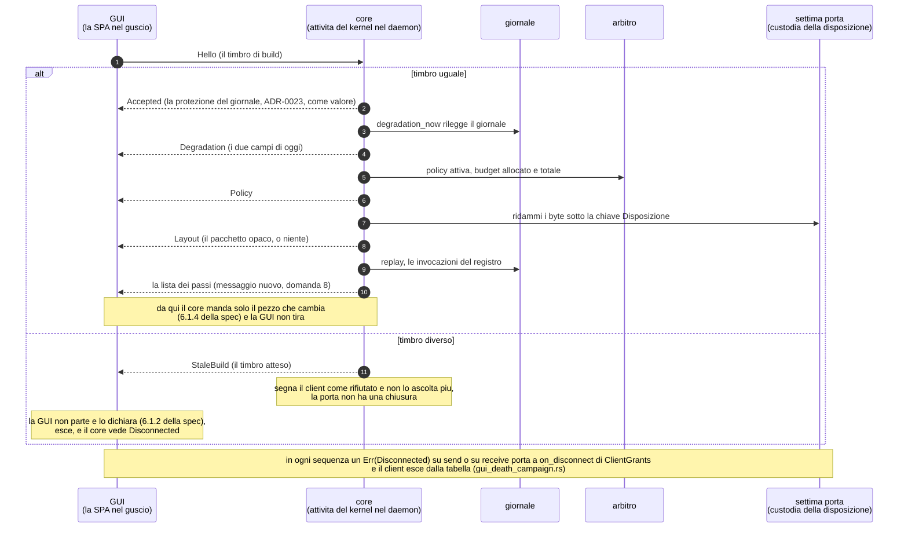
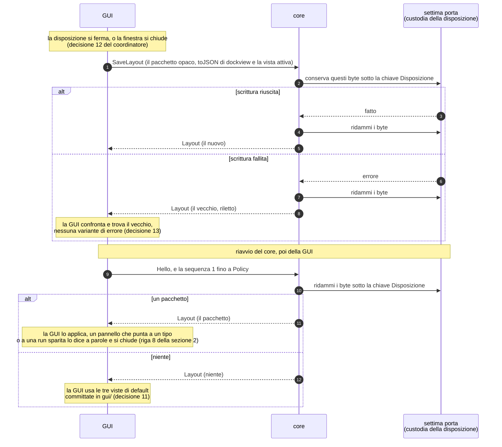
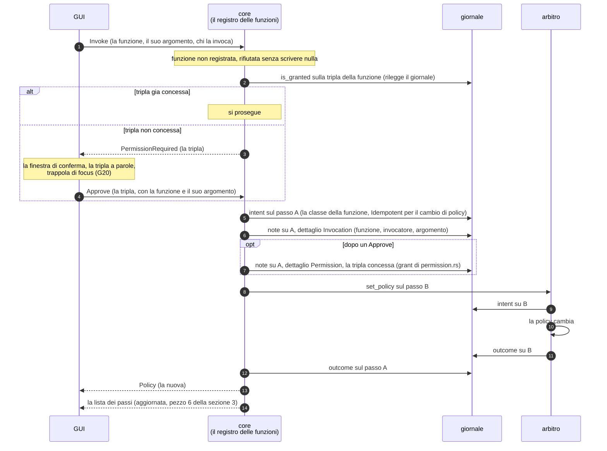

# La direzione della GUI — la stella polare: il disegno

✅ **QUESTO DISEGNO È COMPLETO DAL 2026-09-09.** Le sezioni **1–4 e 6** sono **approvate** dal proprietario, una per volta, in
chat fra il 2026-09-07 e il 2026-09-09 — le decisioni 14, 15 e 38 delegate al coordinatore con «decidi secondo la skill» —
sotto l'**accettazione condizionata** la cui regola sta qui sotto; la sezione **5** — core finto, prove e cancello, decisioni
aperte, come si riprende — vive nel [disegno del 2](2026-09-06-sottoprogetto-2-gui-minima-design.md) come **§7–§10**, e lì sta la
consegna della sessione che ha scritto i due disegni (decisione 37). Chi riprende ha un disegno intero: il prossimo passo lo
dice la §6 del [compendio](../../COMPENDIO.md), in un posto solo. ⏳ **La rilettura del proprietario in questa forma è da fare** —
è il passo che viene prima del piano, si dà in chat e non si deduce; la domanda con cui si apre sta nella §10 del disegno del 2.

⚠️ **RICHIAMO DEL 2026-09-09, sedicesima ripresa:** questo file è nato come **consegna** del brainstorming del 2026-09-07, allargato
per scelta del proprietario dalle due schermate del 2 alla forma di tutta la GUI, ed è cresciuto in quindici riprese fino alla
chiusura del 2026-09-09; il proprietario ha scelto che i due disegni li scrivesse la sessione **successiva** (decisione 39).
Riscritto **sul posto**, allo stesso percorso, perché il puntatore della §6 del compendio non cambiasse casa, come fu per i
disegni dei [gesti](2026-09-03-riconoscimento-gesti-design.md) e della [knowledge base](2026-09-04-knowledge-base-design.md). Il
merito delle sezioni approvate, delle tre sequenze, del modello della GUI e delle due tabelle delle decisioni **non è stato
toccato**; la consegna com'era sta **parola per parola**, intera, in coda a
[`archivio/consegna-brainstorming-direzione-gui.md`](../../archivio/consegna-brainstorming-direzione-gui.md), nel file che già
teneva la cronaca delle riprese; ciò che la riscrittura ha **misurato** in più sta nella §10 del disegno del 2.

⛔ **Non è una spec e non disegna le capacità.** Colloca i **moduli**, le **viste**, la **disposizione**, le **regole** e il
**protocollo core ↔ GUI** — è la stella polare di tutta la GUI, di cui il 2 costruisce la cornice più la propria fetta (§3, che
è la casa del perimetro del 2). Ogni sotto-progetto **disegna i propri moduli quando arriva** — il 3 la Chat e i Passi delle
run, il 6 il nucleo, il 10 Compatta, il 12 la mano — e, quando **costruisce** un modulo, mette un **richiamo datato** nella riga
di quel modulo nella §1: la regola di [design/10](../../design/10-modello-dei-dati-durevoli.md), un'entità costruita passa con
richiamo datato. Il disegno del 2 **rimanda qui per la forma** e non ricopia (§6). Gli ADR restano l'autorità — 0027 e 0030 per
lo stack, 0033 per la GPU della GUI, 0038 per il registro delle funzioni, 0022 per l'archivio della disposizione — e ciò che
questo disegno vi aggiunge è **scritto nelle sezioni**, col richiamo datato dove tocca un documento approvato.

⚠️ **Le approvazioni sono A CONDIZIONE**, con la stessa formula del 2: il proprietario ha risposto «A che rispetti la skill»
alla strada, e poi A o B a ogni domanda. Se scrivendo il piano una decisione viola un criterio di
`anthropic-skills:decision-principles`, l'accettazione decade: ci si ferma e lo si dice.

⚠️ **La modularità è decisa a condizione di una prova.** Il proprietario ha accettato i pannelli agganciabili di `dockview`
dicendo «deve davvero battere la 3», la tela libera. La prova è nello spike del guscio (§4): se provandola non dà il «Jarvis»,
si passa alla tela libera **prima** di scrivere la SPA.

📌 **Metodo.** Ogni affermazione porta la sua specie — **verificata** (letta nel sorgente o in un documento del repository, con
la data), **dedotta**, o **assunta** — e ogni sezione le separa nel proprio «Controllo sui cinque criteri». Il codice non è
cambiato da quando le sezioni lo hanno letto: `git diff --stat 664265a..HEAD -- crates/ Cargo.lock Cargo.toml rust-toolchain.toml`
non rende nulla, rilanciato il 2026-09-09 alla scrittura. I comandi stanno accanto alle affermazioni e **si rilanciano**, non si
citano.

## Lo stato alla scrittura del disegno — 2026-09-09, coi comandi che lo rifanno

⚠️ Questo file tiene la propria tabella dello stato e **rimanda alla §6 del compendio** per il prossimo passo; la consegna della
sessione che ha scritto i due disegni — con «Come si riprende» — è la **§10 del disegno del 2** (decisione 37). Ogni riga è stata
rilanciata coi comandi il 2026-09-09, non ricordata.

| | Comando | Atteso |
|---|---|---|
| ramo | `git fetch --all --prune`, poi `git status -sb` | `## main...origin/main`, niente sotto |
| i commit della direzione della GUI | `git log --oneline 664265a..HEAD` | dal 2026-09-07 a oggi: la consegna, le quindici riprese e le loro chiusure, poi i due disegni scritti sul posto — quanti e quali lo dice il comando; la cronaca è in archivio |
| codice e spec non toccati | `git diff --stat 664265a..HEAD -- crates/ scripts/ spikes/ .github/ Cargo.lock Cargo.toml rust-toolchain.toml docs/superpowers/specs/2026-08-06-kernel-design.md docs/superpowers/specs/2026-08-06-sottoprogetto-1-kernel.md` | nulla, tranne la spec del sotto-progetto 1 — tre righe e un richiamo nella §8.2 (decisione 19, su delega) — e `scripts/check-docs.sh`: il tetto del compendio sceso col taglio 3 e i suoi commenti; è cancello, non codice |
| cancello | `bash scripts/gate.sh` | `GATE GREEN` — si rilancia all'apertura e alla chiusura, non si cita |
| documenti | `bash scripts/check-docs.sh` | `OK` |
| fine-riga | `git ls-files --eol docs/COMPENDIO.md docs/riferimenti.md docs/archivio/consegna-brainstorming-direzione-gui.md docs/archivio/consegna-brainstorming-sottoprogetto-2.md docs/archivio/stato-storico.md docs/superpowers/specs/2026-09-06-sottoprogetto-2-gui-minima-design.md docs/superpowers/specs/2026-09-07-direzione-gui-design.md docs/superpowers/specs/2026-09-07-direzione-gui-wireframes/*.svg` | il compendio, `riferimenti.md` e `stato-storico.md` `i/lf w/crlf`, gli altri `i/lf w/lf` — su questa macchina: un clone nuovo con `core.autocrlf=true` li mostra `w/crlf`, e non è una divergenza |
| i wireframe esistono | `ls docs/superpowers/specs/2026-09-07-direzione-gui-wireframes/` | `compatta-e-grafo.svg  home.svg  lavoro.svg` |
| dove vive ogni diagramma | `grep -rlE '^\s*(flowchart\|stateDiagram\|erDiagram\|sequenceDiagram)' docs` | i file di `docs/design/`, la roadmap, le due spec del kernel, questo file (le tre sequenze), e gli archivi che tengono le consegne parola per parola; i tre wireframe SVG li dà la riga sopra |
| l'archivio è il testo della consegna | `diff <(git show a539f2a:docs/superpowers/specs/2026-09-07-direzione-gui-design.md) <(awk '/^# La direzione della GUI/{s=1} s' docs/archivio/consegna-brainstorming-direzione-gui.md)` | **solo** righe che contengono `](` — i link riscritti per la cartella |
| il puntatore della §6 | `awk '/^### Il prossimo passo/{s=1} s&&/^### Le voci ancora aperte/{s=0} s{b+=length($0)+1} END{print b}' docs/COMPENDIO.md` | poche righe — lo stato di oggi e il prossimo passo vivo — più il blocco del comando dei finding chiusi; cresce solo se cambia il prossimo passo |
| margine del compendio | `wc -c docs/COMPENDIO.md` contro `grep -n '^ceiling=' scripts/check-docs.sh` | positivo |

La baseline dei test la dà `cargo test --workspace --no-fail-fast --locked`, non questa riga.

## Le decisioni del proprietario, una per domanda

| # | Domanda | Risposta |
|---|---|---|
| 0 | il perimetro: stella polare di tutta la GUI, o allargare il 2? | **A, «che rispetti la skill»** — il wireframe è la stella polare, in un documento suo; ogni vista porta il numero del sotto-progetto che la costruisce; il 2 costruisce la **cornice** (le viste, i moduli mobili, la Home con l'anello che a parole dice «niente ancora») più la sua fetta di oggi. Scartata B, allargare il 2 fino ad anello, rete e grafo veri: disegna cose che nessuno produce fino al 3, 6 e 7, ed era già caduta come domanda 12 del [disegno della knowledge base](2026-09-04-knowledge-base-design.md) |
| 1 | cosa conta come «artefatto»: le chat e le run stanno nell'anello? | **A — no.** Nell'anello solo **file** prodotti dalle run — documenti, codice, asset 3D, catture, esportazioni — per data (ADR-0008 e ADR-0018: l'artefatto è un file sul disco, riferito dal giornale). Le chat e le run hanno una tessera loro, Attività. La rete al centro ha **tutto**: artefatti e file della knowledge base messi dal proprietario |
| 2 | cosa succede «a fuoco» | **A** — la rete al centro è un modulo come gli altri: «mettere a fuoco» è aprirlo a pagina intera con lo stesso gesto delle tessere, e a pagina intera è il grafo della knowledge base già deciso (§4.3 del disegno della knowledge base). Scartata B, uno zoom speciale della Home: un secondo modo di aprire, fatto per il solo centro |
| 3 | cosa sono le tessere | **A** — ogni tessera è un **modulo in piccolo, vivo**, che si usa sul posto e si apre a pagina intera; quali esistono lo dice la lista G9–G18 di [`spikes/GUI-REQUISITI.md`](../../../spikes/GUI-REQUISITI.md) più i quattro pilastri; ogni tessera porta il numero del sotto-progetto che la riempie; una tessera senza dati lo dice a parole. Scartata B, un pulsante per pilastro: la Home diventa un menu |
| 4 | dove vive la disposizione dei moduli | **A** — nel core, nell'archivio di configurazione di ADR-0022, e **il 2 ne costruisce il pezzo minimo**: un archivio con una voce sola, la disposizione; il core la manda alla GUI al collegamento, la GUI manda «salva disposizione». È la decisione 12 del [disegno dei gesti](2026-09-03-riconoscimento-gesti-design.md), registrata e ora presa. Salvarla nel browser della GUI è escluso da I1. Scartata B, rimandare l'archivio: si riordina e si perde tutto al riavvio |
| 5 | una modalità piccola sempre in primo piano | **A** — entra come terza vista, **Compatta**: si disegna ora, la costruisce il **10**, perché «sempre in primo piano» e la scorciatoia globale sono integrazione con l'OS (riga «Overlay/finestra fluttuante → GUI + L3» di tracciabilità). Zero codice nel 2 |
| 6 | la modularità: griglia, pannelli agganciabili, tela libera | **2, pannelli agganciabili**, a condizione che «batta davvero la 3»: `dockview-core` 8.2.0, usato **diretto** e non con l'adattatore Vue (ADR-0030 preferisce le librerie agnostiche); dipendenza nuova, in due passi. La prova è nello spike del guscio, sezione *«Lo spike di accettazione»*. Scartate: la griglia a tessere, che non sa fare schede e pannelli divisi per Lavoro; la tela libera, che sovrappone, salva in pixel e fa faticare la tastiera — resta la strada di riserva se la prova fallisce |
| 7 | la chat nella Home di default | **B** — no. La chat vive in Lavoro; in Home si aggiunge dal cassetto «+ moduli». «Agentic OS, non chatbot» |
| 8 | il modulo Passi nel 2 | **A** — nasce col 2, minimo: mostra i passi che il giornale ha oggi, cioè le invocazioni del registro con intento ed esito; col 3 cresce ai passi delle run. Chiude la divergenza con le due righe di tracciabilità «Replay dei trace» e «Osservabilità e tracing locale → GUI minima». Costo: un messaggio IPC con la lista dei passi, e un pannello |
| 9 | il PC «come Cowork» | «lavorare sui tuoi file e lanciare comandi va bene, per ora»: deciso nei meccanismi (ADR-0016, ADR-0024, ADR-0025) e visibile col 5. Guidare schermo, mouse e tastiera resta **solo un nome** — righe «Automazione OS → L3» e «Screenshot e comprensione dello schermo → L3 + Conversazione» — senza definizione: registrata, non presa |
| 10 | **alla ripresa, 2026-09-07** — quanto dettaglio porta un wireframe: il proprietario ha notato che nella barra della chat di Lavoro mancano il contesto della run, la modalità di esecuzione e il tasto «+ allegati», e che «se dovessimo mettere tutte le info mancanti ce ne sarebbero un botto» | **A** — un wireframe è una **mappa**: dove sta ogni modulo e chi lo costruisce; Lavoro e Compatta col grafo sono **approvati come mappa**. Tutto ciò che un modulo mostra, e i comandi che ha, va nel **catalogo dei moduli** (sezione 1 delle sezioni che mancano): una tabella per modulo con la **fonte** di ogni riga — G, ADR, riga di tracciabilità — e il sotto-progetto che la costruisce. Le tre cose notate hanno fonte (G11 · ADR-0016 · «Allegati in chat» di tracciabilità) ed entrano nella riga Chat, nella **barra della chat, per run**; la striscia sempre visibile resta il riassunto. Scartata B, ridisegnare i wireframe con tutto dentro: disegna oggi cose che arrivano col 3, 5, 6 e 13 e si rifanno col design system — la stessa ragione della B della domanda 0 |
| 11 | **alla seconda ripresa dello stesso giorno** — il proprietario ha aggiunto il **modello selezionato** alle cose che mancano nella barra della chat, e ha chiesto quando e dove si scrivono le informazioni che i wireframe non portano, per non crescere feature su feature | **A** — il metodo è la decisione 10, e il momento è la sezione 1, prima del disegno e del piano. Il modello entra nella riga Chat come **indicatore** del modello in uso, con fonte: il record di routing di ADR-0011 e la riga «Indicatore di stato modello» di tracciabilità, casa GUI. Un **selettore** a mano per chat non ha fonte, e tracciabilità ha già «Selettore di modello per compito ✅ §3 · profili»: la domanda «posso anche sceglierlo a mano, per run?» è registrata, chiusore il **3** col disegno del modulo Chat. Scartata B, decidere il selettore adesso: una riga G nuova e la riapertura di come si sceglie il routing, decisione strutturale che non si prende a fine giornata |
| 12 | **alla seconda ripresa** — la profondità del catalogo: «non stiamo complicando le cose?» | **A** — sì, sui moduli lontani. Le tabelle piene restano per i moduli del 2 e del 3 già scritti (Chat, Stato, Permessi, Passi, Attività); gli altri **tredici** entrano in **una tabella corta**: chi li costruisce, ciò che ADR e requisiti impongono di mostrare, le fonti — niente comandi, regole o dedotti, che scrive il sotto-progetto col suo disegno (sezione 6). Riletti i doppioni: le righe che tornano in più tabelle sono **facce diverse** dello stesso fatto, una per modulo, e restano; i doppioni veri stavano nella proposta di Ambito, non scritta. Il paragrafo dei criteri resta dov'è già scritto e si fa una volta per la tabella corta. Scartata B, tredici tabelle piene: circa seicento righe che i sotto-progetti riscriverebbero — la ragione della B della domanda 10 |
| 13 | **alla seconda ripresa** — l'Ambito: «che cos'è? vorrei che funzionasse simil Claude Desktop; ha interazione diretta con i permessi?» | l'ambito è la **cartella di lavoro della run** più la copia di sicurezza di ogni file prima che l'agente lo tocchi (ADR-0024): non un albero del disco, non il diff. **Simil Claude Desktop, deciso**: la cartella si sceglie all'avvio della run e si vede sempre nell'intestazione della chat; se ne aggiungono altre durante la run, e ogni aggiunta è una dichiarazione di ambito; pannello o riga lo decide il 5. Coi permessi, letto negli ADR: sono **due meccanismi distinti** — la tripla dice cosa l'agente **può fare** su un percorso, e una tripla di lettura vale «lì, e solo lì» (ADR-0016, tabella delle triple); l'ambito dice **dove c'è la copia di sicurezza** (ADR-0024, che non nomina i permessi). Si incontrano in un punto: la richiesta di permesso su un file, dove la GUI dice se il percorso è dentro l'ambito o fuori, **prima** che l'agente scriva (G18, follow-up di ADR-0024). Registrata: se il preset «auto-approva sicuri» approvi le letture ovunque o solo dentro l'ambito |
| 14 | **alla terza ripresa, 2026-09-08** — se «salva disposizione» passi dal registro delle funzioni con una tripla, o sia una scrittura fuori dal registro | **delegata al coordinatore, «decidi secondo la skill»: fuori dal registro.** ADR-0038 regola 5 tiene fuori lo spostare un pannello; salvarlo è lo stesso fatto reso durevole, e una tripla chiederebbe il permesso di sistemare le proprie finestre a ogni avvio (ADR-0016: un'approvazione vale quella tripla, quella sessione). §2 |
| 15 | **alla terza ripresa** — dove la disposizione si conserva, letto che `SaveLayout` arriva dentro il kernel (§5 del 2) e che nessuna delle sei porte tiene un pacchetto opaco: una **settima porta**, o il giornale forzato | **delegata al coordinatore: la settima porta.** Scartato il giornale — ADR-0018 tiene per sempre «la parte piccola», e un pacchetto di pannelli decine di volte al giorno non lo è — e, già alla domanda 4, il non salvare. Costo: la §3.1 della spec passa da sei a sette famiglie con richiamo datato, compito del piano. §2 |
| 16 | **alla terza ripresa** — la sezione 3 (**A**, con le due registrate), e la domanda *«tutto questo è integrato e studiato nell'architettura, schemi ER ecc.?»* | **Il mandato per la sessione nuova, con un agente nuovo:** aggiornare i diagrammi esistenti, **crearli dove mancano** — ER compresi — e **correggere la progettazione** dove un diagramma mostra un errore. Viene **prima** delle sezioni 4–6; una correzione a una sezione approvata torna al proprietario in forma A/B, con richiamo datato. La risposta verificata sta nella §3, tabella *«Cosa è già studiato, e dove»* |
| 17 | **alla quarta ripresa, 2026-09-08** — dove vive la policy VRAM: la registrata della terza ripresa, portata come domanda 1 della passata sui diagrammi. A: la corrente è la **proiezione del giornale** e il profilo dà il default; B: l'archivio di configurazione di ADR-0022, come design/09 diceva | **delegata al coordinatore, «decidi secondo la skill»: A.** Letto nel codice: `Arbiter::set_policy` in `crates/kernel/src/arbiter/mod.rs` scrive già ogni transizione come intento ed esito, con la policy per nome nel `reason`; `is_granted` e `degradation_now` rileggono già il giornale così; e design/09 dice da solo che solo il giornale è autorevole — un secondo archivio per un fatto che il giornale ha già sarebbe una casa doppia. Il profilo dà il **default** (Remote, ADR-0006); il daemon rilegge l'ultima transizione all'avvio, **compito del piano del 2** (`build_the_arbiter` riparte da `Remote`). Costo: un rimando in testa ad ADR-0006 — «determinato dal profilo» diventa «il profilo dà il default, il giornale il corrente» — l'etichetta della freccia e una riga in design/02, una riga in design/05. 🔶 **Dedotto, lo decide il disegno del 2:** la transizione guadagna un **dettaglio tipizzato**, sul precedente di `PermissionDetail`, perché la rilettura non cerchi una stringa; oggi non porta dettaglio. Scartata B: il default nel profilo e il corrente altrove, due case per un fatto |
| 18 | **alla quinta ripresa, 2026-09-08** — la sezione 1 della passata (design/09 e le sue conseguenze), e la domanda *«stai tenendo conto di scalabilità, di quanto verrà e di quanto già esiste? è lo schema a modificare le logiche, gli ADR e il codice esistenti se è più corretto di essi»* | **A, con le due correzioni** trovate rispondendo: «guide approvate (col 13)» nel nodo «giornale», e le **due vie** nella cella «Chi lo raggiunge» della configurazione — i profili consegnati dal daemon (ADR-0034), la disposizione dalla settima porta. ⛔ **E il metodo vale per tutti gli studi, i brainstorming e i diagrammi futuri:** ogni proposta controlla esplicitamente che cosa **esiste già** (codice, ADR, disegni), che cosa **arriva** (la roadmap) e se **regge crescendo**, e lo dice a parole prima dell'A/B; se lo schema è più corretto di una logica, di un ADR o del codice, si correggono **quelli** — l'ADR col richiamo datato, il codice come compito del piano, sempre in forma A/B, mai in silenzio. Scritto in `CLAUDE.md`, «Come si lavora qui» |
| 19 | **all'ottava ripresa, 2026-09-08** — la lettera E della §8.2 della spec: il primo worker vero è del 7 (la spec, 2026-08-08) o del 12 (ADR-0039 e la roadmap, 2026-09-03)? A: la spec dice 12, col richiamo datato; B: la spec resta com'è e la voce resta registrata | **delegata al coordinatore, «decidi secondo la skill»: A.** I tre controlli: **esiste** — nessun worker vero nel codice (`grep -rln 'impl Worker for' crates/*/src` rende solo la prosa della porta), la spec porta il 7 in **tre** righe (la tabella delle lettere di §8.2, la riga `process` di §8.2.2, la riga Q4 di §8.4) e la §8.2.1 dice da sola che *«se la roadmap cambia, la condizione resta vera e il numero si aggiorna»*; **arriva** — ADR-0039 e la roadmap dicono 12 dal 2026-09-03, e la Voce riusa; **regge crescendo** — se il 7 o il 6 arrivassero prima, la condizione resta e il numero si aggiorna di nuovo per la stessa regola, e il richiamo lo dice. Costo: tre numeri e un richiamo datato in «Sulla E»; correggerne una riga sola avrebbe lasciato due a mentire. Scartata B: due documenti approvati che si contraddicono senza nominarsi (gotcha #59), e una registrata che nessuno chiude |
| 20 | **all'ottava ripresa, 2026-09-08** — la sezione 3, primo disegno: il modello dei dati durevoli in un file nuovo, `docs/design/10-modello-dei-dati-durevoli.md`, con due `erDiagram` (A), o dentro design/03 e design/09 (B) | **delegata al coordinatore, «decidi secondo la skill»: A.** I tre controlli, detti prima della domanda: **esiste** — sei campi con indice, sei `RecordKind`, tre `Detail`, la tabella `redb` del giornale, cinque scrittori di produzione, `prune` che cancella, la porta `filesystem` con `CheckpointId` e senza implementazione vera; nessun `erDiagram` in `docs/`; **arriva** — col 2 l'invocazione e la disposizione, col 3 run e sub-run, col 5 ambito e checkpoint, col 6 la cartella e l'indice della knowledge base, col 13 le guide approvate (forma dedotta); **regge crescendo** — una specie nuova è un indice nuovo di `Detail` (ADR-0036, regola 3), un archivio nuovo è una porta o una tabella sua, e un'entità costruita passa dal secondo diagramma al primo con richiamo datato, regola scritta nel file. Presentato a parole e col diagramma reso in chat dal sorgente identico (decisione 21); scritto design/10, la riga di `README.md` (il cancello conta file e righe), «nove file» tolto dalla §12 del compendio. Un difetto trovato disegnando e **registrato**: un commento di `crates/platform/src/journal.rs` dice che `boundary.rs` scrive byte che non sono un `Record`, ed è falso — codice, compito del piano (decisione 18). Scartata B: un modello dei dati spezzato in tre case diverge in silenzio (gotcha #68) |
| 21 | **alla nona ripresa, 2026-09-08** — «la GUI dentro», primo buco trovato disegnando: la §5 del 2 dice `Approve` → `permission::grant` → la GUI rimanda `Invoke`, ma `grant` scrive una **nota** e vuole un passo già aperto con un intento (il suo doc: *«upon a step somebody else opened»*), e nel giro approvato quel passo non c'è. A: `Approve` porta anche la funzione e l'argomento, il core apre il passo A, scrive invocazione e permesso, fa l'effetto, chiude A; B: `Approve` resta la sola tripla, e il core tiene la tripla approvata in memoria per quel client fino al prossimo `Invoke` | **delegata al coordinatore, «decidi secondo la skill»: A.** I tre controlli: **esiste** — `grant` è una nota su un passo altrui, come `run_the_ring` e il routing (tre annotazioni, una regola), e il daemon non ha stato fra due messaggi; **arriva** — col 3 il permesso di un agente si posa sul passo della run che aspetta, stessa regola «sul passo che sblocca», e il gesto del 12 rifà la sequenza; **regge crescendo** — un messaggio in meno e nessun sospeso da riconciliare, dove B lascerebbe in memoria una tripla approvata che il giornale non sa. Costo: richiamo datato su §4 (la riga `Approve`), §5 (le righe «il giornale» e «il permesso») e §6a (la riga «il cambio di policy») della consegna del 2. Scartata B: stato del core fuori dal giornale per un fatto che il giornale deve avere |
| 22 | **alla nona ripresa** — secondo buco: la §3 e la §5 del 2 dicono che col timbro sbagliato il core manda `StaleBuild` **e chiude**, e la spec §6.1.2 che «la GUI non parte e lo dichiara»; il tratto `Ipc` ha `accept`, `send`, `receive` e **nessuna chiusura** (`grep -nE '^\s*fn ' crates/kernel/src/ports/ipc.rs`). A: nessuna operazione nuova — il core segna il client come rifiutato e non lo ascolta più, la GUI esce da sola e il core vede `Disconnected`; B: la porta guadagna una quarta operazione | **delegata: A.** **Esiste** — la morte della GUI è già letta solo come `Err(Disconnected)` (`gui_death_campaign.rs`), e la §6.1.2 mette l'uscita dalla parte della GUI; **arriva** — col 2 il trasporto vero di `platform`, che vede sparire il client quando la GUI esce; **regge crescendo** — la GUI è 0..1 e sacrificabile (ADR-0004), un client rifiutato che resta è uno solo e costa un `receive` a giro. Costo: richiamo datato su §3 («la stretta di mano») e §5 (`Hello`) della consegna del 2. Scartata B: tratto, finte, suite di conformità e la §3.1 della spec per un caso che la GUI chiude da sé |
| 23 | **alla nona ripresa** — dove vivono le tre sequenze: A in questo file, sotto «Il modello della GUI»; B un file nuovo in `docs/design/` | **delegata: A**, come la settima ripresa aveva giudicato. **Esiste** — le due spec del kernel portano già blocchi mermaid (`grep -rlE '^\s*(flowchart|stateDiagram|erDiagram|sequenceDiagram)' docs/superpowers/specs`), e design/01 disegna la GUI come una scatola sola; **arriva** — il disegno del 2 rimanda qui per la forma (sezione 6 delle sezioni che mancano); **regge crescendo** — le sequenze restano tre anche col 3 e col 12: un invocatore nuovo rifà la 3, un messaggio nuovo segue «il core manda il pezzo che cambia». Scartata B: `docs/design/` è la struttura del kernel, e un file per il protocollo della GUI ne disegnerebbe l'interno, che ADR-0001 tiene fuori dai diagrammi del kernel |
| 24 | **alla decima ripresa, 2026-09-08** — la sezione 4: lo spike di accettazione di `dockview` dentro lo spike del guscio — sette mosse giudicate dal proprietario provandole, il protocollo congelato prima in `spikes/gui-shell/PROTOCOLLO.md`, le misure (la mossa 7 come confronto di JSON, M4 con `dockview` acceso, Q3 per il popout), la riserva `interactjs` costruita solo su un no, chat e scena dello spike dentro due tessere | **A**, con la domanda *«ma si fa anche la prova con la telecamera per spostarle con mediapipe?»* — la risposta è la **mossa 8** con la riga Q4, proposta nel prossimo passo, in attesa della sua A/B (consiglio A). ⛔ La sezione **non è scritta**: il proprietario ha chiuso la sessione con `session-handoff` («la si scrive nella prossima sessione»); la proposta sta parola per parola nel prossimo passo |
| 25 | **all'undicesima ripresa, 2026-09-09** — la mossa 8 e la riga Q4 nella sezione 4: A, otto mosse; B, sette, la mano tutta al 12 | **A.** La §4 è scritta con otto mosse e la riga Q4; la forma è quella della decisione 33 del coordinatore — il worker e il relay di SP-7 com'è, la pinza tradotta in eventi del puntatore, `dockview` in `dndStrategy: 'pointer'`, provata nel browser — col limite di `'pointer'` dichiarato: la mossa 4 dal comando (decisione 34). Scartata B: il 2 costruisce già pannelli che si muovono con qualunque puntatore (disegno dei gesti, §4.1), e provarlo solo col 12 sarebbe scoprirlo dopo la SPA |
| 26 | **alla chiusura dell'undicesima ripresa, 2026-09-09** — con `session-handoff`: *«continuiamo in una nuova sessione, prima di partire l'agente deve dare una pulita/ordine alla documentazione di resume di sessione e tutto ciò di obbligatorio da leggere e ridimensionarli dove serve per tornare ad avere un consumo umano di token dato che appena inizia la sessione ne vengono occupati 350k»* | **Il mandato per la sessione nuova, prima di ogni altra cosa:** sfoltire la lettura d'apertura — questo file, il compendio (la §6 e le sue voci aperte), la testa dell'audit, `CLAUDE.md` — misurando prima coi comandi e proponendo ogni taglio in forma A/B; la cronaca va in archivio parola per parola, nel documento vivo resta lo stato; le voci aperte del compendio sono decisioni del proprietario e si consolidano **voce per voce** con lui, mai riassunte d'iniziativa. L'ordine e le misure stanno nel prossimo passo. La §7 resta aperta finché il mandato non è eseguito |
| 27 | **alla dodicesima ripresa, 2026-09-09** — taglio 1: la cronaca delle undici riprese esce da questo file? A: in archivio parola per parola, qui lo stato in poche righe, le decisioni, le sezioni approvate, le registrate, i vicoli ciechi e il solo prossimo passo vivo; B: resta tutto finché il disegno non è scritto | **A.** In `docs/archivio/consegna-brainstorming-direzione-gui.md`, coi soli link riscritti; questo file da 222 315 a 157 266 byte (da 71 886 a 50 755 token `cl100k`) |
| 28 | **alla dodicesima ripresa** — taglio 2: la lettura d'apertura dell'audit? A: solo due pezzi, la tabella delle voci senza numero AUD e «La disciplina, in cinque passi»; B: tutta la testa fino a «Dettaglio» come prima | **A.** Il file dell'audit non cambia (le tabelle restano la casa unica dello stato); riscritte col richiamo datato le tre case dell'istruzione — `CLAUDE.md`, la §6 del compendio, la voce 3 del messaggio di `AVVIO-CHAT.md` — coi testi vecchi in `docs/archivio/lettura-di-apertura-storico.md`; e la cella «R1 — APERTA» dell'ordine consigliato, stantia, corretta col richiamo. Da 82 907 a 4 806 byte |
| 32 | **alla tredicesima ripresa, 2026-09-09** — `AVVIO-CHAT.md`, il messaggio da incollare all'inizio di una chat (370 righe e 25 577 byte con l'`awk` della §12 del compendio): A, lo incolla ancora, quindi si misura e si propone lo stesso taglio in A/B; B, non lo incolla più, resta com'è e il mandato si chiude | **B.** Il messaggio resta com'è e non è più lettura d'apertura; la voce dei pesi a mano nella tabella del 2026-08-10 della §6 del compendio e la registrata della dodicesima ripresa si chiudono con questa decisione; il mandato (decisione 26) è **eseguito**: cinque tagli e questa risposta. Un richiamo datato in testa ad `AVVIO-CHAT.md` è del proprietario, registrata qui sotto |
| 31 | **alla tredicesima ripresa, 2026-09-09** — taglio 5: i verbali dentro `CLAUDE.md`? A: i sette pezzi di cronaca — le sei volte del gotcha #31 in testa, la riga su `audit-2026-08-11.md`, il richiamo del 2026-08-30 sulla riga di `writing-plans`, le tre volte dei fine-riga, le due spiegazioni della dipendenza in due passi, il capoverso del 2026-08-28 sotto le quattro domande, «la prima applicazione» della riga dello schema — in `docs/archivio/lettura-di-apertura-storico.md`, ogni regola resta col suo perché in una riga; B: resta com'è, il mandato si chiude con quattro tagli. ⚠️ Misurato prima di chiedere: 2 173 byte e 753 token `cl100k` su 5 019, meno dell'1% della lettura d'apertura — la stima *«a ~10 KB, ~2 000 token»* della dodicesima ripresa era sbagliata, detto al proprietario prima della domanda; il consiglio A è stato dato per coerenza (la regola di `CLAUDE.md` sui verbali) e non per i token | **A.** `CLAUDE.md` da 15 892 a 14 412 byte; i sette pezzi in archivio con la data e dove stavano; il rimando «il verbale in archivio» nelle regole che li portavano (decisione 44 del coordinatore) |
| 30 | **alla tredicesima ripresa, 2026-09-09** — taglio 4: il puntatore «Il prossimo passo» della §6 del compendio? A: riscritto allo stato di oggi in poche righe — cosa è chiuso con la data e il posto del verbale, il mandato in corso, il prossimo passo vivo — e il testo com'era in `docs/archivio/stato-storico.md`; B: resta com'è | **A.** Il puntatore da 7 195 a 4 231 byte (il comando nella tabella dello stato); il testo com'era in archivio coi link riscritti; il blocco della domanda e il paragrafo di «Da sapere subito» com'erano in `docs/archivio/consegna-brainstorming-direzione-gui.md`. Resta `CLAUDE.md`, la domanda 5 |
| 29 | **alla dodicesima ripresa** — taglio 3: il riquadro «Le voci ancora aperte» della §6 del compendio? A: il racconto in archivio, nella §6 restano gli indici, la tabella del 2026-08-10 com'è più le due voci orfane; B: resta com'è. Ogni voce censita una per una contro gli indici, in una tabella di 32 righe in chat | **A.** Il racconto in `docs/archivio/stato-storico.md`; il registro e l'intestazione dell'archivio ricevono il richiamo; il tetto di `check-docs.sh` da 188 416 a 111 616 (misurato + 11%, la regola scritta lì). Il compendio da 182 850 a 100 546 byte (da 59 760 a 32 694 token) |
| 33 | **alla quattordicesima ripresa, 2026-09-09** — la §7 del 2, il core finto, riposta parola per parola dal blocco della tredicesima: A, riusa — il finto fa girare l'attività vera del kernel che ascolta la GUI, su porte in memoria, più un rubinetto; B, imita — un copione a sé che scrive a mano ogni risposta del daemon | **A.** La §7 è scritta nella consegna del 2, sotto «Le sezioni approvate del disegno», nella forma delle §3–§6a; il costo dichiarato lì: il finto dipende anche da `simulator` per percorso, l'attività si costruisce da fuori, il rubinetto condivide il trasporto con una `RefCell`, la disposizione vive finché il finto non riparte. Scartata B: una seconda copia del dispaccio, che il giorno che il daemon cambia diverge senza che nulla diventi rosso. Il blocco della proposta com'era è nella cronaca in archivio |
| 34 | **alla quattordicesima ripresa, 2026-09-09** — la §8 del 2, le prove e il cancello, presentata in chat a parole e con lo schema: A, un cancello unico col passo web dentro (`gate-gui.sh` da una riga `run` di `gate.sh`, la CI con Node da `gui/package.json`, `.gitignore`, la tabella artefatto → controllo); B, il web in un lavoro di CI a parte che gira solo quando cambia `gui/` | **delegata al coordinatore, «decidi secondo la skill»: A.** Con B un cambio al kernel che rompe le fixture non fa girare le prove della SPA che le leggono, e `CLAUDE.md` vuole la porta in un comando solo. La §8 è scritta nella consegna del 2, con le decisioni 46–50 del coordinatore |
| 35 | **alla quattordicesima ripresa** — la registrata della nona: all'avvio l'archivio della disposizione non si apre. A, il core parte e `Layout` dice «non disponibile», ogni `SaveLayout` riceve lo stesso; B, il core si ferma come per il giornale (`StartupError`) | **delegata al coordinatore, «decidi secondo la skill»: A.** ADR-0019, si dichiara prima e non si fallisce dopo; la disposizione non è stato autorevole (I1); un terzo stato di `Layout` è una variante additiva, e nessuna operazione nuova nella porta; non in `Degradation`, che è una proiezione del giornale (decisione 50 del coordinatore). Richiamo datato sulla riga 5 della §2; la sonda nella §8 del 2 |
| 36 | **alla chiusura della quattordicesima ripresa, 2026-09-09** — la §9 del 2, le decisioni aperte col chiusore, presentata in chat: A, coi consigli scritti dentro, verificati alla fonte quel giorno; B, gli attrezzi web restano aperti fino al piano | **delegata al coordinatore, «decidi secondo la skill»: A.** Gli attrezzi sono misurati al registro npm il 2026-09-09 e il piano li rimisura comunque; lasciarli aperti sposterebbe la stessa verifica di un giro. ⛔ **NON scritta**: il proprietario ha chiuso con `session-handoff` prima dell'esecuzione; la proposta parola per parola nel prossimo passo, blocco «La proposta per la §9». ✅ **SCRITTA alla quindicesima ripresa, lo stesso giorno**, nella consegna del 2 |
| 37 | **alla chiusura** — la §10 del 2, «come si riprende», quando i due disegni si scrivono insieme: A, una sola sezione, nel disegno del 2, e la stella polare tiene la sua tabella dello stato; B, una in ciascuno dei due file | **delegata: A.** Una casa sola (gotcha #68): la consegna della sessione che scrive i due disegni va nel disegno del 2, da cui parte il piano; questo file rimanda alla §6 del compendio. ⛔ **NON scritta**: blocco «La proposta per la §10» nel prossimo passo. ✅ **SCRITTA alla quindicesima ripresa, lo stesso giorno**, nella consegna del 2 |
| 38 | **alla chiusura** — la sezione 6 di questo file, dove vive la stella polare: A, file suo al percorso di oggi, come disegno, e il 2 rimanda; B, fusa nel disegno del 2 come sua parte iniziale | **delegata: A.** Il file è già grande e lo toccheranno il 3, il 6, il 10 e il 12 con richiami datati; fuso nel 2, ogni sotto-progetto riscriverebbe il disegno di un altro. ⛔ **NON scritta**: blocco «La proposta per la sezione 6» nel prossimo passo. ✅ **SCRITTA alla quindicesima ripresa, lo stesso giorno** — la §6 delle sezioni approvate |
| 39 | **alla chiusura della quindicesima ripresa, 2026-09-09** — i due disegni scritti sul posto (punto 5 del prossimo passo): A, in una sessione nuova, come il proprietario vuole dal 2026-09-02 per ogni disegno; B, in questa sessione, di seguito alla §6 | **A.** La sessione nuova apre con la lettura obbligatoria, legge questo file e la consegna del 2 **per intero**, e scrive i due disegni sul posto; nessuna domanda resta pendente |

## Ciò che il repo diceva già, letto per decidere

| Funzionalità chiesta dal proprietario | Decisa? | Dove | Codice oggi | Arriva con |
|---|---|---|---|---|
| azioni automatiche a un'ora fissa | sì, come **trigger**: pianificazione, cambiamento di file, fine di un'altra run | ADR-0009; riga «Scheduling ✅» di [tracciabilità](../../tracciabilita.md) | solo l'orologio del reattore (`now`, `wall_time`, `wait_until`); nessun tipo `Trigger` (`grep -rl --include='*.rs' Trigger crates/` rende zero) | il meccanismo col **13**; la funzione per l'utente col **4** |
| sub-agenti e workflow | sì: un sub-agente è una **sub-run**, «proiezione ristretta della stessa struttura, col proprio segmento di giornale» ([design/03](../../design/03-run-durevoli.md)); la gerarchia run → sub-run → passo è ADR-0011; il piano nello stato durevole è ADR-0008 | righe «Orchestrazione e sub-agenti», «Planning», «Agenti in parallelo isolati» di tracciabilità | run e passo non esistono come tipi: c'è solo `StepId` (`grep -rnE 'RunId' crates/*/src` rende zero) | run e sub-run col **3**, piano e coda col **4**, isolamento su disco col **5** |
| il PC come Cowork: file e comandi | sì: permessi a tripla, checkpoint sugli ambiti dichiarati, nessun comando sotto il livello 2 | ADR-0016, ADR-0024, ADR-0025 | le porte `filesystem` e `process` nel kernel; nessuna capacità sopra | il **5** |
| il PC come Cowork: schermo, mouse, tastiera | **no**: solo il nome «Automazione OS» | tracciabilità, sezioni 7 e 8; nessun documento nomina mouse o tastiera (`grep -rnE 'mouse' docs --include='*.md'` fuori da questo file rende zero) | nulla | il **10**, senza disegno |

E le tre cose del repo che hanno **deciso la forma**, verificate coi comandi:

| Cosa | Dove | Che cosa ha deciso qui |
|---|---|---|
| «il sotto-progetto 2 costruisce pannelli e menu che si muovono con **qualunque puntatore**; la mano è un puntatore in più» | §4.1 del [disegno dei gesti](2026-09-03-riconoscimento-gesti-design.md), e la riga 12 di «Perché quest'ordine» in [roadmap](../../roadmap.md): `grep -n 'pannelli mobili' docs/roadmap.md` | i moduli mobili sono **già del 2**; le sezioni approvate del 2 non li nominavano — divergenza chiusa dal perimetro A |
| il pannello della knowledge base: «disegna il grafo raggruppato per router; filtra per specie, cartella, etichetta; cerca sui nomi; al click mostra il nodo e le funzioni del registro; orfani e collegamenti rotti; non tocca file, non tiene stato» | §4.3 del [disegno della knowledge base](2026-09-04-knowledge-base-design.md), decisioni 6, 9, 10, 17 | il nucleo a pagina intera **è** quel pannello, nato col 6; qui non si ridisegna, si colloca |
| «se la posizione dei pannelli sopravvive a un riavvio: configurazione, archivio di ADR-0022, che non esiste: la chiude chi lo costruisce» | decisione 12 del disegno dei gesti: `grep -n 'posizione dei pannelli' docs/superpowers/specs/2026-09-03-riconoscimento-gesti-design.md` | presa oggi: il 2 costruisce l'archivio minimo (domanda 4) |
| «L'interfaccia deve mostrare **cosa è coperto** dall'ambito attivo, prima che l'agente inizi a scrivere»; «un limite di dimensione oltre il quale un file viene escluso dal checkpoint **con avviso**» | follow-up di [ADR-0024](../../adr/0024-checkpoint-del-filesystem-ad-ambiti-dichiarati.md) | il modulo Ambito di Lavoro, con «fuori ambito: non coperto» e «file grande: escluso, con avviso» |
| «la leva non è la GUI ma la **frequenza di aggiornamento** decisa dal core»; «la webview esegue solo contenuto locale nostro»; G13 dal primo giorno | follow-up di [ADR-0027](../../adr/0027-stack-della-gui.md) | la difesa contro tante chat che scrivono insieme; la provenienza in ogni pezzo di flusso |
| «Replay dei trace 🔶 → GUI minima», «Osservabilità e tracing locale 🔶 → GUI minima» | tracciabilità, sezioni 4 e 8: `grep -n 'GUI minima' docs/tracciabilita.md` | il modulo Passi nasce col 2 (domanda 8) |

## Lo stato dell'arte verificato, e il comando

✅ **RICHIAMO DEL 2026-09-09, alla scrittura del disegno:** il comando e la tabella delle venti librerie — versione, data,
licenza, Vue richiesto, download della settimana, per che cosa — misurate al registro npm il 2026-09-07, sono passati in
[`riferimenti.md`](../../riferimenti.md), sezione *«La direzione della GUI e il sotto-progetto 2 — le fonti dei due disegni»*,
la casa unica delle fonti, come questa consegna prevedeva («casa unica provvisoria»). Le scelte che ne discendono restano
nelle decisioni: `dockview-core` diretto (domanda 6, decisione 2 del coordinatore), `interactjs` di riserva, i candidati del
grafo per il 6 (registrata), `markdown-it` e gli attrezzi web nella §9 del 2. ⚠️ **Le versioni si riverificano il giorno dello
spike e il giorno del piano**, col comando che sta lì. Qui restano i fatti di `dockview` 8.x letti alla fonte, che le §2 e §4
citano «qui sopra».

**`dockview` 8.x, letto su dockview.dev il 2026-09-07** — pagine `docs/overview/licence`,
`blog/dockview-enterprise`, `docs/core/groups/floatingGroups`, `docs/core/groups/maximizedGroups`,
`docs/core/groups/popoutGroups`, `docs/core/state/save`, `docs/core/locked`, `docs/advanced/accessibility`,
`docs/advanced/keyboard`, `docs/core/panels/move`, `docs/core/panels/tabs`, `docs/core/dnd/thirdParty`:

| Fatto | Conseguenza qui |
|---|---|
| dalla 8.0.0 due forme: il core resta **MIT** e gratis, `dockview-enterprise` è a pagamento; «nothing you rely on today has been taken away» | si usa il core; niente di enterprise entra nel disegno |
| **gratis**: gruppi galleggianti (quanti si vuole, con layout annidato, tenuti dentro la finestra, con un gancio `transformFloatingGroupDrag` per lo scatto a griglia o l'allineamento); massimizza e ripristina; finestre popout; salva e ripristina il layout (`toJSON`); blocco del layout e dei singoli gruppi; tocco e penna; drag esterno e librerie terze; schede e presa personalizzate; gruppi senza intestazione; `moveTo` programmatico; ruoli ARIA, annunci allo screen reader, indicatori di focus, navigazione di focus programmatica; CSP stretta | è ciò con cui la 2 «batte la 3»: pannelli liberi, pagina intera, finestra a parte, mano come puntatore, presa grande disegnata da noi, nucleo bloccato, salvataggio in JSON |
| **a pagamento**: navigazione spaziale da tastiera e aggancio da tastiera; guide e bussola durante il trascinamento; cronologia annulla/ripeti; gruppi ai bordi che si nascondono; schede appuntate, multi-riga, menu contestuali | G20 chiede la tastiera: le scorciatoie per spostare un pannello **si scrivono noi** sopra `moveTo`, dichiarato; lo scatto a griglia si scrive noi sul gancio; annulla/ripeti non è chiesto |
| v8 è additiva: ogni novità è opt-in, un solo cambio di comportamento (le dimensioni riportate ai pannelli escludono l'intestazione) | «novità non è maturità» regge: la 8.x non rompe la 7.x; le versioni si riverificano il giorno dello spike |
| ✅ **letto il 2026-09-08, decima ripresa** — pagine `docs/core/dnd/overview` e `docs/core/dnd/strategy`: l'opzione `dndStrategy` — `'auto'` (default) usa il drag nativo **HTML5** per il mouse ed eventi del puntatore per tocco e penna; `'pointer'` guida **ogni** ingresso con eventi del puntatore, consigliato dove l'HTML5 è inaffidabile («some Linux browsers, certain Safari versions, embedded webviews»), e perde il trascinamento fra finestre e l'immagine nativa; `'html5'` solo nativo; cambiabile a caldo con `api.updateOptions`. Al tocco il trascinamento si arma con una pressione di circa 250 ms, il tocco breve resta un click | la mano come puntatore (mossa 8 proposta) vuole `'pointer'`, perché uno script non avvia un drag nativo; per i gusci nasce la riga Q4 |
| ✅ **letto il 2026-09-08** — pagina `docs/core/groups/popoutGroups`: `addPopoutGroup(item, { popoutUrl, box })` apre una **finestra nuova del browser** su `/popout.html` (default), ogni popout ospita un layout annidato suo, la finestra è legata con `window.opener`, e regge anche ai layout ripristinati con `fromJSON` | il popout dipende dal guscio, che deve lasciar aprire una finestra: la riga Q3 dello spike |
| ✅ **letto il 2026-09-08** — pagina `docs/core/state/save`: `toJSON()` dà il layout serializzato, `fromJSON` lo ripristina, e l'evento `onDidLayoutChange` scatta a ogni cambiamento come aggregato di molti eventi; la cronologia annulla/ripeti è a pagamento | l'evento è il gancio del salvataggio da solo (decisione 12 del coordinatore); la mossa 7 confronta i due JSON |

## I wireframe, e il loro stato

Disegnati in chat con lo strumento inline, poi salvati come SVG autonomi. Sono a bassa fedeltà: box,
etichette, il numero del sotto-progetto che riempie ogni modulo, e il tratteggio per «modulo mobile».
Colori e forme si decidono dopo, nel design system in tre momenti del 2.

| Wireframe | File | Stato | Verificato · dedotto · assunto |
|---|---|---|---|
| **Home** | [home.svg](2026-09-07-direzione-gui-wireframes/home.svg) | ✅ **approvata**, con la chat nel cassetto (domanda 7) | verificato: le tessere da G9–G18, il pannello knowledge base dal suo disegno, le funzioni di `dockview`; dedotto: la striscia «sempre visibile» come gruppo bloccato di `dockview`, da provare nello spike; assunto: l'aspetto Jarvis lo danno colori e forme |
| **Lavoro** | [lavoro.svg](2026-09-07-direzione-gui-wireframes/lavoro.svg) | ✅ **approvata come mappa alla ripresa del 2026-09-07** — diceva *«⏳ presentata: A su Passi, nessuna modifica chiesta, approvazione da confermare»*; il contesto della run, la modalità di esecuzione e «+ allegati» entrano nella riga Chat del catalogo, nella barra della chat, per run (decisione 10) | verificato: ogni riquadro ha una riga G o un ADR (G4, G5, G7, G13, G14, G18, ADR-0014, ADR-0016, ADR-0017, ADR-0024); dedotto: la richiesta di permesso in riga invece che in finestra — nel 2 resta la finestra della §6a, in riga è la forma del 3; assunto: niente |
| **Compatta e nucleo a pagina intera** | [compatta-e-grafo.svg](2026-09-07-direzione-gui-wireframes/compatta-e-grafo.svg) | ✅ **approvata come mappa alla ripresa del 2026-09-07** — diceva *«⏳ presentata, NON approvata: la sessione si è chiusa prima della risposta»*; ciò che Compatta e il nucleo a pagina intera mostrano va nel catalogo, righe del 10 e del 6 (decisione 10) | verificato: il pannello dalla §4.3 del disegno della knowledge base, decisioni 6, 9, 10; gli stati ascolto/pensiero/parlato da tracciabilità; V9 per la notifica; l'indicatore acceso dal core, ADR-0039; dedotto: trascinare un nodo è la funzione «sposta» del registro, quindi chiede permesso; se Compatta sia una finestra staccata di `dockview` o la finestra principale rimpicciolita lo decide il 10; assunto: niente |

Il quarto disegno, Lavoro, contiene la **quarta vista** implicita: un modulo a pagina intera è la stessa
cosa per tutti i moduli, quindi non ha un wireframe suo.

## Il modello della GUI, com'è stato approvato in chat

| Pezzo | Forma | Da dove |
|---|---|---|
| **modulo** | un **tipo** registrato nella SPA — Chat, Stato, Attività, Ambito, Diff, Anteprima, Terminale, Passi, Sensori, Costi, Permessi, Knowledge base, Asset 3D, Voce e gesti, Nucleo — e i suoi **esemplari**: un pannello di `dockview` con parametri, per esempio il numero della run. Un tipo, tanti esemplari; i tipi sono pochi, gli esemplari quanti si vuole | domanda 3; il modello di `dockview` |
| **regola unica** | ogni modulo si usa sul posto, in piccolo, **oppure** si apre a pagina intera; vale anche per il nucleo (domanda 2) | domande 2 e 3 |
| **vista** | un layout salvato con un nome: JSON di `dockview`; tre arrivano con l'app — **Home**, **Lavoro**, **Compatta** — e il proprietario può salvarne altre; costa un nome e una lista | domande 5 e 6, e la risposta su come cresce |
| **Home** | il **nucleo** al centro, bloccato: l'anello degli artefatti recenti per data, e dentro la rete viva di tutti i file; intorno le tessere agganciate; sopra la barra con le viste, la ricerca, il chip del core, e la fascia che compare solo se il core manca o il timbro è sbagliato; sotto la striscia sempre visibile e il cassetto «+ moduli» | il wireframe Home |
| **Lavoro** | Attività e Ambito a sinistra; la chat a schede al centro, ogni scheda una run, «stacca» per un pannello libero o un'altra finestra; Diff, Anteprima e Terminale a destra; Passi e Sensori in basso | il wireframe Lavoro |
| **Compatta** | una finestrella sempre in primo piano: la rete viva senza anello come presenza (ascolto, pensiero, parlato, fermo), l'ultima notifica, microfono e telecamera accesi dal core, la scorciatoia globale, «grande» per tornare al nucleo | il wireframe Compatta, da confermare |
| **striscia sempre visibile** | in ogni vista: degrado, permessi, contesto, costo e tetto, attese, telecamera, microfono — la lista «deve mostrare sempre» G9–G14 più i due indicatori di percezione | G9–G14; ADR-0039 |
| **ricerca** | sui nomi degli artefatti, dalla barra: colora i trovati nell'anello e nella rete; a pagina intera è la ricerca del pannello knowledge base | domanda 1; §4.3 del disegno della knowledge base |
| **come cresce** | più chat = più esemplari come schede, affiancati o in un'altra finestra; la Home non si allunga: Attività è l'indice di tutte le run, l'anello mostra gli ultimi file e il nucleo a pagina intera li ha tutti; una funzione nuova = un tipo nuovo registrato, che compare nel cassetto col suo numero; le viste sono JSON, niente da ridisegnare | la risposta al proprietario sul come regge |
| **dove si rompe, e cosa lo tiene** | tante chat che scrivono insieme mangiano CPU, e P3 era già stretto: `dockview` disegna solo i pannelli visibili («render modes»), la frequenza la decide il core (ADR-0027), e — dedotto, per il 3 — la GUI dice al core quali run guarda e il core manda solo quelle; un layout salvato che punta a una run sparita: il pannello lo dice a parole e si chiude | ADR-0027; la tabella delle licenze di `dockview` |
| **la disposizione** | vive nel core, archivio di configurazione di ADR-0022, che il 2 costruisce con una voce sola; il core la manda al collegamento, la GUI manda «salva disposizione» | domanda 4 |
| **la mano** | i moduli si muovono con qualunque puntatore; il 12 aggiunge il pinch: `dockview` supporta tocco e penna e le librerie terze di trascinamento | §4.1 del disegno dei gesti; la doc di `dockview` |
| **cosa mostra davvero il 2** | la cornice con `dockview`; Home col nucleo che a parole dice «niente ancora», Stato e Permessi vivi; Lavoro con la chat del core finto, la finestra di permesso, Passi con le invocazioni del registro; le altre tessere dicono a parole chi le riempie; Compatta non esiste ancora | domande 0 e 8 |

### La GUI dentro — le tre sequenze del protocollo core ↔ GUI · scritte il 2026-09-08, nona ripresa (decisioni 21–23)

Il secondo disegno della sezione 3 della passata sui diagrammi (decisione 16).
[design/01](../../design/01-topologia-dei-processi.md) disegna la GUI come **una scatola**, e qui resta tale: le sequenze mostrano
che cosa passa sul filo fra il core e quella scatola, non l'interno della GUI, che sta nella tabella qui sopra e nei wireframe. Tre
schemi e non un disegno per messaggio: un messaggio nuovo è una variante in più dell'enum unico (§4 del 2) e segue «il core manda il
pezzo che cambia» (§6.1.4 della spec); un invocatore nuovo — il gesto del 12, l'agente del 3, la voce dell'8 — rifà la terza
sequenza tale e quale (ADR-0038). I nomi dei messaggi sono quelli **provvisori** della §4 del 2 e della §2 qui sopra; «la lista dei
passi» non ha ancora un nome. Letto il 2026-09-08 nel codice: il tratto `Ipc` in `crates/kernel/src/ports/ipc.rs` (tre operazioni,
nessuna chiusura), `IpcMessage` in `crates/kernel/src/wire/ipc.rs` (due varianti oggi), `permission::grant` e `is_granted`,
`Arbiter::set_policy`, `degradation_now`, `ClientGrants::on_disconnect`, `DyingGui` in `crates/simulator/src/ipc.rs` e la campagna
`gui_death_campaign.rs`; il daemon non nomina `Ipc` e non fa girare attività; nella spec la §6.1.2 e la §6.1.4.

⛔ **Disegnare ha corretto due sezioni approvate della consegna del 2**, col richiamo datato lì (decisioni 21 e 22): il permesso
non aveva un passo su cui posarsi — `grant` è una nota e vuole un intento già scritto — quindi `Approve` porta anche la funzione e
l'argomento, e il core apre il passo A quando arriva; e «il core chiude» non è un'operazione della porta — il core non ascolta più il
client rifiutato, la GUI esce da sola (§6.1.2) e il core vede `Disconnected`. Registrata, non decisa: l'archivio della disposizione
che non si apre all'avvio (tabella delle registrate).

#### Sequenza 1 — l'accoglienza

A parole: la GUI si presenta col timbro di build (§6.1.2 della spec); se il timbro è quello, il core manda in fila ciò che sa — la
protezione del giornale come valore (ADR-0023), il degrado (`degradation_now`), la policy col budget (l'arbitro), la disposizione
custodita dalla settima porta (§2 qui sopra) e la lista dei passi, che nel 2 sono le invocazioni del registro (domanda 8) — poi solo
il pezzo che cambia; se il timbro è un altro, manda il timbro atteso e non ascolta più quel client. In ogni sequenza la morte della
GUI si legge solo come `Err(Disconnected)` su `send` o `receive`, che porta a `on_disconnect`: è la proprietà 3 della §5.7, già
provata da `gui_death_campaign.rs`.

#### Sequenza 2 — salva, riavvia, ritrova

A parole: la GUI salva da sola quando la disposizione si ferma o la finestra si chiude (decisione 12 del coordinatore); il core
conserva il pacchetto opaco dalla settima porta e **rimanda sempre ciò che tiene dopo la scrittura** (decisione 13): se la scrittura
è fallita torna il vecchio, e la GUI lo vede confrontando, senza una variante di errore. Al riavvio il core rilegge la porta
all'accoglienza: un pacchetto si applica — un pannello che punta a un tipo o a una run sparita lo dice a parole e si chiude,
controllo della GUI (riga 8 della §2) — e «niente» fa usare le tre viste di default committate in `gui/` (decisione 11). È la sonda
«salva, riavvia, ritrova» del piano del 2.

#### Sequenza 3 — l'invocazione

A parole: il click manda `Invoke` con la funzione, l'argomento e chi la invoca (il `ClientId` della GUI); una funzione non
registrata è rifiutata senza scrivere nulla (§5 del 2). Il registro chiede a `is_granted` se la tripla della funzione è concessa: se
sì prosegue; se no manda `PermissionRequired`, la GUI apre la finestra di conferma con la tripla a parole (G20) e, al sì, manda
`Approve` **con la funzione e l'argomento** (decisione 21). Da lì il giro della §5 del 2: intento sul passo A con la classe della
funzione, la nota `Invocation`, la nota `Permission` se c'è stato un `Approve` — il permesso si posa sul passo che sblocca, come
`run_the_ring` posa il verdetto sul passo che giudica — l'effetto come passo B di `Arbiter::set_policy` com'è, l'esito su A; poi
`Policy` e la lista dei passi aggiornata (pezzo 6 della §3). Col 3 il permesso di un agente si poserà sul passo della run che
aspetta, stessa regola; col 12 il gesto entra come invocatore, stesso giro, e per default non conferma (ADR-0038). Registrata alla
sesta ripresa e non decisa: i due passi per invocazione, col 3.

Controllo sui cinque criteri: fonti lette il 2026-09-08 nel codice e nella spec, elencate sopra, con verificato e dedotto separati —
🔶 **dedotto**, da confermare da chi costruisce: che la lista dei passi si mandi all'accoglienza e dopo ogni invocazione (§3, pezzo
6), e che il client rifiutato resti nella tabella fino al `Disconnected`; **assunto:** niente; stessa forma dei diagrammi di
`docs/design/` — sorgente mermaid, niente accenti né due punti nel testo dei messaggi — e degli altri blocchi mermaid delle spec; il
debito è scritto: la registrata sull'archivio che non si apre, e i nomi provvisori; nessuna dipendenza; tre sequenze e non un
disegno per messaggio, il minimo che dice ciò che le tabelle della §4 e della §5 del 2 non mostrano — l'ordine, e chi apre il passo.

## Le sezioni approvate del disegno — il merito com'è stato approvato

### §1 — Il catalogo dei moduli · chiusa il 2026-09-07: cinque tabelle piene e una corta (decisione 12)

La regola, dalla decisione 10: un wireframe è una **mappa**; tutto ciò che un modulo mostra, e i comandi
che ha, sta qui, **una tabella per modulo**. Ogni riga porta la **fonte** — una riga G di
[`spikes/GUI-REQUISITI.md`](../../../spikes/GUI-REQUISITI.md), un ADR, una riga di
[tracciabilità](../../tracciabilita.md) — e il **sotto-progetto che costruisce la riga**, coi numeri della
[roadmap](../../roadmap.md); il «dove» dentro il modulo quando conta. Una riga **senza fonte non entra**:
prima diventa una riga G. Ciò che non si può decidere oggi va nelle «Registrate, non prese» con chi lo
chiude. Il catalogo dice **cosa** e **chi**, non come appare: ogni sotto-progetto disegna il proprio modulo
quando arriva, e una funzione nuova è una riga nuova, non un wireframe nuovo. Un modulo il cui
sotto-progetto non è chiuso mostra a parole chi lo riempie.

#### Chat · approvata il 2026-09-07

**Tipo** registrato nella SPA; **esemplare**: una scheda per run. Costruito dal **2** — la cornice, il flusso
del core finto, la finestra di permesso — e dal **3**, la chat vera. Messaggi IPC oggi: `Token`,
`PermissionRequired`, `Approve`; col 3 i messaggi della run.

| # | Dove | Cosa mostra o fa | Fonte | Chi | Verificato · dedotto |
|---|---|---|---|---|---|
| 1 | flusso | testo in markdown, blocchi di codice, un token alla volta | G4 · `Token` | 2 col core finto, 3 vero | verificato |
| 2 | flusso | ogni pezzo con la provenienza; il non fidato si rende come testo, mai HTML, e nessun link si apre da solo | G13 · ADR-0014 · §6a del 2 | 2 | verificato |
| 3 | flusso | la richiesta di permesso, la tripla a parole: finestra nel 2, **in riga** dal 3 | ADR-0016 · ADR-0038 · `PermissionRequired`, `Approve` | 2, 3 | verificato; «in riga» dedotto |
| 4 | flusso | «la run aspetta te», con notifica | G14 · V9 | 3 | verificato |
| 5 | flusso | l'esito di un fallback: avviso nel flusso se la catena cede su qualità o costo, errore se cede sui vincoli dei dati | ADR-0012 | 3 | verificato |
| 6 | flusso | `InCoda` e `Rifiutata` come due esiti diversi, resi diversi | G15 · ADR-0012 | 3 | verificato |
| 7 | flusso | un passo in dubbio dopo un crash, effetto irripetibile: domanda all'utente, nessun replay | ADR-0007 | 3 | verificato |
| 8 | flusso | un messaggio potato dalla ritenzione: si vede che c'era, con impronta e dimensione, mai indistinguibile da uno mai registrato | ADR-0018 | 3 | fonte verificata; il «chi» dedotto |
| 9 | flusso | il primo uso di uno strumento MCP: descrizione integrale e impronta all'approvazione; se cambia, sospeso col diff | ADR-0015 · righe «MCP» e «Difesa da tool poisoning» di tracciabilità | 4 | verificato |
| 10 | barra, per run | la casella di scrittura e «invia» | G4 · §1 del 2: «casella di scrittura → il 3» | 3 | verificato |
| 11 | barra, per run | il contesto della run: occupazione per categoria | G11 · ADR-0010 · riga «Indicatore di riempimento contesto» | 3, col dato dal 13 | verificato, decisione 10 |
| 12 | barra, per run | la modalità di esecuzione: i tre preset | ADR-0016 · riga «Modalità di permessi a più livelli» | 4 i preset, 3 la mostra per run | verificato, decisione 10; per run o globale nelle registrate. ✅ **Richiamo del 2026-09-07:** il «chi» diceva 3; la riga di tracciabilità assegna i preset al 4, corretto con l'approvazione del proprietario |
| 13 | barra, per run | il modello in uso, dal record di routing | ADR-0011 · riga «Indicatore di stato modello» | 3 | verificato, decisione 11; il selettore a mano nelle registrate |
| 14 | barra, per run | «+ allegati»: file e immagini, marcati non fidati | righe «Allegati in chat» e «Input immagini e vision» · ADR-0014 | 3 | verificato; il rapporto con «aggiungi al contesto» nelle registrate |
| 15 | barra, per run | il microfono: dettatura e push-to-talk, gli stati ascolto, pensiero, parlato | righe «Push-to-talk e dettatura» e «Stati di ascolto/pensiero/parlato» · ADR-0011 | 8 | fonte verificata; il «dove» dedotto |
| 16 | barra, per run | le guide attive per questa run: skill e profilo | ADR-0009 · righe «Skills» e «System prompt, personas e profili» | 13 il registro, 3 la mostra | fonte verificata; il «dove» dedotto |
| 17 | barra, per run | gli strumenti di questa run: server MCP attivi e sospesi | ADR-0003 · ADR-0019 · righe «MCP» e «Tool calling» | 4 | fonte verificata; il «dove» dedotto |
| 18 | comando | ferma la risposta; il costo dello stream interrotto resta nel giornale | riga «HITL: interruzione e steering» · riga «Run persistenti, ripresa e cancellazione» — la «cancellazione» è l'annullamento di una run o di una richiesta in corso, SP-4 della spec del kernel · ADR-0011 | 4 | verificato; fonte allargata il 2026-09-07 dopo l'approvazione, contenuto invariato |
| 19 | comando | «+ nuova run»: una chat è una run | ADR-0011, corollario | 3 | verificato; «chiede la cartella» nelle registrate |
| 20 | comando | «stacca» la scheda in un pannello libero o in un'altra finestra; manipolazione della GUI, non passa dal registro | `dockview` · ADR-0038 | 2 | verificato |
| 21 | comando | fork e branching, modifica e rigenerazione, ricerca nello storico, template e prompt salvati, esportazione: una riga ciascuno quando il 3 li disegna | le cinque righe di tracciabilità, casa Conversazione | 3 | verificato |
| 22 | scheda | una scheda è una run, col numero e lo stato; dove si vedono le sub-run lo disegna il 3 | ADR-0011 · righe «Sessioni multiple» e «Orchestrazione e sub-agenti» | 3 | verificato; le sub-run dedotte |
| 23 | scheda | costo e token di questa run | ADR-0011 | 3 | fonte verificata; il «dove» dedotto |
| 24 | flusso | senza una run, la chat lo dice a parole invece di restare vuota | §6a del 2, «i quattro stati della connessione» | 2 | ⚠️ **aggiunta dopo l'approvazione**, scrivendo, dalla §6a già approvata: il proprietario può toglierla |

**Non entra, per decisione già presa:** nessun comando «compatta» — la ricomposizione della proiezione è
continua e proattiva (ADR-0010): il contesto si vede (riga 11), non si comanda; nessuna pulizia del testo
non fidato — si marca, non si sana (ADR-0014).

**Esaminate e senza fonte oggi**, quindi fuori finché non diventano una riga G: rinominare una run;
cancellare una chat dallo storico (il giornale è append-only, ADR-0007: sarebbe una decisione, non una riga; la «cancellazione» di tracciabilità è un'altra cosa, l'annullamento di una run in corso, riga 18); «pensa di
più»; un interruttore «modalità piano» nella barra (il piano è del 4 come capacità, non come interruttore);
mettere in coda un messaggio mentre il modello scrive; fissare o archiviare una chat.

Debiti dichiarati: le righe del 4, dell'8 e del 13 nascono a parole nel 2 e nel 3 — «chi le riempie» — come
dice la regola; la Chat del 2 non ha la casella di scrittura (riga 10, il 3). 🔶 Dedotto, da confermare da
chi costruisce: «in riga» per la richiesta di permesso dal 3 (riga 3); il «chi» della riga 8; il «dove»
delle righe 15, 16, 17 e 23; le sub-run della riga 22.

Controllo sui cinque criteri: fonti lette il 2026-09-07 nel compendio (§5 intera), in
`spikes/GUI-REQUISITI.md` e in tracciabilità, i dedotti marcati; stessa forma della decisione 10 e numeri
della roadmap; le voci aperte nelle registrate; nessuna dipendenza da scegliere qui; solo righe con una
fonte oggi, niente disegno in pixel.

#### Stato · approvata il 2026-09-07

**Tipo** registrato nella SPA; **esemplare**: uno. È la tessera «Stato» della Home, viva nel 2; la striscia
sempre visibile ne è il riassunto (decisione 4 del coordinatore), il modulo è l'intero. Costruito dal **2**.
Messaggi IPC del disegno del 2, nomi provvisori (§4 del 2): `Degradation`, `Policy`, `Accepted`, `Verdict`.

| # | Cosa mostra | Fonte | Chi | Verificato · dedotto |
|---|---|---|---|---|
| 1 | il degrado corrente: i due campi di oggi — `vram_exhausted` e `routing_degraded`, in `crates/kernel/src/degradation.rs` — ognuno con la causa; cresce con chi porta le cause che ADR-0019 nomina: connettività, arbitro GPU, salute dei provider (3), permessi, strumenti sospesi (4); e la telecamera (12, ADR-0039) | G9 · ADR-0019 · `Degradation` · ADR-0039 · righe «Degrado esplicito quando manca la rete» e «Comportamento offline» | 2, poi 3, 4, 12 | verificato, campi letti nel codice |
| 2 | la policy VRAM attiva e il budget allocato sul totale; il totale è il budget allocabile: tutto meno la quota audio e la quota di presentazione | ADR-0006 · ADR-0005 · ADR-0033 · `Policy` · righe «Budget VRAM esplicito» e «Policy differenziata remoto vs locale» | 2 | verificato; le due quote sottratte visibili: dedotto |
| 3 | «protetto quanto il tuo account di sistema», come valore da `Accepted`, non scritta fissa | G16 · ADR-0023 · `Accepted` | 2 | verificato; la cifratura reale è «sede da assegnare» in tracciabilità |
| 4 | una riga di evento per l'ultimo `Verdict`, solo quando ne arriva uno; `InCoda` e `Rifiutata` distinti | G15 · ADR-0012 · `Verdict` · §6a del 2 | 2; il mittente di `Request` arriva col 7 | verificato |
| 5 | il profilo «riservato» attivo e ciò che spegne: avvio automatico, voce always-on, telecamera | ADR-0023 · ADR-0039 | 3, col gestore dei segreti (riga «Gestione segreti e credenziali») | fonte verificata; il «chi» dedotto |
| 6 | la transizione di policy, quando è offerta: gli effetti osservabili prima di accettarla — eviction, ricarica, notifica | ADR-0006 · riga «Swap coordinato» | 9 | fonte verificata; il «chi» dedotto |
| 7 | l'occupazione della GPU nel tempo, come grafico | G8 · ADR-0005 | 9 | fonte verificata; se vive qui o nel modulo Modelli locali: nelle registrate |
| 8 | chi tiene la VRAM adesso: le concessioni attive per titolare — i worker, la quota audio, la quota di presentazione della GUI stessa | ADR-0005 · ADR-0033 · righe «Semaforo unico delle risorse GPU» e «Budget di VRAM riservata all'audio» | 7 o 9, chi porta il primo worker che tiene VRAM | fonte verificata; il «chi» dedotto; serve un messaggio IPC nuovo, dedotto |
| 9 | i livelli di confinamento disponibili su questa macchina; se manca il livello 2, l'esecuzione di codice non parte | ADR-0025 · ADR-0019 · righe «Sandboxing ed esecuzione» e «Permessi e sandbox policy», L-5 | 5 | fonte verificata; se qui o nel modulo Permessi: dedotto |
| 10 | dopo un riavvio: la riconciliazione del giornale, e quanti passi restano in dubbio | ADR-0007 · ADR-0018 · riga «Run persistenti, ripresa e cancellazione» | 3 | fonte verificata; il «dove» dedotto |
| 11 | la telemetria: nessuna lascia la macchina per default; se l'esportazione è accesa, verso dove | ADR-0017 · V25 · riga «Telemetria locale e «no telemetry» garantito» | chi costruisce l'esportazione: nelle registrate, del proprietario | fonte verificata; il «chi» dedotto |
| 12 | la versione del programma, e se c'è un aggiornamento | riga «Packaging e aggiornamenti» | 10 | fonte verificata; se qui o nel modulo Impostazioni: dedotto |

**Nessun comando:** il cambio di policy è una funzione del registro e sta nel modulo Impostazioni (§5 e §6a
del 2, ADR-0038): Stato mostra, non comanda.

**Esaminate e senza fonte oggi:** l'uso di CPU e RAM (M1–M5 sono misure dello spike, non righe della GUI); un
tasto «riavvia il core» (la fascia ha «riprova», che ricollega, §6a del 2); l'elenco dei worker (ADR-0004 e
ADR-0028 li descrivono, nessuna riga dice di mostrarli: entrano solo come titolari di VRAM, riga 8). Il registro
degli eventi non è qui: è il modulo Passi (riga «Osservabilità e tracing locale → GUI minima»).

Debiti dichiarati: le righe del 3, del 5, del 7, del 9, del 10 e del 12 nascono a parole nel 2. 🔶 Dedotto, da
confermare da chi costruisce: le quote sottratte della riga 2; il «chi» delle righe 5, 6, 8 e 11; la casa delle
righe 7, 9, 10 e 12; il messaggio IPC della riga 8. ✅ Le righe 8–12 vengono dalla seconda passata su ADR e
tracciabilità chiesta dal proprietario, approvate il 2026-09-07 prima di essere scritte.

Controllo sui cinque criteri: fonti lette il 2026-09-07 — la §5 del compendio, le righe G, tracciabilità, la
§4 e la §6a del 2, e i due campi nel codice; stessa forma della tabella Chat; le voci aperte nelle registrate;
nessuna dipendenza da scegliere; solo righe con una fonte oggi.

#### Permessi · approvata il 2026-09-07

**Tipo** registrato nella SPA; **esemplare**: uno. È la tessera «Permessi» della Home, viva nel 2 — la tripla del
registro, oggi una, e la finestra di conferma; la voce «permessi» della striscia ne è il riassunto. Costruito dal
**2**, poi dal 3 (le run) e dal 4 (i preset, i server MCP). Messaggi IPC del disegno del 2: `PermissionRequired`,
`Approve`; la lista delle triple concesse chiede un messaggio nuovo (riga 1).

| # | Cosa mostra o fa | Fonte | Chi | Verificato · dedotto |
|---|---|---|---|---|
| 1 | le triple concesse nella sessione — strumento, risorsa, operazione — ognuna con chi l'ha chiesta, quando, per quale run | G10 · V21 · ADR-0016 · ADR-0038 | 2 la tripla del registro, 3 per run | fonte verificata; il messaggio IPC con la lista, dal core (I1): dedotto |
| 2 | quanto dura un permesso: quella tripla, quella sessione; finché il 3 non costruisce il confine di sessione la GUI non lo promette | ADR-0016 · V21 · §5 del 2, letto nel codice: `is_granted` rilegge tutto il giornale | 2 dichiara, 3 costruisce | verificato |
| 3 | la richiesta in attesa, e quante ce ne sono per run: la tripla a parole di tutti i giorni, la classe dell'effetto, chi la invoca, il livello di confinamento richiesto e se c'è | ADR-0016 · ADR-0038 · ADR-0007 · ADR-0025 · `PermissionRequired` · riga «HITL: approvazioni» | 2 il click, 3 l'agente, 5 il livello, 8 la voce, 12 il gesto | verificato; il livello qui o in Stato (riga 9 di Stato): dedotto |
| 4 | il preset attivo — chiede sempre, auto-approva sicuri (default), autonomo — e cosa ognuno lascia passare | ADR-0016 · riga «Modalità di permessi a più livelli» | 4 | verificato; per run o globale nelle registrate |
| 5 | i vincoli sui dati del profilo: ritenzione, provider esclusi, solo locale; e l'escalation automatica quando un contenuto è passato dal gestore dei segreti | ADR-0016 · ADR-0012 · ADR-0023 · riga «Zero-Data-Retention selettivo» | 3 | fonte verificata; qui o in Stato: dedotto |
| 6 | i server MCP e i loro strumenti: la descrizione approvata con l'impronta; sospeso col diff se cambia | ADR-0003 · ADR-0015 · righe «MCP» e «Difesa da tool poisoning» | 4 | verificato |
| 7 | regola: si chiede uguale anche se la richiesta nasce da contenuto non fidato o da un evento di percezione — informano, non autorizzano | ADR-0014 · ADR-0038 | 2 in poi | verificato |
| 8 | regola: un effetto irripetibile chiede conferma a chiunque lo invochi; per default la conferma non è gestuale, e quali funzioni siano gestuali lo decide il 12 | ADR-0038 · ADR-0007 · riga «Approvazione comandi distruttivi» | 2, 12 | verificato |
| 9 | comando: consenti o rifiuta; nel 2 la finestra con la trappola di focus, dal 3 anche in riga nella chat | ADR-0016 · `Approve` · §6a del 2 · G20 | 2, 3 | verificato; «in riga» dedotto |
| 10 | comando: revoca un server MCP | ADR-0003, «revocabile» | 4 | verificato |

**Non entra, per decisione già presa:** spostare pannelli e menu non chiede permesso — è presentazione, non passa
dal registro (ADR-0038).

**Esaminate e senza fonte oggi:** revocare una singola tripla già concessa (nel codice non c'è); «ricorda per
sempre» (contro «un'approvazione non si estende», ADR-0016); una lista di regole scritta a mano; una scadenza a
tempo di un permesso.

Debiti dichiarati: le righe del 3, del 4, del 5, dell'8 e del 12 nascono a parole nel 2; nel 2 la lista delle
triple è una. 🔶 Dedotto, da confermare da chi costruisce: il messaggio IPC della riga 1; la casa del livello
(riga 3) e della riga 5; «in riga» della riga 9.

Controllo sui cinque criteri: fonti lette il 2026-09-07 — la §5 del compendio, le righe G, V21, tracciabilità, la
§5 e la §6a del 2 e `is_granted` nel codice; stessa forma delle tabelle Chat e Stato; le voci aperte nelle
registrate; nessuna dipendenza da scegliere; solo righe con una fonte oggi. La seconda passata su ADR e
tracciabilità, fatta prima della presentazione, ha portato la correzione del «chi» della riga 12 della Chat.

#### Passi · approvata il 2026-09-07

**Tipo** registrato nella SPA; **esemplare**: uno, o uno per run quando il 3 lo vorrà. È il pannello in basso di
Lavoro. Costruito dal **2** — le invocazioni del registro, gli unici passi che il giornale ha prima del 3
(decisione 5 del coordinatore, domanda 8) — e dal **3**, i passi delle run. Messaggio IPC: la lista dei passi, nuovo,
già nel costo della domanda 8. Nel codice il giornale ha oggi quattro tipi di record — `Intent`, `Outcome`, `Note`,
`Verdict` — e tre specie di dettaglio — `Routing`, `Permission`, `Verdict` — in `crates/kernel/src/record.rs`; il 2
aggiunge `Invocation` (§5 del 2). ⚠️ **RICHIAMO DEL 2026-09-08, sesta ripresa: i tipi di record sono SEI, non quattro** —
`Routing` e `Permission` sono varianti proprie di `RecordKind` (indici 4 e 5), non note con dettaglio; le tre specie di
dettaglio reggono. Trovato scrivendo design/03 (decisione 18); approvato dal proprietario (A). Le righe della tabella non
cambiano.

| # | Cosa mostra o fa | Fonte | Chi | Verificato · dedotto |
|---|---|---|---|---|
| 1 | la lista dei passi, dal core: nel 2 le invocazioni del registro — funzione, invocatore, argomento, classe dell'effetto, esito; dal 3 i passi delle run | domanda 8 · decisione 5 del coordinatore · §5 del 2 · ADR-0038 · righe «Replay dei trace» e «Osservabilità e tracing locale» | 2, 3 | verificato |
| 2 | ogni passo com'è nel giornale: intento prima, esito dopo, le note, i verdetti; un intento senza esito è **in dubbio** e si vede così, con la classe dell'effetto | ADR-0007 · `RecordKind` in `crates/kernel/src/record.rs` | 2 | verificato, letto nel codice |
| 3 | il dettaglio del passo secondo la specie: routing, permesso, verdetto oggi; l'invocazione col 2 | `Detail` in `crates/kernel/src/record.rs` · §5 del 2 | 2 | verificato, letto nel codice |
| 4 | per un passo di modello: il record di routing risolto — modello, destinazione, provider, parametri, vincoli, catena di riserva valutata, tentativi, esito — con token e costo; un ritentativo non è un passo nuovo; uno stream interrotto ha comunque il suo costo | ADR-0011 · righe «Contabilità token e costi» e «Cronologia e riproducibilità» | 3 | verificato |
| 5 | la gerarchia: passo dentro run dentro run padre; i costi sono aggregazioni della stessa gerarchia | ADR-0011 · riga «Analisi dei costi per run e per sub-agente» | 3 | verificato |
| 6 | i verdetti dei sensori sul passo, schema compreso; una correzione è un passo nuovo | ADR-0009 · ADR-0013 | 3; il modulo Sensori è del 4 | verificato |
| 7 | per un passo che tocca file: la versione precedente, conservata e riferita dal passo, da cui «ripristina dal checkpoint» | ADR-0024 · G18 · righe «Checkpoint e rollback» e «Undo/checkpoint del filesystem» | 5 | verificato |
| 8 | il passaggio esplicito da contenuto non fidato a istruzione, giornalato, come evento del passo | ADR-0014 | 3 | fonte verificata; il «dove» dedotto |
| 9 | il payload potato: impronta e dimensione al posto del testo, distinto da «mai registrato»; un passo in dubbio non si pota | ADR-0018 | 3 | fonte verificata; il «chi» dedotto |
| 10 | la sostituzione di un parametro consegnato, come passo giornalato | ADR-0034 | chi porta la prima sostituzione | fonte verificata; il «chi» dedotto |
| 11 | un gesto di comando come passo nella run aperta, con l'invocatore «gesto» | ADR-0039 · ADR-0038 | 12 | verificato |
| 12 | comando: il replay — scorrere i passi di una run nell'ordine, intento ed esito; non è la ripresa del core, che è riconciliazione | riga «Replay dei trace» · ADR-0017 · ADR-0007 | 2, 3 | verificato |
| 13 | comando: esporta il trace — solo via OTLP, opt-in, verso una destinazione scelta dall'utente; nulla esce per default | ADR-0017 · V25 | chi costruisce l'esportazione: nelle registrate | fonte verificata; il «chi» dedotto |
| 14 | regola: Passi è una proiezione del giornale, non uno stato suo — si rilegge dal core; i campi della proiezione seguono il vocabolario GenAI di OpenTelemetry, le scritte restano in `locales/it.json` | ADR-0017 · I1 · G1 · G21 | 2 | verificato |

**Non entra, per decisione già presa:** modificare o cancellare un passo — il giornale è append-only (ADR-0007).
Andare dal passo alla sua run, al diff o al checkpoint è presentazione (ADR-0038): la disegna chi costruisce, non
è una riga.

**Esaminate e senza fonte oggi:** rieseguire un passo a mano (la riesecuzione è la riconciliazione del core,
ADR-0007; il «rigenera» della chat è un'altra cosa, riga 21 della Chat); un grafico dei tempi per passo (G8 è
costo e occupazione, non tempi); i filtri per specie e per run sono presentazione.

Debiti dichiarati: le righe del 3, del 4, del 5 e del 12 nascono a parole nel 2, e nel 2 la lista è delle sole
invocazioni. 🔶 Dedotto, da confermare da chi costruisce: il «dove» della riga 8; il «chi» delle righe 9, 10 e 13.

Controllo sui cinque criteri: fonti lette il 2026-09-07 — la §5 del compendio, le righe G, V25, tracciabilità, la
§5 del 2 e `record.rs` nel codice; stessa forma delle tabelle precedenti; le voci aperte nelle registrate; nessuna
dipendenza da scegliere; solo righe con una fonte oggi. Seconda passata su ADR e tracciabilità fatta prima della
presentazione: da lì le righe 8–11, 13 e 14.

#### Attività · approvata il 2026-09-07

**Tipo** registrato nella SPA; **esemplare**: uno. È la tessera «Attività» della Home e il pannello in alto a sinistra
di Lavoro: l'indice di tutte le run (domanda 1). Costruito dal **3** (le run), dal **4** (piano, coda, trigger come
funzione) e dal **13** (il meccanismo dei trigger); nel 2 la tessera dice a parole «arriva col 3». Messaggi IPC: quelli
delle run, del 3.

| # | Cosa mostra o fa | Fonte | Chi | Verificato · dedotto |
|---|---|---|---|---|
| 1 | l'indice di tutte le run: numero, stato, quando; una chat è una run | ADR-0011, corollario · domanda 1 · riga «Sessioni multiple» | 3 | verificato |
| 2 | le sub-run sotto la run padre; dal 5 il loro isolamento su disco | ADR-0011 · [design/03](../../design/03-run-durevoli.md) · righe «Orchestrazione e sub-agenti» e «Agenti in parallelo isolati» | 3, 5 | verificato |
| 3 | lo stato di ogni run: in corso; aspetta te, con notifica; finita; annullata; in dubbio dopo un riavvio | G14 · V9 · ADR-0007 · righe «Run persistenti, ripresa e cancellazione» e «Notifica «l'agente ha bisogno di te»» | 3; la notifica di sistema col 10 (riga «Notifiche → L3») | verificato; i nomi degli stati li fissa il 3: dedotto |
| 4 | se la richiesta di una run è in coda dall'arbitro: l'avviso di conflitto e la stima d'attesa; in coda e rifiutata distinti | G15 · V4 · ADR-0012 · riga «Avviso di conflitto e stima d'attesa» | 3 | verificato |
| 5 | la coda e le priorità delle run | riga «Coda e priorità delle run» · ADR-0005, le corsie | 4 | verificato |
| 6 | le run partite da un trigger e non dall'utente — pianificazione, cambiamento di file, fine di un'altra run, hook del ciclo di vita — con la causa | ADR-0009 · righe «Scheduling», «File watching e awareness del progetto» e «Hook sul ciclo di vita» | 13 il meccanismo, 4 la funzione, 6 la politica dei file | verificato |
| 7 | il piano di una run e lo stato dei suoi passi | ADR-0008 · riga «Planning e decomposizione dei task» | 4 | verificato |
| 8 | l'avanzamento e la notifica dei job lunghi | riga «Progress e notifiche per job lunghi → GUI minima» · V9 | 2 il meccanismo, 7 il primo job | fonte verificata; qui o nella striscia: dedotto |
| 9 | il costo per run e per sub-run | ADR-0011 · riga «Analisi dei costi per run e per sub-agente» | 3 | verificato; anche nel modulo Costi |
| 10 | la cartella o l'ambito della run | la registrata «ambito per progetto o per run» | 3 | dedotto, segue la registrata |
| 11 | comando: «+ nuova run»; la cartella: registrata | ADR-0011 | 3 | verificato |
| 12 | comando: apri la run — la sua chat come scheda, esemplare del tipo Chat | domanda 3, la regola unica del modello | 2 l'apertura, 3 | verificato |
| 13 | comando: ferma o annulla una run; riprendi una run che aspetta | righe «Run persistenti, ripresa e cancellazione» e «HITL: interruzione e steering» · ADR-0007 | 3, 4 | verificato |
| 14 | comando: fork — una run nuova da un punto di un'altra | riga «Fork e branching» | 3 | verificato |
| 15 | comando: cerca nello storico; esporta | righe «Ricerca nello storico» e «Esportazione conversazioni» | 3 | verificato; stessa funzione della Chat (riga 21), qui sull'indice |
| 16 | regola: Attività è un indice, proiezione del giornale; la Home non si allunga — l'anello mostra i file, Attività le run | il modello della GUI, «come cresce» · I1 · ADR-0008 | 2 | verificato |

**Non entra, per decisione già presa:** cancellare una run dallo storico — il giornale è append-only (ADR-0007),
come per la Chat.

**Esaminate e senza fonte oggi:** appuntare o archiviare una run; ordinare a mano; etichette; cartelle di run
(l'ambito come progetto è già registrata, chiusore il 3).

Debiti dichiarati: nel 2 la tessera dice a parole «arriva col 3»; le righe del 4, del 5, del 6, del 7, del 10 e
del 13 nascono a parole nel 3. 🔶 Dedotto, da confermare da chi costruisce: i nomi degli stati (riga 3); la casa
della riga 8; la riga 10, che segue la registrata.

Controllo sui cinque criteri: fonti lette il 2026-09-07 — la §5 del compendio, le righe G, V4, V9, tracciabilità,
il modello della GUI; stessa forma delle tabelle precedenti; le voci aperte nelle registrate; nessuna dipendenza da
scegliere; solo righe con una fonte oggi. Seconda passata su ADR e tracciabilità fatta prima della presentazione:
da lì le righe 4, 5, 6, 8 e 14.

#### Gli altri tredici moduli, in una tabella corta · approvata il 2026-09-07 (decisione 12)

Qui ogni modulo ha una riga: chi lo costruisce, ciò che ADR e requisiti gli **impongono** di mostrare, le fonti.
Niente comandi, niente regole, niente dedotti: la tabella piena la scrive il sotto-progetto col suo disegno, quando
arriva (sezione 6), e quel giorno sostituisce la riga con richiamo datato. La **cornice** — la barra delle viste, la
ricerca, il chip del core, la fascia, la striscia, il cassetto «+ moduli» — non è un modulo: la descrive «Il modello
della GUI».

| Modulo | Chi | Ciò che le fonti impongono di mostrare | Fonti |
|---|---|---|---|
| **Ambito** | 5 | la cartella di lavoro della run, scelta all'avvio e sempre visibile nell'intestazione della chat; le cartelle aggiunte durante la run, ogni aggiunta una dichiarazione di ambito; cosa copre il checkpoint e cosa no, **prima** che l'agente scriva; il file troppo grande escluso, con avviso. Simil Claude Desktop: decisione 13; pannello o riga lo decide il 5. Coi permessi: la richiesta di scrittura su un file dice se il percorso è dentro l'ambito (copia di sicurezza) o fuori (nessuna) | ADR-0024 e il suo follow-up · G18 · ADR-0016 · righe «Checkpoint e rollback» e «Undo/checkpoint del filesystem» |
| **Diff** | 5 | le modifiche a un file, approvabili o rifiutabili; la versione prima, conservata, e «ripristina dal checkpoint»; il renderer è una libreria da scegliere il giorno del 5 col comando sul registro npm — CodeMirror, già scelto come editor da ADR-0030, porta una vista diff e merge, da verificare quel giorno | G5 · ADR-0024 · ADR-0030 |
| **Anteprima** | 3 | artifacts e canvas con anteprima viva; il contenuto non fidato resta segnato; la webview esegue solo contenuto locale nostro | G7 · G13 · ADR-0014 · ADR-0027 e il suo follow-up |
| **Terminale** | 5 | i comandi eseguiti dall'agente e il loro output, col livello di confinamento — mai sotto il 2 per codice e comandi; l'output è contenuto non fidato | ADR-0025 · ADR-0014 · righe «Sandboxing ed esecuzione» e «Permessi e sandbox policy» |
| **Sensori** | 4 | i sensori registrati, con la classe di costo; i verdetti nel giornale; l'anello di miglioramento — la ricorrenza rilevata e la **proposta**, che l'utente approva; il canary di esfiltrazione come verdetto che blocca | ADR-0009 · ADR-0013 · ADR-0016 |
| **Costi** | 3 | costo corrente e distanza dal tetto; costo per run e per sub-run come aggregazioni della gerarchia; i grafici di costo; gli avvisi e i tetti di spesa | G12 · G8 · V8 · ADR-0011 · righe «Avvisi e tetti di spesa» e «Analisi dei costi per run e per sub-agente» |
| **Knowledge base e Nucleo a pagina intera** | 6 | il pannello della §4.3 del disegno della knowledge base: il grafo per router, i filtri per specie, cartella ed etichetta, la ricerca sui nomi, il nodo con le funzioni del registro, orfani e collegamenti rotti; a pagina intera è il nucleo (domanda 2); nell'anello solo file, per data (domanda 1) | [disegno della knowledge base](2026-09-04-knowledge-base-design.md), §4.3 · ADR-0008 · ADR-0018 · ADR-0038 |
| **Asset 3D** | 7 | il viewer 3D — rotazione, zoom, materiali — entro la quota di presentazione, con concessione ordinaria oltre (`Request`, `Verdict`); la coda dei job e il progresso; l'export della mesh | G6 · ADR-0033 · ADR-0030 · righe «Coda dei job di generazione», «Progress e notifiche per job lunghi» e «Export mesh (GLB/OBJ/PLY)» |
| **Voce e gesti** | 8, 12 | gli stati ascolto, pensiero, parlato; microfono e telecamera accesi dal core, con indicatore; la mano disegnata dai 21 punti, niente video; solo la wake word apre una run; «riservato» spegne voce always-on e telecamera | ADR-0039 · ADR-0023 · ADR-0011 · righe «Stati di ascolto/pensiero/parlato», «Wake word», «Push-to-talk e dettatura» e «Controlli di privacy del microfono» |
| **Backup** | 11 | cosa il backup **non** contiene, al momento del backup — indici ed embedding, pesi dei modelli, e mai i segreti; il ripristino | G17 · ADR-0022 · righe «Backup ed export dei dati» e «Backup della KB indipendente dall'app» |
| **Checkpoint** | 5 | le versioni conservate per passo e il ripristino: vivono dentro Diff e Ambito; se sia un modulo a sé lo decide il 5 | ADR-0024 · righe «Checkpoint e rollback» e «Undo/checkpoint del filesystem» |
| **Modelli locali** | 9 | catalogo e download; caricamento su richiesta, pre-caricamento, scarico per inattività; il tetto ai modelli residenti; l'indicatore di stato modello; il grafico dell'occupazione GPU, se vive qui (registrata) | ADR-0005 · ADR-0006 · righe «Catalogo e download modelli locali», «Caricamento su richiesta e pre-caricamento», «Scarico per inattività (TTL)», «Tetto ai modelli residenti» e «Indicatore di stato modello» |
| **Impostazioni** | 2, poi 3 e 10 | nel 2 il cambio di policy VRAM, funzione del registro con la sua tripla; poi le preferenze di provider, la telemetria opt-in e la sua destinazione, il profilo «riservato», l'avvio automatico, la lingua | §5 e §6a del 2 · ADR-0038 · ADR-0006 · ADR-0017 · ADR-0023 · G21 · righe «Preferenze di provider (OpenRouter)» e «Avvio automatico e daemon in background» |

Controllo sui cinque criteri, per la tabella corta: fonti lette il 2026-09-07 — la §5 del compendio, le righe G,
tracciabilità, e ADR-0016 e ADR-0024 aperti per la decisione 13; stessa forma delle tabelle piene ma senza comandi,
regole e dedotti, per proporzione (decisione 12); le voci aperte nelle registrate; nessuna dipendenza scelta qui —
CodeMirror è già di ADR-0030, il renderer del diff si verifica il giorno del 5; niente disegno in pixel.

### §2 — Viste e disposizione · approvata il 2026-09-08, con le decisioni 14 e 15 delegate

La **disposizione** — quale vista è aperta, per ogni vista dove stanno i pannelli, e le viste che il proprietario salva
con un nome (domanda 6): il JSON che `dockview` produce con `toJSON()`, più il nome della vista attiva — è stato di
**presentazione** che deve sopravvivere a un riavvio. I1 vieta alla GUI di conservarla da sé: la conserva il **core**.
Fonti: la domanda 4 di questa stella polare, la decisione 12 del disegno dei gesti, I1, la riga «configurazione, guide,
profili» di ADR-0022 — non cifrato, nel backup, permanente. Nessuna riga G la chiede.

⛔ **Ciò che il codice ha detto scrivendo, e che la proposta non sapeva.** La riga 2 delle sezioni che mancano diceva
*«l'archivio in `platform`, consegnato al daemon e non letto dal kernel»*, e **non regge**: `SaveLayout` arriva **dentro
il kernel** — la §5 del 2, approvata, mette il ciclo che ascolta la GUI in un'attività del kernel perché la DST possa
muoverla con `DyingGui` — e il kernel tocca il mondo solo dalle **sei porte** che la §3.1 della spec dichiara
**esaustive** e che il simulatore sostituisce tutte. Nessuna delle sei tiene un pacchetto opaco, letto in
`crates/kernel/src/ports/`: `filesystem` è per gli ambiti di checkpoint, pretende che ogni scrittura conservi prima la
versione precedente **su un passo**, e la sua implementazione vera è del 5; `journal` tiene per sempre solo «la parte
piccola» (ADR-0018) e pota i payload; le altre quattro sono tempo, rete, worker e la GUI stessa. Un daemon che scrive
fuori dal kernel non vede mai passare il messaggio; una chiusura o una cella consegnata all'attività sarebbe una porta
**non nominata** — gotcha #17 dalla porta di servizio, che è ciò contro cui la tabella di `ports/mod.rs` esiste.
Quindi: una **settima porta** (decisione 15), o il giornale piegato.

| # | Pezzo | Forma | La prova |
|---|---|---|---|
| 1 | cos'è «la disposizione» per il core | un pacchetto solo, **opaco**: byte che il core conserva e restituisce, mai apre. Se `dockview` cambia formato, il core non cambia | gli si danno byte che non sono JSON: tornano identici |
| 2 | **la settima porta** (decisione 15) | una famiglia nuova in `kernel::ports`, nome inglese nel disegno scritto (✅ **RICHIAMO DEL 2026-09-09, alla scrittura del disegno:** `custody`, con `keep` e `retrieve` e la chiave `CustodyKey::Layout` — la tabella dei nomi della §1 del disegno del 2): **due operazioni** — tenere dei byte sotto una chiave, ridarli — e **una chiave sola** oggi, un enum chiuso con la variante della disposizione. Non nomina file né percorsi (I3). ⛔ **Non è configurazione del kernel:** un valore su cui il kernel *decide* è consegnato (ADR-0034); qui il kernel *custodisce* ciò che la GUI gli affida e non lo legge mai per decidere — sta scritto nel doc della porta. La riga nella tabella di `ports/mod.rs` e nella §3.1 della spec: **sei → sette**, con richiamo datato, compito del piano | la finta in `crates/kernel/tests/ports_are_implementable.rs`; la suite di conformità sulle due implementazioni coi bugiardi, come `journal_contract` |
| 3 | l'implementazione vera | un modulo nuovo di `platform`: `redb` (ADR-0032) sul `FileBackend` che il giornale già usa — è `pub`, con `open(path)` — un file suo, una tabella, una chiave. **Nessuna dipendenza nuova.** È l'archivio «configurazione» di ADR-0022: non cifrato, nel backup | apri, scrivi, riapri, rileggi; la scrittura è atomica per costruzione di `redb` |
| 4 | la finta del simulatore | in memoria, in `simulator`, come `MemoryJournal`; la DST la sostituisce come le altre | la campagna del 2 (§5) gira con questa porta nel mondo |
| 5 | i due messaggi | `Layout` (core → GUI) e `SaveLayout` (GUI → core), nell'enum unico della §4 del 2, nomi provvisori; `Layout` porta il pacchetto o «niente». Il core lo manda all'accoglienza dopo `Accepted`, insieme a `Degradation` e `Policy`, e **di nuovo dopo ogni `SaveLayout`**, con ciò che tiene dopo la scrittura — la regola della §6.1.4, «rimanda il pezzo che è cambiato». Così una scrittura fallita **si vede senza una variante sua**: la GUI riceve il vecchio (decisione 13 del coordinatore) | le fixture, come le altre varianti; una sonda: `SaveLayout` su un archivio che rifiuta la scrittura → `Layout` col vecchio ✅ **RICHIAMO DEL 2026-09-09, quattordicesima ripresa (decisione 35, delegata: A):** `Layout` porta il pacchetto, «niente», **o «non disponibile»** — l'archivio che all'avvio non si apre non ferma il core (ADR-0019), e ogni `SaveLayout` riceve lo stesso; nessuna operazione nuova nella porta, la lettura fallita si traduce; la sonda nella §8 del 2 |
| 6 | le tre viste di default | Home, Lavoro, Compatta (segnaposto) come JSON committati in `gui/`; restano nella GUI, **non** si copiano nell'archivio (decisione 11); una vista salvata con lo stesso nome vince sul default | archivio vuoto → `Layout` «niente» → la GUI usa i default |
| 7 | quando si salva | da solo, quando la disposizione si ferma, e alla chiusura della finestra; non un pulsante (decisione 12). La cadenza la tiene la GUI: è presentazione, non una decisione del kernel | la sonda del giro: salva, riavvia, ritrova |
| 8 | se il salvato non torna | un pannello che punta a un tipo o a una run sparita lo dice a parole e si chiude; controlla la **GUI**, non il core | una sonda sul pacchetto con un tipo che non esiste |
| 9 | il percorso dell'archivio | argomento del daemon, come per il giornale; ogni banco passa il suo (gotcha #52) | è già la forma di `run_the_production_graph` |

**Perché fuori dal registro, e non una funzione con tripla — decisione 14, delegata.** ADR-0038 regola 5 tiene fuori
dal registro lo spostare un pannello; salvarlo è lo stesso fatto reso durevole, non un effetto nuovo — non è un passo di
una run, nessun agente lo invoca, e `SaveLayout` porta **solo** un pacchetto: la GUI non nomina un percorso e non scrive
altrove. Con una tripla il programma chiederebbe il permesso di sistemare le proprie finestre **a ogni avvio** (ADR-0016:
un'approvazione vale quella tripla e quella sessione), e il salvataggio automatico cadrebbe. Vale con la porta come
sarebbe valso nel giornale.

**Perché una settima porta e non il giornale — decisione 15, delegata.** Il giornale è il posto dei permessi, della
policy e delle guide approvate (ADR-0009: «proiezione del giornale, non un secondo archivio»), e sono **decisioni
piccole**: la «parte piccola» che ADR-0018 tiene per sempre. Un pacchetto di pannelli, decine di volte al giorno, non lo
è: nel giornale resterebbe **per sempre**, cifrato e nel backup, e il traguardo della ritenzione dovrebbe fargli
un'eccezione apposta — la pezza che chi viene dopo disfa. ADR-0022 ha già deciso che «configurazione» è un archivio a
sé: questa porta **è** quell'archivio, nella forma minima. ⚠️ **Controllato prima di decidere se altri avranno lo stesso
bisogno: no.** Guide approvate, permessi e policy VRAM sono proiezioni del giornale (ADR-0009, disegno della knowledge
base); la disposizione è l'unico **pacchetto** all'orizzonte — e non per questo la porta è sfoggio: due operazioni e una
chiave non sono un sistema. Costo dichiarato: la §3.1 della spec passa da sei a sette famiglie con richiamo datato —
spec, quindi del proprietario, e la delega lo copre — la tabella di `ports/mod.rs`, una finta, una suite di conformità,
e la campagna C1 che verifica un mondo più largo di una porta, **detto** invece che scoperto (gotcha #17 nella direzione
giusta). Cosa disfa chi viene dopo se è sbagliata: una porta con due operazioni, tre implementazioni.

**Ciò che la §2 non fa:** non è un sistema di configurazione — niente formato, schema, validazione, ricarica (perimetro
negativo di ADR-0034); una chiave sola; **nessun tetto di dimensione** — la GUI è locale e nostra (follow-up di
ADR-0027), e il giorno che serve è un parametro consegnato, non una costante; nessun secondo client: la GUI è una
(ADR-0004), quindi `Layout` dopo `SaveLayout` è conferma, non sincronizzazione.

**Esaminate e senza fonte oggi:** «ripristina la vista di default» — è presentazione, si toglie la voce salvata con quel
nome: una riga quando serve; esportare o importare una disposizione.

Debiti dichiarati: la settima famiglia allarga il mondo che C1 verifica, e la §3.1 lo dice; nel 2 la chiave è una; la
GUI non sa che una scrittura è fallita se non confrontando il `Layout` che torna. 🔶 **Dedotto**, da confermare da chi
costruisce: il pacchetto opaco; i default in `gui/`; il salvataggio automatico; `Layout` come conferma; la forma della
tabella `redb`. **Assunto:** che `dockview.toJSON()` si rimetta com'era — lo misura lo spike di accettazione (sezione 4),
prima della SPA.

Controllo sui cinque criteri: fonti lette il 2026-09-08 — `crates/platform/src/lib.rs` e `journal.rs` (`FileBackend`),
`crates/daemon/src/main.rs`, `crates/kernel/src/ports/{mod,filesystem,journal}.rs`, `parameters.rs`, la §3.1 della
spec, ADR-0009, 0018, 0022, 0034, 0035, 0038, il disegno della knowledge base, tracciabilità — e verificato, dedotto e
assunto separati; stessa forma delle porte esistenti, stesso motore, stesso backend, stessa forma del percorso, un enum
solo per i messaggi; il debito è scritto qui e nella §3.1; nessuna dipendenza nuova; due operazioni e una chiave, il
minimo che risolve alla radice — il core non aveva un posto per ciò che non è giornale, e ADR-0022 diceva che deve averlo.

### §3 — La fetta del 2 ritagliata · approvata il 2026-09-08 (A)

Il 2 costruisce la **cornice** di tutta la GUI più la propria fetta (domanda 0), e da oggi anche la settima porta
(decisione 15). Questa sezione dice **cosa** costruisce, in che **ordine**, e quali sezioni approvate del 2 cambiano:
non le riscrive — ricevono un richiamo datato, e la riscrittura è del disegno del 2 (decisione 7 del coordinatore).

| # | Pezzo | Dove vive | Da dove viene |
|---|---|---|---|
| 1 | lo spike M1–M5 sui due gusci **più l'accettazione di `dockview`** (sezione 4), e la chiusura di ADR-0029 | `spikes/gui-shell/` | §2 del 2 · domanda 6 |
| 2 | il filo: trasporto `ipc` in `platform`, stretta di mano col timbro, `ClientId` dal contatore, suite di conformità — **invariato** | `crates/platform/src/ipc.rs` | §3 del 2 |
| 3 | lo schema che cresce: le varianti della §4 del 2 **più tre** — `Layout`, `SaveLayout`, la lista dei passi — con le fixture e il timbro | `crates/kernel/src/wire/ipc.rs` | §4 del 2 · §2 qui · domanda 8 |
| 4 | il registro delle funzioni, col click e il cambio di policy — **invariato** | modulo nuovo di `kernel` | §5 del 2 |
| 5 | **la settima porta**: il tratto in `kernel::ports`, la finta in `ports_are_implementable.rs`, l'implementazione `redb` in `platform`, la finta del simulatore, la suite di conformità; e i **richiami datati** alla §2.3 e alla §3.1 della spec e alla testa di `ports/mod.rs` | `kernel/src/ports/`, `platform/src/`, `simulator/src/` | §2 qui, decisione 15 |
| 6 | il daemon che ascolta: accoglie, manda ciò che sa — **ora anche `Layout` e i passi** — esegue il registro, **scrive la disposizione** e la rimanda; il percorso dell'archivio come argomento | `crates/daemon/src/main.rs` | §5 del 2 · §2 qui |
| 7 | la SPA: Vue 3, `pinia`, Reka UI, `vue-i18n`, token, **più la cornice con `dockview-core`** — barra delle viste, chip del core, fascia, striscia, cassetto «+ moduli» — **le tre viste** come JSON (Compatta segnaposto), **i moduli**: Stato e Permessi vivi, Chat col core finto in Lavoro, Passi con le invocazioni, il nucleo che dice «niente ancora», gli altri segnaposto col numero; la finestra di permesso; le scorciatoie da tastiera per spostare un pannello sopra `moveTo` (G20) | `gui/` | §6a del 2 · il modello della GUI · domande 3, 7, 8 |
| 8 | il core finto, come la §7 proposta del 2, **più `Layout`/`SaveLayout` e la lista dei passi** | `gui/fake-core/` | §7 proposta del 2 |
| 9 | il passo del cancello per `gui/` | `scripts/gate-gui.sh` | §8 proposta del 2 |

Il piano resta in **due parti**: la prima fino al pezzo 1 compreso, la seconda scritta dopo la misura. Non cambia.

**Le sezioni del 2 che cambiano, e come:**

| Sezione del 2 | Cosa cambia | Come |
|---|---|---|
| §1 perimetro | la tabella qui sopra al posto degli otto pezzi; il «non costruisce» cresce | richiamo datato, riscritta col disegno |
| §2 spike | guadagna l'accettazione di `dockview` (sezione 4) | idem |
| §3 filo | **niente** | — |
| §4 schema | tre varianti nuove, chi le manda, perché nel 2; «il core decide quando emettere» copre anche `Layout` e i passi | richiamo datato |
| §5 registro e daemon | il dispaccio guadagna `SaveLayout` → porta → `Layout`; dopo ogni invocazione rimanda i passi | richiamo datato |
| §6a GUI | «le due schermate» → **Home e Lavoro nella cornice**; `panels/` ospita i tipi di modulo e le tre viste come JSON; il ponte manda **quattro** messaggi (più `SaveLayout`); il pannello di stato → il modulo Stato; la vista chat → una scheda di Lavoro, non in Home; la finestra di permesso resta; G20 include muovere i pannelli da tastiera | richiamo datato, riscritta col disegno |

**Cosa il 2 NON costruisce, in più rispetto alla §1 del 2:** Compatta vera → il 10 · il nucleo, la ricerca e la casella
nella barra → il 6 · la casella di scrittura e le run → il 3 · un tetto di dimensione alla disposizione → un parametro,
quando serve · la navigazione spaziale da tastiera e le guide di aggancio a pagamento di `dockview` → mai: G20 è coperto
dalle scorciatoie nostre · «ripristina la vista di default», esporta e importa una disposizione → una riga quando serve ·
il kit UI → alla seconda occorrenza.

#### Cosa è già studiato, e dove — la risposta alla domanda del proprietario, verificata nei file

Il proprietario ha chiesto se tutto questo sia *«integrato e studiato nell'architettura, schemi ER ecc.»*. Letto il
2026-09-08 in `docs/design/`, nella spec, negli ADR e in tracciabilità, coi comandi:

| Cosa | Già nell'architettura? | Dove | Cosa è nuovo |
|---|---|---|---|
| l'archivio di configurazione | ✅ sì | ADR-0022, la tabella degli archivi per natura · [design/09](../../design/09-l0-fisico.md), nodo «configurazione: profili, guide, policy», non cifrato, nel backup · tracciabilità, «Impostazioni e profili → pannello GUI» | niente: la disposizione è un contenuto in più di un archivio già disegnato; il nodo può guadagnare la parola, un ritocco datato |
| le porte del kernel | ✅ sì — sei, **esaustive** | spec §2.3 (la tabella) e §3.1 (il simulatore le sostituisce tutte) · `crates/kernel/src/ports/mod.rs` · [design/01](../../design/01-topologia-dei-processi.md) | ⛔ **la settima porta è l'unica cosa nuova**, e non è inventata: è **trovata**. Due documenti approvati non si toccavano — ADR-0022 dice «esiste un archivio di configurazione», la §2.3 dice «il kernel tocca il mondo solo da queste sei» — e nessuna delle sei arriva a quell'archivio. Invisibile finché nessuno provava a scriverci da dentro il kernel |
| i messaggi `Layout`, `SaveLayout`, i passi | ✅ il canale sì, le varianti no — di proposito | spec §6.1: privato, unico, non versionato; §6.1.2 il timbro; §6.1.4 «il core decide *quando* emettere, la GUI non tira» | le varianti le decide il disegno del 2 (§4), non la spec; la regola è rispettata |
| la GUI dentro — cornice, moduli, viste, `dockview` | ❌ no, e non deve | design/01 disegna la GUI come **una scatola**: «client sottile, 0..1, solo presentazione»; ADR-0027/0030 decidono web, Vue, librerie agnostiche; ADR-0029 il guscio, aperto | i diagrammi del kernel non disegnano la GUI (ADR-0001). Lo studio della GUI **è questa stella polare**: i wireframe sono i suoi diagrammi, le decisioni 0–16 il suo merito. ✅ **RICHIAMO DEL 2026-09-08, nona ripresa:** le tre sequenze del protocollo core ↔ GUI esistono, nella sottosezione «La GUI dentro» sotto «Il modello della GUI» (decisione 23) |
| uno schema ER | ❌ non esiste, per nessun archivio. ✅ **RICHIAMO DEL 2026-09-08, ottava ripresa:** esiste — [design/10](../../design/10-modello-dei-dati-durevoli.md), due `erDiagram` (decisione 20) | `grep -rn erDiagram docs/` → zero, quel giorno | non c'è un database relazionale: `redb` è chiave → valore; il modello dei dati è il record del giornale (ADR-0036) e design/09. La disposizione è una chiave e un valore opaco |

⚠️ **Due divergenze trovate guardando, e non toccate** — nelle registrate qui sotto, con chi le chiude: design/09 mette la
**policy** nell'archivio di configurazione mentre il codice riparte sempre da `Remote`; design/09 mette le **guide** nello
stesso archivio mentre il disegno della knowledge base le fa file nella cartella della KB.

Debiti dichiarati: la roadmap dà il 2 come «GUI minima (shell, chat, stato)», titolo **più stretto** del perimetro di oggi —
aggiornarlo è un compito del piano (decisione 9 del coordinatore); `ports/mod.rs` porta in prosa «SIX families», «FIVE
fakes» e «the simulator substitutes SEVEN things» (`rng` è fuori dalle famiglie, deliberatamente): con la porta diventano
sette, sei e **otto**, cifre in prosa che il piano deve toccare, gotcha #31; i richiami vanno alla §2.3 e alla §3.1 della
spec. 🔶 **Dedotto**, da confermare da chi costruisce: l'ordine dei pezzi 2–9; che la SPA si costruisca contro il ponte
finto prima del daemon (lo dice già la §6a); che i passi si mandino all'accoglienza e dopo ogni invocazione. **Assunto:**
niente di nuovo — `toJSON` è già nella §2.

Controllo sui cinque criteri: fonti lette il 2026-09-08 — la consegna del 2 intera, la roadmap, `ports/mod.rs`, la spec
alle due sezioni, `docs/design/` per la tabella qui sopra; stessa forma della §1 del 2, richiami datati e non riscritture;
il perimetro cresciuto è **scritto**, non nascosto, e le cifre in prosa da toccare sono nominate; nessuna versione scelta
qui, `dockview-core` si riverifica allo spike; un componente segnaposto e non diciotto, nessun ADR per un tratto a due
operazioni.

### §4 — Lo spike di accettazione di `dockview` · approvata il 2026-09-08 (A, decisione 24); la mossa 8 il 2026-09-09 (A, decisione 25)

Prima della GUI vera si fa una **Home finta** con `dockview-core`, dentro l'app di prova che lo spike del guscio (§2 del 2) già
prevede, in `spikes/gui-shell/`. La giudica il **proprietario provandola** — con mouse, tastiera e **la mano** — come per la mano
in SP-7: prima che la provi, le mosse si scrivono una riga l'una e si **congelano** in `spikes/gui-shell/PROTOCOLLO.md` al primo
commit di codice (la regola di `spikes/PROTOCOLLO.md`); il proprietario dice sì o no a ogni mossa **con le sue parole**, e le parole
vanno in `spikes/RISULTATI.md`. Se nell'insieme «non dà il Jarvis», `dockview` esce e la stessa Home finta si rifà con la tela
libera, `interactjs`, **prima** della SPA (decisione 6 del proprietario, 30 del coordinatore). Il flusso della chat e la scena 3D
dello spike stanno **dentro due tessere** (decisione 31): così la CPU di M4 si misura con `dockview` acceso, e la finestra staccata
si prova dentro i due gusci, che è dove può fallire. Fonti: la §2 del 2; la decisione 6; G20; il disegno dei gesti, §4.1; la
tabella «`dockview` 8.x» qui sopra, letta alla fonte il 2026-09-07 e il 2026-09-08; SP-7 in `spikes/gesti/` e in
`spikes/RISULTATI.md`.

**Le otto mosse.** Ognuna serve a una vista già approvata; l'ottava l'ha chiesta il proprietario (decisione 25).

| # | La mossa | Chi ne ha bisogno | Passa se | Cosa dà `dockview` 8.2 |
|---|---|---|---|---|
| 1 | il nucleo al centro e la striscia in basso non si spostano; le tessere intorno sì | Home; la striscia come gruppo bloccato, oggi solo dedotta (decisione 4 del coordinatore) | trascinando qualsiasi cosa, i due restano dove sono | gruppi bloccati, anche senza intestazione |
| 2 | una tessera si sgancia, galleggia sopra le altre, si riaggancia | Lavoro, «stacca» (riga 20 della Chat) | si sgancia, si muove, torna, senza perdersi | gruppi galleggianti, col gancio `transformFloatingGroupDrag` per lo scatto a griglia |
| 3 | una tessera a pagina intera e ritorno | la regola unica dei moduli (domande 2 e 3) | un gesto per andare, uno per tornare, la disposizione sotto resta | massimizza e ripristina |
| 4 | una tessera in un'altra finestra | Lavoro, «in un'altra finestra»; Compatta candidata, decide il 10 | la finestra si apre **dentro il guscio** (riga Q3); chiusa, la tessera torna. Si fa **dal comando**, non trascinando fra due finestre (decisione 34) | popout: `addPopoutGroup` apre una finestra nuova del browser su `popout.html`, legata con `window.opener` — dipende dal guscio |
| 5 | la presa grande, disegnata da noi, si afferra col mouse e col tocco | il 12, la mano come puntatore; G20 | si afferra senza mirare a una linguetta sottile | intestazione e linguetta personalizzate; tocco e penna |
| 6 | spostare una tessera con la tastiera | G20; la navigazione spaziale di `dockview` è a pagamento | una scorciatoia nostra sposta la tessera attiva nelle quattro direzioni | `moveTo` |
| 7 | salva, ricarica, ritrova | l'assunto dichiarato nella §2 di questo file | i due JSON, prima e dopo, sono **uguali**: una misura, non un giudizio (decisione 32) | `toJSON`, `fromJSON`, l'evento `onDidLayoutChange` per il salvataggio da solo |
| 8 | la pinza afferra la presa grande e la tessera segue la mano | il 2, che costruisce pannelli mossi da **qualunque puntatore** (disegno dei gesti, §4.1); il 12, che porterà i punti dal core | la tessera segue la pinza, si sgancia e si riaggancia: un sì o un no **tecnico**; come si sente lo dice il proprietario, con le sue parole, **senza soglia** | `dndStrategy: 'pointer'`: ogni trascinamento va a eventi del puntatore, che uno script può creare; il default `'auto'` usa per il mouse il drag nativo HTML5, che uno script **non** può avviare |

**La mossa 8, come si fa.** Il worker `s2_worker.py` e il relay di `spikes/gesti/` **com'è**, righe JSON in SSE; la Home finta
disegna la mano dai 21 punti — come `page.html` di SP-7 — e traduce la pinza in eventi del puntatore: `pointerdown` alla
chiusura, `pointermove`, `pointerup` all'apertura, con `dockview` in `'pointer'`; si prova **nel browser**, i gusci non servono. La
pinza è il segnaposto e un pugno vale come pinza (O7 di SP-7): il vocabolario dei gesti resta della capacità. Costo: un client SSE,
il disegno della mano che `page.html` ha già, la traduzione pinza → puntatore; telecamera, ambiente Python e modello stanno già in
`spikes/gesti/`. ⚠️ **Il limite di `'pointer'`, letto il 2026-09-08:** si perdono il trascinamento **fra due finestre** e
l'immagine nativa del trascinamento. Quindi la mossa 4 si fa dal comando — `addPopoutGroup` — e non trascinando una tessera da una
finestra all'altra, e il protocollo lo dice **prima** (decisione 34 del coordinatore): senza, un no alla mossa 4 sotto `'pointer'`
sarebbe un no per una ragione che non è di `dockview`.

**Le misure, oltre al giudizio.** La mossa 7 è un confronto fra due JSON. M4 tiene la sua soglia — P3 sotto un quarto di core —
ora con `dockview` acceso e la chat che scorre in una tessera. La CPU con la chat **nascosta** dietro un'altra tessera si riporta
**senza soglia**, perché nessuna fonte ne fissa una («nessuna soglia inventata», SP-7). Due righe qualitative nuove, **per
guscio** come Q1 e Q2: **Q3**, la finestra staccata si apre dentro il guscio; **Q4**, nella webview basta `dndStrategy: 'auto'`
o serve `'pointer'` — la doc di `dockview` consiglia `'pointer'` dove l'HTML5 è inaffidabile e nomina le webview incorporate,
quindi il dato serve ai gusci prima ancora che alla mano. Il ritardo che si sente nella mossa 8 è quello misurato in SP-7 —
cattura → disegno, mediana 114 ms — della pipeline e non di `dockview`: il protocollo lo dice prima.

**Come si decide.** Tutte e otto passano: `dockview` resta. Una mossa che passa solo con un trucco è «parziale», la regola di
`spikes/PROTOCOLLO.md`. Un no nell'insieme: si rifà la stessa Home con `interactjs`, stesse mosse, stesso protocollo, così le due
si confrontano davvero. Un no sulla sola mossa 4 in un guscio non è un no a `dockview`: è un fatto per ADR-0029, come Q1. Un no
tecnico sulla mossa 8 — `dockview` non segue il puntatore finto — si sa prima della SPA e su quel punto la tela libera vince;
se basti a far cadere `dockview` lo dice il proprietario, sull'insieme.

**Cosa non prova.** La forma di Compatta, del 10. Colori e forme, del design system. I moduli veri. Il filo vero: il flusso viene
dall'emettitore di `spikes/gui-ipc/`, righe JSON, come la §2 del 2 già dice. Della mano: **non** prova il worker sotto il core,
il porto `process`, il timbro — li paga il 12 (ADR-0039) — né il riconoscimento di un gesto discreto, che SP-7 lascia alla
capacità (F3).

**Cosa cambia altrove.** La §2 del 2 riceve un richiamo datato: il frontend minimo porta `dockview-core`, chat e scena sono due
tessere, nascono Q3 e Q4, il protocollo porta le otto mosse. Il protocollo si congela al primo commit di codice. Il lockfile npm
dello spike si committa, come `requirements.lock` di SP-7. Le cartelle di build dello spike entrano in `.gitignore`, compito del
piano. L'esito va in una sezione nuova di `spikes/RISULTATI.md`, il numero dopo l'ultimo dell'elenco; Q3 e Q4 entrano in
ADR-0029 come fatti, accanto a Q1 e Q2. In `spikes/gesti/` non cambia nulla: worker e relay si usano com'erano.

**I tre controlli (decisione 18).** *Esiste già:* la §2 del 2 approvata con M1–M5, Q1 e Q2; il precedente di SP-7 — criteri
prima, congelati, giudizio del proprietario con le sue parole — in `spikes/gesti/PROTOCOLLO.md` e in `spikes/RISULTATI.md`, col
worker, il relay e `page.html` al loro posto il 2026-09-09 (`ls spikes/gesti/ spikes/gesti/relay/`); P3 misurato «stretto» senza
rendering vero in `spikes/GUI-REQUISITI.md`; la decisione 6 con la riserva `interactjs`; G20; la riga «qualunque puntatore» del
disegno dei gesti, §4.1; le funzioni di `dockview` lette il 2026-09-07 e, il 2026-09-08 alla fonte, le pagine su popout,
salvataggio e strategia di trascinamento. `spikes/gui-shell/` e `gui/` non esistono. *Arriva:* il 3 con tante chat a schede, il 6
col nucleo a pagina intera, il 10 con Compatta, il 12 con la mano sulla presa grande — e col 12 cambia solo **da dove arrivano i
punti**, dal core invece che dal relay; lo spike prova le mosse che useranno, non decide per loro. *Regge crescendo:* prova
meccanismi, non moduli — un modulo nuovo è un tipo di pannello in più, nessuna mossa in più; ogni vista di questo file è fatta di
queste otto; un no cambia motore prima della SPA, e la riserva riceve le stesse mosse.

**Controllo sui cinque criteri.** Verificato coi comandi e alle fonti ciò che sta nelle tabelle. 🔶 **Dedotto**, da confermare
allo spike: che chat e scena dentro due tessere non cambino il confronto fra i gusci, perché il frontend è lo stesso su entrambi;
che i pannelli nascosti costino meno CPU («render modes», letto e non misurato: per questo senza soglia); che la macchina di
sviluppo abbia uno schermo touch — altrimenti la mossa 5 si giudica col mouse e il tocco resta «non misurato» fino al 12; che la
pressione lunga di circa 250 ms richiesta al tocco si eviti dichiarando il puntatore come mouse, o tenendo la pinza ferma un
attimo; che il relay parli con la pagina di `vite` come parlava con `page.html`. **Assunto:** niente. Coerente con SP-7
(protocollo, giudizio, lockfile) e con la §2 del 2 (righe M e Q). Il debito è scritto sopra. Nessuna dipendenza scelta qui:
`dockview-core` è della decisione 6, e le versioni si riverificano il giorno dello spike. Otto mosse e una Home finta, non due:
la tela libera solo su un no.

**Decisioni del coordinatore in questa sezione:** 30, 31, 32 e 34 della tabella omonima; la 33 — la forma della mossa 8 — è
diventata la decisione 25 del proprietario.

### §6 — Dove vive la stella polare · approvata il 2026-09-09 (delegata, «decidi secondo la skill»: A, decisione 38)

✅ **RICHIAMO DEL 2026-09-09, sedicesima ripresa: SCRITTO SUL POSTO.** La testa di questo file è quella che questa sezione
prescrive; la consegna com'era sta in coda a
[`archivio/consegna-brainstorming-direzione-gui.md`](../../archivio/consegna-brainstorming-direzione-gui.md), intera, come
istantanea; la consegna della sessione è la §10 del [disegno del 2](2026-09-06-sottoprogetto-2-gui-minima-design.md); le righe
nella §12 del compendio e in «Dove va cosa» di `README.md` restano compito del piano. Le righe della tabella qui sotto restano
com'erano approvate.

⚠️ La sezione **5** — core finto, prove e cancello, decisioni aperte, come si riprende — non è una sezione di questo file: vive
nella consegna del 2 come **§7–§10**, riga 5 della tabella «Le sezioni che mancano» qui sotto, tutte scritte il 2026-09-09.

Questo file resta al suo percorso, `docs/superpowers/specs/2026-09-07-direzione-gui-design.md`, e diventa il **disegno della
direzione della GUI** quando sarà scritto sul posto (punto 5 del prossimo passo). **A** — file suo, e il 2 rimanda; B era
fonderlo nel disegno del 2 come sua parte iniziale: il file è già grande e lo toccheranno il 3, il 6, il 10 e il 12 con
richiami datati, e fuso nel 2 ogni sotto-progetto riscriverebbe il disegno di un altro.

| Pezzo | Forma | Il controllo che lo esercita |
|---|---|---|
| la testa | dice che ⛔ **non è una spec e non disegna le capacità**: colloca i moduli, le viste, la disposizione, le regole e il protocollo core ↔ GUI | la revisione del disegno, alla scrittura sul posto |
| chi disegna i moduli | ogni sotto-progetto disegna i propri moduli quando arriva — il 3 la Chat e i Passi delle run, il 6 il nucleo, il 10 Compatta, il 12 la mano — e, quando **costruisce** un modulo, mette un **richiamo datato** nella riga di quel modulo nella §1 di questo file: la regola di design/10, un'entità costruita passa con richiamo datato | la rilettura della §1 contro il codice, compito del piano di quel sotto-progetto |
| il rimando dal 2 | il disegno del 2 **rimanda qui per la forma** — le viste, i moduli, la disposizione, le tre sequenze — e non ricopia (gotcha #68) | la revisione del disegno del 2: nessuna tabella della §1 o della §2 ricopiata |
| la riga nella §12 del compendio e in «Dove va cosa» di `README.md` | un **compito del piano** (decisione 9 del coordinatore), nella forma delle righe dei disegni dei gesti e della knowledge base: *«⛔ Non è una spec e non disegna le capacità: la stella polare di tutta la GUI — viste, moduli, disposizione, il protocollo core ↔ GUI — con le decisioni del proprietario e le sezioni approvate»* | `check-docs.sh` sui link; la riga letta alla revisione del piano |
| l'archivio | quando il disegno sarà scritto, il resto di questa consegna — cronaca, decisioni, registrate, vicoli ciechi, prossimo passo — va in coda a [`consegna-brainstorming-direzione-gui.md`](../../archivio/consegna-brainstorming-direzione-gui.md), parola per parola, coi soli link riscritti (il richiamo in testa) | `check-docs.sh` sui link; il confronto parola per parola, come per la knowledge base |
| la consegna della sessione che scrive i due disegni | nel disegno del 2, la sua §10 (decisione 37): una sola «Come si riprende»; questo file tiene la tabella dello stato e rimanda alla §6 del compendio | la §10 del 2 |

**I tre controlli (decisione 18).** *Esiste:* la domanda 0 (stella polare in un documento suo); la decisione 6 del coordinatore;
le righe dei due disegni precedenti in `README.md` e nella §12 del compendio, lette il 2026-09-09; la regola di design/10.
*Arriva:* il 3, il 6, il 10 e il 12 con richiami datati nella §1. *Regge crescendo:* un modulo nuovo è una riga nella §1; un
sotto-progetto che disegna i suoi moduli non riscrive questo file.

**Controllo sui cinque criteri.** Verificato: le righe dei precedenti, lette. Coerenza: la forma della knowledge base. Debito:
nessuno; le righe nel compendio e nel README restano compito del piano, dichiarato. Stato dell'arte: non c'entra. Proporzione:
un file, nessun secondo. **Dedotto:** niente. **Assunto:** niente.

**Decisioni del coordinatore in questa sezione:** nessuna nuova; la 6 e la 9 della tabella omonima erano già prese.

## Le sezioni, e dove vive ciascuna

Le proposte da cui ogni sezione è partita, coi richiami di quando fu chiusa, stanno nella consegna com'era, in archivio. Qui la
mappa.

| Sezione | Che cosa | Dove vive |
|---|---|---|
| 1 | il catalogo dei moduli: cinque tabelle piene e una corta (decisione 12) | qui sopra |
| 2 | viste e disposizione, con la settima porta (decisioni 14 e 15) | qui sopra |
| 3 | la fetta del 2 ritagliata: i nove pezzi, le sezioni del 2 che cambiano, il «non costruisce» | qui sopra — ed è la casa del perimetro del 2 |
| 4 | lo spike di accettazione di `dockview`, otto mosse (decisioni 24 e 25) | qui sopra |
| 5 | il core finto, le prove e il cancello, le decisioni aperte col chiusore, come si riprende | le **§7–§10 del disegno del 2** (decisioni 33–37) |
| 6 | dove vive la stella polare (decisione 38) | qui sopra |
| — | il modello della GUI e le tre sequenze del protocollo core ↔ GUI (decisioni 21–23) | «Il modello della GUI» e «La GUI dentro», sopra le sezioni |

## Decisioni prese dal coordinatore, col perché — il proprietario può ribaltarle

| | Decisione | Perché, e che cosa costa se è sbagliata |
|---|---|---|
| 1 | i wireframe disegnati con lo strumento inline della chat e **salvati come SVG autonomi** accanto a questo file | decisione 8 della consegna del 2, e `anthropic-skills:design-docs`: un mockup che vive solo in chat è contesto perso. Costo: tre file in più; i colori sono di comodo e non sono il design system |
| 2 | `dockview-core` diretto, non `dockview-vue` | ADR-0030 preferisce le librerie agnostiche; l'adattatore è usato da pochi (tabella). Costo: il ponte fra Vue e i pannelli lo scriviamo noi, poche righe |
| 3 | le tessere ricavate dalla lista G9–G18 più i pilastri, e non inventate | «un requisito senza fonte non è un requisito», `spikes/GUI-REQUISITI.md`. Costo: una tessera che il proprietario vorrà e che non ha fonte va prima scritta come requisito |
| 4 | la striscia sempre visibile in ogni vista, oltre alle tessere | G9–G14 dicono «deve mostrare sempre», e Lavoro non ha le tessere. Costo: due case per lo stesso dato; la striscia è il riassunto, la tessera il modulo |
| 5 | nel 2, Passi mostra le **invocazioni del registro** | sono gli unici passi che il giornale ha prima del 3 (§5 del 2: «un'invocazione è un passo suo»). Costo: un messaggio IPC in più |
| 6 | la stella polare in un file suo, al percorso del futuro disegno | domanda 0, e il precedente della knowledge base (consegna al percorso del disegno). Costo: due disegni da tenere coerenti, e un rimando dal 2 |
| 7 | la consegna del 2 riceve **richiami datati** e non una riscrittura | le §1 e §6a sono approvate; riscriverle spetta al disegno, nella sessione che lo scrive (regola «richiamo datato» di `CLAUDE.md`). Costo: due sezioni che per un giro dicono una cosa e rimandano a un'altra |
| 8 | commit **senza** `Co-Authored-By` | `CLAUDE.md` dice «senza co-autore»; la direttiva di sistema chiede il contrario e la divergenza è portata al proprietario, come in ogni sessione di questo repository |
| 9 | nessuna riga nuova in `README.md`, `roadmap.md`, `tracciabilita.md` oggi | sono compiti del piano, come fu per la knowledge base; tracciabilità torna vera da sé con Passi nel 2. Costo: fino al piano, la stella polare la trova solo chi parte dalla §6 |
| 10 | **§2, 2026-09-08** — l'archivio con `redb` sul `FileBackend` esistente, non un file scritto a mano | un motore solo (ADR-0032); la scrittura atomica è gratis; a mano rifarebbe il vicolo cieco del 2026-08-27 — uno script che svuota il file prima di sapere cosa scrivere, gotcha #82. Costo: un file `.redb` per un dato piccolo |
| 11 | **§2** — le tre viste di default restano in `gui/`, non si copiano nell'archivio al primo avvio | copiate, un aggiornamento che migliora una vista non arriverebbe mai a chi non l'ha toccata. Costo: la GUI porta due sorgenti, l'archivio se c'è e i default se no |
| 12 | **§2** — salvataggio automatico quando la disposizione si ferma, non un pulsante | è ciò che fa ogni app con pannelli mobili; un pulsante si dimentica e la disposizione si perde. Costo: la cadenza la tiene la GUI, e va dichiarata nel disegno del 2 |
| 13 | **§2** — `Layout` rimandato dopo ogni `SaveLayout`, con ciò che il core tiene dopo la scrittura | è la regola della §6.1.4 del 2, «rimanda il pezzo che è cambiato»; una scrittura fallita si vede senza una variante nuova. Costo: il pacchetto viaggia due volte a ogni salvataggio |
| 14 | **§2** — fuori dal registro: **delegata** dal proprietario | la tabella delle sue decisioni, riga 14, e la §2 |
| 15 | **§2** — la settima porta: **delegata** dal proprietario | la tabella delle sue decisioni, riga 15, e la §2 |
| 16 | **§3** — nella cornice del 2 la **striscia** mostra solo ciò che è vivo (degrado, permessi); la casella di ricerca dice chi la riempie; il **cassetto** elenca tutti i tipi col numero | sette «arriva col N» in una striscia sottile sono rumore; il cassetto è il posto per «chi riempie cosa». Costo: la striscia cresce pezzo per pezzo |
| 17 | **§3** — **un** componente segnaposto, con nome e numero, per ogni modulo non costruito, non diciotto | YAGNI. Costo: nessuno |
| 18 | **§3** — la settima porta è un **pezzo suo** (5), fra il registro e il daemon, non dentro «il filo» | tre implementazioni e una suite propria; i compiti del piano si tagliano per pezzo. Costo: un pezzo in più |
| 19 | **§3** — **nessun ADR nuovo** per la settima porta: l'archivio lo decide ADR-0022, la porta è il suo meccanismo; la spec e `ports/mod.rs` ricevono il richiamo, il perché vive nella §2 | proporzione: un ADR per un tratto a due operazioni sarebbe sfoggio. Costo: se il proprietario vuole l'ADR, è un compito in più |
| 20 | **passata sui diagrammi, 2026-09-08** — la policy VRAM corrente è la proiezione del giornale: **delegata** dal proprietario | la tabella delle sue decisioni, riga 17 |
| 21 | **passata** — un diagramma proposto si presenta **a parole** (una tabella «dove, prima, dopo, fonte») **e** reso in chat dal **sorgente mermaid identico** a quello che andrà nel file, non da un disegno a mano | «prima a parole, poi lo schema» di `CLAUDE.md`; un SVG a mano può divergere dal sorgente, con mermaid ciò che il proprietario approva è ciò che si scrive. Costo: nessuno; il come sta nei vicoli ciechi |
| 22 | **passata, quinta ripresa** — il sorgente di un diagramma, una volta scritto nel file di `docs/design/`, **esce** dalla stella polare: qui resta il rimando | una seconda casa diverge in silenzio (gotcha #68): ciò che il proprietario approva è il file. Costo: chi rilegge la proposta apre design/09 |
| 23 | **passata, sesta ripresa** — i due passi per invocazione **registrati e non decisi**: la forma è approvata nella §5 del 2 per il 2, e decidere per il 3 senza il disegno di run e passo sarebbe una scelta strutturale presa fuori posto | autonomia e proporzione: costa una riga oggi, e chi disegna il 3 la trova con le due vie. Costo: fino al 3 ogni invocazione paga quattro scritture |
| 24 | **passata, settima ripresa** — design/08 non porta lo **stato** delle Q: rimanda alla §8.4 della spec, casa unica; e la GUI entra nel diagramma come seconda scatola dello strato deterministico, non come terzo strato | gotcha #68; e la GUI non decide mai su un modello (G13, ADR-0014): le sue prove sulle fixture sono deterministiche come quelle del kernel. Costo: chi cerca «Q3 è verificata?» in design/08 apre la spec |
| 25 | **passata, ottava ripresa** — la lettera E della §8.2 della spec: **delegata** dal proprietario | la tabella delle sue decisioni, riga 19 |
| 26 | **passata, ottava ripresa** — design/10: **delegata** dal proprietario; il file nasce **LF** come design/09; le entità decise e non costruite stanno in un **secondo** diagramma con «(col N)», non mescolate al primo | la tabella delle sue decisioni, riga 20; due diagrammi perché «esiste» e «arriva» sono i primi due controlli della decisione 18, e un lettore deve vederli separati. Costo: quando un sotto-progetto costruisce un'entità, la riga si sposta — la regola sta nel file |
| 27 | **passata, nona ripresa** — `Approve` porta l'invocazione, e il permesso si posa sul passo A: **delegata** dal proprietario | la tabella delle sue decisioni, riga 21 |
| 28 | **passata, nona ripresa** — nessuna chiusura nella porta `ipc`, il client rifiutato non si ascolta più: **delegata** | la tabella delle sue decisioni, riga 22 |
| 29 | **passata, nona ripresa** — le tre sequenze vivono in questo file: **delegata**; e **nessun quarto diagramma** per la struttura moduli/esemplari/viste, che resta a parole nella tabella «Il modello della GUI», la quale la dice già per intero («un diagramma che non aggiunge nulla al testo non si fa», punto 2 del mandato) | la tabella delle sue decisioni, riga 23. Costo: se il proprietario vorrà il disegno della struttura, è una proposta A/B in più |
| 30 | **sezione 4, decima ripresa** — il proprietario giudica `dockview` **da solo** contro le sette mosse; la tela libera (`interactjs`) si costruisce **solo** su un no, con le stesse mosse e lo stesso protocollo | la decisione 6 dice «se non dà il Jarvis si passa alla tela libera», non «si confrontano entrambe»; costruirle insieme paga una strada già scartata sul merito. Costo: se è sbagliata, un secondo giro di spike |
| 31 | **sezione 4** — la chat che scorre e la scena 3D dello spike del guscio (§2 del 2) vivono **dentro** la Home finta come due tessere: un frontend solo | M4 è «P3 col rendering vero» e la GUI vera ha `dockview`; il popout si prova solo dentro i gusci. Costo: se `dockview` cade, M4 si rimisura sulla Home con `interactjs`; il confronto fra i gusci resta equo perché il frontend è lo stesso su entrambi |
| 32 | **sezione 4** — la mossa 7 (salva, ricarica, ritrova) è una **misura**, due JSON uguali, non un giudizio; la CPU coi pannelli nascosti si **riporta senza soglia** | dove si può misurare si misura; «nessuna soglia inventata» è la regola di SP-7. Costo: nessuno |
| 33 | **sezione 4, la mossa 8** — la forma proposta e **non decisa**: il worker e il relay di SP-7 com'è, la Home finta traduce la pinza in eventi del puntatore, `dockview` in `dndStrategy: 'pointer'`, si prova nel browser; e la riga Q4 per guscio (`'auto'` basta, o serve `'pointer'`) | il disegno dei gesti §4.1 fa del «qualunque puntatore» un compito del 2, e `'pointer'` è l'unica via che uno script può guidare — il drag nativo HTML5 non si avvia da script. Costo: `'pointer'` perde il trascinamento fra finestre e l'immagine nativa; il ritardo che si sente è quello di SP-7 (cattura → disegno, mediana 114 ms), della pipeline e non di `dockview`. È del proprietario: A/B nel prossimo passo. ✅ **Decisa A il 2026-09-09** (decisione 25 del proprietario): la mossa 8 e la riga Q4 stanno nella §4 |
| 34 | **§4, undicesima ripresa** — con `dndStrategy: 'pointer'` la mossa 4 si fa dal comando (`addPopoutGroup`) e non trascinando una tessera fra due finestre, e il protocollo lo dice prima | la doc letta il 2026-09-08 dice che `'pointer'` perde il trascinamento fra finestre: senza questa riga un no alla mossa 4 sotto `'pointer'` sarebbe un no per una ragione che non è di `dockview`. Costo: la mossa 4 prova il popout, non il trascinamento fra finestre — se il proprietario vuole anche quello, è una mossa in più sotto `'auto'` |
| 35 | **undicesima ripresa** — la cronaca delle riprese esce dal puntatore della §6 del compendio e dalla sua intestazione, archiviata parola per parola in `docs/archivio/stato-storico.md` coi link riscritti; nel compendio resta lo stato di adesso | lo prescriveva la tabella dello stato della decima ripresa, e il margine misurato all'apertura (riga «margine del compendio») non reggeva un'altra chiusura (gotcha #100); la cronaca vive qui, in «Da sapere subito» e nel «Fatto». Costo: chi legge la §6 non vede più ripresa per ripresa, e apre questo file |
| 36 | **dodicesima ripresa, taglio 1** — la cronaca va nel file che questa consegna già riservava a sé stessa, `docs/archivio/consegna-brainstorming-direzione-gui.md`, e non in un gemello: quando il disegno sarà scritto, il resto della consegna va **in coda** allo stesso file | una casa sola per la storia della consegna. Costo: il file mescola cronaca e consegna, in sezioni datate |
| 37 | **taglio 1** — il «Prossimo passo» è archiviato **intero**, come istantanea, anche nelle parti tenute vive qui (il punto 1 del mandato, i punti 2–5, la §7) | «parola per parola» e «su un dubbio si conserva»; un verbale datato può ripetere il vivo (55ª misura). Costo: la domanda sulla §7 vive in due copie finché non ha risposta; vince la viva |
| 38 | **taglio 2** — un archivio nuovo, `docs/archivio/lettura-di-apertura-storico.md`, per i testi usciti da `CLAUDE.md` e da `AVVIO-CHAT.md`; ciò che esce dalla §6 del compendio va in `stato-storico.md` come dal 2026-08-28 | un archivio per specie di sorgente, com'è già per le consegne. Costo: un file in più |
| 39 | **taglio 2** — la cella «R1 — APERTA» dell'audit e la sua testa corrette **sul posto** col richiamo datato, non spostate in archivio | è la convenzione di quel file (richiami in linea), e una testa che contraddicesse `CLAUDE.md` sarebbe il gotcha #59. Costo: due richiami in più in un file che non si legge più all'apertura |
| 40 | **taglio 3** — le due voci orfane entrano nella tabella del 2026-08-10 del compendio, com'era stato approvato, e non nella tabella del Traguardo 5 del registro, benché la prima sia un fatto del Traguardo 5 | è la tabella che si legge all'apertura; il registro riceve il richiamo che rimanda all'archivio. Costo: l'indice del T5 non elenca l'orfana 1; il compendio sì |
| 41 | **taglio 3** — le 14 righe della tabella del 2026-08-10 restano **byte per byte**, storie interne comprese (la riga «durabilità» porta un verbale di ~2 KB) | «senza riscriverne una» era la forma approvata; sfoltire le celle è un taglio a parte, A/B. Costo: ~9 KB che restano |
| 45 | **chiusura del mandato** — il punto 1 del prossimo passo (la misura datata dell'undicesima ripresa e il metodo) esce in archivio e resta una riga coi comandi; `AVVIO-CHAT.md` non si tocca, e il suo stato lo dicono la §12 del compendio e la decisione 32 | un blocco di misura vecchio dentro un prossimo passo vivo è la cronaca che il mandato ha tolto altrove; toccare il documento d'ingresso senza un A/B suo sarebbe fuori dal B («resta com'è»). Costo: il richiamo in testa ad `AVVIO-CHAT.md` resta registrato, non preso |
| 44 | **taglio 5** — ogni pezzo uscito lascia nella regola che lo portava il rimando «il verbale in archivio»; la riga su `audit-2026-08-11.md` e il capoverso del 2026-08-28 escono interi, senza rimando | un verbale che sparisce senza traccia è il debito invisibile che `CLAUDE.md` stesso vieta; i due pezzi interi non reggevano nessuna regola — l'uno parla di un file che non è più lettura d'apertura, l'altro ripete la frase sopra la tabella. Costo: sei rimandi brevi |
| 43 | **taglio 4** — il blocco «I finding dell'audit sono chiusi» col suo comando resta nella §6 al suo posto, fuori dal taglio; e la riga «da leggere per intero» sulla stella polare resta nel puntatore com'era | `CLAUDE.md` e la testa della §6 lo chiamano «il comando in fondo alla §6»: spostarlo vorrebbe due richiami per un puntatore (gotcha #68). Quanto della stella polare si legga all'apertura è del proprietario: registrata qui sotto. Costo: nessuno |
| 42 | **taglio 3** — l'indice nel compendio è fatto di **comandi** (i due `awk` sulle tabelle del registro) e non di elenchi di nomi | un elenco invecchia alla prima voce che si chiude; i comandi sono provati nelle due direzioni (29 aperte e 5 chiuse al T5, 28 al T6). Costo: chi legge lancia un comando |
| 46 | **§8, quattordicesima ripresa** — la versione di Node in `gui/package.json` (`engines.node`) con `engine-strict=true` in `gui/.npmrc`, non in un `.nvmrc` | una casa sola (gotcha #68), e un Node sbagliato fa rosso a `npm ci` con la ragione scritta, come il vincolo 4 di §11 del compendio; `actions/setup-node` legge `package.json` (alla fonte, 2026-09-09). Costo: chi usa `nvm` non trova il file che si aspetta; se `npm ci` onori l'opzione è dedotto, si prova al piano |
| 47 | **§8** — niente cache npm in CI | una riga che si aggiunge quando la CI misura che serve: due meccanismi per una misura sola si comprano quando la misura c'è. Costo: `npm ci` scarica a ogni corsa |
| 48 | **§8** — le sonde del core finto in `gui/fake-core/src/main.rs`, e la ricompilazione di `kernel`, `platform` e `simulator` nel `target/` del finto dichiarata | il daemon tiene le sue in `main.rs`, e un binario non si importa da un banco esterno. Costo: tempo di compilazione doppio per tre crate, misurato al piano |
| 49 | **§8** — i lockfile dello spike del guscio si committano, npm e Cargo, contro `/spikes/rust/Cargo.lock` ignorato | i numeri di M1–M5 entrano in ADR-0029 e devono rifarsi; un lockfile ignorato basta a uno spike che si rifà con un seme. Costo: due file in più tracciati |
| 50 | **§8** — il terzo stato «non disponibile» vive in `Layout`, non in `Degradation` | `Degradation` è una proiezione del giornale (ADR-0019, `degradation_now`), e un archivio cosmetico non merita un record per sempre (ADR-0018). Costo: la GUI legge lo stato dell'archivio da `Layout` e non dal modulo Stato; se il proprietario lo vuole anche lì, è una riga della §1 |
| 51 | **§9, proposta alla chiusura della quattordicesima ripresa** — il renderer di markdown della chat: `markdown-it` (15.0.1, 2026-08-27, MIT), non `marked` né `micromark` | letto **dentro il pacchetto** il 2026-09-09: il preset `default` ha `html: false` e `linkify: false`, e `validateLink` rifiuta `vbscript:`, `javascript:`, `file:` e `data:` (tranne le immagini); il preset `commonmark` ha `html: true` e **non si usa**. `marked` (18.0.12) è più scaricato ma senza sanitizzazione propria: vorrebbe `dompurify`, una dipendenza in più per la sicurezza; `micromark` (4.0.2, 2025-02) è il motore di una pila più grande. Costo: se un modulo vorrà l'HTML del modello, è una decisione nuova, non un'opzione |
| 52 | **§9** — `vitest` 4.1.11 (2026-08-18, tag `V4`) e non la 5.0.0 del 2026-09-03 | «novità non è maturità»: sei giorni; la 5 si prende quando il piano la rimisura. Costo: un aggiornamento di major al piano o dopo |
| 53 | **§9** — `jsdom` 30.0.1 come ambiente delle prove, non `happy-dom` 20.14.0 | più maturo e più scaricato (88 milioni contro 15 a settimana, il 2026-09-09); la velocità di `happy-dom` non è una misura che il 2 abbia. Costo: prove un po' più lente |
| 54 | **§9** — l'accessibilità nelle prove dei componenti con `axe-core` 4.13.0 chiamato direttamente sul DOM montato da `@vue/test-utils` 2.5.0; `vitest-axe` **non** si prende | `vitest-axe` è fermo alla 0.1.0 del 2022-10-21; `axe-core` è mantenuto (2026-08-05) e un adattatore di poche righe è nostro. Il capo a capo, dopo il guscio, con `@playwright/test` 1.63.0 e `@axe-core/playwright` 4.13.0. Costo: poche righe di aiutante |
| 55 | **§9** — la regola di lint per le scritte esiste ed entra nel cancello: `@intlify/eslint-plugin-vue-i18n` 4.5.1 (2026-06-02), regola `no-raw-text` nel preset `recommended`, con `eslint` 10.10.0 e `eslint-plugin-vue` 10.11.0; `npm run lint` in `gate-gui.sh`, richiamo alla riga delle scritte della §8 | letta alla pagina della regola il 2026-09-09: segnala il testo scritto nei template al posto di una chiave. La §8 la dava «se matura»: lo è abbastanza, circa 370 mila download a settimana. Costo: le eccezioni (codici, icone) si dichiarano nella configurazione della regola |
| 56 | **§9** — la rilettura della policy all'avvio (decisione 17): `Arbiter::set_policy` scrive sul passo B una nota con un **dettaglio tipizzato** della policy, variante nuova di `Detail`, additiva (ADR-0036, regola 3), coi suoi byte congelati in più; il daemon la rilegge con `replay` | la rilettura non cerca una stringa nel `reason`, la ragione della decisione 17; il precedente è `PermissionDetail`. Scartato leggere l'`Invocation` del registro: non copre il default né un cambio fatto altrove. Costo: un record congelato in più; la sonda `E115` ② e la campagna dell'arbitro si rileggono al piano |
| 57 | **§9** — se vince Tauri, la crate del guscio va in `gui/shell/` fuori dal workspace come `gui/fake-core/`, col `Cargo.lock` committato | stessa forma per lo stesso genere di cosa; si decide **dopo** M1–M5, nella parte 2 del piano. Costo: una terza compilazione delle crate se il guscio dipende dal kernel per decodificare (Q1) |

## Registrate, non prese — del proprietario

| Voce | Chiusore proposto |
|---|---|
| se più chat sulla stessa cartella condividono un **ambito** come «progetto», o se ogni run dichiara il suo; la proposta: «+ nuova run» chiede la cartella e propone l'ultima usata | il **3** |
| cosa contiene «Automazione OS»: schermo, mouse e tastiera sì o no; una riga in tracciabilità che lo dica | il proprietario, prima del **10** |
| ✅ **chiusa il 2026-09-08** — se «salva disposizione» sia una funzione del registro con tripla, o una scrittura di configurazione fuori dal registro | decisione 14, delegata: **fuori dal registro** — §2 |
| le scorciatoie da tastiera per spostare un pannello scritte noi sopra `moveTo`, contro l'aggancio da tastiera a pagamento di `dockview-enterprise` | il piano del 2, con G20 |
| la libreria del grafo per il nucleo a pagina intera e la fisica della rete viva (`sigma`, `d3-force`, `cytoscape`, `pixi.js`: candidati verificati, nessuno scelto) | il **6**, con le versioni di quel giorno |
| se Compatta sia una finestra popout di `dockview` o la finestra principale rimpicciolita | il **10** |
| le decisioni aperte già elencate nella §9 proposta del 2: renderer di markdown, attrezzi di prova, lint delle scritte, dove va la crate Rust del guscio, prontezza I/O del reattore, allocatore nella porta `journal`, confine di sessione dei permessi, watchdog e spegnimento, AUD-004, il ledger `.superpowers/sdd/` | come lì |
| se la **modalità di esecuzione** — i tre preset di ADR-0016 — si scelga **per run** o per tutte le run insieme: l'ADR dice «l'autonomia si sceglie, non si eredita» e non dice dove; notata alla ripresa del 2026-09-07 | il **3**, col disegno del modulo Chat |
| se nella barra della chat il **modello** si possa anche **scegliere a mano, per run**, oltre a vederlo: nessuna fonte oggi, e tracciabilità ha «Selettore di modello per compito ✅ §3 · profili»; notata alla seconda ripresa del 2026-09-07, decisione 11 | il **3**, col disegno del modulo Chat |
| se «+ allegati» nella barra della chat e «aggiungi al contesto» del registro (ADR-0038, rimando del 2026-09-05: due invocatori, il click e il modello) siano la stessa funzione o due; notata scrivendo la riga 14 della tabella Chat | il **3**, col **6** |
| dove vive il grafico dell'occupazione GPU (G8): nel modulo Stato o nel modulo Modelli locali; notata scrivendo la riga 7 della tabella Stato | il **9** |
| chi costruisce l'esportazione OTLP opt-in di ADR-0017, che nessuna riga della roadmap assegna; senza di essa lo stato «nessuna telemetria lascia la macchina» è una costante, non un dato | il proprietario, prima del modulo che la mostra |
| se il preset «auto-approva sicuri» approvi le **letture ovunque** o solo **dentro l'ambito** della run: ADR-0016 dice che una tripla di lettura vale «lì, e solo lì» e che nel preset le letture procedono, non dice su quali percorsi; notata con la decisione 13 | il **4**, coi preset, sentito il 5 |
| ✅ **chiusa il 2026-09-08, quarta ripresa — decisione 17, delegata: la proiezione del giornale.** Era: la **policy VRAM scelta non sopravvive al riavvio**: design/09 la mette nell'archivio di configurazione, ma `build_the_arbiter` in `crates/daemon/src/main.rs` riparte sempre da `Remote`, e il 2 la cambia dalle Impostazioni. La via coerente col repo è la **proiezione del giornale** all'avvio — l'ultima transizione è «struttura», ADR-0018 la tiene — nessuna porta in più; nessun documento lo decide | chiusa: decisione 17; il rimando in testa ad ADR-0006 e le righe di design/02 e design/05 **scritti il 2026-09-08, quinta ripresa** |
| ✅ **chiusa il 2026-09-08, quinta ripresa — design/09 e il rimando in testa ad ADR-0022 scritti.** Era — ⚠️ nata alla terza ripresa: design/09 mette le **guide** nell'archivio di configurazione; il [disegno della knowledge base](2026-09-04-knowledge-base-design.md) (2026-09-04) le fa file nella cartella della KB, artefatti dell'utente. Il diagramma era indietro di un disegno | chiusa con la sezione 1, scritta il 2026-09-08 |
| 🔶 **nata alla quarta ripresa, 2026-09-08** — la forma con cui la transizione di policy si rilegge dal giornale: oggi `set_policy` scrive intento ed esito **senza dettaglio**, con la policy nel `reason`; la rilettura coerente col repo legge un **dettaglio tipizzato** — `PermissionDetail` è il precedente — che è una variante nuova di `Detail`, additiva (ADR-0036, regola 3) coi suoi byte congelati in più, oppure legge l'invocazione del registro del 2, che il dettaglio lo ha già | il disegno del 2, con la §4 (lo schema) e la §5 (il registro); il piano ne fa un compito |
| 🔶 **nata alla sesta ripresa, 2026-09-08, scrivendo design/03** — la §5 del 2 fa dell'invocazione del registro un passo suo (A) e dell'effetto un altro passo (B, `set_policy` com'è): quattro scritture per un click. Nel 2 regge: una funzione, invocata dall'utente. Col 3, se ogni chiamata di strumento passa dal registro (ADR-0038: un registro per tutti gli invocatori), sono **due passi per interazione**, contro il «non più fine di un'interazione» di ADR-0007, e il doppio della «parte piccola» che ADR-0018 tiene per sempre. Le due vie: tenere A e B; oppure l'effetto scrive **sul passo dell'invocazione**, e allora `set_policy` non apre più il proprio passo — cambia contratto, e la sonda `E115` ② con lui | il **3**, col disegno di run e passo; tocca la §5 del 2 e `Arbiter::set_policy` |
| ✅ **chiusa il 2026-09-08, ottava ripresa — decisione 19, delegata: A, il numero è 12 nelle tre righe della spec, col richiamo datato in «Sulla E».** Era — 🔶 nata alla settima ripresa, 2026-09-08, scrivendo design/08 — la lettera **E** della §8.2 della spec («esiste un worker reale da avviare e uccidere») dice **7**, Generazione asset; ADR-0039 e la roadmap (riga 12, «il worker sotto il core») dicono che il primo worker vero lo paga il **12**. Due documenti che non si nominano (gotcha #59): la §8.2 è spec, e il richiamo datato lì è del proprietario; design/08 scrive «col primo worker vero» senza scegliere | chiusa: decisione 19; scritto nella spec il 2026-09-08, ottava ripresa |
| 🔶 **nata all'ottava ripresa, 2026-09-08, scrivendo design/10** — il commento di `crates/platform/src/journal.rs` sopra la `TableDefinition` («`boundary.rs` writes some that are not a `Record` at all») è **falso**: `Untrusted::promote` scrive un `Record::V1` normale — una nota `Unrepeatable`, `Untrusted` — e byte che non sono un record li scrivono solo i banchi (`grep -rln 'note(.*, b"' crates/*/tests`). La regola che il commento difende — la porta non decodifica — resta vera. È codice: si corregge come compito del piano, non qui (decisione 18) | il piano del 2, nel primo compito che tocca `crates/platform/src/journal.rs`; o il proprietario, prima |
| 🔶 **nata alla settima ripresa** — l'innesco **B (3)** di Q6 e Q11 nella §8.4 della spec («qualcuno chiama un modello: proiezione…»): la proiezione nasce col **13**, prima del 3 (rimandi del 2026-09-05 in ADR-0008 e ADR-0010), e le due prove — ricomposizioni ripetute, occupazione sotto il budget — non chiedono un modello. La lettera resta vera come innesco del primo uso; se lo stato debba potersi chiudere già col 13 è del proprietario | il proprietario, con la §8.2 e la §8.4 |
| ✅ **chiusa il 2026-09-09, quattordicesima ripresa — decisione 35, delegata: A, il core parte e `Layout` dice «non disponibile».** Era — 🔶 nata alla nona ripresa, 2026-09-08, disegnando la sequenza dell'accoglienza — se all'avvio l'archivio della disposizione (la settima porta) **non si apre**, il core si ferma come per il giornale (`StartupError` in `crates/daemon/src/main.rs`, dove `FileJournal::open` che fallisce ferma l'avvio) o parte senza e manda `Layout` «niente»: la §2 copre la scrittura fallita («la GUI riceve il vecchio»), non l'archivio che non si legge. La disposizione non è stato autorevole, quindi la via coerente con ADR-0019 è **partire e dichiararlo** — un archivio cosmetico non dovrebbe fermare il core — ma è una scelta del disegno del 2, con la sua sonda | chiusa: decisione 35; la §8 del 2, e il richiamo datato sulla riga 5 della §2 qui sopra |
| ✅ **chiusa il 2026-09-09, tredicesima ripresa — decisione 32: B, il proprietario non lo incolla più e il messaggio resta com'è.** Era — 🔶 nata alla dodicesima ripresa, 2026-09-09 — il messaggio di `AVVIO-CHAT.md` pesa 26 224 byte (l'`awk` della §12 del compendio lo rifà) e oggi il proprietario non l'ha incollato, la sessione è ripartita dalle skill: se non lo usa più è un taglio a parte, se lo usa si sfoltisce come gli altri | il proprietario, dopo la domanda 5 |
| 🔶 **nata alla dodicesima ripresa** — le storie dentro le celle della tabella del 2026-08-10 della §6 del compendio (decisione 41 del coordinatore): sfoltirle in archivio è un taglio a parte | il proprietario, A/B, dopo il mandato |
| 🔶 **nata alla tredicesima ripresa, 2026-09-09** — se all'apertura la stella polare si legga **per intero**, com'è scritto in testa e nel puntatore della §6 del compendio, o solo le parti di stato («Stato in una riga», «Da sapere subito», la tabella dello stato, «Prossimo passo, eseguibile», «Come tornare operativi») col merito letto prima di scrivere; la tredicesima ripresa ha letto solo le parti di stato per il taglio 4, e lo dichiara | il **proprietario**, dentro il mandato (decisione 26): è una riga di lettura obbligatoria, e la stella polare pesa quanto dicono `wc -c` e lo snippet `tiktoken` |
| 🔶 **nata alla tredicesima ripresa, 2026-09-09** — un richiamo datato in testa ad `AVVIO-CHAT.md` che dica che il messaggio non è più incollato (decisione 32): oggi lo dicono la §12 del compendio e questa tabella, il file no | il **proprietario**: è il documento d'ingresso, e B era «resta com'è» |

## Vicoli ciechi e trappole, per chi scrive il piano

- leggere dockview.dev da Python su console Windows: `print` di una pagina con caratteri fuori da cp1252
  solleva `UnicodeEncodeError` **dopo** che la pagina è stata scaricata, e l'errore si legge come «pagina
  non trovata» — è la forma del gotcha **#69**; si risolve con `sys.stdout.reconfigure(encoding="utf-8")`
  prima di stampare.
- la pagina delle licenze di `dockview` è `docs/overview/licence`, non `docs/overview/licensing`, e le
  pagine su tastiera e accessibilità stanno sotto `docs/advanced/`, non `docs/other/`: la mappa è
  `https://dockview.dev/sitemap.xml`.
- la ricerca degli argomenti nella pagina `docs/` di dockview.dev non rende link: il menu è costruito dal
  JavaScript, si usa il sitemap.
- **seconda ripresa:** un heredoc Bash di circa 9 KB con righe di tabella lunghe fallisce con *«unexpected EOF while
  looking for matching `''»* anche con `<<'EOF'`; si scrive lo script Python nello scratchpad col tool `Write`.
- **seconda ripresa:** il percorso dello scratchpad supera i 259 caratteri di `MAX_PATH`, e `python percorso.py`
  fallisce con *«No such file or directory»* anche se il file c'è; si lancia con `python - < percorso`, che apre
  il file da Bash.
- **quarta ripresa:** il `read_me` dello strumento inline della chat, modulo `diagram`, supera il tetto del risultato e viene
  salvato in un file: si legge con `grep` sul file salvato, non intero. Il diagramma mermaid si rende in chat con un widget HTML
  che importa `mermaid@11` da `esm.sh` — nella lista consentita — col blocco di inizializzazione che il `read_me` dà per gli
  `erDiagram`: funziona uguale per un `flowchart`, col sorgente del file dentro un template literal.
- **quarta ripresa:** `docs/design/` ha **nove** file, 01–09: un file nuovo è il **10**, non l'11 come una prima stesura del
  prossimo passo diceva. `ls docs/design/` prima di numerare.
- **quinta ripresa:** uno script di modifica che calcola **tutte** le sostituzioni con agganci asseriti e scrive **solo alla fine**
  si è fermato due volte su un aggancio sbagliato di tre parole senza toccare nessun file: la forma regge, e vale più di un `sed`
  per file. E `design/07` è CRLF nell'albero di lavoro mentre `design/09` e `design/05` sono LF: `git ls-files --eol` **prima** di
  ogni script, e gli agganci su più righe si convertono al fine-riga del file, o una riga nasce mista.
- **settima ripresa:** il cwd dello strumento Bash **persiste** fra una chiamata e l'altra: un `cd docs/superpowers/specs` in
  una chiamata ha fatto girare la baseline e i comandi successivi dentro quella cartella — `No such file or directory`, exit
  127 — mentre i comandi git, che risalgono da soli alla radice, non se ne accorgevano. Percorsi assoluti, o `cd` alla radice
  in testa a ogni chiamata.
- **ottava ripresa:** col tool Bash l'uscita di una chiamata ha un tetto di **30 000 caratteri**, oltre il quale finisce su un
  file: il compendio si legge a **200** righe per chiamata, la testa dell'audit a **150**, e la tabella dei rimedi dell'audit
  (righe 151–225) a **40**. Il tool Read ha un altro tetto, 25k token, e regge 400 righe.
- **ottava ripresa:** `grep '8\.2' scripts/check-docs.sh` non trova nulla perché le etichette dello script sono in inglese: il
  controllo della §8 si trova con `grep -n trigger scripts/check-docs.sh` — stato in `c[4]`, innesco in `c[6]`.
- **ottava ripresa:** due `erDiagram` in un solo widget funzionano coi sorgenti in un oggetto e un ciclo di `mermaid.render`,
  un `id` diverso per ciascuno; il blocco di inizializzazione è quello del `read_me` (modulo `diagram`, righe 384–441 del
  file salvato). Nel sorgente niente accenti, apostrofi, due punti né punti e virgola: è la convenzione dei file di
  `docs/design/`, e evita le trappole del parser.
- **nona ripresa:** in un `sequenceDiagram` il testo di un messaggio viene dopo i due punti, quindi «niente due punti» vale
  **dentro** il testo (`permission::grant` si scrive «grant di permission.rs»); le `Note over A,B` lunghe si spezzano con ` `
  per tenere il disegno stretto. Tre sequenze in un widget solo funzionano come i due `erDiagram` dell'ottava — un `id` per
  ciascuna, `overflow-x: auto` sul contenitore — e il sorgente si salva prima in un file dello scratchpad, da cui lo script di
  scrittura lo rilegge: così ciò che il proprietario approva e ciò che finisce nel file sono la stessa stringa.
- **decima ripresa:** dockview.dev risponde **403** a `urllib` di Python senza uno `User-Agent` da browser; con uno `User-Agent`
  di Chrome risponde, e il testo si legge togliendo i tag, perché il contenuto è nell'HTML e non serve JavaScript. Il sorgente su
  GitHub è meno comodo: `packages/dockview-core/src/dnd/abstractDragHandler.ts` su `master` è **404**, e `droptarget.ts` non nomina
  gli eventi del browser; la pagina `docs/core/dnd/strategy` dice tutto in una tabella. La mappa resta `sitemap.xml`.
- **decima ripresa:** i tetti di lettura col tool Bash vanno per **tabella**, non per file: il compendio a 200 righe regge fino
  alla 1400 e **trabocca** sulle 1401–1600 (la tabella delle voci aperte, celle lunghe) — lì 100 righe; questo file a 150 righe
  trabocca su 301–450 e 901–1050 (le tabelle delle decisioni e delle sezioni) — lì 75; la testa dell'audit a 150 trabocca su
  151–300 — lì 40, com'era già scritto. Quando trabocca il tool salva l'uscita su file e la chiamata è persa: meglio chiamare
  più corto che rileggere.
- **decima ripresa:** il cancello lanciato in background scrive il log nello scratchpad; la quaterna dei test **non si ricava**
  da quel log (il passo 7 rilancia bersagli con `--nocapture` e un `awk` sulle righe `test result` li conta due volte, com'è
  scritto nella consegna del 2): dal log si legge solo `GATE GREEN`, la baseline la dà `cargo test --workspace --no-fail-fast
  --locked` da solo.
- **undicesima ripresa:** `git diff` e `git commit` stampano *«LF will be replaced by CRLF the next time Git touches it»* per i
  due file `w/lf`: non è una divergenza — l'indice resta LF (`git ls-files --eol`) e l'albero di lavoro non cambia finché nessuno
  rifà un checkout; si ignora.
- **undicesima ripresa:** il vecchio puntatore della §6 del compendio cominciava **a metà riga**, in coda al racconto del piano
  della knowledge base: uno script che sostituisce «dalla freccia in poi» conserva la testa della riga, e `git diff` mostra
  comunque l'intera riga cambiata — non è un errore.
- **undicesima ripresa:** `tiktoken` è installato: lo snippet di `CLAUDE.md` gira; sull'italiano con emoji è un limite inferiore,
  e i ~350 000 token del proprietario comprendono anche le skill e il prompt di sistema, che nessun comando del repo misura.
- **undicesima ripresa:** il cancello in background — `bash scripts/gate.sh > <log> 2>&1` nello scratchpad, poi
  `grep -E 'GATE (GREEN|RED)'` — costa qualche minuto e si lancia all'apertura e alla chiusura mentre si scrive; dal log si legge
  solo il verdetto, non la quaterna.
- **dodicesima ripresa:** un aggancio non unico (`---` dopo il ritratto pieno) ha fermato lo script prima di scrivere, com'è
  giusto: si prende il **primo** dopo l'indice noto (`next(i for i in range(k, len(l)) if l[i] == "---")`), non un `find` che
  pretende l'unicità sul file intero.
- **dodicesima ripresa:** la riscrittura dei link per la cartella va applicata **solo al testo mosso**, non alle righe già
  scritte per l'archivio: due link della testa hanno preso un `../` di troppo, e un link a una **cartella** (`archivio/`) è
  diventato vuoto perché la regola trattava solo file. `check-docs.sh` ha colto i due `.md`; il terzo lo coglie
  `grep -n '\](\s*)'`, da lanciare prima del commit su ogni archivio nuovo.
- **dodicesima ripresa:** `printf '…' >> <memoria>` dal tool Bash con un backtick nel testo fallisce con *«syntax error near
  unexpected token»* (il tool passa il comando da un `eval`): la memoria dell'agente si aggiorna col tool Edit dopo un Read.
- **dodicesima ripresa:** quattordici blocchi di lettura in parallelo reggono; l'unico traboccato è l'audit 151–300 a 150
  righe (41,8 KB), com'era scritto: lì 40. E `git ls-files --eol` mostra un file nuovo solo dopo `git add`.
- **dodicesima ripresa:** un blocco `#### ` che riporta una domanda A/B si scrive come citazione (`> `), così il testo resta
  parola per parola e non si confonde col vivo; il blocco della §7 è nella stessa forma.
- **tredicesima ripresa:** `sed` in questa Git Bash toglie i CR in lettura — `sed -n '5p' file | cat -A` non mostra `^M` su un
  file CRLF — quindi un `sed -i` riscriverebbe un file CRLF in LF, la trappola dei fine-riga di `CLAUDE.md`. Ogni taglio è stato
  uno script Python nello scratchpad che legge in binario, sostituisce per **ancore uniche** con `assert`, riscrive coi fine-riga
  del file; poi `tr -cd '\r' < file | wc -c` contro `wc -l < file` e `git ls-files --eol`.
- **tredicesima ripresa:** togliere una riga di tabella con una sostituzione a span lascia una riga vuota che **spezza la tabella
  in due**, e `check-docs.sh` non lo vede. Il controllo, che deve non stampare nulla:
  `awk 'prev ~ /^\|/ && $0 == "" {getline nxt; if (nxt ~ /^\|/) print NR} {prev=$0}' <file>`.
- **tredicesima ripresa:** una stima scritta prima della misura ha sbagliato di tre volte — `CLAUDE.md`: «~2 000 token», misurati
  753 — e ogni riga di decisione aggiunta a questo file costa quanto un piccolo taglio: i tagli 4 e 5 hanno reso ~600 token
  netti. La misura si fa **prima** di porre la domanda, e la divergenza si dice.
- **tredicesima ripresa:** `python -` con un `print` di testo fuori da cp1252 fallisce **dopo** aver scritto il file, e l'errore
  sembra un fallimento dello script: `sys.stdout.reconfigure(encoding='utf-8')` in testa, come il primo vicolo di questa lista.
- **sedicesima ripresa, la scrittura dei disegni:** la tabella delle decisioni del proprietario di questo file, letta col tool
  Bash a 65 righe, **trabocca** (33 KB, salvata su file): 30 righe per chiamata. E un cancello lanciato in background in una
  sessione che poi si chiude non lascia verdetto: si rilancia, e si legge `GATE GREEN` dal log.
- **sedicesima ripresa:** il repo può muoversi **mentre** si legge — un'altra sessione ha scritto le §9 e §10 del 2 e la §6 di
  questo file fra la lettura d'apertura e la ripresa: `git fetch` e `git log` **prima** di scrivere, non solo all'apertura, e il
  «prossimo passo» del documento si rilegge contro `HEAD` di adesso.

## Il prossimo passo

⛔ **Lo dice la §6 del [compendio](../../COMPENDIO.md), in un posto solo.** La consegna della sessione che ha scritto i due disegni
sul posto — lo stato coi comandi, il compito della sessione successiva, ciò che i disegni consegnano a chi scrive il piano, la
Definizione di «fatto» della parte 1 — è la **§10 del [disegno del 2](2026-09-06-sottoprogetto-2-gui-minima-design.md)**, «Come si
riprende» (decisione 37): una sola, e da lì parte il piano. Le skill della sessione che scrive il piano:
`anthropic-skills:decision-principles`, `anthropic-skills:session-resume` sulla §10 del 2, `anthropic-skills:dev-discipline`,
`anthropic-skills:dev-communication`, `superpowers:writing-plans`; `anthropic-skills:design-docs` governa i diagrammi.
